# Ep.3 物理层

## 一、基本概念

⭐物理层是解决**各种传输媒体**上，**传输比特`0`或`1`**的问题。  
进而给数据链路层**提供透明地传输比特流的服务**，为数据链路层屏蔽了各种传输媒体的差异。

用来连接各种网络设备的**传输媒体**：

* 导引型传输媒体：双绞线、同轴电缆、光纤
* 非导引型传输媒体：微波通信

⭐物理层**协议**的**主要任务**：

* **机械特性**  
  指明接口所用连线器的**形状**和**尺寸**、**引脚数目**和**排列、固定和锁定装置**
* **电气特性**  
  指明在接口电缆的各条线上，出现的**电压范围**
* **功能特性**  
  指明某条线上出现的某一电平的**电压表示何种意义**。
* **过程特性**  
  指明对于不同功能的各种可能事件的**出现顺序**。

## 二、传输媒体（介质）

计算机采用**电流、无线电波、微波或者是光谱能量**来传递信号，传输介质就是这些**能量所传递的通路**。  
分为“导引型传输媒体”（有线）和“非导引型传输媒体”（无线）。

### 1. 导引型传输媒体

* **同轴电缆**（现在基本不用）  
  各层都是同轴心的，故称同轴电缆。  

  **从内到外依次为：**  
  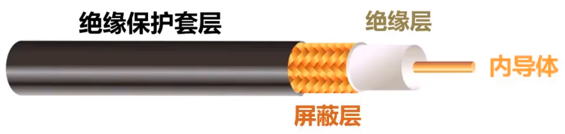
  * 内导体
  * 绝缘层
  * 屏蔽层
  * 绝缘保护套层

  **分类：**
  * 基带同轴电缆(50Ω)  
    用于数字传输。  
    又分为细缆和粗缆，细缆功率损耗大，传输近；粗缆传输远。
  * 宽带同轴电缆(75Ω)  
    用于模拟传输，目前主要用于有线电视。
* **双绞线电缆**  
  由两条**互相绝缘的铜导线**，按照一定规则绞合组成。  
  绞合可以抵御部分来自外界的电磁波干扰、减少相邻导线的电磁干扰。

  **分类：**
  * 无屏蔽双绞线(UTP)
  * 屏蔽双绞线(STP)  
    比UTP外层多带有屏蔽层，提高了抗电磁干扰的能力。

  **绞合线类别：**  
  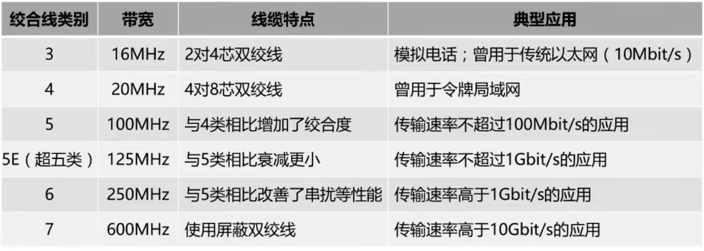  
  第五类100Mbps，超5类或6类可达1000Mbps，但传输距离不能超过100m。
  
  **标准：**  
  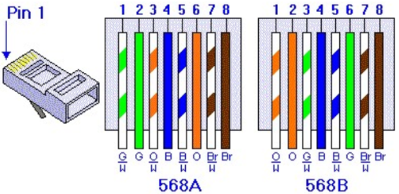
  * T568B  
    线序如下：
    * 黄色对1,2 - 数据输出（黄是负极、黄白是正极）
    * 绿色对3,6 - 数据输入（绿是负极、绿白是正极）
    * 蓝色对4,5 - 电话语音（由于现在电话使用少，可以拧在一块做正极）
    * 棕色对7,8 - 电话电源（由于现在电话使用少，可以拧在一块做正极）
  * T568A
* **光纤**  
  光纤电缆由光导玻璃或塑料芯构成，称为**纤芯**；它被另一层称作**包层**的玻璃包住，最外一层用坚硬的外壳包住。  
  纤芯折射率高，包层折射率低，故光以一定角度入射时会发生**全反射**，该过程反复进行，则会使光一直传输下去。

  **工作波长：**
  * 0.85微米
  * 1.30微米
  * 1.55微米

  **分类：**  
  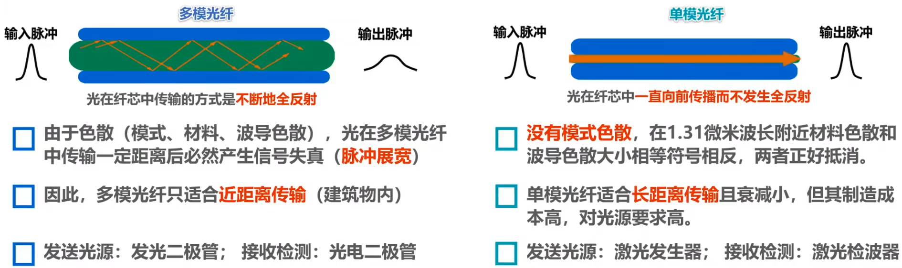
  * 多模光纤  
    允许许多条**不同入射角度的光线**，在同一条光纤中传输。
  * 单模光纤  
    光纤直径减小到只有一个光的波长，只能有一条光纤，使其只向前传播，不发生反射。

  **优点：**
  * 通信**容量（带宽）大**
  * 传输**损耗**小，远距离传输更经济
  * 抗雷电和抗电磁干扰性能好，能**电磁隔离**
  * 无串音干扰，**保密性好**，不易被窃听
  * **体积小、重量轻**

  **缺点：**
  * 割接需要专用设备
  * 光电接口价格较贵
* 电力线

### 2. 非导引型传输媒体

利用**电磁波**在自由空间的传播，来传输数据信息。
即无线介质。

电磁波频谱如下：  
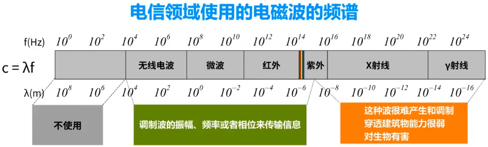  
只有中间部分是可用的。

对于无线电波之前的频段，划分如下：  
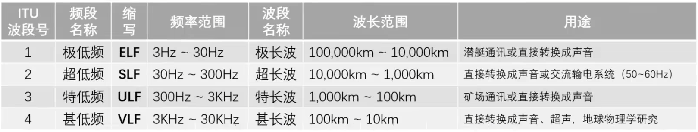  
这些频段并不用于电信领域。

无线电波和微博的频段，划分如下：  
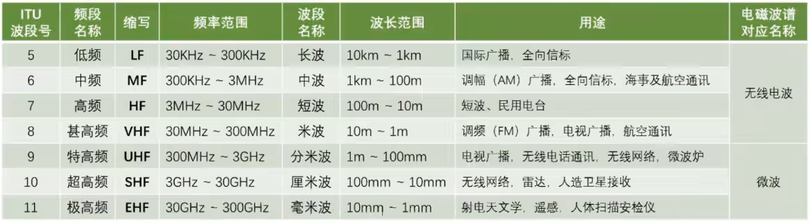  

* **无线电波**  
  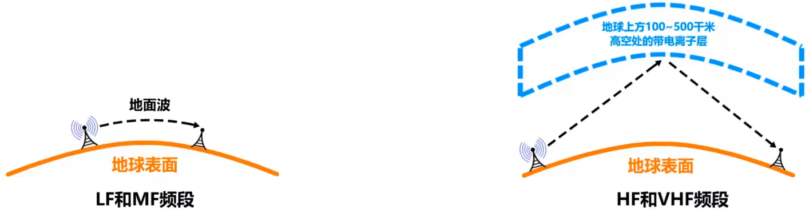
  * 低频和中频 - 利用地面波进行传播
  * 高频和甚高频 - 利用电离层反射进行传播
* **微波**  
  在空间主要是直线传播。  
  会穿透电离层进入宇宙空间，故不能靠电离层反射。

  两种传播方式：  
  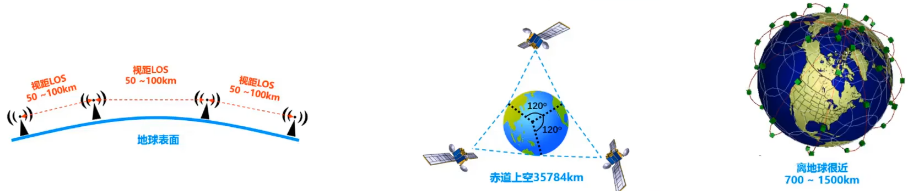
  * 地面微波接力通信  
    由于传输为直线，地面为曲线，故需要两站之间没有障碍物，能在地面上直视；  
    否则需要建立中继站，其越高传输距离越远。
  * 卫星微波接力通信  
    利用高空的人造同步地球卫星作为中继器。  
    通信距离远，但传输时延大。
  
  目前出现了低轨道卫星通信系统，构成空间高速链路。
* 红外线  
  家用电器配套的红外遥控器即属于红外线。  
  属于点对点无线传输，是直线传输，传输距离短且传输速率低。  
  目前用于通信已经被淘汰；但手机仍保留红外接口，用于对电器进行红外遥控。
* 可见光  
  LiFi - 利用可见光进行通信，如LED快速开关来调制光信号。

要使用某一段无线电频谱进行通信，需要向本国的“无线电频谱管理机构”进行申请，  
如我国的为“工业和信息化部无线电管理局”。  
各国存在各自的ISM(Industrial, Scientific, Mediacal)频段，可以自由使用。

## 三、数字通信系统模型

### 1. 操作

先要经过以下操作才能通过传输介质传输。

* 信息源
* 信源编码（如ASCII）
* 信道编码（高电平、低电平）
* 调制（把数字信号变为适合长途传输的）

调制后，通过**传输介质**传输，再进行如下接受操作：

* 解调
* 信道译码
* 信源译码
* 接收

传输介质中可能有干扰；信源编码和信源译码需要考虑安全编码和安全译码。

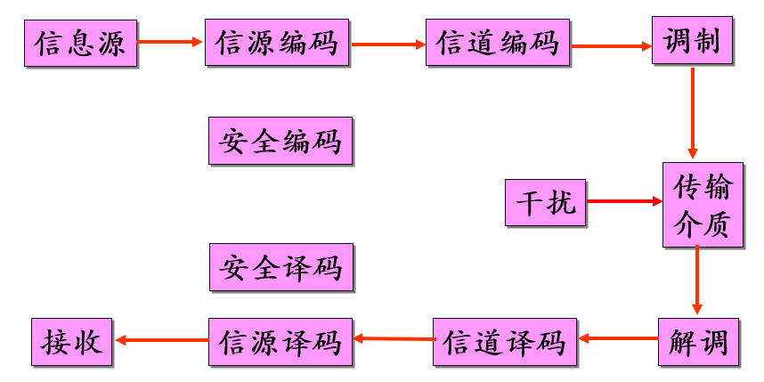

### 2. 三种编码

* 信源编码
* 信道编码
* 安全编码

### 3. 信道

> 定义 - 信道：
>
> 信道(channel)是通信中**传递信息的通道**，它由相应的**发送**信息与**接收**信息(有时还包括转发信息)的**设备**，以及与这些发送和接收信息的相关设备**连接**在一起的**传输介质**组成。

分为独占信道和共享信道。

## 四、信号传输方式

### 1. 串行/并行传输

* 串行：传输速度慢；但布线简单，**常用**。
* 并行：传输速度快；但只能单向，且布线困难，只适合**短距离**传输。

串行存在异步串行传输和同步串行传输。

同步串行传输有面向比特和面向字符的规程。

### 2. 同步/异步传输

* 同步传输：以稳定的**比特流形式**传输，字节之间没有间隔，接收端在每个比特的**中间时刻检测**，以判别式`0`还是`1`。  
  由于会产生**时钟累计误差**，需要同步时钟，方法有：
  * 外同步：添加一条**信号线**。
  * 内同步：数据中包含时钟信号（如曼切斯特编码）。
* 异步传输：以**字节**为独立的传输单位，字节之间的时间间隔不固定，在每个字节前后分别加上**起始位和结束位**。

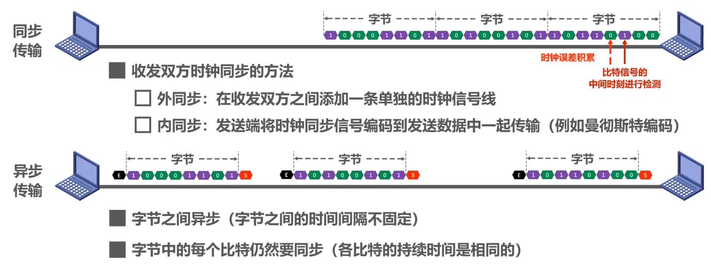

### 3. 单工/半双工/双工传输

* **单工**通信：通信双方只有一个传输方向（不允许改变）。如无线电广播。
* **半双工**通信：通信双方可以互相传输数据，但不能同时进行。如对讲机。
* **双工**通信：通信双方可以同时发送和接收信息。如电话。

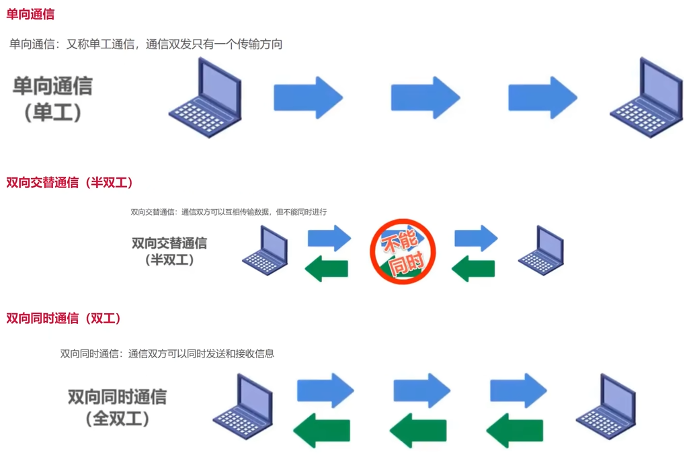

单工只需要一条信道，而**半双工**和双工需要两条。

## 五、信号类型

### 1. 信号、调制、数据

**信号和调制：**

* 信号
  * 基带信号（数字/模拟信号）：特指来自**信源**的信号，包含低频和直流信号，信道不能直接传输。  
  为了解决问题，需要进行**调制**（包含编码和实际的调制）
  * 宽带信号（模拟信号）：特质将基带信号用**载波**经过**调制**，转换为**模拟信号**后的信号，频带较高。
* 调制（包含编码和实际的调制）
  * 基带调制（编码）：将基带信号变化为**数字信号**`1`或`0`，直接用两种不同的电压表示，送到线路上传输。
  * 宽带调制：将基带信号调制成**模拟信号**传输，增加传输率。

**数据转换为信号：**

* 模拟数据 → 模拟信号：电话
* 模拟数据 → 数字信号：CODEC（多媒体数字信号解码器，如电脑录音）
* 数字数据 → 模拟信号：Modem
* 数字数据 → 数字信号：数字传输

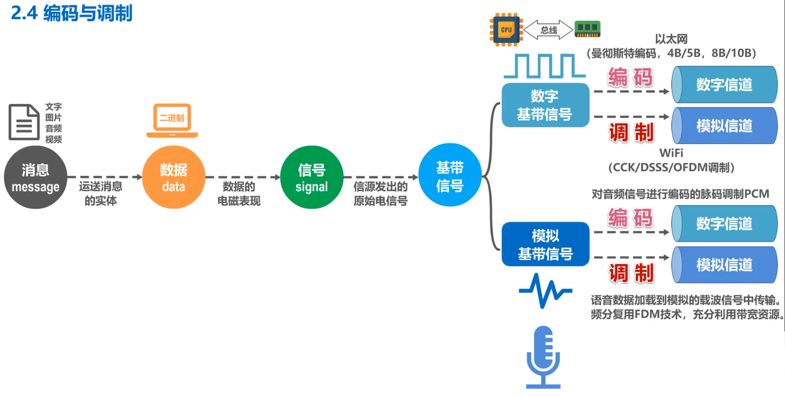

### ⭐2. 编码 - 数字数据→数字信号

⭐数字数据到数字信号：要考虑**编码**，主要是**曼切斯特编码**和**差分曼彻斯特编码**。  

* 曼切斯特编码  
  在周期中心：数据是`0`，向上跳变；数据是`1`，向下跳变。  
  这样只在有跳动的时候代表有数据传送，不需要特别判断是没数据传送还是一直在传送。  
  但缺点是编码效率低。
* 差分曼切斯特编码  
  周期中心一直有跳变。  
  开始边界处下一位为`0`，跳变；下一位为`1`，不跳。

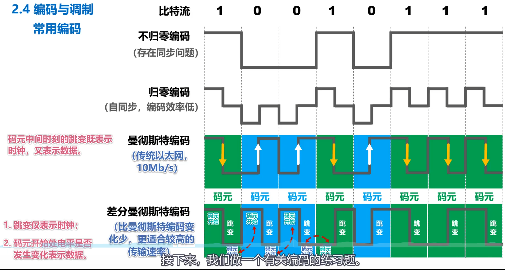

### ⭐3. 调制 - 数字数据→模拟信号

> 定义 - 码元：
>
> 用调制好的**波形表示数字信号**时，代表不同离散值的**基本波形**即为码元。  
> 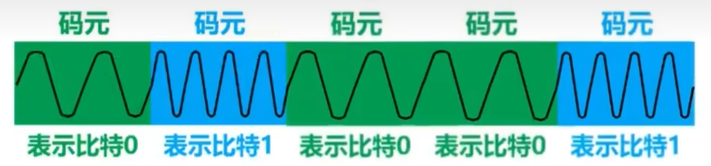

数字数据到模拟信号：

* 基本调制方法：每个码元只包含一个比特信息（一共两种码元，分别代表`0`或`1`）
  * 调幅
  * 调频
  * 调相
  * *差分PSK*
* 混合调制 - QAM(正交振幅调制)  
  将相位和振幅结合起来调制

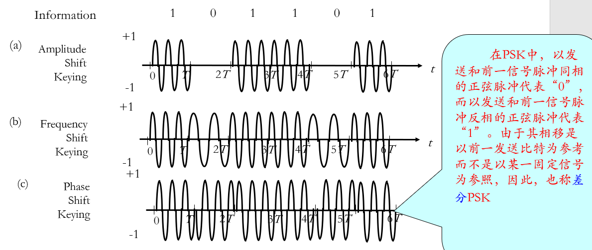

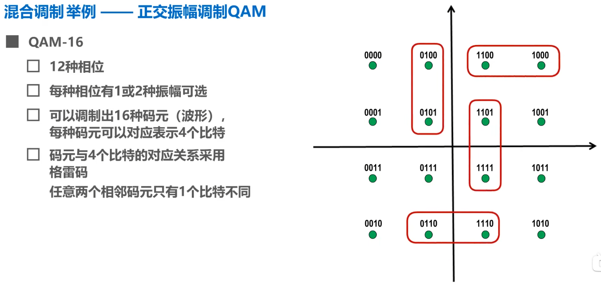  
采用格雷码，减少传输错误时产生的误码位数。

### 4. 模拟数据→数字信号

模拟数据到数字信号，方法是脉冲编码调制(PCM)。  
以采样定理为基础。

### 5. 信号失真

信号在传输过程中会因为受到各种因素的影响，使得信号波形失去码元之间的清晰界限，这种现象称为“码间串扰”。

**因素：**

* 码元传输速率
* 信号传输距离
* 噪声干扰
* 传输媒体质量

## ⭐六、信道极限容量（各种定理）

### 1. 数据传输速率（比特率⇌波特率）

* 比特率：单位时间内信道上所能传输的最大**比特数**，用bps表示
* 波特率：单位时间内信道上所能传输的最大**波形数**，用Baud表示

**两者存在关系：**

$$
S=B*\log_2N
$$

* $S$ - 信息速率($bps$)
* $B$ - 波特率($Band$,  $\textrm{码元}/s$)
* $N$ - 波形状态数

波形的状态数$N=2$时（如只有高低电平），$S=B$。

要把**波特率**($Band$)转换为数据传输速率($bps$)，  
需求出调制后有多少种码元$N$($N=$相位数$\times$振幅数$\times$……)，  
然后求$\log2$，即为每个码元的比特数($b/\textrm{码元}$)。

### 2. 奈式定理（采样定理）

在**理想**条件下，为了**避免码间串扰**（信号失真），**码元传输速率**有**上限**。  
有两种情况。

**理想低通信道：**

$$
B = 2W \\
S = 2W*\log_2N
$$

**理想带通信道：**  

$$
B = W \\
S = W*\log_2N
$$

* $B$ - 最大**码元速率**（波特率, **调制速度**）($Band$, $\textrm{码元}/s$)  
* $W$ - 带宽($Hz$)

判断是理想**带通信道**还是理想**低通信道**：

* 没有指明信道是带通信道，则属于**低通信道**($B=2W$)。
* 指明信道频率的**上下限**，则属于**带通信道**($B=W$)。
  如：**电缆**调制解调器（会有上下限）

### 3. 香农定理

考虑了传输距离、噪声等影响因素。

$$
C = W\log_2(1+\frac{S}{N})
$$

* $C$ - 有效信道容量/信道的极限信息传输速率($bps$)
* $W$ - 带宽($Hz$)
* $\frac{S}{N}$ - 信噪比(无单位)  
  ⚠一般带单位为$dB$，**值实际上为**$10\log_{10}(\frac{S}{N})$，需要求得真正的$\frac{S}{N}$。
  * $S$ - 信号平均功率
  * $N$ - 噪音功率

“热噪声”即用上述的$\frac{S}{N}$来度量，  
但一般用$10\log_{10}(\frac{S}{N})$，单位为分贝(dB)。

### 4. 常用与典型数据传输速率

常用数据传输速率标准：

* DS1(T1) - $1.544Mbit/s$
* E1 - $2.048Mbit/s$

典型数据应用的速率：

* 事务处理（如ATM终端取钱）：$100bps\sim\textrm{Few} Kbps $
* 字处理（如网页）：$100Kbps\sim\textrm{Few} Mbps$
* 文件传输：$\textrm{Few} Mbps\sim 10 Mbps$
* 实时图像：$10 Mbps\sim 100 Mbps$

### 5. 误码率

$$
P_e = \frac{N_e(\textrm{\textrm{出错的位数}})}{N(\textrm{传送的位数})}
$$

## 七、通信方式

* 点到点控制
* 多点分支控制  
  采用轮询和应答的方式。

## 八、多路复用技术

允许多个设备在单一的传输媒介上传输。

复用传输后，还需要逆复用接受。

有四种方法：

* 频分多路复用(FDM)  
  把不同频率叠加。
* 时分多路服用(TDM)  
  信道内传送信号以最大周期$T_s$为间隔，在$T_s$内按信道带宽划分相应的小时隙，并利用这些时隙进行传输。
* 波分多路复用(WDMA)  
  适用于光，通过光学器具叠加（棱柱、衍射光栅），然后走共享光纤。
* 码分多址(CDMA)  
  基于码型分割信道，每个用户分配一个互不重叠的地址码，特点是频率和时间资源均共享。

**码分多址考题：**  
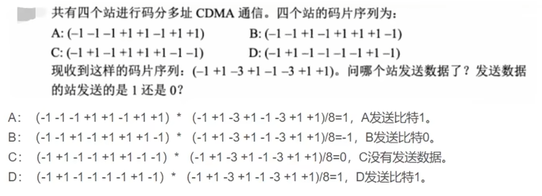  
方法：  
各个站原本的“码片序列”，跟收到的“码片序列”正交（分别相乘后累加）。

* 如果是正数：发送的是该站**原本**的码片序列，且发送比特`1`
* 如果是负数：发送的是该站**相反**的码片序列，且发送比特`0`
* 如果是0：则不发送

## 九、交换技术

* 线路交换
  * 三个阶段
    * 建立线路  
      如果线路不可用，则为“忙信号”。
    * 数据传输
    * 释放线路
  * 特点  
    * 适合进行实时或交互式通信。对于不允许有明显的传输时延则采用这种方式。
    * 连接建立的时间较长。如果线路占线或用户忙则无法建立连接。
    * 线路利用率低。一旦建立连接，即便没有数据传输，也会占线。
* 报文交换
  * 将报文分组，可以并行传输，降低端-端时延，还可以避免某一个报文长时间占用链路。  
    如果不分组整块发送，大数据块则会堵塞小数据快。
  * 数据报交换  
    报文(Message)拆成若干个包(Packet)。
  * VC（虚电路）分组交换
  * 优点
    * 提高稳定性（一条线路崩溃可以换线路）
    * 便于用户对高层信息的共享（一个Web服务器都可以访问）
    * 在结点交换机中可以进行传输速率匹配和码型变换
    * 便于进行流量控制、拥塞控制、负载均衡
    * 减少信息的重传

## 十、综合布线系统

* 建筑群子系统
* 垂直子系统：连接各楼层的垂直布线
* 水平子系统（电信间）
* 工作区子系统
* 设备间子系统
* 管理子系统
