# Ep.4 数据链路层

## 一、基本概念

### 1. 数据链路

> 定义 - 链路、数据链路：
>
> 链路是从一个结点到相邻结点的一段**物理线路**，  
> 数据链路则是在链路的基础上增加了一些必要的**硬件**（如网络适配器）和**软件**（如协议的实现）。

**数据链路层的功能：**  
确保数据在链路上的可靠传输。

**涉及的问题：**

* 流量控制
* 帧格式
* 差错控制
* 链路管理
* 信道共享

在Internet网体系结构的第二层，与物理结构相关。

### 2. 实现

* 一般由网络适配器实现
* 网卡：Ethernet卡、X.25网卡
* 网卡组成
  * RAM
  * DSP芯片
  * 主机总线接口
  * 网络接口(BNC,RJ45)

### 3. 服务

* 无应答无连接  
  错误恢复由高层负责，用于低误码率、语音通信
* 有应答无连接  
  通过应答改善可靠性，用于不可靠信道（无线通信）
* 有应答面向连接  
  过程：连接建立、分组数据传输、释放连接

## 二、基本问题

数据链路层协议有很多种，但有三个共同的基本问题：

* **封装成帧**
* **透明传输**
* **差错控制**

### 1. 封装成帧

⭐在数据链路层中，传输的协议数据单元是“**帧**”(Frame)。  
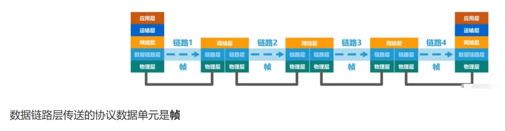

**封装成帧：**  
数据链路层给上层交付的**协议数据单元**，添加**帧头**和**帧尾**，使之成为“帧”。  
帧头和帧尾包含很多控制信息。

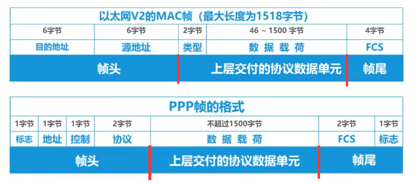

**帧定界：**  
帧头和帧尾的作用之一就是**帧定界**，用来在物理层传输比特流时，知道某串比特是否是一个帧。  

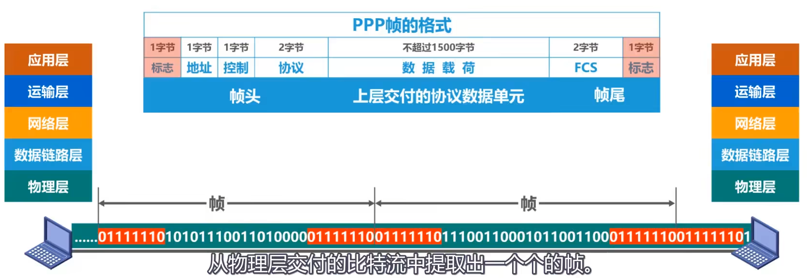  
如上为PPP帧的帧头和帧尾，用来帧定界。

但注意，不是所有协议的帧都有“帧定界标志”，但一定有方法定界，如下：

> 一个网络比特流组帧的示例 - 以太网的MAC帧：
>
> 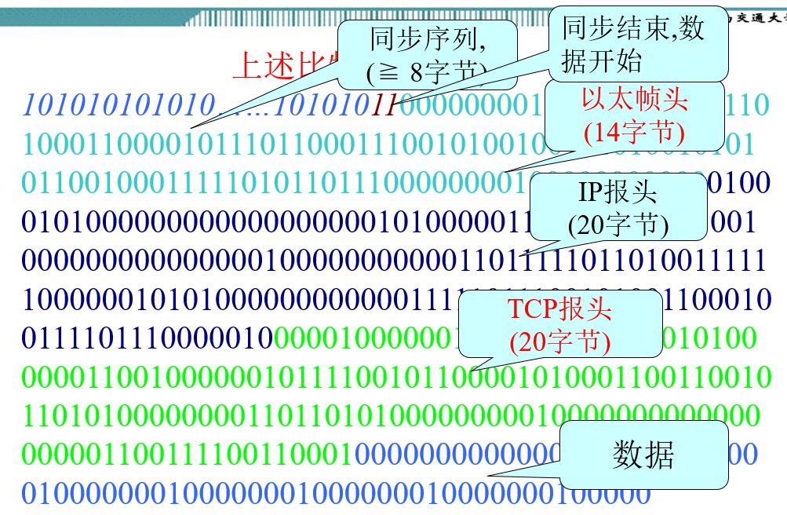
>
> * 前导码
>   * 同步序列 - 使收发方时钟同步
>   * 标志 - 同步结束、表明数据（上层的协议数据单元）开始
> * 数据载荷
>   * 以太帧头
>   * IP报头
>   * TCP报头
>   * 数据
>
> 前导码为**物理层添加**的内容，  
> 同时以太网规定了帧的间隔时间为96bit，故不需要帧尾定界。

帧的数据部分应该远大于帧头和帧尾。
每一种协议都规定了帧的数据部分长度上限，即“最大传送单元”(MTU)。  
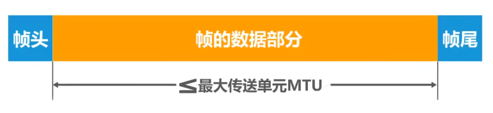

### 2. 透明传输

透明传输指：数据链路层对**上层**交付的传输**数据单元**并**没有限制**，就好像数据链路层不存在（透明）。

典型情况：由于帧需要用标志定界（即便是MAC，前导码也有个标志），而上层的**协议数据单元**可能**刚好存在该标志**。

处理方法：

* 不常用协议
  * 定时(Timing)  
    危险，无保障。
  * 字节计数(Character count)  
    如`5ABCDE2KK3FFF`，数字代表字节数，对应后面若干个字节。  
    如果表示字节数的数字错传，则会导致错误，引起误解。
* 面向字节协议 - **字符填充**(字节填充, Character delimiter and stuffing)  
  对于ASCII字节，用特殊的控制字符(如`STX`表示帧头、`ETX`表示帧尾)进行帧定界，再定义一个转义字符(如`DLE`)，  
  然后有各种方式：
  * 如：就用定义的帧头帧尾，对于数据内部，若存在帧头/帧尾/转义字符，则在其前方添加一个`DLE`进行转义。  
  * 如：用`DLE STX`（数据头）和`DLE ETX`（数据尾）字符标志进行定界，对于数据内部，若需要传送`DLE`本身，则在之前插入`DLE`进行转义。
* 面向比特协议 - （零）**比特填充**(Bit stuffing)  
  用特殊的比特序列进行帧定界。
  如HDLC协议：帧定界为`0111_1110`，传送时，对于数据部分连续的5个`1`后面插入`0`，则不会在数据中出现帧定界符；接收时，则若连续5个`1`后有`0`则删除，则能还原原本的数据。

### 3. 差错控制

比特在传输过程中可能出现差错，称为**比特差错**。

**目的**：避免数据丢失或者损坏。

**方式：**

发送方在报文中插入错误检测为，接收方根据这些检测为进行错误检测。  
如果正确，则接收并应答`ACK`；否则丢弃或应答`NAK`。

**控制方法：**

* 重传：如果收到`NAK`，或在规定时间内没有应答，则需要重传。
* 错误纠正：发送方在报文中插入**错误纠正码**，接收方根据纠错码进行错误纠正。  
  利用EDC进行检错甚至纠错。EDC越长性能越好，但开销越大。  
  因此计算机网络中较少使用纠错码。

**纠错方法**：

* 奇偶校验
  * 奇校验 - 添加一位，使`1`变为奇数个。
* 循环冗余校验(CRC)  
  * 生成多项式：$G(x) = 1\cdot x^3 + 1 \cdot x^2 + 0\cdot x + 1$
    * 该多项式最高项为$3$次
    * 常数项必须为$1$
  * **发送步骤：**
    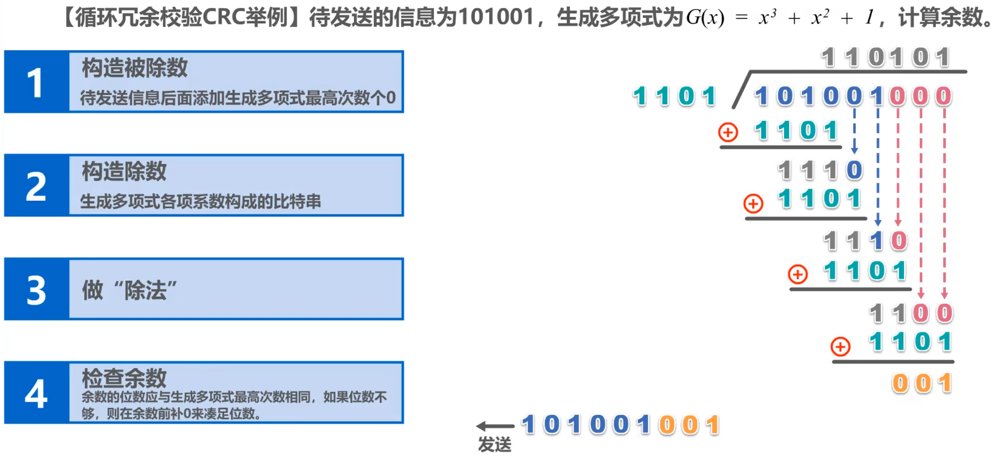  
    被除数，要在最后补多项式最高项次数个$0$（注意要除$4$位，但只补$3$位），  
    除法的时候，只要位数够，就商$1$，每次做**异或**运算。
  * **接收步骤：**  
    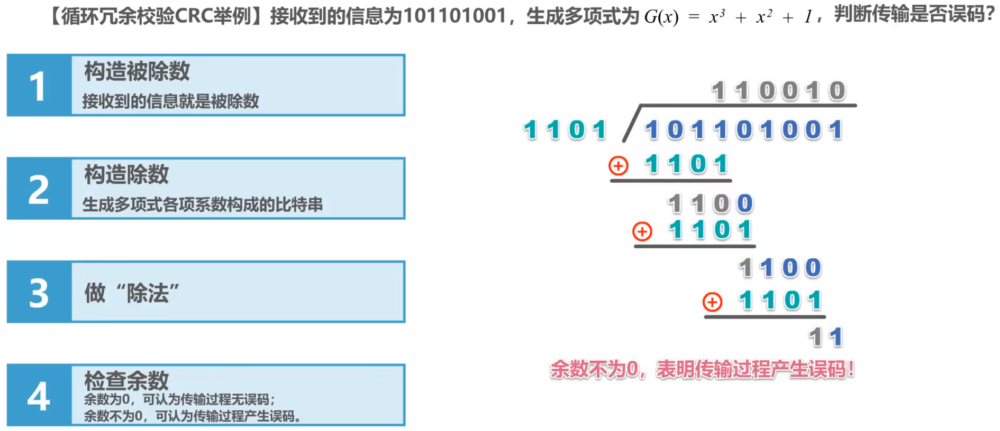
* 硬件冗余检测

## 三、集线器与交换机（以太网发展）

### 1. 概念与对比

* 总线型以太网  
  早期的以太网是将许多台计算机连接到**同一根总线**上。但很容易产生冲突，被淘汰。
* 集线器(Hub)  
  * 虽然物理拓扑是星形，但还是**总线网**，**共享总线资源**，可简单视作总线，同时发送数据仍会碰撞
  * 使用**CSMA/CD协议**，来协调各总线争用总线，只能半双工
  * 工作于**物理层**：故只负责转发比特（不进行碰撞检测，由各站网卡负责）
  * 有少量的容错能力和网络管理功能（断开出故障网卡连线）
  * 使用集线器，可以在**物理层扩展以太网**  
    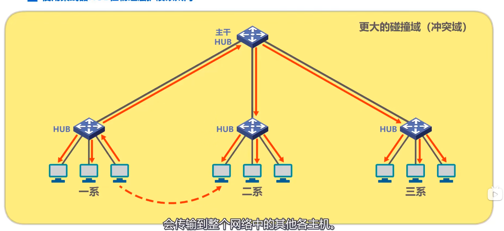
* 交换机
  * 有多个接口，每个接口都可以连接一个主机或者另一个以太网交换机
  * 具有并行性，能同时联通多对接口，使多对主机能同时通信，**无碰撞**（不使用CSMA/CD协议）
  * 有多种速率的接口，如10Mb/s、1Gb/s
  * 工作于**数据链路层**，收到帧后，在“**帧交换表**”中查找帧的目的MAC地址对应的**接口号**，然后通过该接口转发帧。
  * 帧交换表是通过**自学习算法**建立的
  * 两种转发方式
    * 存储转发：可以进行差错控制，但需要缓存且有延迟
    * 直通交换：基于硬件交换，时延很小，但不检查帧的差错

**对比：**

* 单主机单播时：集线器会转发到其他所有主机，各主机根据MAC地址判断是否接收；交换机根据自身的帧交换表，找对应的接口转发到对应主机。
* 单主机广播时：集线器与交换机没什么区别，都能正常广播。
* 多主机单播时：集线器会产生碰撞，导致所有主机都接受到碰撞帧，均丢弃；交换机会缓存，然后依次转发到对应主机
* 仅使用集线器扩展以太网，虽然扩展了广播域，但会扩大碰撞域；而使用交换机，只扩展广播域，隔离碰撞域。

### 2. 广播域与冲突域

* 集线器：连接的主机，即在同一个广播域，也在同一个冲突域
* 交换机：连接的主机，在同一个广播域，但每个端口是一个独立的冲突域，  
  故可以分割冲突域，但不能分割广播域，  
  但是，虚拟局域网(VLAN)可以分割广播域

### 3. VLAN

三种接口划分方式：

* Access接口
* Trunk接口
* Hybird接口

Access和Trunk区别：  
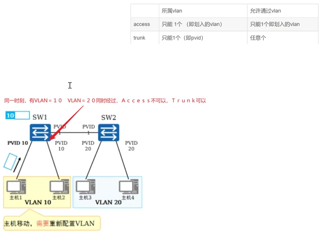

## 四、媒体接入控制

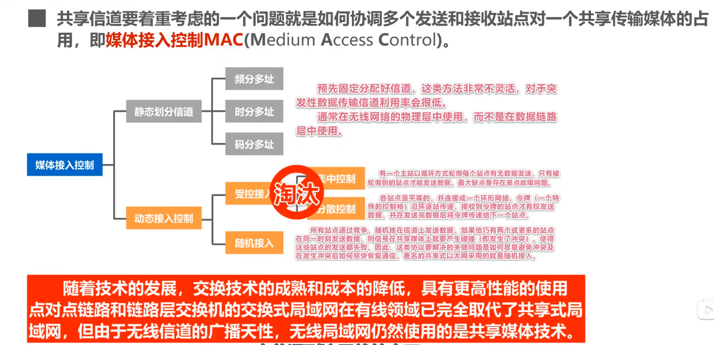

### CSMA/CD协议

CSMA/CD协议属于“随机接入”，为“载波监听多址接入/碰撞检测”。  
只适用于**以太网**，不适用于无线网络。

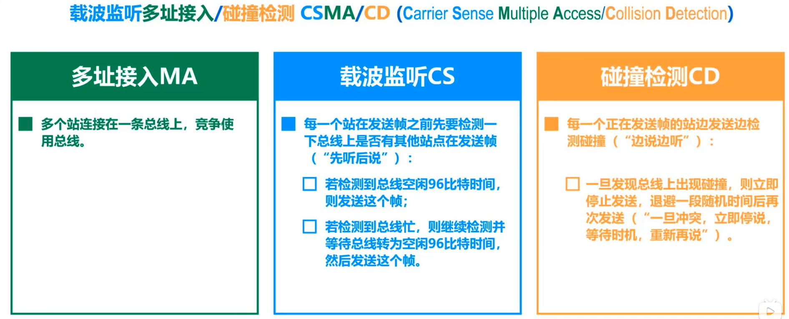  
“96比特时间”指的是发送96比特所需要的时间，称为“最小帧间间隔”。

* 强化碰撞  
  
* 争用期（碰撞窗口） - $2\tau$，$\tau$为以太网**单程**端到端**传播时延**  
  如果经过争用期这段时间没有检测到碰撞，才肯定这次发送不会碰撞。
* 最小帧长  
  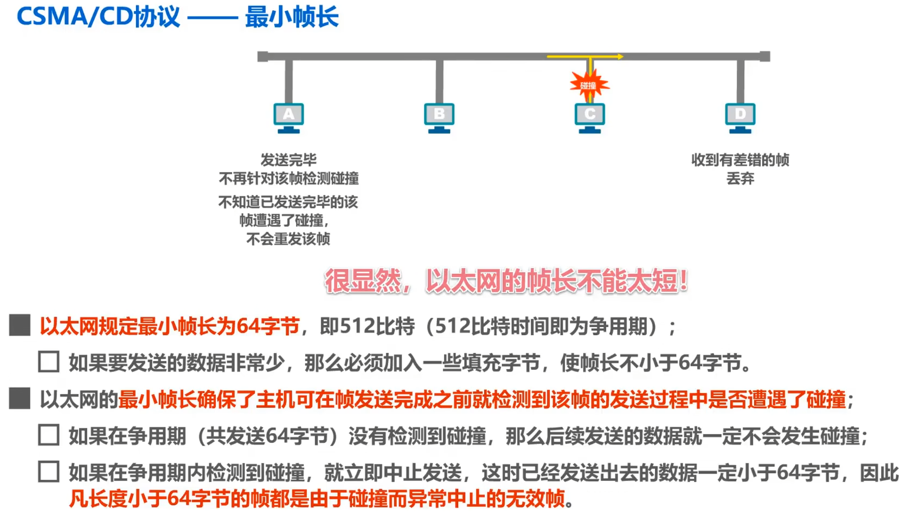  
  计算公式：
  $$
  \textrm{最小帧长} = 2\tau \times \textrm{数据传输速率}
  $$
  其中$\tau = \frac{\textrm{站点距离}}{\textrm{信号传播速度}}$
* 最大帧长 - 若帧过长，长时间占用总线，且接收方可能缓冲区满。

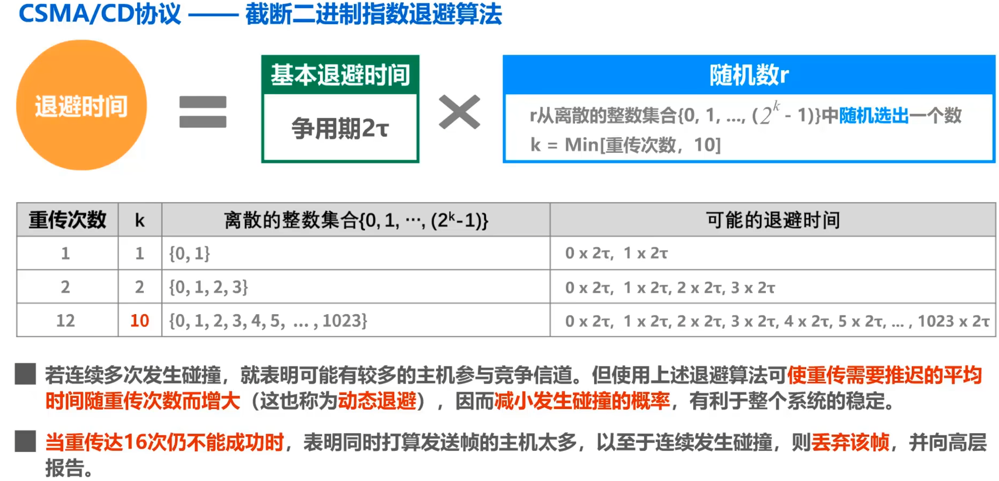

**发送流程图：**  
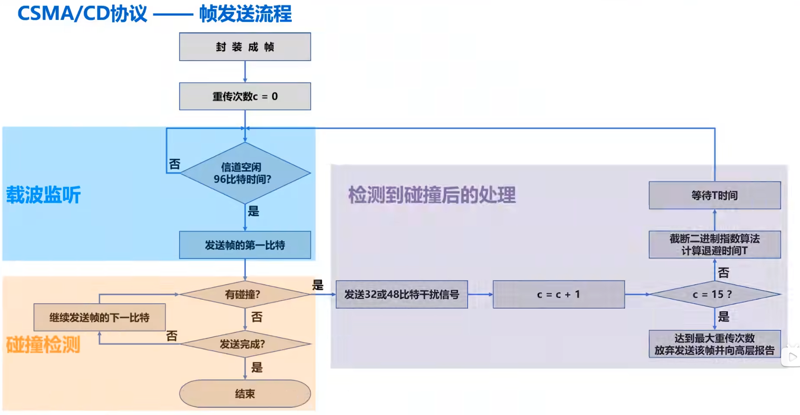

**接收流程图：**  
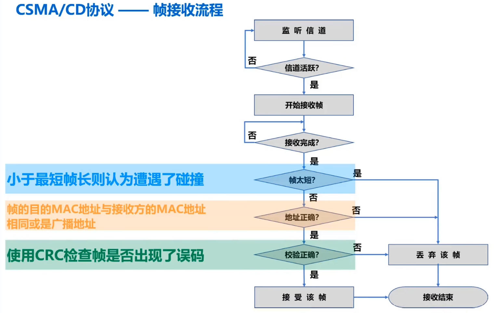

**有关计算的一个例题：**  
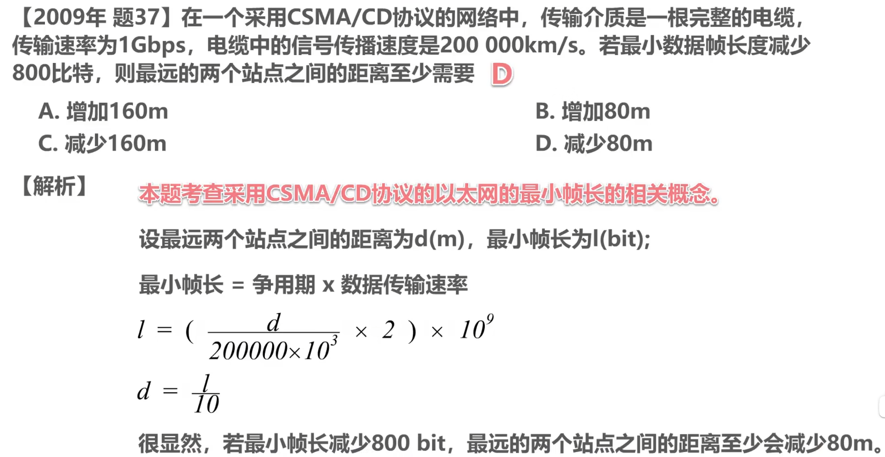

* 采用方式
  * 载波监听：**1坚持**CSMA工作方式（一直监听）
  * 退避算法：**二进制指数截断退避算法**

## 五、点对点协议 - PPP

为两个**对等节点**传输时提供一种封装协议。

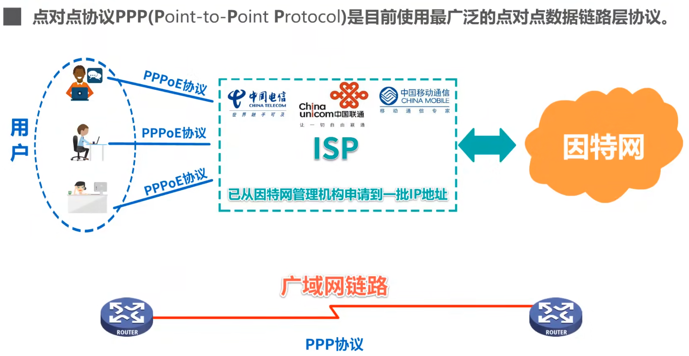  
其中：PPPoE(PPP over Ethernet)，让ISP可以通过各种宽带接入技术，以以太网接口形式为用户提供因特网接入服务。

**⭐包括三个部分：**

* PPP
* LCP - 建立、设定和测试数据链路层连接
* NCP - 建立和设定不同的网络层协议

### 1. 概念

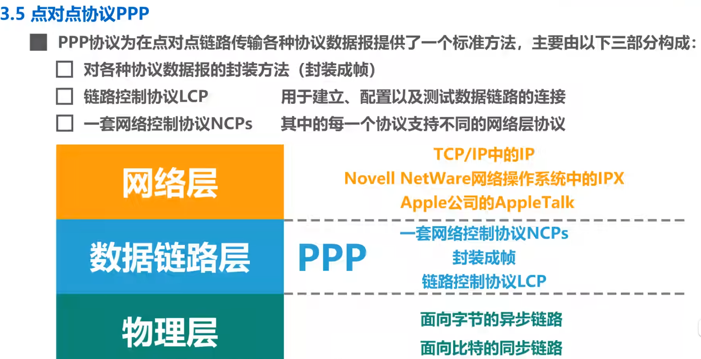

### 2. 帧格式

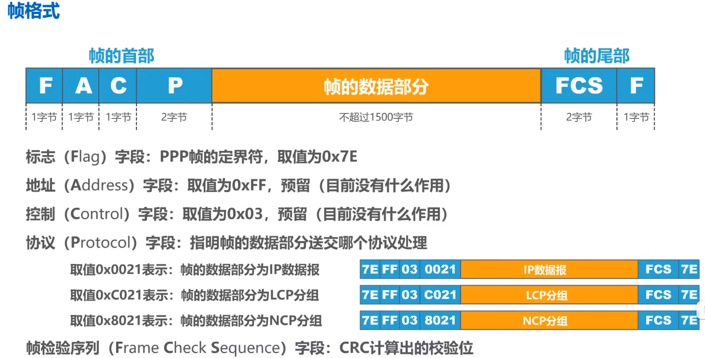

### 3. 透明传输

* 面向字节 - 字节填充（插入转义字符）
* 面向比特 - 比特填充（插入比特0）

### 4. 差错控制

使用CRC检验，若错误，则丢弃，  
故向上层提供“**不可靠传输服务**”。

### 5. 工作状态

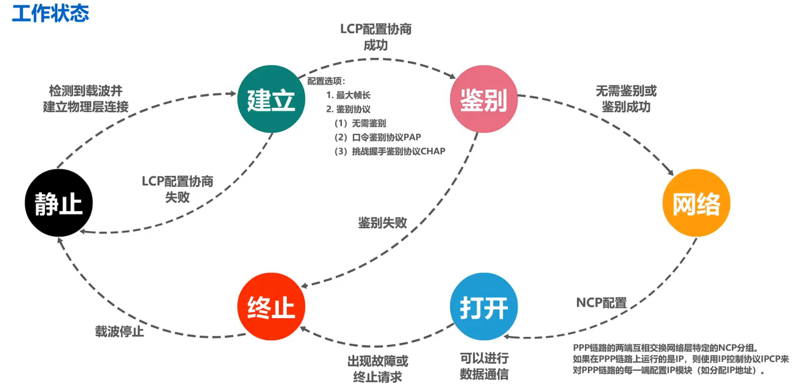

* **链路静止状态**：不存在物理层的连接
* **链路建立状态**：建立链路层的LCP连接
* **鉴别状态**：身份验证
* **网络层协议状态**：进行NCP网络层配置
* **链路打开状态**：进行数据通信
* **链路终止状态**：鉴别失败、出现故障或终止请求

## 六、MAC/IP/ARP协议

### 1. MAC地址

属于数据链路层。  
是一个唯一标识符，有助于在任何网络上标识机器。

### 2. IP地址

属于网络层。

### 3. ARP地址解析协议

把**IP地址解析**为以太网的**MAC地址**。

当主机或其他网络设备需要向另一个主机或设备发送数据时，需要知道**网络层地址(IP地址)**，  
但仅有IP还不行，因为IP数据报必须在数据链路层**封装成帧**，才能通过物理网络发送，  
因此发送站还必须有接收站的**物理地址(MAC)**，  
所以需要一个从IP地址到物理地址的映射。

## 七、可靠传输（流量控制）

寻求最大吞吐率，并且快的发送方不会将慢的接收方淹没（速率匹配）。  
发送方节流直到接收方同意。

### 1. 停止等待协议

**缺点**：信道利用率很低。

#### (1) 简单停止等待协议

**缓冲区**：因为速率不匹配，所以必须设立发送和接收缓冲区。

在研究该协议时，先作两个前提假设：

* 链路理想：数据不会出错丢失。
* 速率理想：接收方总能及时的接收发送来的数据，且能及时向主机上报。  
  相当于缓冲区容量无限大，且接收发送速率精确相等。

此时不需要任何流量控制，传输也可以不出差错的进行。

---

此时去掉假设二，需要进行简单的流量控制，即**停止等待协议**。  
**原理是**：当接收方接收到数据，向主机发送完成然后**应答`ACK`**，接收方接收应答再发送。

#### (2) 考虑帧出错的停止等待协议

去掉假设一，会发生帧丢失现象。  
如果帧出错，则接收方**发送`NAK`**，发送方接收后则重发。

**问题1 - 超时重传：**

可能是传送过来的帧丢失，则接收方不会发送应答帧，若不处理接收发发生死锁。

**解决方法：**

启动一个**超时计时器**，规定一个**超时时间**，超过这个时间没接收到应答帧则重发。  
这种行为称为“**超时重传**”。

**问题2 - 确认丢失：**

但如果是应答帧`ACK`丢失，重发时接收方会接收到同样的数据帧。

**解决方法：**

此时可以给每个数据帧**增加一个序号**，**相同的帧序号相同**，用以区分。  
只需要区别与上次帧不同，因此只用`1bit`就行，然后`0`,`1`循环。

**问题3 - 确认迟到：**

应答帧`ACK`迟到，会导致发送方收到对同一帧的重复`ACK`。

**解决方法：**

一样跟发送方的确认帧`ACK`加上序号。

### 2. 回退N帧协议（连续ARQ协议）

针对**通信线路质量好**的情况下，对停止等待协议的改进，采用流水线。

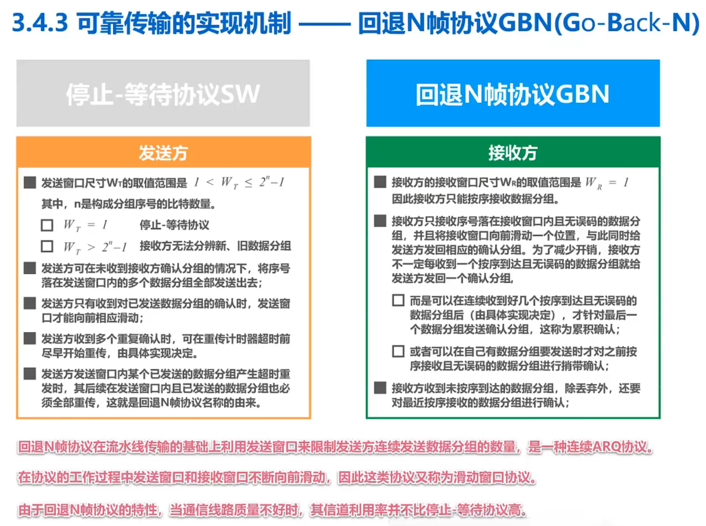

* 累计确认：不再收到一个确认一个，而是累计确认最后收到的
* 重传时：发送窗口内的所有已发送帧都要重传

### 3. 选择重传协议

针对回退N帧协议的改进，避免一个数据分组误码导致之后的数据分组都被丢弃然后超时重传。

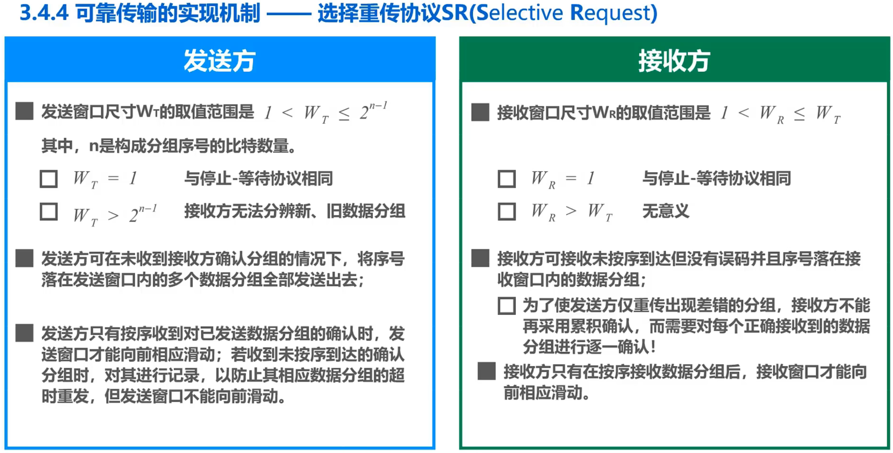

注意！范围是$2^{n-1}$，而不是$2^n-1$。

---

## 四、流量控制

#### (3) 特点

### 2. 连续ARQ协议

发送完一个数据帧后，不是等待`ACK`再继续发送，而是一直发送。  
当应答超时（规定出错时不做响应，而非发送`NCK`，这样更简单统一）时，则回退到需要重发的位置进行重发。  

能最大程度利用吞吐率，但传送效率降低，  
当误码率很大的时候，方法不好。

## 五、信道利用率和最佳帧长度

由于每个数据帧都包含一定的控制信息，  
即使连续不停地发送数据真，信道的利用率也不能达到$100\%$。

存在一个最佳帧长度，一般都在`1K~2K`之间。

## 六、链路层协议

* 局域网LAN：Ethernet
* 广域网WAN：**HDLC**
* 因特网Internet：SLIP, **PPP**

### 1. HDLC

站点类型：

* 主站 - Primary station
  * 控制链路，维护连接从站的逻辑链路
  * 发送的帧叫：命令帧
* 从站 - Secondary station
  * 受主站控制
  * 发送的帧叫：响应帧
* 混合站 - Combined station

结构：

* 非平衡点到点

传输模式：

* 正常响应模式
  * 非平衡结构
  * 主站发起与从站的传输
  * 从站只能通过对主站命令的应答来传输数据
  * 点对点
* 异步平衡模式
* 异步响应模式
  * 非平衡

**帧结构：**

* Flags Field - 标志域
  * 作用：帧定界
* Address - 地址域
  * 作用：指明发送或接收帧的从站
  * 一般用8bit长度，可扩展到多个字节  
    每个8bit组的第1个bit指明是否扩展，若为`0`则之后8bit仍为地址域，为`1`则是最后一个字节。
  * 全`0`为无效地址，全`1`为广播地址。
* 控制域
  * 作用：区分不用的帧类型
    * 信息帧(I) - 传输给用户的数据
    * 监控帧(S) - 不是用捎带应答的ARQ
    * 无编号帧(U) - 辅助链路控制  
      5个bit作为命令
* 帧校验和

操作：

* 初始化  
  任何一方都可以通过六个置位符号初始化

⭐**三种类型的帧：**

* **监督帧**
* **信息帧**
* **无编号帧**

⭐**面向比特。**

### 2. Internet数据链路层

采用：  

* 点到点链路
* 拨号主机-路由器连接(SLIP)  
  简单、但需要预先了解对方的IP，目前已很少使用。
* 路由器-路由器租用线路(**PPP**)  
  * 标志域 - `01111110`
  * 地址域 - `00000000`，因为点到点，地址域无意义
  * 控制域
  * 协议域
    * `0021`
    * `C021`
    * `8021`
