# Ep.4 网络层

## 一、概要

主要实现的是异构的**网络的互连**，进而实现数据报在各网络之间的传输。  
若网络只需要内部通信，则只用实现物理层和数据链路层即可。

**作用：**  
确定在本路由器下，如何**转发“分组”**，确定“分组”从源到目的经过的路径，是**点到点**服务。

**解决问题：**

* 网络层向运输层提供怎样的服务（可靠/不可靠传输）
* 网络层寻址问题（IP地址）
* 路由选择问题（决定数据报从自己哪个接口转发）

## 二、IP

* 是给**Internet**上的**每一台主机（或路由器）的每一个接口**，分配一个在全世界范围内是唯一的**32bit标识符**。
* 一般采用**点分十进制**表示方法，变为`192.168.1.1`

### 1. 分类编址

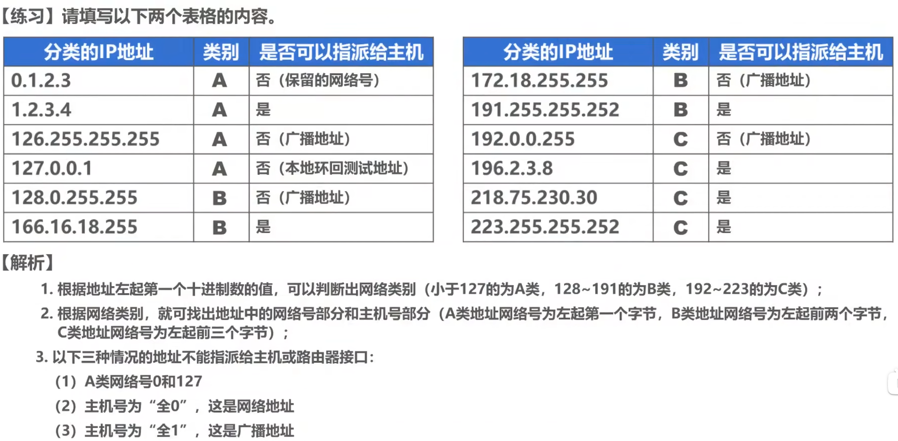  
注意：`224.0.0.0`之后的地址一般也不做分配。

**特殊IP地址：**  
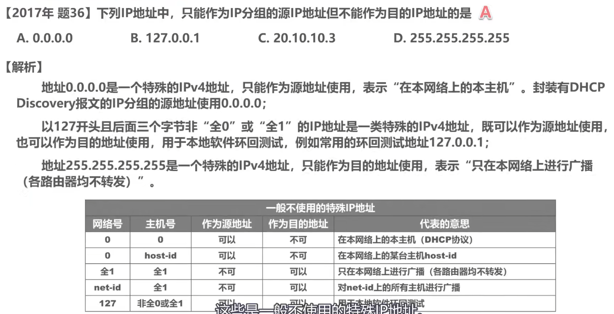

**小结：**  
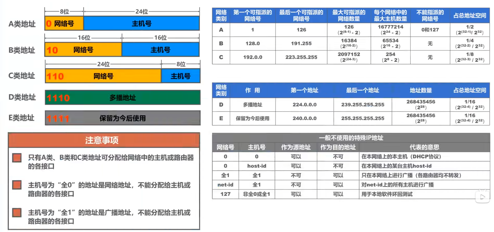

### 2. 划分子网

即“**子网掩码**”。

* 原本的IP：网络号+主机号
* 划分子网的IP：网络号+子网号+主机号

默认子网掩码即为未划分子网的子网掩码。

**两种划分方式：**

* 定长子网划分  
  需要多少个子网，计算出至少要的位数，然后每个子网都用这么多位数作为子网号，**子网掩码一样**。
* 可变长度子网划分  
  各子网的**子网掩码不一定一样**，即有些子网可以合并。  
  假如需要分成3个子网，若按定长每个自能分配$62$个主机，但假如第一个子网需要100多个，则可以把`00`与`01`合并给第1个，`10`给第2个，`11`给第3个。  

### 3. 无分类编址(CIDR)

采用“斜线记法”。  
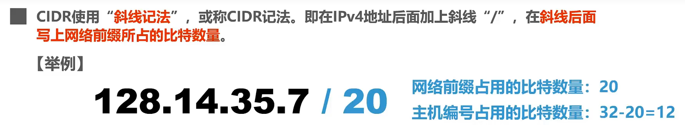  
注意：网络前缀包含“**网络号+子网号**（如有）”。

* 路由聚合  
  把路由表中，该路由的所有记录，找出共同前缀，得到**聚合地址块**的网络地址。  
  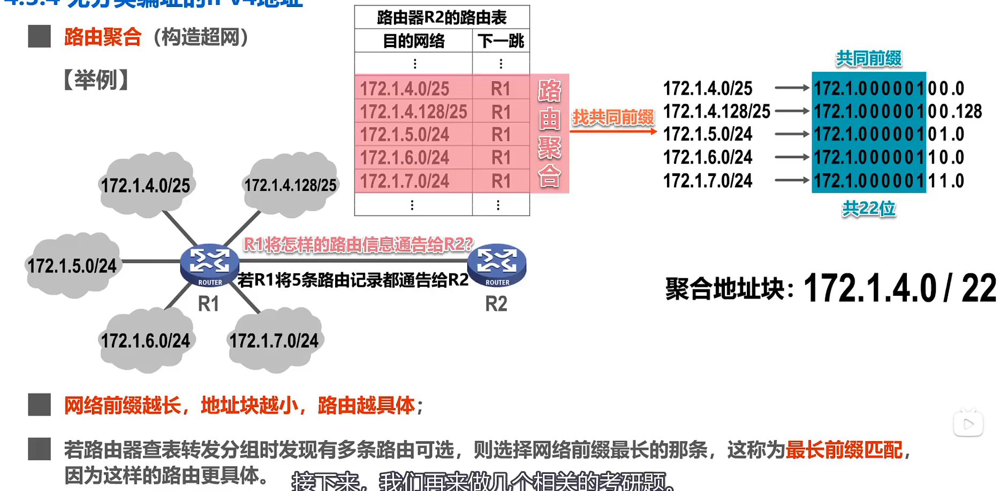

## 三、路由

### 1. 发送和转发过程

* 网络：当IP地址与子网掩码运算时，得到网络地址，若用交换机或更高级的设备相连，则属于同一网络。

**发送：**

* 交付
  * 直接交付：在同一个网络中，可以直接把IP数据报发送给对方。
  * 间接交付：不在同一个网络，需要把IP数据报传送给路由器，再由路由器转发给对方。
* 网络配置
  * IP地址
  * 子网掩码
  * 默认网关：为了让本主机进行间接交付，就必须要指定本网络的一个**路由器的地址**，即为默认网关。

**路由器转发：**

1. 检查IP数据报首部是否出错：若出错则丢弃并通报源主机；否则转发
2. 根据IP数据报首部的目的地址，在**路由表**中查找匹配的条目：找到则转发；否则丢弃并通报源主机

* 路由表
  * 目的网络：可以转发到网络的网络号
  * 地址掩码：该网络的子网掩码
  * 下一跳：转发出去的接口号或IP地址。若直连，则直接是接口号；否则需要转发到下一个路由器，则是下一个路由器的IP地址。

查找过程：先将**目的地址**与路由表条目中的**地址掩码**运算，然后判断是否等于路由表条目的**目的地址**。匹配则按**下一跳**进行转发；否则找下一条目。

**作用：**

路由器不会转发任何的广播数据报，会隔离广播域，避免“广播风暴”，  
即便一主机向**另一网络发送广播数据报**，路由器也**不会转发**。

### 2. 路由表配置

* 直连路由：直接连上的接口，其目的网络直接可知。
* 静态路由
* 动态路由

#### (1) 静态路由

存在多种静态路由，若某IP数据报符合多条时，则采用“**最长前缀匹配**”，选择目的网络前缀最长(就`/`后面的数字最大)的条目转发。  
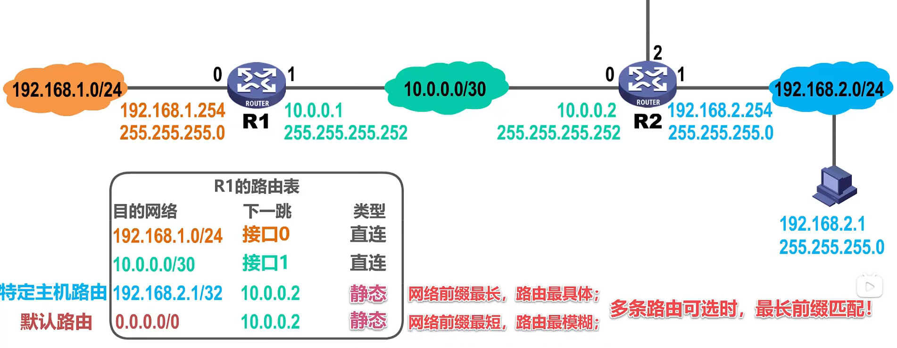

**类型：**

* 一般静态路由：某一个特定的网络号
* 默认路由：`0.0.0.0/0`
* 特定主机路由：`A.B.C.D/32`
* 黑洞路由：下一跳为`null0`

**路由环路问题：**
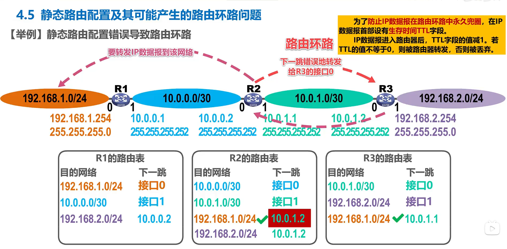  
存在生存时间TTL，来防止路由环路。

**路由聚合导致的路由环路问题：**  
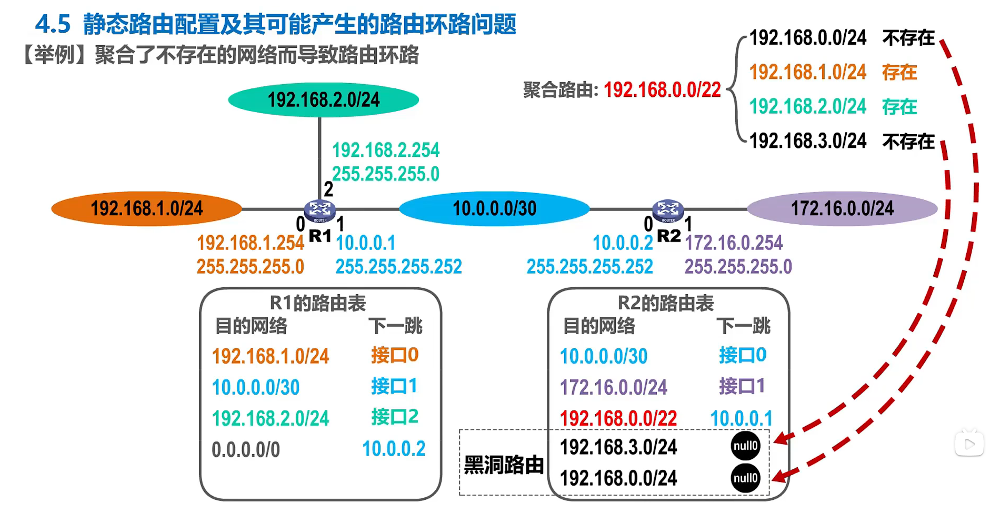  
使用“黑洞路由”解决。

#### (2) 动态路由 - 路由选择协议

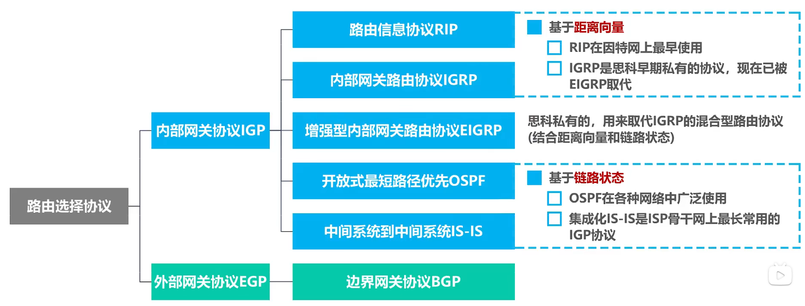

## 四、IP数据报

### 1. 首部格式

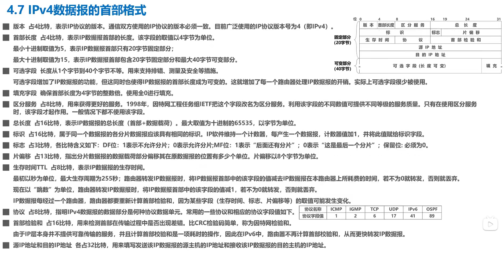  

需要注意的：

1. 分片时：计算的**片偏移量**除$8$计算后必须**为整数**，所以前方分片时需要考虑除$8$后向下取整。  
   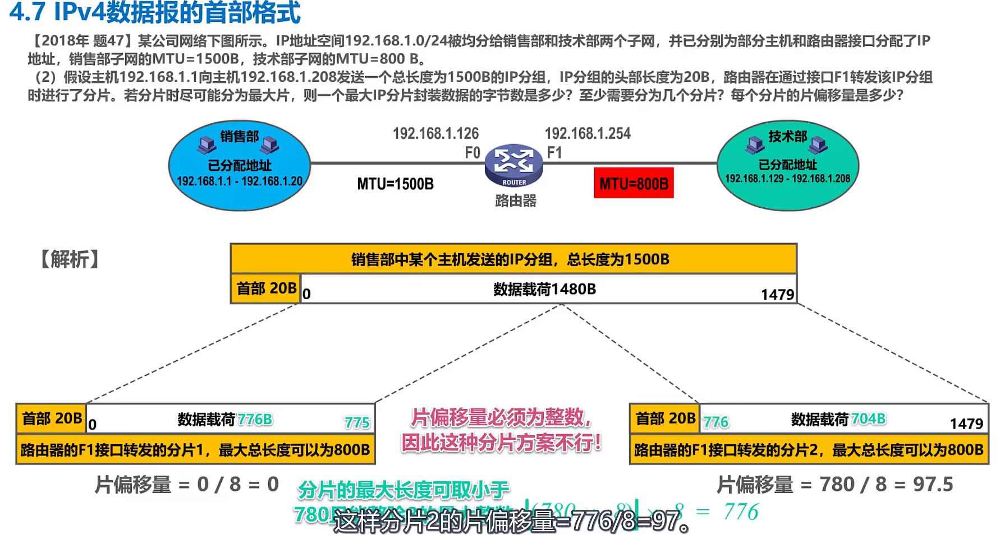
2. 抓包时抓的是“以太网帧”，以太网帧头会有$14$字节内容，然后才是IP数据报内容，报头$20$字节内容。  
   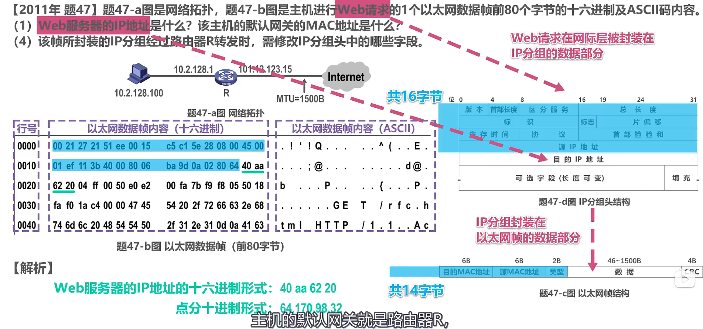  
   * 目的IP地址：就是最终的IP地址，转发过程中恒定
   * 目的MAC地址：下一跳的MAC地址，转发过程中就是下一个路由器（主机则为默认网关）的MAC。

### 2. 网际控制报文协议 - ICMP

主机或路由器使用ICMP，发送**差错报告报文**或**询问报文**。

* 差错报告报文：当IP数据报转发的过程中出现错误而被丢弃时，会向源主机发送ICMP差错报告报文。
  * 终点不可达：因各种原因**找不到**到目的主机的路由路径时。
  * 源点抑制：路由路径存在**拥塞**，告诉源主机（源点）要抑制发报速度。
  * 时间超过：TTL过期（先减`1`，减后如果为`0`，则丢弃）。
  * 参数问题：首部的检验和字段不通过，首部出错。
  * 改变路由：让主机知道下次应该发送给另外的路由器，可以通过更好的路由
* 询问报文
  * 回送请求和回答报文：由一个主机向另一个主机发送询问，另一个主机需要发送ICMP回送回答报文  
    用来测试目的站是否可达，了解其状态。
  * 时间戳请求和回答报文：请求某个主机或路由器，回答当前的日期和时间  
    用来进行时钟同步和测量时间。

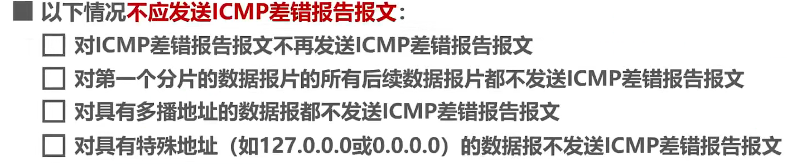

**应用：**

* 分组网间探测：用来测试主机或路由器间的连通性
* 跟踪路由：测试IP数据报从源主机到目的主机应经过哪些路由

## 五、VPN和NAT

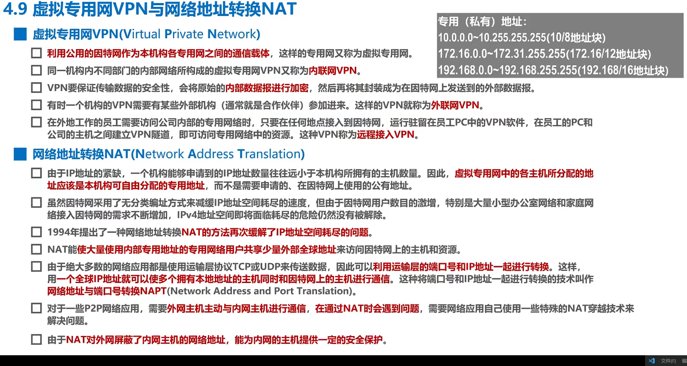

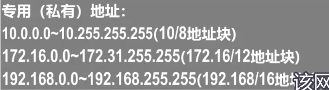

---

**路由：**

* 固定路由
* 泛洪法
* 随机路由
* 自适应路由

## 路由算法

组成有两部分程序：

* 发送和接受网络可达性信息的程序
* 计算最优路的程序

需要程序在网络拓扑变化时动态变化。

有两种基本的路由算法：

1. 距离矢量路由
2. 链路状态路由

### (1) 距离矢量路由

问题：无限计数

### (2) 链路状态路由

每个结点都知道整个网络拓扑结构，记录在由LSAs组成的数据库中，  
然后用Dijkstra算法，得到路由表。

**Dijkstra算法：**

* `V` - 二维矩阵，存图路径的信息
* `dis` - 初始存起点到其余各顶点的路径，之后随着松弛操作，更新为最短路
  
每次找`dis`中最短点，将其设为确定点，之后不再对该点进行操作，  
然后以该点作为中转，把其他可通过该点的点进行松弛操作。

## 网际互连

* 物理层 - 中继器/集线器
  * 中继器 - 用来连接多个局域网段  
    会放大所有信号，包括干扰
  * 集线器 - 也叫多端口中继器
* 数据链路层 - 网桥/交换机
  * 网桥 - 连接多个局域网（可以是不同MAC协议的异构网络，如无线与有线）  
    工作在数据链路层（管理帧的接收/转发等）  
    有用两层路由表，
* 网络层 - 路由器
  * 路由器 - 连接多个不同的子网
* 传输层/应用层 - 网关