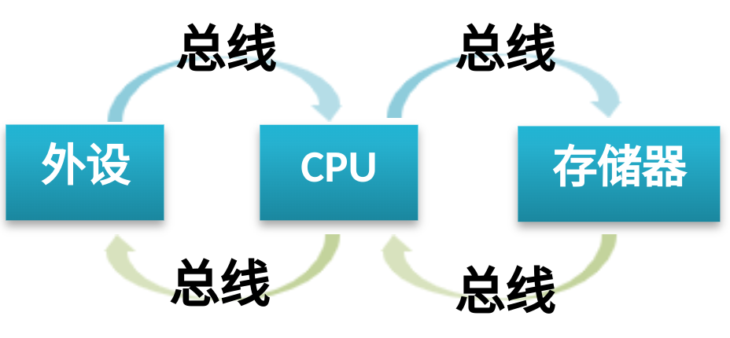
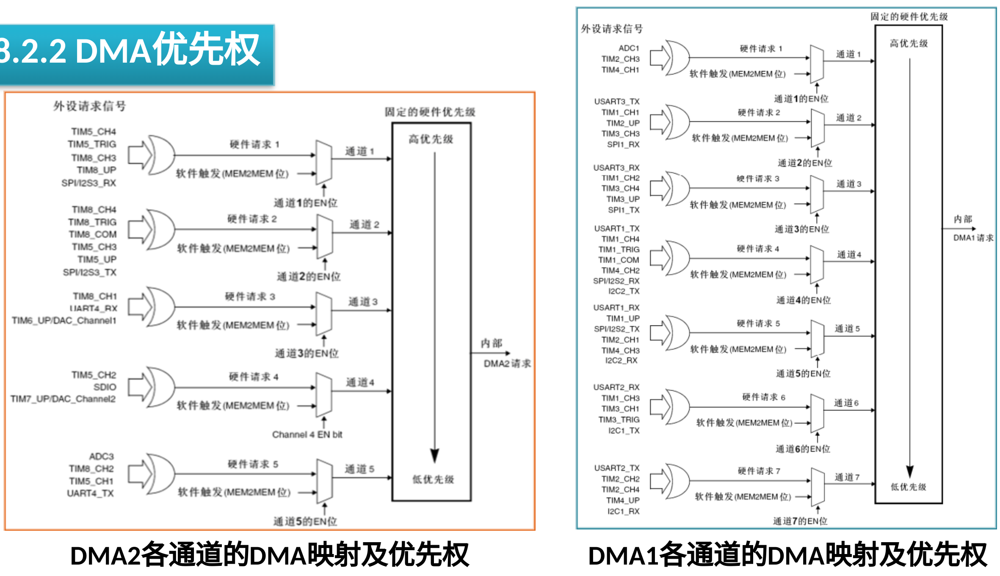
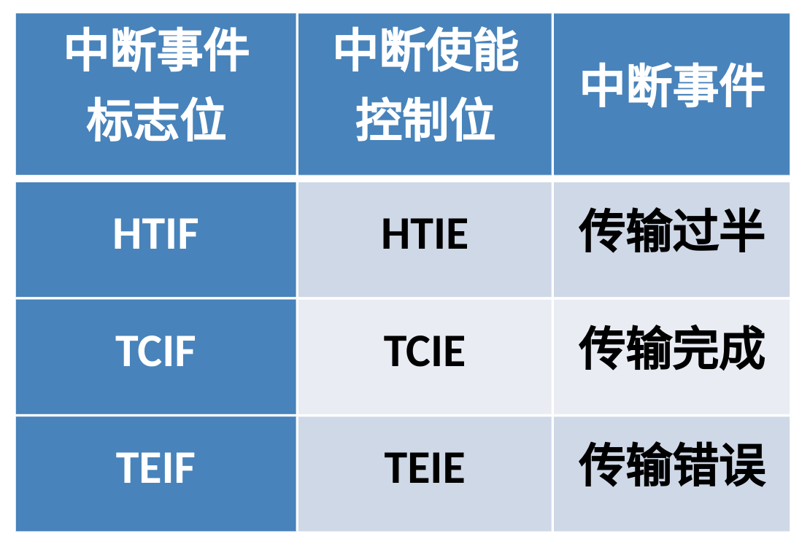

# Ep.8 DMA

## 一、基础知识

### 1. 原因

一般的数据处理流程：  

当**不需要对数据进行处理**时（不需要算力，只需要简单状态控制），由于外设和存储器速度较低，  
导致 CPU大 量的时间和资源被浪费，造成 CPU 效率低下。

因此若采用 DMA 方式，利用 DMA 控制器(DMAC)直接控制总线，在外设与存储器之间建立一条**直接通道**，不需要 CPU 的中转。  
此时 CPU 可以用于做别的事情，避免浪费。

会涉及到**总线控制权转移**问题：  
即 DMA **传输前**，CPU 需要把总线控制权交给 DMA 控制器，  
DMA **传输结束后**，DMA 控制器再把总线控制权交还给 CPU。

### 2. 传输过程

1. DMA 请求  
   对 DMA 进行初始化，I/O 设备准备好后，向 DMA 控制器发出 DMA 请求。
2. DMA 响应  
   DMAC 对 DMA 请求进行优先级判别，向 CPU 发出总线请求信号。  
   CPU 响应总线请求，当 CPU 执行完当前总线周期，就将总线控制权交给 DMAC，完成响应。
3. DMA 传输  
   DMAC 获得总线控制权后，外设经过硬件信号请求 DMA 传输，或通过软件启动 DMA 请求，  
   按配置好的相关参数，DMCA 发出读写命令，开始进行数据传输。
4. DMA 结束  
   DMAC 对传输数据进行统计，判断数据是否传输完成，  
   当完成后，DMCA 将总线控制权交换给 CPU，并向 I/O 设备发出结束信号。

## 二、STM32的 DMA 模块

### 1. 内部结构

最多有两个控制器：

* DMA1 - 7个通道
* DMA2 - 5个通道

每一个通道专门用来管理一个或多个**外设对存储器访问的请求**。

外设（e.g. TIMx（x=1,2,3,4）、ADC1、SPI1、IICx（x=1,2）、USARTx（x=1,2,3））产生的DMA1请求，传送到DMA1控制器，  
同一时刻**只能有一个请求**有效。

### 2. 优先级

* DMA1 > DMA2
* 通道号低 > 通道号高

### 3. 中断请求

DMA 的每个通道都可以在 **DMA 传输过程中**触发中断，  
可通过**设置相应寄存器的不同位**来打开这些中断。

中断事件有：

* "HT" - 传输一半 - 对应标志位`HTIF`
* "TC" - 传输完成 - 对应标志位`TCIF`
* "TE" - 传输出错 - 对应标志位`TEIF`

