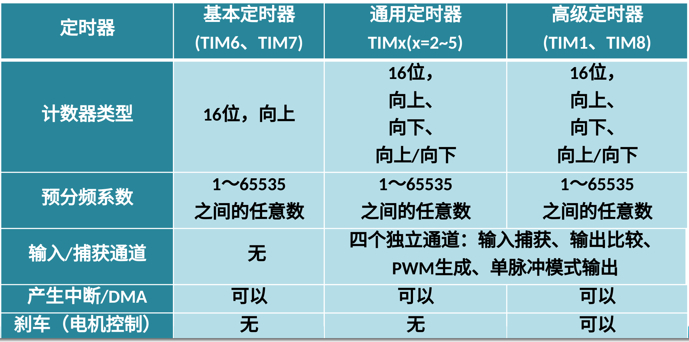
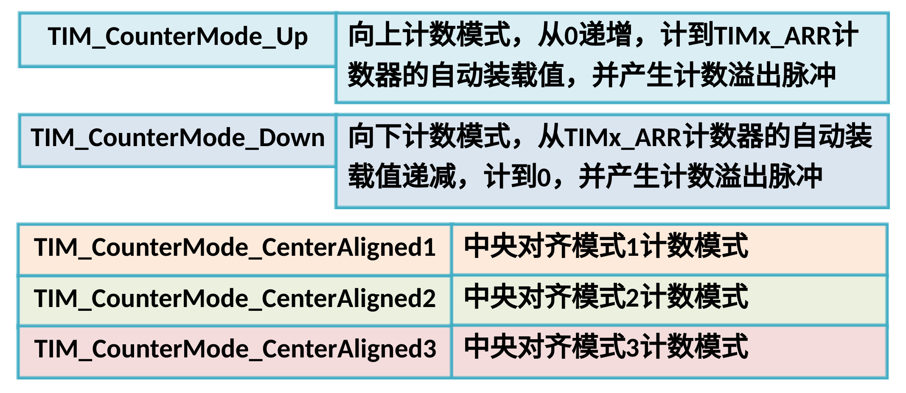
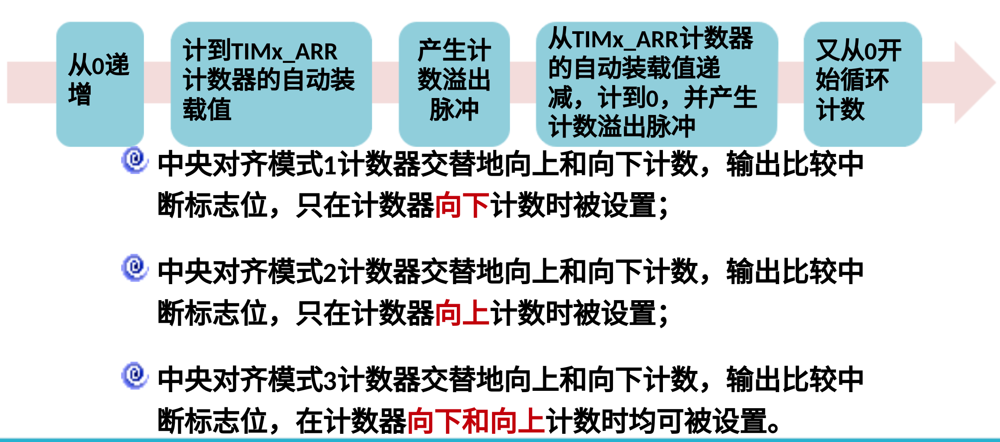
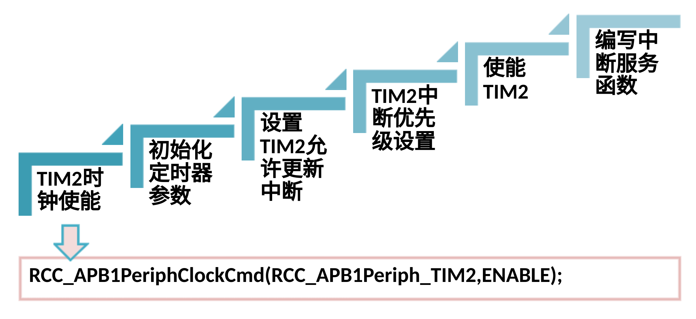

# Ep.9 定时器

STM32 定时器种类多，功能强大，完全独立、互不干扰，可以同步操作。

* 外设定时器
  * 常规定时器
    * 基本定时器：TIM6, TIM7
    * 通用定时器：TIM2, TIM3, TIM4, TIM5
    * 高级定时器：TIM1, TIM8
  * 专业定时器（给长期、7x24运行时用的）
    * 看门狗定时器
    * 实时时钟
    * 低功耗定时器
* 核内定时器
  * 系统节拍定时器

## 一、定时器模块



主要功能：

* 计数：对固定周期的脉冲信号计数
* 定时：时间控制，通过对时间脉冲进行计数实现
* 输入捕获：测量输入脉冲信号，比如测量点击转速
* 控制输出：将计数器计数值与设定值进行比较，根据比较结果输出不同电平，用于控制输出波形(PWM)

### 1. 通用定时器

STM32F103系列微控制器的定时器功能十分强大，内部结构也比较复杂，
STM32通用定时器TIMx（x=2，3，4，5）主要由**时钟源**、**时钟单元**、**捕获和比较通道**等构成，
核心是可编程预分频驱动的16位自动装载计数器。

#### (1) 时钟源

当定时器使用内部时钟时，定时器的时钟源统称为`TIMxCLK`。
虽然在系统默认的配置中，`TIMxCLK`的时钟频率都是72MHz，但其时钟来源并不相同：

* 定时器TIM2~TIM7挂接在APB1上
* 定时器TIM1和TIM8挂接在APB2上

#### (2) 预分频器(PSC, Prescaler)

可以以$1\sim 65535$之间的任意数值对时钟源`CK_PSC`的时钟频率进行分频，
输出`CK_CNT`脉冲供计数器`CNT`进行计数。

#### (3) 计数器(CNT)

`TIMxCNT`是一个**16位的寄存器**，计数范围为$1\sim65535$，可以**向上计数**、**向下计数**或向下向上**双向计数**。

要得到想要的计数值，需要对输入时钟频率进行分频。

当计数值达到设定值时，便产生溢出事件，溢出时产生中断或DMA请求，然后再由自动装载寄存器进行重新加载或更新。
计数器溢出中断属于软件中断，执行相应的定时器中断服务程序。

#### (4) 自动装载寄存器ARR

定时器的定时时间主要取决于**定时周期**和**预分频因子**，计算公式为：

$$
T =（ARR + 1）\times（PSC + 1）/ Freq_{in}
$$

这里ARR+1是因为计数器都是从0开始计数的。

### 2. 基本计时器

STM32有2个基本定时器：`TIM6`和`TIM7`，可用作：

* 通用的16位计数器
* 产生DAC触发信号

基本定时器的计数模式只有**向上计数模式**。

### 3. 高级计时器

STM32有2个高级定时器：`TIM1`和`TIM8`，可用作：

* 通用定时功能
* `TIM1`还提供控制三相六步电机的接口，具有**刹车**功能、**死区时间控制**等功能，主要用于电机控制。

## 二、标准外设库接口函数及应用

### 1. 库函数

#### (1) 初始化

**函数原型：**

```c++
void TIM_TimeBaseInit(TIM_TypeDef* TIMx, TIM_TimeBaseInitTypeDef* TIM_TimeBaseInitStruct);
```

**结构体：**

```c++
typedef struct
{
  uint16_t TIM_Prescaler;
  uint16_t TIM_CounterMode;
  uint16_t TIM_Period;
  uint16_t TIM_ClockDivision;
  uint8_t TIM_RepetitionCounter;
} TIM_TimeBaseInitTypeDef;
```

**计数模式`TIM_CounterMode`：**




**计数周期`TIM_Period`：**

`TIM_Period`是一个16位无符号整型数据，取值范围为0~65535。

定时器定时时间主要取决于预分频因子`TIM_Prescaler`和定时周期`TIM_Period`。

$$
T=（TIM_{Prescaler}+1）*（TIM_{Period}+1）/TIMxCLK
$$

TIMxCLK为定时器TIMx的时钟频率，默认为$72Mhz$。

**计数分频`TIM_ClockDivision`：**

* `00` - 采样频率基准$f_{DTS}=$定时器输入频率$f_{CK_INT}$
* `01` - $f_{DTS}=\frac{f_{CK_INT}}{2}$
* `10` - $f_{DTS}=\frac{f_{CK_INT}}{4}$

#### (2) 配置过程




**Step6 - 编写中断服务函数：**

一定要清楚中断标志为，否则会死循环。

## 三、PWM

PWM (Pulse Width Modulation，脉冲宽度调制) 是一种利用脉冲宽度即**占空比**实现对**模拟信号**进行控制的技术，即是对模拟信号电平进行数字表示的方法。
广泛应用于电力电子技术中，比如 PWM 控制技术在逆变电路中的应用；还应用于**直流电机调速**，如变频空调的交直流变频调速，除实现调速外，还具有**节能**等特性。

不改变周期的频率，只改变周期的占空比。
*占空比指的是**高电平**与周期的比值。*

### 1. STM32 定时器 PWM 工作原理

STM32 的定时器除了`TIM6`和`TIM7`，其他定时器都可以用来产生 PWM 输出，
高级定时器`TIM1`和`TIM8`，可以同时产生多达$7$路的 PWM 输出；
通用定时器能同时产生多达$4$路的 PWM 输出。

STM32 中每个定时器有4个输入通道：`TIMx_CH1`~`TIMx_CH4`；
每个通道对应$1$个"捕获/比较寄存器"`TIMx_CRRx`，将寄存器值和计数器值相比较，通过**比较结果输出高低电平**，从而得到PWM信号。

脉冲宽度调制模式可以产生一个由`TIMx_ARR`寄存器确定**频率**、由`TIMx_CCRx`寄存器确定**占空比**的信号。