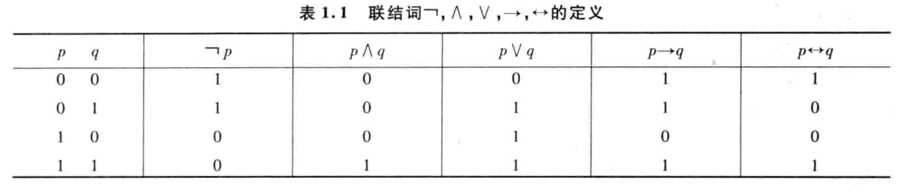
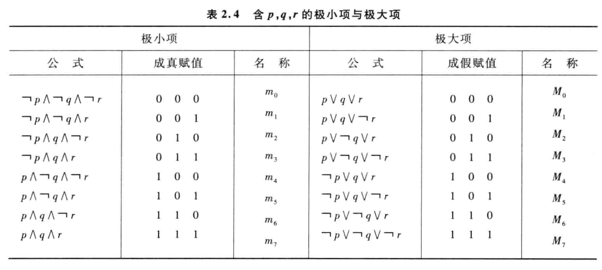
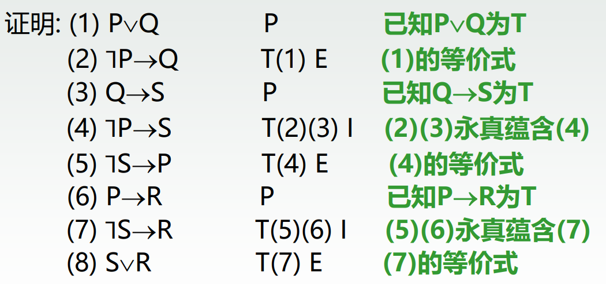
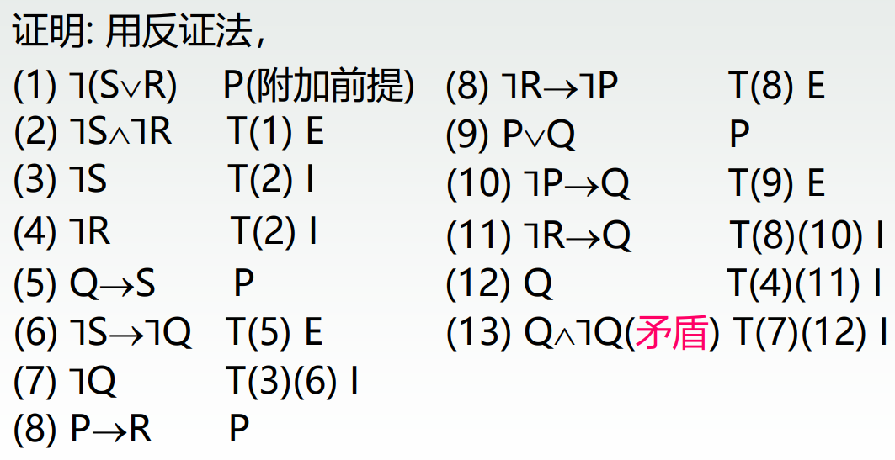
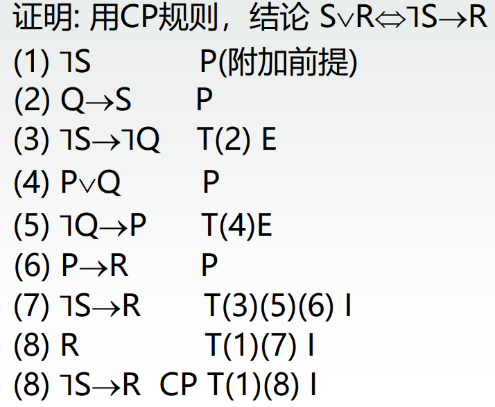

# 第一节 命题逻辑

## 一、命题

只拥有真值$T$和假值$F$的一个陈述句。  
**注意**：**悖论**、判断**结果不惟一**确定的（比如$x+3>5$），不是命题。

**分类**：

* 原子命题：不能再分解为更简单的陈述句。
* 复合命题：由联结词、标点符号、原子命题构成的为符合命题。

**命题标识符**：  
可以用大写字母、带下标的大写字母、数字来表示，如$P$、$A_i$、$[3]$。

**命题常量和命题变元**：

* 命题常量：命题标识符表示一个**确定的命题**。
* 命题变元：命题标识符表示**任意命题**，不能确定真值，命题变元不是命题。
  当用一特定命题指定$P$时，才能确定真值，此时称为**对$P$的指派**。  
  *相当于数据类型为“命题”的变量（未知数）。*
  当$P$表示原子命题时，称为**原子变元**。  
  **注意**：**命题变元不是命题**（结果不唯一）。

## 二、联结词

* $\land$ - 否定
* $\lor$ - 析取
* $\lnot$ - 合取
* $\rightarrow$ - 条件
* $\leftrightarrow$ - 双条件

### (1) 否定

就是逻辑联结词的“非”。
写作：$\lnot P$。

### (2) 合取

就是逻辑联结词的“与”。
写作：$P\land Q$。

### (3) 析取

就是逻辑联结词的“或”。
写作：$P\lor Q$。

### (4) 条件（蕴含）

$$
P\rightarrow Q
$$

也可写作$P\supset Q$

读做：如果$P$那么$Q$；若$P$则$Q$。

**可以转换为**：

* $P$是$Q$的充分条件：当$P$则$Q$
* $Q$是$P$的必要条件：仅当$Q$则$P$

| $P$ | $Q$ | $P\rightarrow Q$ |
| --- | --- | ---------------- |
| $T$ | $T$ | $T$              |
| $T$ | $F$ | $F$              |
| $F$ | $T$ | $T$              |
| $T$ | $F$ | $T$              |

需要注意的是：**条件是有因果的**。
即，对于条件命题$P\rightarrow Q$来说（前件特性）：

* 条件**满足**时：该命题真假由后件（结论）决定，**真值与后件相同**，即$P\rightarrow Q\Leftrightarrow Q$。
* 条件**不满足**时：该命题**定义为真**，真值恒$T$，即$P\rightarrow Q\Leftrightarrow T$。

补充 - **后件特性**：

* 当后件$Q=T$时：$P\rightarrow Q \Leftrightarrow T$
* 当后件$Q=F$时：$P\rightarrow Q \Leftrightarrow \lnot P$

### (5) 双条件

$$
P \rightleftarrows Q
$$

当$P$和$Q$真值相同时，$P\rightleftarrows Q$的真值才为$T$；否则为$F$。
翻译过来就是：如果$P$成立，那么$Q$成立；如果$P$不成立；那么$Q$不成立。  
此时说明$P$与$Q$**等价**，互为充分必要条件。

也可以写作$P\leftrightarrow Q$,$P \quad iff \quad Q$。

读做：$P$，当且仅当$Q$。

> 理解 - 条件与双条件：
>
> * “双条件”一般都是定理，给定这个定理$P\rightleftarrows Q$后，$P$和$Q$就存在等价关系$P\Leftrightarrow Q$。
>   如“三角形全等”和“三边相等”是等价说法。
> * “条件”一般都是要我们证明的。

## 三、命题公式、命题层次、公式赋值、真值表

### 1. 命题公式

命题公式（合式公式）就是由**命题变元**$P(,Q,\cdots)$组成的复合命题。  
简称为：**公式**。

优先级：$\lnot > \land > \lor > \rightarrow > \leftrightarrow$

### 2. 命题层次

命题层次：

* 一元$\lnot A$ - 加1层
* 二元联结词$A, B$ - 取$A,B$最大层加一层

### 3. 公式赋值

公式$A$里，全部的命题变元是$p_1\sim p_n$，  
如果给$p_1\sim p_n$**均给定一个真值**，  
则称是对$A$的“赋值”（解释）。

* 成真赋值 - 使$A$为$T$
* 成假赋值 - 使$A$为$F$

### 4. 真值表

真值表就是：对于公式$A$，在**所有赋值情况**下的一张表。  
*排列组合就完事*……  
前面列写所有命题变元，中间列可以写中间的子公式，最后一列写公式$A$的。

## 四、等价式

### 1. 定义

> 定义 - 等价式：
>
> 对于两命题$A$、$B$，两者原子变元均为$P_1\sim P_n$，  
> 如果其**原子变元任意取值**，**两者真值都相同**，
> 则称$A,B$等价，记作$A \Leftrightarrow B$

证明可用真值表，也可以用其他等价式演算。

### 2. 常用等价式

就是用来化简演算的。

注：下方的$X^*$代表对偶，可以同时将所有对偶项进行翻转（$\land$和$\lor$翻转，$T$和$F$翻转），依然成立。

**基本定律**：

| 名称 | 公式                                                         | 解释                   |
| ------ | ---------------------------------------------------------------- | ------------------------ |
| 对合律 | $\lnot\lnot P \Leftrightarrow P$                                 | 双重否定表肯定    |
| 幕等律 | $P\lor^* P \Leftrightarrow P$                                    | 同一句话反复说，效果一样 |
| 交换律 | $P\lor^*Q \Leftrightarrow Q\lor^* P$                             | 二元联结词可交换 |
| 结合律 | $(P\lor^*Q)\lor^* R \Leftrightarrow P\lor^*(Q \lor^* R)$         | **同一联结词**，可以结合 |
| 分配律 | $P\lor^*(Q\land^*R) \Leftrightarrow (P\lor^*Q)\land^*(P\lor^*R)$ | **不同联结词**，需要分配 |

**高级定律**：

| 名称   | 公式                                                    | 解释                                       |
| -------- | --------------------------------------------------------- | -------------------------------------------- |
| 吸收律 | $P\lor^*(P\land^* Q) \Leftrightarrow P$                   | 分配时，如被分配项与分配项相同，可划为分配项 |
| 德摩根律 | $\lnot(P\lor^*Q) \Leftrightarrow \lnot P \land^* \lnot Q$ | 就数电里的，$\lnot$分配法则        |
| 常值律 | $P\lor^*T^*\Leftrightarrow T^*$                           | 或1为1，与0为0                          |
| 同一律 | $P\lor^*F^*\Leftrightarrow P$                             | 或0，与1为自身                         |
| 否定率 | $P\lor^*\lnot P\Leftrightarrow T^*$                       | 或否定为1，与否定为0                |

**⭐常用等价式**：

| 名称             | 公式                                                                                                                     | 解释                                                       |
| ------------------ | -------------------------------------------------------------------------------------------------------------------------- | ------------------------------------------------------------ |
| ⭐蕴含式转化与否定 | $P\rightarrow Q \Leftrightarrow \lnot P \lor Q \Leftrightarrow \lnot Q \rightarrow \lnot P$                                | 条件式和析取式转换，很多证明题用（**因为只有析取式能化简**） |
| 等价式转化与否定 | $P\leftrightarrow Q \Leftrightarrow (P\rightarrow Q)\land (Q\rightarrow P)\Leftrightarrow \lnot P \leftrightarrow \lnot Q$ | 一般不证双条件式，不常用                         |
| 归谬律          | $(P\rightarrow Q) \land (P\rightarrow \lnot Q) \Leftrightarrow \lnot P$                                                    | 简单的分别假设$P$为0和1即可                       |

### 3. 置换规则等值演算

* 置换规则：就是利用上面等值式，将公式$A$中的子公式$B$，置换为$B$等价式$B'$后的$A'$，也与$A$等价。
* 等值演算：利用置换规则，由已知等值式，推演新的或证明要求的等值式。

> 定义 - 等价置换：
>
> $X$是合式公式$A$的子公式，$X\Leftrightarrow Y$，
> 若将$A$中的$X$替换为$Y$，得到新公式$B$，
> 则$A \Leftrightarrow B$。

就是把公式中的一部分，等价替换为别的等价公式，真值相同。

## 五、重言式、矛盾式与蕴含式

### 1. 三者定义

* 重言式（永真式）：无论**变元**怎么指派，**恒为真**的命题
* 矛盾式（永假式）：无论**变元**怎么指派，**恒为假**的命题
* 可满足式：非重言式或矛盾式
* 蕴含式（条件永真式）：当且仅当$P\rightarrow Q$**永真**，称其为蕴含式，记作$P\Rightarrow Q$
  *数学上实际各种证明，就是证明各种蕴含式*。

> 区别 - 蕴含$\Rightarrow$ 和 等价$\Leftrightarrow$：
>
> * 等价$\Leftrightarrow$是双向，可以完全替换
> * 蕴含$\Rightarrow$是单向，只能从前件替换到后件（所有前件均存在，则后件存在）
>
> ---
>
> 区别 - 双条件$\leftrightarrow$ 和 等价$\Leftrightarrow$：
>
> * 双条件是“联结词”，跟加减乘除一样，两者联结后的新命题不一定成立（为真）
> * 等价是“关系”，就跟等于一样，两者可等价替换。
>
> 存在性质：$(A\Leftrightarrow B) \leftrightarrow (A \leftrightarrow B\textrm{为重言式（永真）})$  
> 当且仅当双条件构成的复合命题为重言式时，两个子命题是等价的。

### 2. 证明方法

* 证明重言式
  1. 构造真值表：所有结果都是$T$
  2. 等价式演算：运用等价式化简，最终结果为$T$
* 证明蕴含式
  1. 真值表
  2. 等价式演算
  3. ⭐**讨论法**
     证明蕴含式，即真值表中的第二行不存在。
     采用以下两种中的任意一种。
     1. 假设条件式前件$P=T$，证明后件$Q$必为$T$
     2. 假设条件式后件$Q=F$，证明前件$P$必为$F$
  4. [推理论证](#七推理论证)（见后）

### 3. 常用蕴含公式

> 区别 - 与常用等价式：
>
> * 常用等价式：是**无论真假**都可以替换。  
>   因此可以广泛用在化简/证明中。
> * 常用蕴含式：必须要**前件为真**，才能替换！  
>   一般只能用在**证明**中，且必须要说明前件为真后才能用。

* 双元化简：$P\land Q \Rightarrow P(/Q)$
* 条件化简：$(P\rightarrow Q) \land P \Rightarrow Q$、$(P\rightarrow Q)\land \lnot Q\Rightarrow\lnot P$
* **传递**：$P\rightarrow Q, Q\rightarrow R\Rightarrow P\rightarrow R$
* 配凑
  * 单元析取配凑：$P\Rightarrow P\lor Q$
  * 单元条件配凑：$P\Rightarrow Q \rightarrow P$、$\lnot P \Rightarrow P\rightarrow Q$  
    再结合传递性，可直接整得条件式。
  * 双元条件配凑：$P\rightarrow Q\Rightarrow P\lor R \rightarrow Q\lor R$

其他可以自己分析然后转化：比如“条件式的否定”恒真，那么只能是前件为真、后件为假

## 六、对偶和范式

### 1. 对偶

> 定义 - 对偶：
>
> 对于给定命题公式$A$，将联结词$\lor$和$\land$互换，$T$和$F$互换，记作$A^*$，
> 称$A$与$A^*$对偶

**重要性质**：$A\Leftrightarrow B$，则$A^*\Leftrightarrow B^*$

### 2. 范式

针对$\land, \lor$两种运算，有两种范式：

* 合取范式：可以看作$A_1\land A_2\land \cdots \land A_n$  
  由若干个**简单析取式**（只有$\lor$或$\lnot$但必须在变元前），组成的合取式。
* 析取范式：可以看作$A_1\lor A_2\lor \cdots \lor A_n$  
  由若干个**简单合取式**（只有$\land$或$\lnot$但必须在变元前），组成的析取式。

命题公式化为合（析）取范式的方法：

1. 将公式中的联结词化为只含$\land, \lor, \lnot$
2. 利用德摩根定理，将$\lnot$直接放到各个**命题变元之前**，而不是子公式前
3. 利用分配律、结合律将公式归约为合（析）取范式

### 3. 小项

> 定义 - 小项
>
> $n$个命题变元的组合所有**合取式**，称作布尔合取或者**小项**。

$n$个命题变元的全部小项共有$2^n$个。

如：$n=3$，命题变元记作$P,Q,R$，则拥有八个小项：

1. $\lnot P \land\lnot Q \land\lnot R$，记作$m_{000}$或$m_0$
2. $\lnot P \land\lnot Q \land R$，记作$m_{001}$或$m_1$
3. $\lnot P \land Q \land\lnot R$，记作$m_{010}$或$m_2$
4. $\lnot P \land Q \land R$，记作$m_{011}$或$m_3$
5. $P \land\lnot Q \land\lnot R$，记作$m_{100}$或$m_4$
6. $P \land\lnot Q \land R$，记作$m_{101}$或$m_5$
7. $P \land Q \land\lnot R$，记作$m_{110}$或$m_6$
8. $P \land Q \land R$，记作$m_{111}$或$m_7$

性质：

* 每一个小项，当“真值指派”与其“编码”相同时，其真值为$T$；其余$2^n-1$项都是$F$。
* 任意两个不同小项的合取永$F$，即$m_i\land m_j \Leftrightarrow F(i\ne j)$。
  只有一项为$T$，合取为$F$。
* 全部大项的析取式必为永$T$，即$\Sigma m_i \Leftrightarrow T$。
  必定有项为$T$，合取为$T$。

### 4. 大项

对称的，则有大项，
$n$个命题变元的析取式，称作布尔析取或者大项。

如：$n=3$，命题变元记作$P,Q,R$，则拥有八个小项：

1. $P \lor Q \lor R$，记作$M_{000}$或$M_0$
2. $P \lor Q \lor\lnot R$，记作$M_{001}$或$M_1$
3. $P \lor\lnot Q \lor R$，记作$M_{010}$或$M_2$
4. $P \lor\lnot Q \lor\lnot R$，记作$M_{011}$或$M_3$
5. $\lnot P \lor Q \lor R$，记作$M_{100}$或$M_4$
6. $\lnot P \lor Q \lor\lnot R$，记作$M_{101}$或$M_5$
7. $\lnot P \lor\lnot Q \lor R$，记作$M_{110}$或$M_6$
8. $\lnot P \lor\lnot Q \lor\lnot R$，记作$M_{111}$或$M_7$

性质：

* 每一个大项，当“真值指派”与其“编码”相同时，其真值为$F$；其余$2^n-1$项都是$T$。
* 任意两个不同大项的析取永$T$，即$M_i\lor M_j \Leftrightarrow T(i\ne j)$。
  只有一项为$F$，析取为$T$。
* 全部大项的合取式必为永$F$，即$\Pi M_i \Leftrightarrow F$。
  必定有项为$F$，合取为$F$。

### 5. 主析取范式和主合取范式

> 定义 - 主析取范式和主合取范式：
>
> 对于给定的命题公式，
> 如果有一个等价公式，它仅由小项的析取组成，
> 则该等价式称坐原式的主析取范式。
>
> 主合取范式则是由大项的合取组成。

*对应数电的“最小项”和“最大项”。*

范式不唯一，而主范式是唯一的。

转化方法：

1. 化为合取范式（小项表达式）
2. 根据不完整的小项，写作$m_{01x}$，
   其中`0`,`1`代表已知的项，`x`代表未出现的项。
3. 将`x`展开为两种情况$m_{010}\land m_{011}$，得到主析取范式
   选择未出现的编码作为大项，然后可以转换为主合取范式

作用：

* 公式的成真赋值，刚好是最小项的角标。
* 判断公式类型：主范式含全部最小项为重言；含全部最大项为矛盾。

## 七、联结词完备集、与非、或非

### 1. 完备集

基础的联结词完备集为：

* $S=\{\lnot, \land\}$
* $S=\{\lnot, \lor\}$
* $S=\{\lnot, \rightarrow\}$

*必须含$\lnot$。*

其余联结词均可在最小联结词完备集上推导得到。

### 2. 扩展联结词 - ↑、↓

* 与非 - $\uparrow$ - $\lnot(P \land Q)$
* 或非 - $\downarrow$ - $\lnot(P \lor Q)$
* 异或 - $\overline\lor$  
  性质：自异或归0、异或真归反、异或假归本、  
  $A\overline\lor B\Leftrightarrow C$，则$A,B,C$可以互换位置。

相当于把$\land,\lor$变窄了就为非。

特性：

* $S=\{\uparrow\}$，或$S=\{\downarrow\}$均为完备集。  
  也就是，所有逻辑表达式都可以写为只含与非（或非）的式子。

## 七、推理论证

*这一节是对前面“蕴含式证明”的其中一种方法的具体讲解。*

由$n$个前提$H_i$来**证明**结论$C$，表达为：

$$
H_1\land H_2\land \cdots \land H_n \Rightarrow C
$$

证明条件式永真的方法：

* 真值表
* 等价式演算
* 讨论法
* **推理论证**

证明的时候，都要在前面写上序号，后面写上**为什么**会有这个步骤（依据）。

### 1. 直接证法

* P规则：在推导中引入前提（直接假设**前提均为真**）  
  步骤说明直接写$P$
* T规则：在推导中，如果有一个或多个公式、**等价于**或**重言蕴含**着公式$S$，则公式$S$可以引入推导之中
  $i$式的等价式记为$T(i) E$；
  $i,j$式的永真蕴含记为$T(i)(j) I$（就是$i,j$可以推出另一式子）

> ⭐重要例题：
>
> $$
> (P\lor Q)\land (P\rightarrow R)\land (Q\rightarrow S)\Rightarrow S\lor R
> $$
>
>   

### 2. 反证法

欲证明$H\Rightarrow C$，可证明：

$$
H\land \lnot C \Rightarrow A, \textrm{并且} H\land\lnot C \Rightarrow \lnot A
$$

即否定结论$C$，**将$\lnot C$作为新的已知**，  
与原已知$H$推论出某一中间结论$A$和$\lnot A$同时为真（即找到矛盾），  
则必有$H\Rightarrow C$。

采用反证法，先把后件$C$写为$P(\textrm{附加前提})$，  
然后用直接证法，开始找矛盾的两依据。

原理：**归谬论**

> 例题：
>
> $$
> (P\lor Q)\land (P\rightarrow R)\land (Q\rightarrow S)\Rightarrow S\lor R
> $$
>
> 

### 3. CP规则

欲证明$H\Rightarrow (R\rightarrow C)$，可证明$H\land R\Rightarrow C$即可。  
即当结论为一个条件式时，可将**结论的前件**，作为**新的已知**（附加前提）与$H$一起。

**特化于**：要证的结论里是条件式。

在最后证得结论的后件后，步骤说明前面写个CP。

> 例题：
>
> $$
> (P\lor Q)\land (P\rightarrow R)\land (Q\rightarrow S)\Rightarrow S\lor R
> $$
>
> 
