# 建模

## 一、概述

### 1. 什么是建模

> 定义 - 系统模型：
>
> 对系统全方位各个方面不同角度表示的一个集合。

* 从外部看 - 系统上下文模型、系统环境模型
* 从交互看 - 与用户交互的时序图、自身交互的通讯图
* 从结构看 - 类图，类和类之间的关系；构件与构件之间的关系

### 2. 统一建模语言(UML)

要进行建模，需要用规范的语言描述，  
一般都使用标准的**图形表示法**来建模，即**可视化建模语言**。

UML是面向对象系统分析与设计的**建模语言**，是一种语言工具。  
提供不同的视图，贯穿整个开发流程，用于进行面向对象设计与分析，并且统一化标准。

**特点**：

* 可视化，用户也容易读懂，开发人员与客户可沟通，不同阶段开发人员可共享
* 构造化，可直接映射成C++, Java, SQL等代码
* 文档化

**构成**：

* 基本构造快
  * 事物：一个个基本的概念，如：
    * 结构事物：类、接口、构件
    * 行为事物：消息、动作序列、链接、状态机
    * 分组事物：包（微服务打包）
    * 注释事物：注释
  * 关系：事物之间的联系，如：依赖、关联、泛化、实现
  * 图：不同类事物和之间的关系，就形成了各种图，UML1.0有9种，如：用例图、类图、时序图、部署图
* 语义规则
  * 命名、范围
  * 可见性、完整性、可执行性
* 公共机制
  * 说明、修饰
  * 通用部分
  * 扩展机制

**UML五种视图**：

* 用户模型视图
* 结构模型视图
* 行为模型视图
* 实现模型视图
* 环境模型视图：发布、部署、安装

## 二、用例模型

用例建模方法主要用来为**系统**与**外部参与者**（用户或其他系统）之间的交互建模。

用例是一个系统中所进行的**一连串的处置活动**，就是**提供给用户的功能**，  
该活动体现能够满足系统外部的执行者对于系统的“**某一个完整期望**”。  
*可描述为：名词+动词*

### 1. 基本元素

* **参与者**：指系统外部的、需要**使用系统**或与系统交互的**人或事物**对用例所扮演的角色  
  通过向系统输入或请求系统输入某些事件来触发系统的执行。
  * 种类：
    * 系统用户（人）
    * 与所建造系统交互的其他系统（外部系统）
    * 设备
  * 参与者之间的关系：用单向肩头表示继承关系
* 用例：表示对参与者有价值的**功能单元**，是对一组动作序列的描述，系统通过执行这一组动作序列为参与者**产生一个可观察的结果**。  
  用例是与实现无关的，关于**系统功能的描述**，是一种功能分解技术，一个用例对应一个**功能性需求**。  
  * 表示：用椭圆表示
  * 用例间关系：
    * 关联关系：参与者与用例之间进行通信，信息可以双向流动，带箭头方向表示谁启动的信息（而不是信息的流向）
    * 包含关系：可以把会重复被调用的用例抽出来，其他需要用到该用例的用例，包含该用例即可。
    * 扩展关系：一个用例可以增强另一个用例的行为，为基本用例添加新的**可选行为**。  
      注：包含是一定会调用，扩展是可选（比如修改、删除之前都要查询，是包含；刷卡消费不一定每次都要充值，是扩展）,如果需要关联但没有，用例不完整；用扩展时，用例本身就完整了
    * 泛化关系：子用例表示父用例的特殊形式，代表"is a"。
  * 四种关系比较：
  
### 2. 用例描述

用例描述：以上每个功能按一个用例对待，然后依据用例模板进行描述。  
特别强调用例基本事件流和扩展事件流及子事件流。

## 三、活动图

描述系统行为的图，用于展现参与行为的对象所进行的各种活动的顺序关系。  
*对流程的建模。*

表述工作机理、业务过程、**工作流**，可以对业务过程、工作流建模，也可以对用例甚至程序实现来建模。

**目的：**

* 描述操作执行过程中完成的工作
* 先是用例的实例如何执行、如何改变对象状态  
  可以描述**对象**，对象在活动中状态的变化。
* 描述活动的哪些步骤可以**顺序**执行，哪些可以**并行**执行。
* 可以在高层次抽象上理解业务过程，也可以在低层次抽象上设计复杂的顺序算法，或者多线程应用系统中的并发性。  
  可以在一个模块用几个活动图来描述。

*实验中要对两个主业务流程提供活动图。*

本质上是一种流程图，但又有**区别**：

* 活动图用于需求分析阶段，描述业务；流程图在算法的具体实现阶段，描述算法的执行过程。
* 活动图存在并发活动；流程图没有并行的执行，不能多个路径同时走。
* 活动图面向对象；流程图面向过程

### 1. 元素

* **起点 - 实心圆圈**：代表活动的开始一个角色就是一个泳道
* **终点 - 实心圆外带圆圈**：代表活动的结束
* **活动 - 圆角矩形**：活动业务节点，描述过程中某一活动
* **组合活动 - 包含活动的圆角矩形**：就把活动分组
* **对象 - 矩形**：可用对象来描述活动的输入、操作或输出
* **泳道 - 最大范围的矩形**：对活动图中的活动进行分组，一个泳道一般代表一类角色或对象
* **条件判断 - 菱形**：表示活动流程中的判断，通常有多个信息流从它引出
* **同步条 - 粗线**：表示活动之间的同步，表示同时接收、或者同时分出
* **信号发送 - 外凸三角矩形**：表示信息流上某个活动转移发生时，向某个对象发送一个信号
* **信号接收 - 内凹三角矩形**：表示信息流上相应信息的接收时，某个活动转移的必要条件
* **信息流 - 实线**：连接活动、表示活动的转移
* **对象流 - 虚线**：连接活动与对象，表示该对象是活动的输入或输出
* 注释体、注释连线

**基本元素的含义：**

* 活动：表示工作流中人物的执行或职责，也可以表示过程中语句的执行。  
  活动可以用文字、表达式、消息描述。
* 转移：一个活动结束后，控制流马上传递给下一个活动节点。  
  用带箭头的直线表示。 
* 分支：对同一个出发事件，可根据不同的条件转向不同的活动【但只选择其他一个、。
* 分叉和汇合：表示系统或对象中的并发行为。  
* 泳道：每个actor一个泳道
* 对象节点：由活动的一个动作产生，并被其他动作使用  
  对象名加上虚线，代表为该对象的一个实例。

### 2. 构建

1. 业务过程中的活动  
   * 该业务完成需要完成哪些工作 → 活动
   * 有哪些参与者、执行了哪些不走 → 泳道
   * 是否有那些事件启动了哪些工作步骤
2. 活动连接
   * 活动执行顺序
   * 执行某个活动满足的条件，前置操作、后置操作
   * 有哪些必要的分支
   * 哪些操作是同时发生

### 3. 应用场景

* 项目起始阶段：需求分析人员使用活动图，针对项目相关的活动，设计流程
* 项目上线阶段：判断功能工作流与活动图描述是否一致
* 项目维护阶段

## 四、类图

## 五、时序图

用来描述对象之间**动态**的交互行为。  
**按时间顺序**把各个对象所**执行的操作**以及它们之间所**传递的消息**展现出来。  
*即把静态的类图变换为按时间发生的时序图。*

使用时序图来**阐明用例的实现**，即说明对象如何**通过交互**来执行**全部或部分用例**的行为，  
故与用例图相对应，只要有事件流，就应当有时序图；  
且也要与类图对应，每一列对应一个类。

### 1. 组成

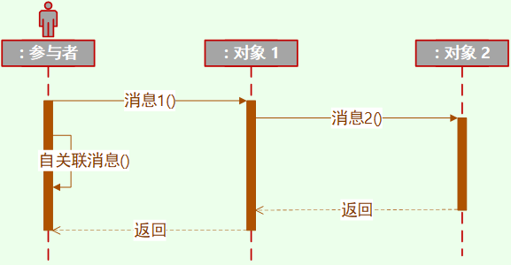  

**存在两个轴：**

* 水平轴 - 一组对象  
  对象用一个带有**垂直虚线的矩形框**表示，并标有对象名和类名。  
  **垂直虚线**是对象的**生命线**，用于表示在某段时间内对象是存在的。
* 垂直轴 - 时间  

**激活条：**  
**对象间的通信**通过在对象的**生命线之间的消息**来表示。  
当收到消息时，接收对象立即开始**执行活动**，即对象被激活了，  
通过在对象生命线上显式一个**细长矩形框**来表示激活。

### 2. 元素

* 参与者
* 对象
* 生命线
* 激活
* 消息

#### (1) 参与者

系统、子系统或类发生交互作用的**外部用户**。

#### (2) 对象

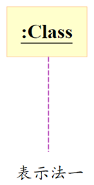  
显示在**单独的列**里，用一个矩形框代表一个对象。  
框内填写**对象名**和它**所属的类名**，中间用一个冒号隔开。

*参与者是一种特殊的对象。*

**创建或删除对象：**  
一个对象可以在交互过程中**发送一条消息**，来**创建另一个对象**；  
一个对象也可以在交互中删除，对象**生命线底部的"X"**表明对象已从内存中除去。  
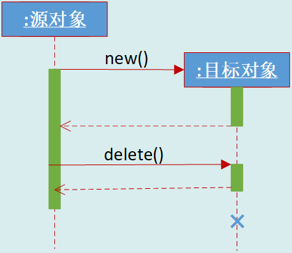  

#### (3) 生命线

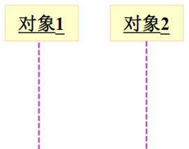  
对象标识符在垂直方向上拖出的**一条长虚线**。

表示时序图中的对象在**一段时间内的存在**。

**活动区：**  
两条生命线之间的区域称为“**活动区**”，进行**消息的传递**。

#### (4) 激活

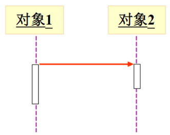  
在UML中激活用一个在生命线上的**细长矩形**表示。

当一条**消息被传递给对象**的时候，它会**触发**该对象的**某个行为**，这时该**对象被激活**了。
矩形本身被称为对象的**激活期**或控制期。  
对象在激活期顶端被激活，伴随着一个消息箭头离开对象的生命线。

#### (5) 消息

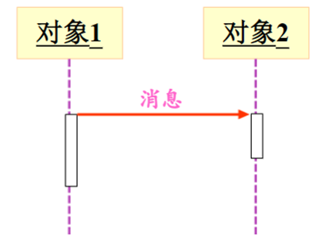  
消息是由从一个对象的生命线指向另一个对象的生命线的**直线箭头**来表示的。

消息是用来说明时序图中**不同活动对象之间的通信**，  
可以激发某个**操作、创建或撤销**某个对象。

**种类：**

* **简单消息**：**控制流**的转移，描述控制如何在对象间进行传递，不考虑通信细节。
* **同步消息**：**等待**对象消息的**回答后才能继续**自己的操作。  
  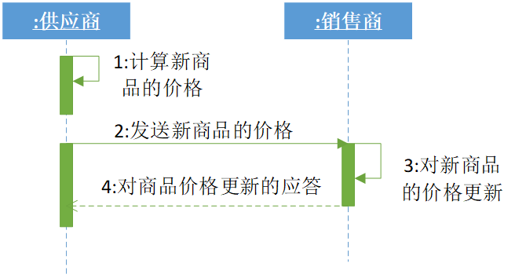  
  同步最后有一个虚线返回。
* **异步消息**：**不需要等待**对方对消息的回答**便可以继续**自己的操作。  
  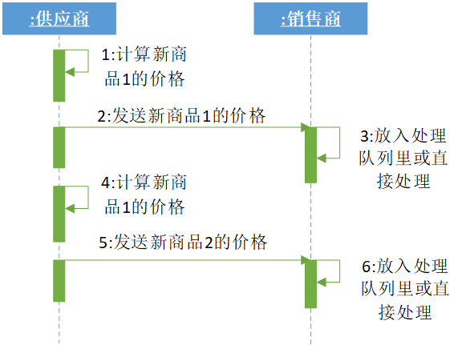  
  异步没有返回【只是指针对**这一次激活没有返回**，但在之后非激活状态可随时返回消息，重新激活  
  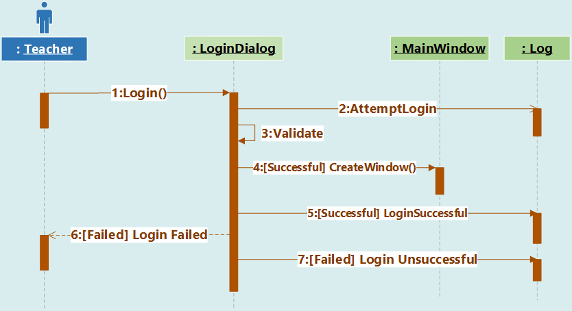  

* **返回消息**：从同步消息创建的激活**返回到调用者激活**。

### 3. 交互片段

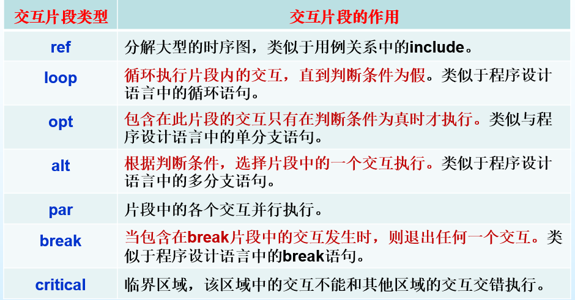  

#### (1) ref - 引用

就相当于子时序图。

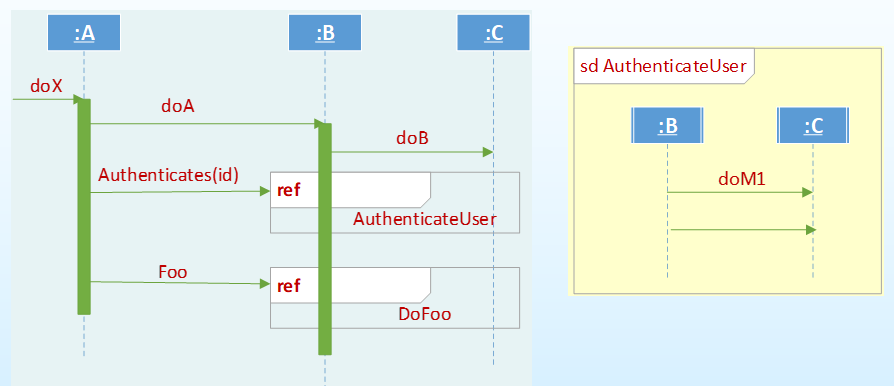  

#### (2) loop - 循环

一直循环，直到条件为假，常用来做输入时正确性验证。

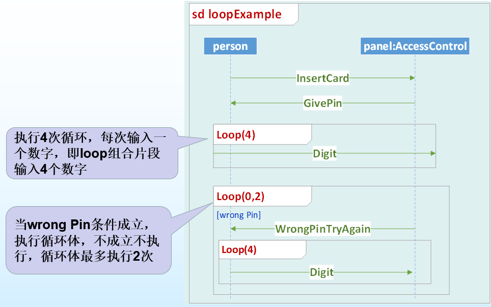  

#### (3) alt - 分支

alt交互片段可以存在多个区域，即多个分支，不同区域用虚线分割。  
每个区域设置一个**监护条件**，代表一种选择分支。  
根据判断条件，选择片段中的一个区域交互执行。

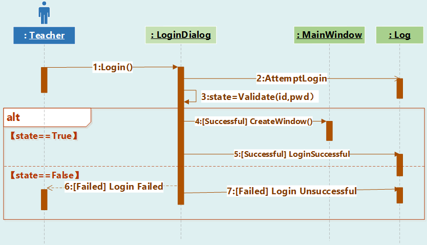  

#### (4) par - 并发

par的每个区域中的**交互会并发工作**，而不会相互交互。

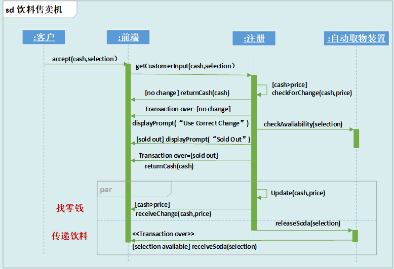  
上图中的找零钱和传递饮料，是并发执行的【相当于移到一起，但只是分开展示……

#### (5) break - 退出

* 监护条件为“真” - 执行子片段，而不执行子片段后面的其他交互
* 监护条件为“假” - 按正常流程执行

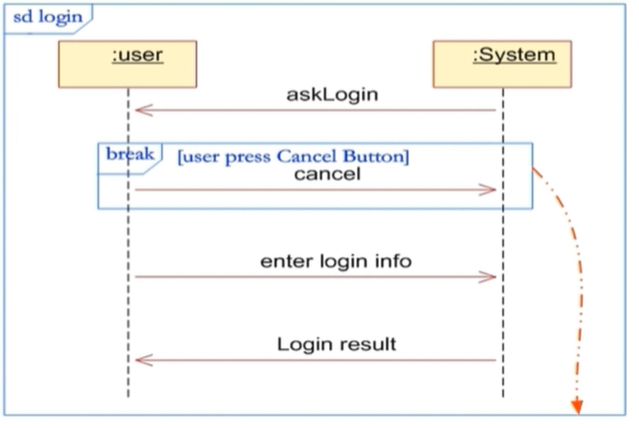  

#### (6) critical - 临界

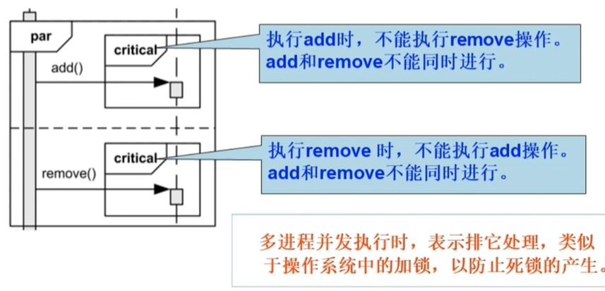  
