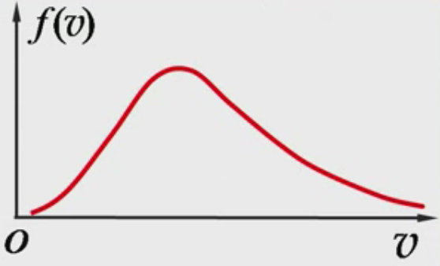
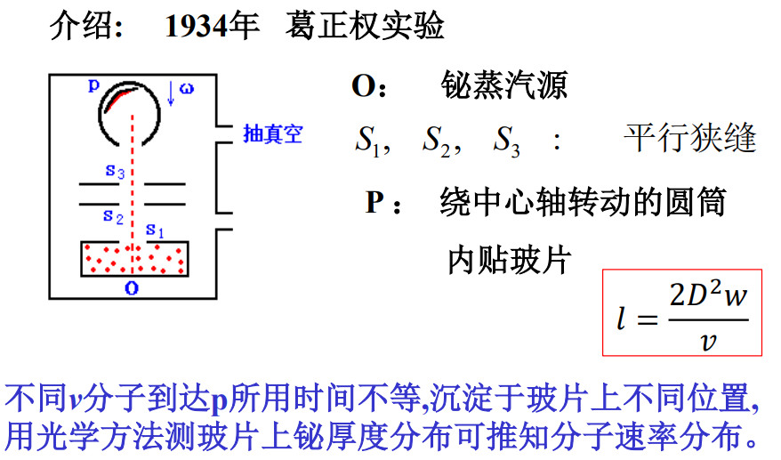
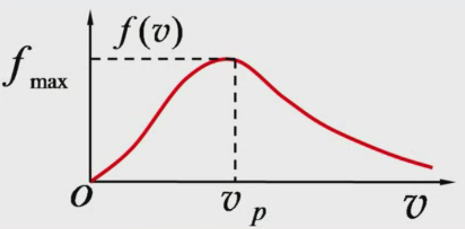
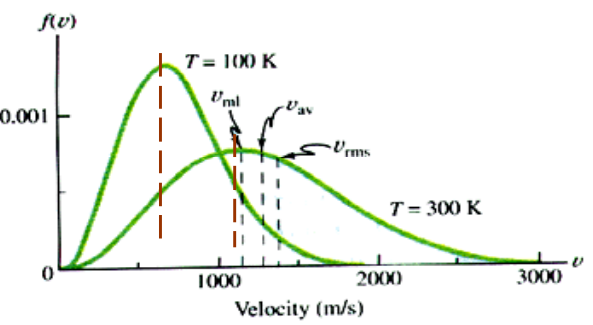
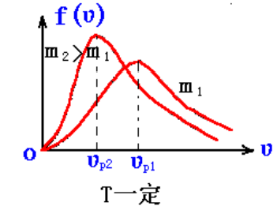
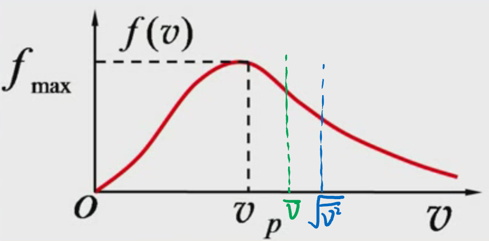

# 第三节 麦克斯韦分子速率分布定律

## 一、麦克斯韦速率分布曲线

用来表示运动速率的大小的分布。

可以知道：

* 气体分子速率可取$0\sim\infty$的任意值
* $v$很小和$v$很大所占比率很小。
* 中等速率分子所占比率很大。

用统计方法得到速度分布函数：$f(v)=\lim_{\Delta v\to 0}\frac{\Delta N}{N\Delta v}=\frac{1}{N}\frac{\textrm{d}N}{\textrm{d}v}$

---

根据实验现象，可以得到函数图形：  

麦克斯韦得到了具体的速率分布函数如下：
$$
f(v)=4 \pi\left(\frac{m}{2 \pi k T}\right)^{\frac{3}{2}} e^{-\frac{m v^{2}}{2 k T}} v^{2}
$$
其中的$m$是指**一个分子的质量**，而不是总气体质量。

可以看出：对某种气体（确定$m$），$f(v)$**与热平衡的状态$T$有关**。  
故要确定具体的热平衡状态$T$，才能得到速度分布曲线。

> 拓展 - 对该速率分布曲线的验证：
>
> 由葛正权实验可以验证。  
> 

## 二、三种速率

### 1. 最概然速率

> 定义 - 最概然速率$v_p$：
>
> 分布曲线的峰值所对应的速率，称为最概然速率$v_p$。

可通过求导方法得到：
$$
⭐v_p=\sqrt{\frac{2kT}{m}}=\sqrt{\frac{2RT}{M}}\approx1.41\sqrt{\frac{RT}{M}}
$$

* $m$ - **一个分子**的质量（不是总质量）
* $k$ - 玻尔兹曼常数（$k=\frac{R}{N_A}$）
* $M$ - 分子的摩尔质量（$M=mN_A$）
* $R$ - 普适气体常数

一般用后者计算。

不是说速率正好等于$v_p$的分子数最多，而是在这个**很小的区间范围内**最多。  
*反而$v=v_p$的概率趋近于$0$。（由概率论可知）*

> 拓展 - 曲线随$m,T$的变化：
>
> * $T\uparrow\qquad \rightarrow \qquad v_p\uparrow$  
>   温度升高，最概然速率变大，向右移，曲线变平缓。  
>   
> * $m\uparrow\qquad\rightarrow\qquad v_p\downarrow$  
>   质量升高，最概然速率下降，向左移，曲线变尖锐。
>   

### 2. 平均速率

平均速率$\bar{v}$：  
计算为$\int vf(v)\textrm{d}v$

求得为：
$$
\bar{v}=\sqrt{\frac{8RT}{\pi M}}\approx 1.6\sqrt{\frac{RT}{M}}
$$

### 3. 方均根速率

*先方$v^2$，再均$\bar{v^2}$，再根$\sqrt{\bar{v^2}}$*。

方均根速率$\sqrt{\bar{v^2}}$
计算为$\int v^2f(v)\textrm{d}v$

求得为：
$$
\sqrt{\bar{v^2}}=\sqrt{\frac{3RT}{M}}\approx1.73\sqrt{\frac{RT}{M}}
$$

## 三、三者关系与各自用途

三者关系：

* 最概然速率：$v_p=1.41\sqrt{\frac{RT}{M}}$
* 平均速率：$\bar v=1.6\sqrt{\frac{RT}{M}}$
* 方均根速率：$\sqrt{\bar{v^2}}=1.73\sqrt{\frac{RT}{M}}$

$$
v_p<\bar{v}<\sqrt{\bar{v^2}}
$$

三种速率的用途：

1. 最概然速率：讨论分子速率分布的时候用到。
2. 平均速率：讨论分子间相互作用（碰撞）的时候用到。
3. 方均根速率：讨论分子能量的时候用到。

---

*对于“玻耳兹曼粒子按势能的分布定律”，由于考纲不要求，不做记录。*
