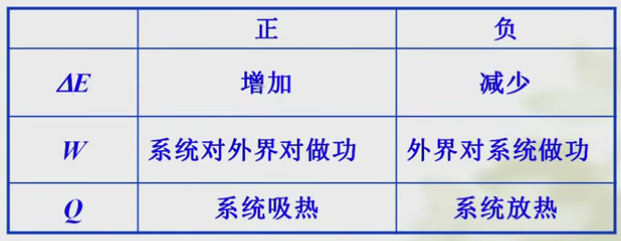
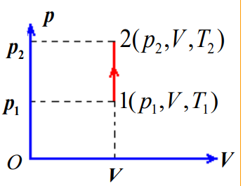
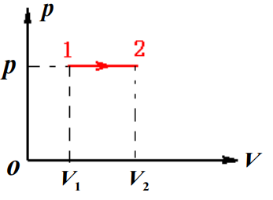
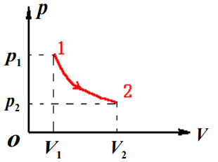
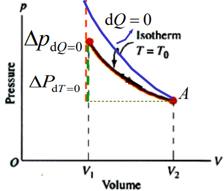

# 第二章 热力学第一定律

## 一、热力学第一定律

> 定律 - 热力学第一定律：
>
> 一系统若从外界吸热$Q$，则其等于系统内能的增量$\Delta E$和系统对外界做功$A$之和。  
> 反之，一系统对外界放热，则等于系统内能的减量和外界对系统做功之和。
>
> $$
> Q=\Delta E+A
> $$

  

物理意义和实质：涉及热运动和机械运动的**能量转换及守恒定律**。

## 二、对理想气体的应用

利用$pV=nRT$分析，有三个变量  
分为四种过程，每次限定一个变量。

* 由$pV=\frac{m}{M}RT$，可以推导每个过程的“过程方程”。
* 由$A,Q,\Delta E$三者关系，可以推导每个过程的“热力学第一定律具体形式”

### 1. 等体过程

等体过程 - $\textrm{d}V=0$($V=C$)：  

1. 过程方程：  
   $\frac{p_1}{p_2}=\frac{T_1}{T_2}$
2. 热力学第一定律的具体形式：
   * 吸热$Q$：$Q=\frac{m}{M}C_V\Delta T$
   * 做功$A$：$A=\int p\textrm{d}V=0$（体积不变，不对外做功）
   * 内能变化$\Delta E$：吸热全部用于增加内能
     $$
     ⭐\Delta E = (A+)Q=  \frac{m}{M}C_V\Delta T
     $$

     **对一切过程适用**。  
     在等温线上找到一个点，其与另一状态体积相同，则$\Delta E$可由$\Delta T$算出。
3. 等体摩尔热容
   $$
   C_V=\frac{i}{2}R
   $$

### 2. 等压过程

等压过程 - $\textrm{d}p=0(p=C)$：  

1. 过程方程：  
   $\frac{V_1}{V_2}=\frac{T_1}{T_2}$
2. 热力学第一定律的具体形式：
   * 吸热$Q$：$Q=\frac{m}{M}C_p\Delta T$
   * 做功$A$：$A=\int p\textrm{d}V=p(V_2-V_1)=\frac{m}{M}R\Delta T$
   * 内能变化$\Delta E$：$\Delta E =  \frac{m}{M}C_V\Delta T$
3. 等压摩尔热容
   $$
   C_p=\frac{i+2}{2}R
   $$

### 2.5. 等体和等压关系

由等压过程的推导，可得$C_V$与$C_p$关系：
$$
C_p=C_V+R
$$
为迈耶公式。

* 泊松比：$\gamma=\frac{i+2}{i}>1$，  
  告诉泊松比，则**可知道自由度**，则可判断是什么类型的气体分子。

> 拓展 - 为什么$C_p>C_V$：
>
> * 对于等容：$V=c\Rightarrow A=0$，故$Q_1=\Delta E$
> * 对于等压：$p=c\Rightarrow\Delta V>0, A>0$，故$Q_2=\Delta E + A$
>
> 故$C_p>C_V$

### 3. 等温过程

等温过程 - $\textrm{d}T=0(T=C)$：  

1. 过程方程：  
   $p_1V_1=p_2V_2$
2. 热力学第一定律的具体形式：
   * 内能变化$\Delta E$：$\Delta E =  0$（温度不变，内能不变）
   * 做功$A$：
     $$
     ⭐A=\frac{m}{M}RT\ln\frac{V_2}{V_1}
     $$
   * 吸热$Q$：$Q=A$（吸热全部用来对外做功）
3. 等压摩尔热容：  
   $C_T=\infty$

### 4. 绝热过程

绝热过程 - $\textrm{d}Q=0(Q+C)$，不吸热放热。

1. 过程方程：  
   * $pV^\gamma=C$
   * $p^{\gamma-1}T^{-\gamma}=C$
   * $V^{\gamma-1}T=C$
2. 热力学第一定律的具体形式：
   * 吸热$Q$：$Q=0$
   * 内能变化$\Delta E$：$\Delta E =  \frac{m}{M}C_V\Delta T$
   * 做功$A$：$A=-\Delta E=-\frac{m}{M}\cdot\frac{i}{2}R\Delta T=\frac{i}{2}(p_1V_1-p_2V_2)=\frac{p_1V_1-p_2V_2}{\gamma-1}$
3. 等压摩尔热容：  
   $C_\textrm{绝热}=0$
4. 绝热线：  
   * 等温线：$pV=C$，双曲线。
   * 绝热线：$pV^\gamma=C$，比**等温线陡峭**。

     

## 三、总结

### 1. 理想气体典型过程的主要公式

### 2. 四个公式

* 气体物态方程：  
  $$
  pV=\frac{m}{M}RT
  $$
* 热力学第一定律：
  $$
  Q=\Delta E+A
  $$
* 内能变化：
  $$
  \Delta E=\frac{m}{M} C_V\Delta T
  $$
  **⭐永远都是这个！**  
  其中：$C_V=\frac{i}{2}R$
* 热量$Q$：
  * 等体变化：
    $$
    Q=\frac{m}{M}C_V\Delta T
    $$
  * 等压变化：
    $$
    Q=\frac{m}{M}C_p\Delta T
    $$
  * 绝热变化：$Q=0$
  * 准静态中等温变化：
    $$
    Q=pV\ln\frac{V_2}{V_1}
    $$
* 准静态中对外做功：
  $$
  A=\int P\textrm{d}V
  $$
  大小反映为$p-V$相图中曲线的面积，  
  正负反映为曲线在$V$轴的方向。

  ⚠非准静态：用$A=Q-\Delta E$算！

⚠：对于非准静态的$A,Q,\Delta E$，不能用特性方程求解，要用热力学第一定律减法来求解。

### 3. 一些词语

* **自由膨胀**：$A=0$
