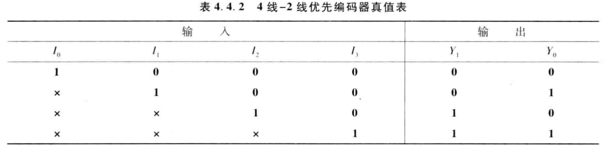
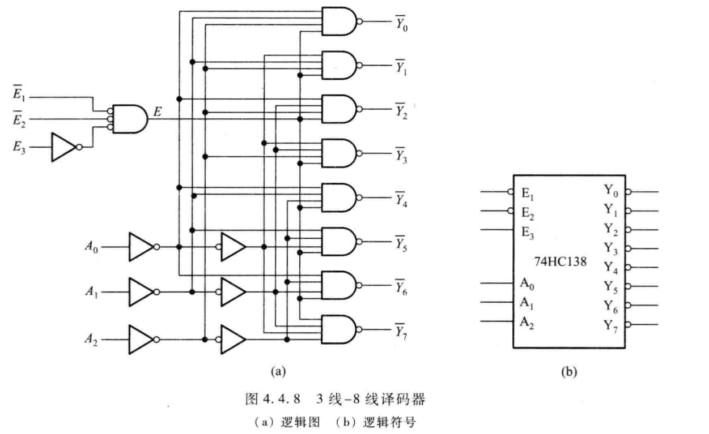
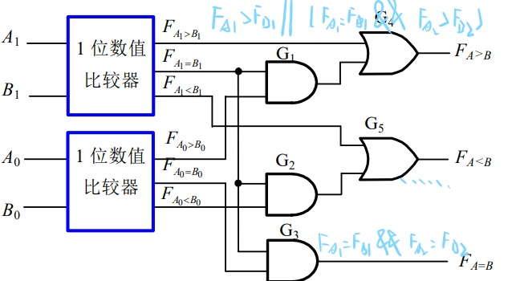
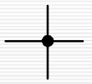
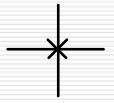
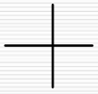
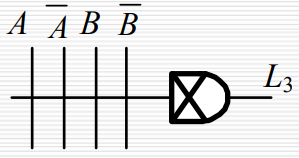
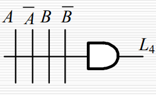
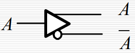
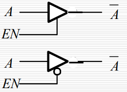

# Ep.4 组合逻辑电路

## 第二节 组合逻辑电路的设计

### 一、 设计

* 对于不可能出现的情况，应将其作为无关项。
* 对于较多情况，可以用多位二进制的组合来表示。  
  e.g. 血型A、B、AB、O，可以用两位来表示。而不是用4bit分别表示。

### 二、 优化

#### 1. 单输出电路

通过对逻辑表达式进行变换，以减少芯片资源的种类。

比如将$L=AB+CD$转换为$L=\overline{\overline{AB}\cdot\overline{CD}}$，  
将两个与门一个或门转换为三个与非门。

#### 2. 多输出电路

利用多项表达式中公共部分，减少逻辑门数目。

比如2个输出，其表达式都含有一项$AB$，  
则$AB$这一项可以共同连接到两个输出，而不是两个输出分别整一个$AB$。

#### 3. 多级逻辑电路

提取公因子后，可以将扇入数（输入端口数）减少。

比如$L=ABCD+AB\overline{C}E+ABD\overline{F}$，转换为$L=AB(CD+\overline{C}E+D\overline{F})$，  
可以将扇入数从$4$降到$3$。

## 第三节 组合逻辑电路的竞争-冒险

现实情况下，任何逻辑电路从输入到输出总是会有延迟。  
所以会产生竞争-冒险现象。  
导致在稳态电路下本应输出某种结果，实际上却并不是该结果。

### 一、 产生的竞争冒险的原因

> 例子：
>
> 但$L=AB$，其中$B=\overline{A}$时，
> 若不考虑延迟，则$L=0$。
>
> 
>
> 但因为经过一个逻辑元件会产生一定的延时，所以非门的输入会晚一些，  
> 导致$L$的处理在短时间内会产生错误。

* 竞争：当一个逻辑门的两个输入端的信号同时向相反方向变化，而变化的时间有差异的现象。
* 冒险：由竞争而可能产生输出干扰脉冲的现象。

由竞争不一定有冒险。


---

**⭐总结：**

* 表达式**最终是一个$L=M+\overline{M}$**  
  （只是要求两变量高低电平反向即可，不一定是同一变量）
* 对于与门：其中一个先从$0$到$1$  
  
* 对于或门：其中一个先从$1$到$0$  
    

### 二、 消除竞争冒险的方法

1. 消除**互补变量相乘**$A \overline{A}$ - 直接可以消去  
   比如$L=(A+B)(\overline{A}+C)$，展开后直接消除$A\overline{A}$。
2. 消除**互补变量相加**$A + \overline{A}$ - 增加乘积项  
   对于$L=X_AM+X_B \overline{M} \rightarrow L=X_AM+X_B \overline{M} + X_AX_B$  
   此时当$X_A=X_B=1$时，$L+M+\overline{M}+1$，使得恒为$1$，消去互补项相加。
3. *输出端并连电容器  
   *为物理技术，不在本课讨论范围。*

## 第四节 若干典型的组合逻辑电路

### 一、 编码器(Encoder)

> 赋予二进制代码**特定含义**的过程成为编码。  
> *或者反过来说，将一串有特定含义的代码，转化为二进制代码。*
>
> 如8421BCD，用1000表示8；
> 如ASCII，用各种二进制表示字符。

必须确保一种特定含义与一个编码**一一对应**。

* 输入：特定含义的信号
* 输出：其二进制代码

输入输出关系：$N$位输入→$\log N$位输出。

因为有特定含义，所以只能一位对应一种含义，  
也就是说，只能**同时存在一个有效信号**。  
有多少种“特定含义”，输入端就有多少位。
> 比如有八个人，则`00000001`代表第一个人，`00010000`代表第五个人，`10000000`代表第八个人，  
> 而对于`00100010`，是没有意义的。

而如果不规定只能以一位有效对应某一特定含义的话，则在编码时会发生混乱，不满足一一对应的关系。  
可以见下面“有两个以上的输出信号时会出现异常”。

---

分类：

* 普通编码器：任何时候**只允许一个**有效输入信号，否则输出发生混乱。
* 优先编码器：允许同时输入两个以上的有效输入信号。  
  当同时输入几个有效信号时，**只对优先级最高的进行编码**。  
  *并不是指多个有效输入信号代表一个特定含义，还是一位有效信号代表特定含义。*

#### 1. 普通编码器 - 4线-2线普通二进制编码器

真值表：


可由表得逻辑式：
$$
Y_1=\bar{I_0}I_1\bar{I_2}\bar{I_3}+\bar{I_0}\bar{I_1}\bar{I_2}I_3 \\
Y_0=\bar{I_0}\bar{I_1}I_2\bar{I_3}+\bar{I_0}\bar{I_1}\bar{I_2}I_3
$$

```verilog
//Behavior
module encoder4to2(Y, I);
  input [3:0] I;
  output reg [1:0] Y;

  always @(I)
  begin
    case (I)
      4'b0001: Y=2'b00;
      4'b0010: Y=2'b01;
      4'b0100: Y=2'b10;
      4'b1000: Y=2'b11;
      default: Y=2'b00;
    endcase
  end
```

---

异常分析：

当$I_3=1$时，$Y_1Y_0=11$，  
而当$I_1=I_2=1$时，$Y_1Y_0=11$，  
故当有两个以上的输出信号时会出现异常。

*也解释了为什么只能以一位有效信号代表某个特定含义。*

#### 2. 优先编码器 - 4线-2线优先二进制编码器

根据事情的轻重缓急，实现规定好输入端口的优先级，
当有多个输入信号输入时，只处理优先级高的。

真值表：


异常分析：

* 当所有输入信号为0时，输出为0
* 当$I_1=1$时，输出也为0

```verilog
//Behavior
module encoder4to2(Y, I);
  input [3:0] I;
  output reg [1:0] Y;

  always @(I)
  begin
    casex (I)
      4'b0001: Y=2'b00;
      4'b001x: Y=2'b01;
      4'b01xx: Y=2'b10;
      4'b1xxx: Y=2'b11;
      default: Y=2'b00;
    endcase
  end
```

---

可以看出上述两种编码均存在问题（输入与输出不是一一对应），  
故一般用下面的集成电路优先编码器。

常用集成电路优先编码器种类：

* 74X147 - 10线-4线优先编码器  
  输入：低电平有效  
  输出：8421BCD码
* 74X148 - 8线-3线优先编码器  
  输入：低电平有效  
  输出：二进制代码
* CD4532 - 8线-3线优先编码器  
  输入：高电平有效  
  输出：二进制代码

#### 3. 8线-3线优先二进制编码器

即为上述的CD4532。


* EI - 使能控制信号，当为$0$时不工作
* EO - 异常输出信号，当为$1$时说明输入全为0
* GS - 正常输出信号，当为$1$时说明正常工作（输出不全为0）

  

### 二、 译码器/数据分配器(Decoder)

#### 1. 定义与分类

> 将二进制码翻译成代表某一特定含义的信号（即电路的某种状态）。

即为上述编码的逆过程。

分类：

* 唯一地址译码器 - 将一系列代码转化为与之一一对应的特定有效信号
  * 二进制译码器
  * 二-十进制译码器
  * 显示译码器
* 代码转换器 - 将一种代码转换为另一种代码

#### 2. 二进制译码器

这种才是真正上面编码器的译码器。

* 输入：二进制代码
* 输出：其特定含义的信号

输入输出关系：$M$位输入→$2^M$位输出。

因此也需要保证一种编码，只对应一种“一个有效信号”情况的输出。

而正因为这种特性，相当于每一种输出代表一个最小项，  
故也称“最小项译码器”。

##### ① 2线-4线译码器(74HC139)

  
⭐注：端口变量符号上有横线，或者端口接线处有圆圈，代表为**低电平有效**。  
特别是在**逻辑表达式中**，低电平有效的符号（如上图的$\overline{E}$）不能当作“非”而消去，而要**一直保留**。


```verilog
//Dataflow
module decoder_df(A1,A0,E,Y);
  input A1,A0,E;
  output [3:0]Y;

  assign Y[0] = ~(~A1 & ~A0 & ~E);
  assign Y[1] = ~(~A1 & A0 & ~E);
  assign Y[2] = ~(A1 & ~A0 & ~E);
  assign Y[3] = ~(A1 & A0 & ~E);
endmodule
```

##### ② 3线-8线译码器(74HC138)



输出均为低电平有效。  
数据输入为高电平有效。

控制信号：

* $E_1$ - 低电平有效
* $E_2$ - 低电平有效
* $E_3$ - 高电平有效

如果**只用这一片74HC138**，则三个控制端口$E_1$、$E_2$、$E_3$，就当成**简单的控制开关**。  
即**只有满足：$E_1$、$E_2$端口为低电平输入、$E_3$端口为高电平输入**（均为有效输入），才能使得该电路正常工作。  
否则只要有一个不为有效输入，则会使得输出全为$1$（全为无效输出，注意输出也为低电平有效）。

> 而当需要用两片74HC138，构成一个“4线-16线译码器”的时候，这三个控制端口才有特定用途。  
> 对于其中一个译码器$A$：
>
> * $E_3$ - 用于接收输入信号其额外的第$4$位。  
>   其需要连接到另一片译码器$B$的$E_2$端口，用来代表选择哪个译码器工作。
>
> 对于另一片译码器$B$：
>
> * $E_2$ - 用于与第一片译码器$A$的$E_3$端口构成选择器。  
>   当第$4$位为$0$选择$B$工作，为$1$选择$A$工作。
>
> 构成示意图见下：  
> 
>
> 具体分析可见：  
> [三八译码器74HC138的 使能端 的工作原理是什么?为什么设计三个使能端？ - 周辰峰的回答 - 知乎](https://www.zhihu.com/question/412229206/answer/1828350505)

```verilog
//Behavior
module ecoder3to8_bh(A,En,Y);
  input [2:0]A, En;
  output reg [7:0]Y;
  integer k;

  always @(*)
  begin
    Y = 8'b1111_1111;
    for (k = 0; k <= 7; k++)
      if ((En == 1) && (A == k))
        Y[k]=0;
      else
        Y[k]=1;
  end
endmodule
```

---

得到每个输出端口唯一的输入情况：  


可以看出：每一项可以代表一个**最小项（的非）**，故也称为**最小项译码器**。
能很方便实现三变量逻辑函数。

用74HC138实现三变量逻辑运算：

1. 先将表达式转换为**最小项之和**的形式。
2. 再还原律+摩尔根，变为**最小项的非的与**形式。
3. 用**与非门连接**在一起。

> 拓展 - 用74HC138实现$L=\overline{A}\ \overline{C}+AB$  
>
> 

#### 3. 二-十进制译码器

*其实根上述的二进制译码器差不多，不过为BCD8421译为十进制数。*

有$4$个输入端口，代表$4$位8421BCD码，  
有$10$个输出端口，分别代表十进制$0~9$。


#### 4. 显示译码器

将输入的4位BCD码（一般为8421BCD）代表的十进制数，翻译成“七段码”送给数码管，  
以便数码管能够显示各个BCD码所对应的十进制数字。

> 与前面两种译码器的区别：  
>
> * 前面两种：一种输入信号，只会有一个输出端口输出有效电平。
> * 显示译码器：一种输入信后，可能会有多个输出端口输出有效电平。


* 共阴极电路：所有阴极接地，输出信号为高电平有效
* 共阳极电路：所有阳极接地，输出信号为低电平有效

---

常用的为：集成七段显示译码器(74HC4511)

真值表（功能表）：  
  


* 灯测试$\overline{LT}$优先级最高 - 正常为1。但只要为0，灯全亮。
* 灭灯$\overline{BL}$优先级第二 - 正常为1。但只要为$BL=0(LT=0)$，灯全灭。
* 锁存$LE$ - 正常为0。但只要$LE=1(LT=1, BL=1)$，则输出信号锁定。

> 需要注意这三个控制位**与二进制译码器**（74HC138等）的**三个使能位不同**：
>
> 这三个有具体作用，所以正常工作要置为无效（如低电平有效则置高电平）；  
> 而二进制译码器的是控制是否工作，所以正常工作要置为有效（如低电平有效则置低电平）。

```verilog
//Behavior
module seg7_decoder(
  input LE, BL, LT, D3, D2, D1, D0,
  output reg a, b, c, d, e, f, g
);

  always @(*)
  begin
    if (LT == 0) //灯测试
      {a, b, c, d, e, f, g} = 7'b1111111;
    else if (BL == 0) //灭灯
      {a, b, c, d, e, f, g} = 7'b0000000;
    else if (LE == 1) //锁存
      {a, b, c, d, e, f, g} = {a, b, c, d, e, f, g};
    else //开始判断
      case ({D3, D2, D1, D0})
        4'd0: {a, b, c, d, e, f, g} = 7'b1111110;
        4'd1: {a, b, c, d, e, f, g} = 7'b0110000;
          ...//以下类推
        default: {a, b, c, d, e, f, g} = 7'b0000000;
      endcase
  end
endmodule
```

> 拓展 - 由1个显示译码器、1个译码器和4个七段显示器显示$4$位数字
>
> 本来一个显示译码器只能显示$1$位，  
> 但搭配74HC139，在极短的时间内依次输出4个不同的电位，同时变动显示译码器要输出的数字，  
> 即在很短的时间内依次在4个七段显示器上显示每一位，  
> 再利用人的视觉残留，可以看到稳定的$4$位数字。
>
> 此时接在译码器的输入信号则称为“位选择信号”。

#### 5. 数据分配器

将公共数据线（一个公共输入端口）上的数据，  
按照需要，发送到不同的通道（某个特定的输出端口）上去。

相当于“一个输入”对应“多个输出”的单刀多掷开关。

> 原理：
>
> 对于74HC138，当$E_2=0, E_3=1$时，  
> 将$E_1$作为公共输入端口，  
> 可以通过不同的$A_0, A_1, A_2$，可以将$E_1$输出到不同的$Y$端口。
>
> 如$A_0=0, A_1=1, A_2=0$，  
> 则$Y_2=E_1$，从$Y_2$端口原样输出。

可以分别将$E_1, E_2, E_3$作为输入端口，并其余两个调整为有效信号即可。  
但注意：

* $E_1, E_2$ - 输出跟输入一样。（均为低电平有效）
* $E_3$ - 输出是输入取非。


---

具体的分配电路实现方式：  
利用二进制译码器(74HC139、74HC138)，搭配$n$个三态门来实现。

> 例 - 实现一个数据分配器，分配到$4$个通道。  
> 需求非控制的输出通道为高阻态。
>
>   
> 其中黑色部分即为74HC139，蓝色部分为4个三态门。

### 三、数据选择器

与数据分配器互补：  
相当于“多个输入”对应“一个输出”的单刀多掷开关。

在选择信号的作用下，将多个通道的数据选择其中一个，传输到公共的输出数据通道中。

#### 1. 最基础的数据选择器 - 2选1数据选择器

##### ① 基本介绍

电路图：  


逻辑符号：  


```verilog
//Dataflow
module mux2x1_df(A, B, SEL, L);
  input A, B, SEL;
  output L;

  assign L = SEL ? A : B;
endmodule

//Behavior
module mux2x1_bh(D1, D0, S, L);
  input D1, D0, S;
  output reg Y;

  always @(*)
  //一句话，不用加begin
    L = SEL ? D1: D0;
endmodule
```

##### ② 构成n选1数据选择器

由该数据选择器可以组合成n选1数据选择器。

> 如4选1数据选择器：  
> 可由$3$个2选1选择器构成。  
> 
>
> 
>
> 表达式：$Y=D_0\overline{S_1}\ \overline{S_0} + D_1\overline{S_1}S_0 + D_2S_1\overline{S_0} + D_3S_1S_0$  
> 改为选择信号的最小项$Y=D_0m_0+D_1m_1+D_2m_2+D_3m_3$

即组合成$n$选$1$数据选择器：  
则有$n$个数据输入端口；  
有$\lceil\log_2n\rceil$个控制输入端口，  
其中同一级的$2$选$1$，用一个控制端口共同控制。
> 原因：
>
> 当前一级的控制端取的$0$的话，这一级的下方选择器便没有用了，  
> 而如果前一级取$1$的话，这一级的上方便没有用了。  
> 所以这一级的控制端，能唯一确定某个通路。

##### ③ 运算功能

上例看出：也可以将表达式改为**最小项表达**，  
故也**可以进行数据运算**。

通过数据输入端口$D_m\sim D_0$的不同确定取值，  
可组合成关于**控制输入端口**$S_n\sim S_0$的不同最小项组合。

但如果变量数多于“控制端口”数，  
则需要把多余的变量被迫安排到“输入端口”。  

此时根据“控制端口”的变量的不同取值，  
得到输出$L$与剩余（位于“输入端口”的）变量关系式，  
然后根据关系式，确定该“控制端口”的状态（如$(D_1,D_0)=10$）下，“输入端口”的变量该如何连接至该状态的端口（如连接至$10$端口）。

即枚举位于控制端口的变量，然后对于每种状态得到一个剩余变量的表达式，  
再将剩余变量按照该表达式连接至对应状态端口。

> 例 - 利用2选1数据选择器，实现$L=AB+A\overline{C}+BC$。
>
> 本来2选1只支持$1$个控制输入端，但这里有$3$个变量，  
> 因此需要指定另外$2$个变量为“输入端”。
>
> 定$A$为控制端，则真值表：  
> 
>
> 也就是说，枚举控制端口的$A$：
>
> * $A=0 \rightarrow L=BC$
> * $A=1 \rightarrow L=B+\overline{C}$
>
> 则将BC连入$0$这个状态（第一种输入），  
> 将$B+\overline{C}$连入$1$这个状态（第二种输入）。
>
> 实现电路如图：  
> 

总结：

都是优先**把变量接入控制输入端口$S$**。

* 变量数 = **控制**输入端口数  
  则直接把函数转化为最小项表达式，然后根据保留情况，直接确定输出端口$D$为确定的值。  
  这个时候$D$是常量。
* 变量数 < **控制**输入端口数
  把没被用到的选择端口置任意值，然后对有可能输出的端口进行控制（置1）即可。（其余则置0）
* 变量数 > **控制**输入端口数  
  * 如果支持其他逻辑元件（如与门等）：  
    将部分变量当输入信号，根据不同的控制信号，得出每个情况的表达式，然后再设计该种情况的电路。  
    这个时候$D$是变量。
  * 如果不支持其他逻辑元件（只能用选择器）：  
    则需要用该选择器，组合成$n$选$1$选择器，使得$n>=\textrm{变量数}$。

##### ④ *构成查找器LUT

数据选择器构成查找表LUT(Look-Up-Table)：  
*约等于一个8选1数据选择器*  
输出给定逻辑函数，  
其中输入端口为选择器的控制端口，而数据端口为常量。

  
一定注意$D$端为设计好了的**常量**。

#### 2. 典型集成电路 - 8选1数据选择器（74HC151）


* $E$ - 低电平有效。为$1$时不工作（$Y$输出0、$\overline{Y}$输出1）。
* $Y$ - 输出由$S$所选择的信号
* $\overline{Y}$ - 输出所选择信号的非

> 扩展：
>
> 1. 多位的8选1（$N$bit，均按照相同的$S$选择）：  
>    简单的几个8选1直接并联。
> 2. 16选1：  
>    将两个8选1并联，  
>    并将使能端$\overline{E}$利用起来，作为第二个8选1是否启用的控制信号（即选择$8\sim15$）。

### 四、数值比较器

对**两个数字**进行比较，以判断其大小的逻辑电路。

#### 1. 1位数值比较器

最基本的1位数值比较器：

* 2个输入：$A$、$B$
* 3个输出：$F_{A>B}$、$F_{A=B}$、$F_{A<B}$

可由1位数值比较器构成n位数值比较器。  
当高位不相等时，则直接输出高位的比较信息，  
否则进行下一位的比较。

#### 2. 2位数值比较器

按照上面的分析，直接构成。




#### 3. 集成数值比较器 - 4位数值比较器(74HC85)


从高位$A_3$、$B_3$开始判断，  
如果相等则往低位判断。

如果四位全相等，直接输出地位比较结果。

> 拓展 - 组成$4n$位数值比较器：
>
> 1. 串联扩展方式  
>    
>
>    但注意：可能存在延时情况。  
>    最坏情况：每次都比较到最后一位才得出结果。
> 2. 并联拓展方式  
>    多用一片4位比较器，用来综合考虑其他4个4位的比较结果。  
>    相当于把4位整合成1位比较。
>
>    注意被整合的4位的比较器，其低位输出要为相等$I_A=I_B$。
>    

### 五、算术运算电路

#### 1. 半加器和全加器

* 半加：不考虑低位的进位
* 全加：考虑低位的进位

##### ① 1位半加器(Half Adder)


* $S$ - 本位的运算结果  
  逻辑表达式：$S=A \oplus B$
* $C$ - 是否产生进位  
  逻辑表达式：$C=AB$

##### ② 1位全加器(Full Adder)


* $C_i$ - 低位的进位信息

* $S$ - 本位的运算结果  
  逻辑表达式：$S=A\oplus B\oplus C_i$
* $C_o$ - 是否产生进位  
  逻辑表达式：$C_o=AB+(A\oplus B)C_i$

---

可以由两个半加器组成成一个全加器：  
  
即本位半加后再与进位半加。

> 应用 -奇偶校验器：
>
> 对于全加器，其$S$端输出，即为$3$个输入端是否为奇数个$1$（如果是输出$1$）。  
> $\because S=A\oplus B\oplus C_i$，利用的实际上为异或$\oplus$的性质。

#### 2. 多位加法器

*略。*

## 第五节 组合可编程逻辑器件

> 一种可以由用户定义和设置逻辑功能的器件。

所谓可编程，即是可以由用户自己设计逻辑表达式，  
*由Verilog就可以看出：编程的行为模式和数据流模式是等价的。*  
而一切表达式都可以转化为最小项表达式，  
因此对于最小项表达式，最基本的结构：

* 与门阵列
* 或门阵列

由此构成与非（最小项）表达式。

> 本节知识点：
>
> * 根据电路图写出表达式
> * 根据表达式画出电路图

### 一、PLD的结构、表示方法及分类

P - Program 可编程  
L - Logic 逻辑  
D - Device 器件

#### 1. PLD的基本结构

  

#### 2. PLD的逻辑符号表示方式

1. 不可编程单元 - 硬线连接单元  
   代表恒为接通状态。  
   
2. 可编程单元
   1. 被编程接通单元  
      代表由用户自定义的接通状态。  
      
   2. 被编程擦除单元  
      代表由用户自定义的断开状态。  
      
  
特殊的组合表达：

1. 输出恒为0的与门：
2. 输出恒为1的与门：
3. 互补输入缓冲器：
4. 三态输出缓冲器：  

> 例1：  
> 
>
> 例2：  
>   
> 注意图中的新颖点 - 反馈：  
> 即将输出结果由用来当作输入变量。

#### 3. 编程连接技术

1. 早期  
   采用金属熔丝技术，  
   通过大电流将金属丝熔断，完成编程。  
   **只能进行一次编程。**
2. CMOS中  
   采用可擦除的编程方式，  
   用浮栅MOS代替熔丝。  
   可以多次编程。

#### 4. 分类

1. 按集成密度划分：
   * 低密度可编程逻辑器件
   * 高密度可编程逻辑器件
2. 按结构特点划分：
   * 简单PLD
   * 复杂的可编程器件(CPLD)
   * 现场可编程门阵列(FPGA)
3. 按与、或阵列是否编程划分：
   1. 与阵列固定，或阵列可编程(PROM)
   2. 与阵列、或阵列均可编程(PLA)
   3. 与阵列可编程，或称列固定(PAL、GAL)

---

由于实际上比较简单（只需要根据表达式，再需要的点上画`X`即可），  
故不额外讲述本节。

## 第六节 用Verilog描述组合逻辑电路

一般语法结构：

```verilog
//只用于本课学习的方面
module 模块名(端口_1, 端口_2, 端口_3, ...); //注意这里有分号
  input 输入端口_1, ...;
  output 输出端口_1, ...;
  数据类型定义((wire,) reg); //也可以与input、output合并为：`input(output) wire(reg) ...;`
  其他变量申明(wire, reg, integer, ...); //比如用作循环变量的i，需要声明为`integer i`;
  /* 再补充关于wire和reg：
  门级电路描述时：所有用来代表连接的结点，都需要定义为wire
  数据流描述时：只要为赋值语句左边的变量，都需要定义为wire
  注意：input和output默认定义的是wire，即`input wire in_1`，所以在上述两种中其实可以相当于不加。但最严谨的是：input、output所有端口以及临时节点都加上wire

  行为描述时：只要赋值语句左边的变量，必须要定义为reg（输出需要额外定义）
  */

  //门级描述
  基本门级元件(not, and, or); //e,g, `not(out_1, in_1);`//注意输出在前，输入在后！
  //数据流描述
  连续赋值语句(assign); //e.g. `assign out_1 = (in_1 & A) | （in_2 & ~B);`//注意电路中法国逻辑运算一般为按位，即要用`&`,`|`,`~`,`^`,`~^`。
  //行为描述
  过程块结构(initial, always) //e,g. `always @(...)`
  begin
    行为描述语句; //一句话不用加begin, end
  end //就是基本的C语言结构了
```

额外补充几点：

* 用基数形式表示是，位宽指的是二进制下的位数。  
  如`5'H0CFF`→`0000_1100_1111_1111`→`1_1111`，与`5'H1F`一样。

### 1. 组合逻辑电路的行为级建模

1. `if` - 跟C一样。
2. `case`  

   ```verilog
   case (case_expr)
     item_expr1: //一种情况多个语句
     begin
       statement1_1;
       statement1_2;
     end
     item_expr2: statement2; //一种情况一个语句
     ...
     default: default_statement; //可省略
   endcase

   casex (...) //包含未知项（优先编码器）
    4'b1xxx: ...;
   endcase

   casez (...) //包含高阻态
   endcase
   ```

3. `for`  

   ```verilog
   integer k;
   ...
   for (k = 0; k <= 7; k++)
   begin //一条语句不用
     ...
   end
   ```

### 2. 分模块、分层次的电路设计

一般采用“自顶向下”的设计方法。


从最开始要求的设计，一步步划分，直到得出每个模块最基本的元件。

---

*模块的引用，与C++的函数还是有点区别。*

父模块引用（调用）子模块时：

1. 实例引用名不能省略。
2. 实例引用名在父模块中必须且唯一。

调用方法：

1. 位置关联法：  
   变量与子模块申明的参数顺序位置一样。

   ```verilog
   //子模块设计
   module halfadder(S, C, A, B);
     ...
   endmodule

   //父模块开始引用
   module main(...);
     halfadder HA1(Sum, out_C, in_A, in_B); //必须要求顺序严格对应
   endmodule
   ```

2. 名称关联法：  
   `.A`是子模块中的参数。  
   `(B)`是主模块中的参数。

   ```verilog
   module main(...);
     halfadder HA2(.A(in_A), .S(Sum), .B(in_B), .C(out_C)); //顺序可以打乱
     //.A, .S为子模块中参数名称
     //(S1), (Sum)为父模块中变量名称
   endmodule
   ```

> 例： 完整的4位加法器
>
> ```verilog
> module halfadder(S, C, A, B); //用门级电路描述的1位半加器
>                               //采用一个与门一个异或门构成。
>   input A, B;
>   output S, C;
> 
>   xor (S, A, B);
>   and (C, A, B);
> endmodule
> 
> module fulladder(S, C_o, A, B, C_i); //用门级电路描述的1位全加器
>                                      //采用两个1位半加器和一个或门构成。
>   input A, B, C_i;
>   output S, C_o;
>   wire S1,C_1,C_2; //内部节点信号
> 
>   halfadder HA1(S1, C_1, A, B);
>   halfadder HA2(S, C_2, S1, C_i); //本位结果输出
>   or gate_1(C_o, C_1, C_2); //进位输出
> endmodule
> 
> module 4bit_adder (S, C_o, A, B, C_i); //用门级电路描述的4位加法器
>                                        //采用四个1位全加器构成。
>   input[3:0] A,B; //4bit输入
>   input C_i;
>   output[3:0] S; //4bit输出
>   output C_o;
>   wire C1,C2,C3; //内部进位信号
> 
>   fulladder FA_0 (S[0], C_1, A[0], B[0], C_i),
>             FA_1 (S[1], C_2, A[1], B[1], C_1),
>             FA_2 (S[2], C_3, A[2], B[2], C_2), 
>             FA_3 (S[3], C_o, A[3], B[3], C_3);
> endmodule
> ```
