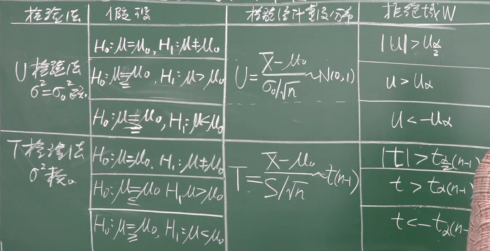

# 第二节 单个正态总体

* 总体：$X\sim N(\mu,\sigma^2)$
* 样本：$(X_1,X_2,\cdots,X_n)$
* 检验水平：$\alpha$

要假设并检验$\mu$和$\sigma^2$。

## 一、参数μ的假设检验

**对于假设：**

1. 双边假设：$H_0: \mu=\mu_0\qquad H_1:\mu\ne\mu_0$  
   拒绝域：$|A|>A_{\frac{\alpha}{2}}$
2. 右侧检验：$H_0: \mu\le\mu_0 \qquad H_1:\mu>\mu_0$  
   拒绝域：$$  
   $H_0$的拒绝域在右边，所以叫右侧假设。

   但当检验时，只有$H_0$为一个确值才好检验，  
   故一般简化处理为$\mu=\mu_0$。  
   但假设的时候还是设的小于等于。
3. 左侧检验：$H_0: \mu\ge\mu_0\qquad H_1:\mu<\mu_0$  
   拒绝域：$$  
   $H_0$的拒绝域在左边，所以叫左侧假设。

   同理：一般简化处理为$\mu=\mu_0$。

**对于检验，有如下两种：**

### 1. 总体方差σ已知 - U检验

1. 提出假设  
   $H_0:\mu=\mu_0\qquad H_1:\mu\ne\mu_0$  
   这里$\mu_0$是个具体的数，代进去。
2. ⭐构造检验统计量
   $$
   ⭐U=\frac{\bar X-\mu_0}{\sigma/\sqrt{n}}
   $$
3. 计算拒绝域
   $$
   P\{|U|>U_{\frac{\alpha}{2}}\}=\alpha\Rightarrow \textrm{临界点为}U_{\frac{\alpha}{2}}(Z_\frac{\alpha}{2})
   $$
   这里$U_\frac{\alpha}{2}$是个具体的数，查表得到。
   则拒绝域：
   $$
   ⭐W=\{(X_1,X_2,\cdots,X_n)\bigg||U|>U_\frac{\alpha}{2}\}
   $$
4. 计算$U$的值，与临界点$U_\frac{\alpha}{2}$比较
   * $|U|>U_\frac{\alpha}{2}$：拒绝$H_0$
   * $|U|<U_\frac{\alpha}{2}$：接收$H_0$

对于假设：  
为是否合格、是否正常工作，  
都是**将“是”这类肯定的回答**作为$H_0$。

对于单边：临界点为$U_\alpha$

---

对于之后的，步骤都一样，不同的是检验统计量和拒绝域。

### 2. 总体方差σ未知 - T检验

* 检验统计量：
  $$
  ⭐T=\frac{\bar{X}-\mu_0}{S/\sqrt{n}}\sim t(n-1)
  $$
  ⚠注意$\overline{X}$和$S$都不能在这里代数。
* 拒绝域：
  $$
  ⭐W=\{(X_1,X_2,\cdots,X_n)\bigg||t|>t_\frac{\alpha}{2}(n-1)\}
  $$

当$n$很大时，近似为正态分布，  
$t(n-1)\rightarrow Z$

---

总结：  

## 二、参数σ的假设检验

**对于假设：**

1. 检验：$H_0: \sigma^2=\sigma^2_0\qquad H_1:\sigma^2\ne\sigma^2_0$  
   拒绝域：$A>A_{\frac{\alpha}{2}}$
2. 检验：$H_0: \sigma^2>\sigma^2_0\qquad H_1:\sigma^2\le\sigma^2_0$  
   拒绝域：$A>A_\alpha$
3. 检验：$H_0: \sigma^2>\sigma^2_0 \qquad H_1:\sigma^2>\sigma^2_0$  
   拒绝域：$A<A_{1-\alpha}$

*对于检验，直接用$\mu$未知的。*

### 1. 期望μ未知 - 卡方检验

* 检验统计量：
  $$
  ⭐A(=\frac{\sum(X_i-\overline{X})^2}{\sigma^2})=\frac{(n-1)S^2}{\sigma^2}\sim \chi^2(n-1)
  $$
* 拒绝域：
  $$
  ⭐W=\{(X_1,X_2,\cdots,X_n)\bigg||\chi^2|>\chi^2_\frac{\alpha}{2}(n-1)\}
  $$  
  注意因为不是对称的，所以右侧是的大的正数，左侧是个小的正数。  
  拒绝判断条件为$\chi^2$是否大于右侧的，小于左侧的。

$A=\frac{(n-1)S_n^2}{\sigma^2}\sim\chi^2(n-1)$

e.g. $H_0: \sigma^2=\sigma_0^2$  
检验为：$\frac{(n-1)S_n^2}{\sigma^2}>\chi_{\frac{\alpha}{2}}^2(n-1)$
