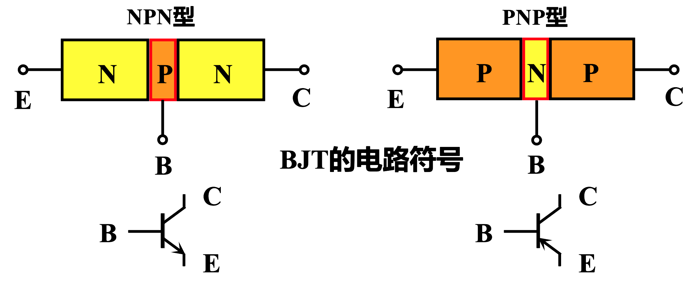
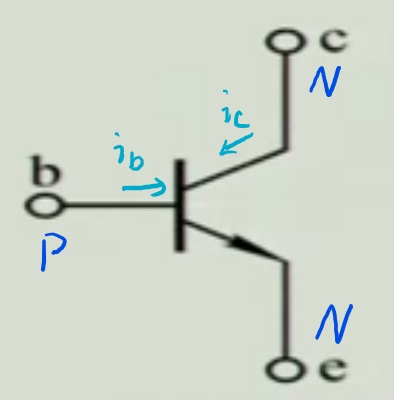
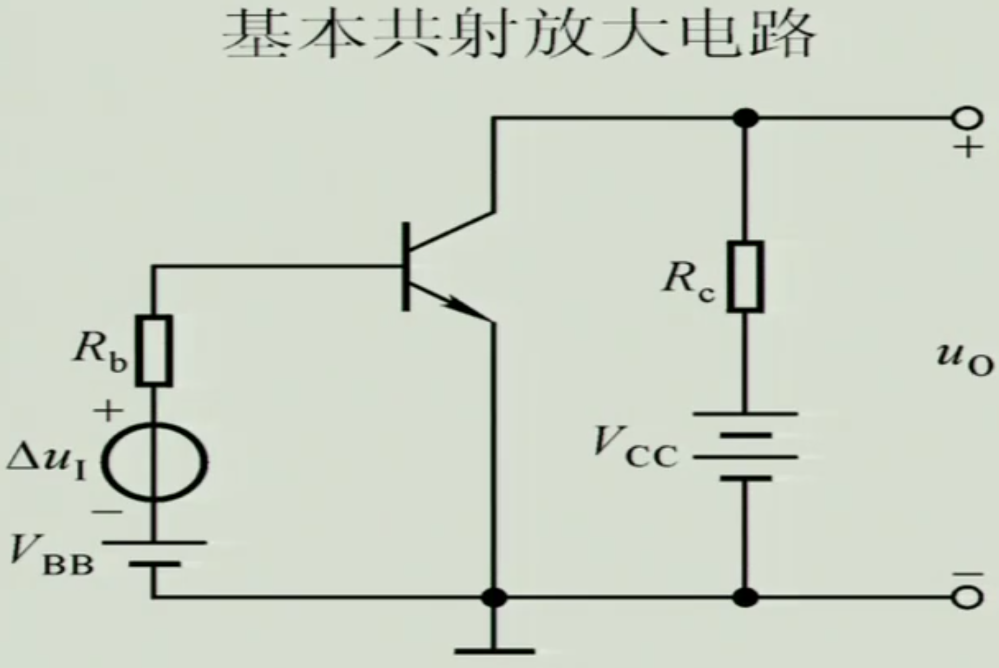
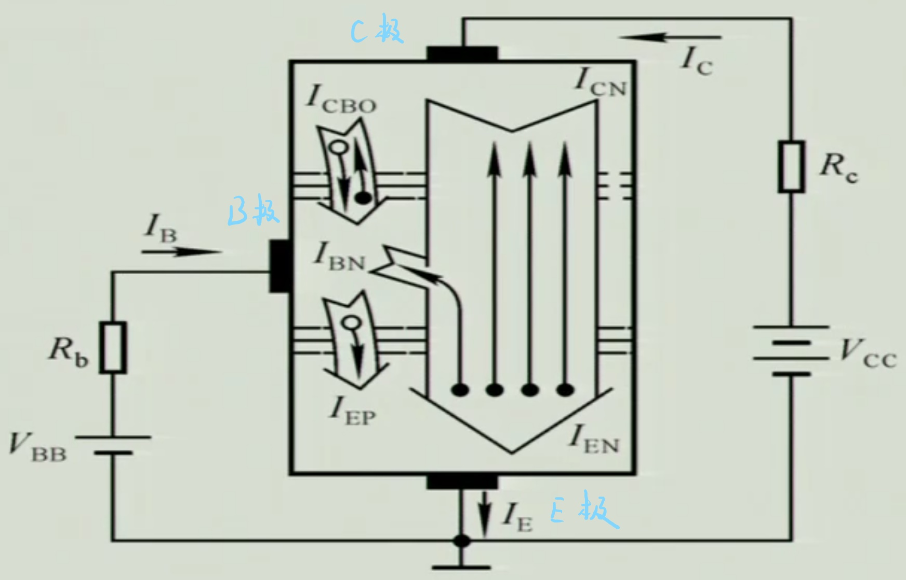
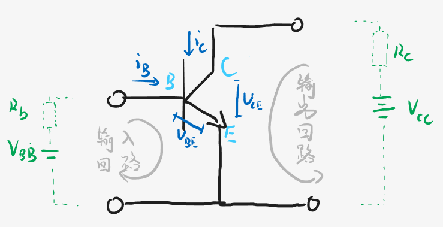
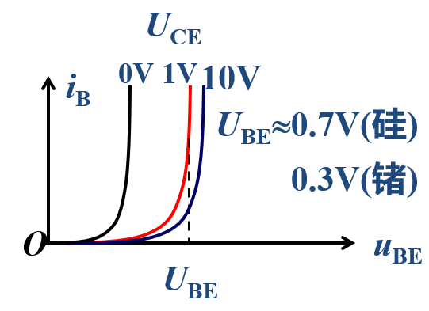
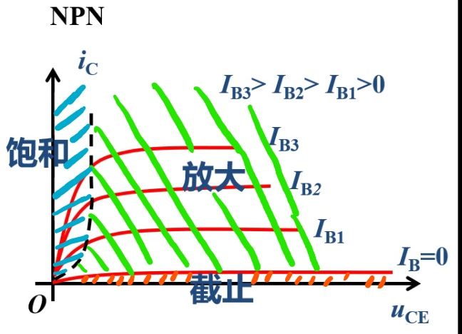
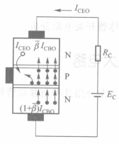
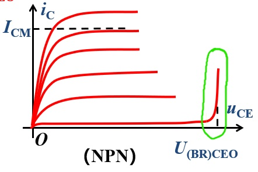

# 第二节 双极型晶体三极管及其电路模型

## 一、双极型晶体三极管

### 1. 基本信息

双极型晶体三极管，简称晶体管、三极管、BJT。

其由两个PN结构成，有PNP和NPN两种类型。  

### 2. 结构特点

1. 最基本 - 三个区：
   * 发射区：发射载流子的区域。  
     因为要发射载流子，故**掺杂浓度最高**。
   * 基区：为一个控制区。  
     **掺杂浓度最低**，并且**极其薄**。
   * 集电区：收集载流子。  
     要收集载流子，故**掺杂浓度不能太高**，同时**面积应该最大**。  
     *类似仓库装东西，需要面积大，并且里面不能装杂物。*
2. 对应三个极：
   * 发射极(Emitter) - 用E表示。
   * 基极(Base) - 用B表示。
   * 集电极(Collector) - 用C表示。
3. 形成两个PN结
   * 发射结(Je)
   * 集电结(Jc)

对应三极管的电路符号：

箭头代表发射结导通方向。  
因此箭头标出来后，其指向为P到N,便可确定三极管是PNP还是NPN。

## 二、晶体管电流分配及放大原理

### 1. 工作效果

晶体管是**对电流的放大**。

以NPN型为例，先看现象：  
  
当基极B有一个电流$i_b$时，一定条件下C和E会通过一个电流，  
集电极会进来一个电流$i_c$。  
在一定工作条件下，**$\frac{i_c}{i_b}$为一个常数**，$i_c$是$i_b$的放大。  
这个常数就是放大倍数。

是一个控制元件，电流并不是自身产生的，  
而是**控制能量重新分配**。

### 2. 本质原理

基本的电路图如下：  

* $V_{BB}$ - 用以导通发射结，并吸收基区复合的自由电子，**形成控制电流$I_b$**。
* $R_b$ - 限流电阻
* $V_{CC}$ - 提供发射区的自由电子，故**提供放大电流$i_c$的能量**

发射结导通、处于正向偏置，简称正偏。  
集电结截止、处于反向偏置，简称反偏。

> 拓展 - 共基(B)放大电路
>
> 共用什么极，即使在构成的控制回路与输出回路中，共同经过了哪个极。  
> 如共射，两者共同经过了发射极E。
>
> 对于共基放大电路，放大系数为$\bar\alpha\approx\frac{I_C}{I_E}=\frac{\bar\beta}{1+\bar\beta}, \alpha\approx\bar\alpha$

---

分析晶体管内部，其内部载流子的运动：  

1. 发射区 - 提供自由电子  
   发射结正偏 - 做扩散运动

   发射区大量的自由电子$e^-$，会向基区扩散。  
   基区的多子为空穴$e^+$,也向发射区扩散。  

   形成上图的两个电流：
   * $I_{EN}$ - 自由电子从E扩散到B，**电流方向反向**。
   * *$I_{EP}$ - 空穴从B扩散到E，电流同向。但空穴极少，因此**电流极小**，可以忽略。

   故形成的整个电流为：$I_{EN}(+I_{EP})$
2. 基区 - 扩散、复合并产生  

   从发射区扩散过来的自由电子$e^-$远远多于本身的多子空穴$e^+$。  
   会继续扩散，到集电区。

   但基区本身是P型，其**空穴会与自由电子发生复合**。  
   但正因为一下两点，保证了自由电子$e^-$的生存：
   1. 基区的**长度极短**
   2. 基区的**掺杂浓度极低**

   所以绝大多数都会顺利通过基区。  
   基区的长度和掺杂浓度决定了**复合的百分比**。

   但发生复合后的自由电子与空穴，会被$V_{BB}$所抵消。  
   > 假如$100$个自由电子，复合的比率为$2\%$，  
   > 当这两个自由电子与空穴复合后，  
   > $V_{BB}$出会瞬间抽走两个自由电子$e^-$，在B极附近重新产生两个空穴$e^+$。（就像普通的二极管导通，会形成电流）  

   若复合比率记为$A$，$n$个自由电子中，就可以看成：  
   有$(1-A)\cdot n$的电子向集电结E扩散，形成电流$I_{CN}$；  
   有$A\cdot n$的电子向基极B扩散，形成电流$I_{BN}$。  
   正因为这种比率固定，所以可以**粗略看出$I_B$与$I_C$成比例**。
3. 集电结反偏 - 促进电子收集（漂移运动）  
   集电结 - 收集自由电子

   要保证电流稳定（复合比率一定），  
   基区中聚集在集电结处的自由电子，需要被快速移走到集电区，  
   否则浓度不断提高，扩散速度减慢，呆的时间更长，复合比率更高。

   而正因为其反偏，存在上图中一个向下的很大的电场，  
   则集电结中的自由电子$e^-$，会被很快的收集到集电区中。（此时是主要漂移运动）

   而集电区的少子空穴$e^+$，基区的少子自由电子$e^-$，会因反偏而做微弱漂移运动，形成反向电流$I_{CBO}$

因此得到：

* 控制电流：$I_B\approx I_{BN}=I_B+I_{CBO}(-I_{EP})$
* 输出电流：$I_C\approx I_{CN}=I_C-I_{CBO}$

且要正常使用（能放大电流），  
⭐一定要满足“**发射结正偏**”、“**集电结反偏**”。

> 讲解 - 根据三端电压判断分别是哪三个端口，类型等
>
> 需要注意，因为发射结B极到E极恒处于正偏，  
> 故他们两端的压差$U_{BE}$最小，为一个小数。  
> 然后基极的电压恒为第二大的，  
> 因此可以根据这两条**判断出B极和E极**，另一个则是C极。
>
> 然后导通压降$U_{BE}$是根据材料决定的，  
> 因此也可以判断出三极管**是什么材料**。
>
> 最后判断是PNP还是NPN，  
> 记住：**导通为P到N**。
> 如果B极电压大于E极，则B为P，为NPN；  
> 如果B极电压小于E极，则B为N，为PNP。

## 三、晶体管的特性曲线

对于共射放大电路，会形成两个回路、两个端口：

1. 发射极与基极之间，存在电流$i_B$。  
   为输入回路，称为“输入特性”。
2. 发射极与集电极之间，存在电流$i_C$。  
   为输出回路，称为“输出特性”。

而对应的电压，则为两回路所加电压：

1. 输入回路中有$V_{BB}$，  
   故存在电压$U_{BE}$。
2. 输出回路中有$V_{CC}$，  
   故存在电压$U_{CE}$

故分别研究$i_B$、$i_C$与两电压之间的关系。

### 1. 输入特性曲线

为$i_B$与$U_{BE}$之间的关系，  
此时需要控制$U_{CE}$为定值。

$$i_B=f(U_{BE})|_{U_{CE}=C}$$

此时**就是一个导通的二极管**，  
易知特性曲线为：

  
对于不同的$U_{CE}$，有不同的伏安特性曲线。

---

特点：

$U_{CE}$越大，曲线越往右移动，对应$U_{BE}$越大。  
但当$U_{CE}>1V$时，曲线几乎不移动、重合（相同$U_{BE}$，$i_{B}$不变）。
> 原因：
>
> 因为$U_{CE}=1V$时，集电结已经反偏且内电场足够强大，  
> 已经能使集电结处所有电子快速扩散到集电区。
>
> 因此$U_{BE}$不变，发射区到基区的电子数不变，  
> 则无论$U_{CE}$怎么增加，电流$i_B$会恒定。
>
> 因此通常只画出$U\ge1V$的一条输入特性曲线。

---

这条曲线所反映的就是：**$U_{BE}$能够控制$i_B$。**

### 2. 输出特性曲线

为$i_C$与$U_{CE}$之间的关系，  
此时需要控制$i_B$为定值。

注意不是跟$U_{BE}$的关系：  
因为首先要满足发射结正偏，  
所以只要$i_{BE}>0$，则为正偏。

$$i_C=f(U_{CE})|_{i_B=C}$$

可以得到特性曲线为：

---

特点 - 三个区域：

1. 截至区 - $I_B=0$($U_{BE}\le0$)以下的狭窄区域：  
   特征：**发射结反偏**（或零偏）、集电结反偏。

   整个电流约等于$0$（会有一个极小的穿透电流$I_{CEO}$，**受温度影响很大**，随温度升高而升高），  
   **$C$和$E$相当于开路。**
2. 饱和区 - 虚线($U_{CE}=U_{BE}$)左边的区域：  
   特征：发射结正偏、**集电结正偏**。

   饱和时$U_{CE}$电压记为$U_{CES}$。  
   也相当于发射结正偏的导通电压，  
   故与材料有关，且一般很小。

   此时$I_B$失去了对$I_C$的控制作用，
   **$C$和$E$相当于短路。**（两个结都是正偏的，就相当于条导线，$I_B=\frac{V_{CC}}{R_c}$）
   > 深层次理解饱和区：
   >
   > 饱和，实际上指的是：输出回路所允许的最大电流$I_{C\max}$，小于控制需要的$\beta I_B$。  
   > 故输出电流实际上是饱和的（或者说是不足的）。
   >
   > 显而易见，最大电流$I_{C\max}=\frac{V_{cc}-U_{CES}}{R_c}$（见上面[本质原理](#2-本质原理)的晶体管内部图）  
   > 【回路最大电流肯定等于总电压除以电阻吧……
   >
   > 而需要注意：坐标轴中的**增大$U_{CE}$，实际上增大的是$V_{CC}$**！  
   > 故最大电流$I_{C\max}\uparrow$，最终使得$I_{C\max}\ge \beta I_B$，  
   > 从而变得余裕余裕，因此能达到控制需要的电流。
   >
   > 故判断三极管工作状态**还有一个方法**：  
   > 计算最大电流$I_{C\max}=\frac{V_{CC}-U_{CES}}{R_c}$，判断其跟$\beta I_B$的关系。

3. 放大区 - 曲线平坦的中间部分：  
   特征：**发射结正偏、集电结反偏**。（满足正常工作要求）  
   $I_C$唯一由$I_B$决定，即$I_C=\beta I_B$，  
   为晶体管的**恒流特性**。

## 四、晶体管的主要参数

1. 穿透电流$I_{CEO}$  

### 1. 电压放大系数

1. 直流电流放大系数：
   $$\bar{\beta}(=\frac{I_{CN}}{I_{BN}})\approx\frac{I_C}{I_B}$$
2. 交流电流放大系数：
   $$\beta=\frac{\Delta I_C}{\Delta I_B}$$

虽然两放大系数不一样，但数值比较接近，$\beta\approx\bar\beta$，  
故可看作同一个。

### 2. 极间反向电流

1. 集电极-基极 反向饱和电流 - $I_{CBO}$  
   是指发射极开路$I_E=0$时，回路拥有微弱的集电极电流。  
   （但注意正常工作时也存在，这个状态只是准确确定反向饱和电流）

   是**正常工作（发射极正偏、集电极反偏时）**，集电结处产生的漂移电流，希望是越小越好。  
   跟二极管漂移电流一样，受温度影响大（随温度升高而升高）。
2. 集电极-发射极 穿透电流 - $I_{CEO}$  
   定义为基极开路$I_B=0$时，即**截至状态（发射结、集电结均反偏时）** ，集电极C和发射极E的电流。
  
   正常情况下$I_B=0\rightarrow I_C=0$，  
   但实际上还有个很小的电流$I_{CEO}$，仍来自于两个反偏结的漂移电流。
   > 形成原因：
   >
   > 当$I_B=0$时，即$U_{BE}=0$，  
   > 故发射结处于**反偏**状态。  
   > 此时虽然没有大量电子通过发射结进入基区，即不会形成主要电流$I_{EN}$，  
   > 但反偏会导致“漂移运动”，导致这个微小的穿透电流$I_{CEO}$产生。

存在关系：$I_{CEO}=(1+\bar\beta)I_{CBO}$，  
> 原因：
>
> 自由漂移产生了$I_{CEO}$的电子，  
> 此时仍相当于正常工作的三极管，满足分配性质：$I_{CN}=\bar\beta I_{CBO}$，  
> 故：$I_{CEO}=(1+\bar\beta) I_{CBO}$
>
> 如下图：  
> 

### 2. 反向击穿电压

$U_{(BR)CEO}$，  
为基极开路$I_B=0$，加在集电极C和发射极E之间的最大允许电压。

此时处于截至工作状态，若超过该电压，  
则集电极的电流会大幅度上升，晶体管被击穿损坏。

  

### 3. 集电极最大允许电流

$I_{CM}$，  
当集电极电流$I_C$超过一定值时，晶体管的$\beta$会下降。  
当$\beta$下降到正常值$\frac{2}{3}$时的集电极电流，称为最大允许电流。

若$I_C>I_{CM}$，虽然不一定损坏，  
但$\beta$会大大下降。

### 4. 集电极最大允许耗散功率

$P_{CM}$，  
电流通过集电结时会产生热量，温度升高，引起晶体管参数变化。  
当因受热引起的功率变化不超过允许的范围时，  
此时**集电极消耗的最大功率**，  
称为集电极最大允许耗散功率$P_{CM}$。

$P_{CM}$受晶体管自身决定，  
故满足：$P_{CM}=U_{CE}I_C$，  
所以$U_{CE}$与$I_C$关系为双曲线，  
称为“$P_{CM}$曲线”。

* 安全区：集电极电流$I_C$不能超过$I_{CM}$
* 过损耗区：超过了，会损耗晶体管。

  

## 五、大信号晶体管模型

大信号 - 电流电压较大的**直流信号**（静态工作状态）。

此时可以根据输出处于什么区，等效转化为对应简化模型。

1. 截至区 - 断开的开关。
2. 放大区 - 电流控制的电流源
3. 饱和区 - 闭合的开关。
