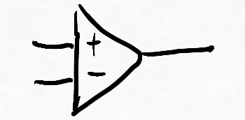
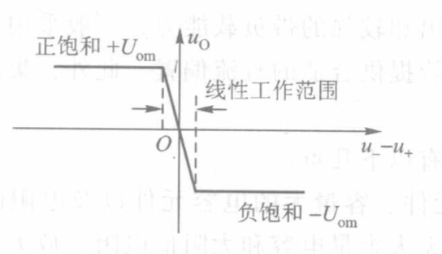

# 第一节 运算放大器

## 一、符号、参数与特性曲线

$$
v_o=A_{vo}(v_p-v_N) \qquad (V_-<v_0<V_+)
$$

* 开环电压增益：$A_{vo}$很大，一般为$10^5$。（理想为$\infty$）  
  但存在最大输出电压。
* 输入电阻：$R_i$很大。（理想为$\infty$）
* 输出电阻：$R_o$很小。（理想为$0$）

如果要当成放大器，是**不能开环（没有反馈）直接用**的。

特性曲线：  

* 中间的“线性区”很窄，如果工作在这个区域则构成“运算电路”。
* 两侧的“非线性区”，应用于“波形产生电路”的“电压比较器”。
