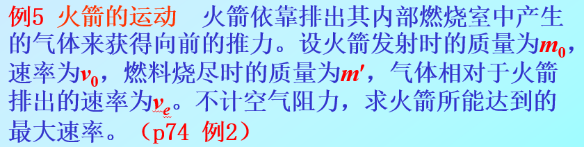
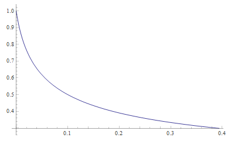

# 第三节 动量定理

是将系统**动量的改变**与作用于系统的**力**和作用**时间**联系在一起的物理规律。  
用于分析**碰撞问题**。（而牛顿定律则不好分析）

## 一、质点系的动量定理

*质点的动量定理类似，省略。*

1. **微分形式**  
   由$\frac{\textrm{d}\vec{p}}{\textrm{d}t}=\vec{F_\textrm{合外}}$，  
   转化为$\vec{F}\textrm{d}t=\textrm{d}\vec{p}$。

   记：$\textrm{d}\vec{I}=\vec{F}\textrm{d}t$  
   其中$\textrm{d}\vec{I}$称为微元冲量。

   故有：
   $$
   \textrm{d}\vec{I}=\vec{F_\textrm{合外}}\textrm{d}t=\textrm{d}\vec{p}
   $$
2. 积分形式  
   若合外力$F_\textrm{合外}$不与速度相关，  
   物体所受合力的总冲量：
   $$
   \vec{I}=\int_{t_1}^{t_2}\vec{F_\textrm{合外}}\textrm{d}t=\int\textrm{d}\vec{p} \\
   \vec{I}=\int \vec{F} \textrm{d}t=\Delta p = p_2-p_1
   $$

   ⚠一定注意：**$F$不与$v$相关**才能这样转换，否则最好用微分形式的。  
   例题见下[例2](#三例2---阻力随速度变化问题)。

*注：高中形式$Ft=m\Delta v$*

结论：  
质点系所受**合外力**在$t_1\sim t_2$**时间段内的冲量**，**等于**质点系**总动量的增量**。  
质点系总动量变化与内力冲量无关，内力冲量改变的是总动量在系内各质点的分配。

牛顿第二定律反映力的**瞬时效应**，  
动量定理反映力对时间的**累积效应**。

可用动量定理，算出一段时间内的**平均冲力**$\bar{\vec{F}}$

## 二、例1 - 火箭问题

解：

首先要求最大速度，用动量定理的积分形式（即高中的$Ft=m\Delta v$算$\Delta v$）。  

$t$时刻时，记火箭质量为$m$，系统速度为$\vec{v}$  
此时不考虑之前喷的气，则初始系统动量：
$$
\vec{p_1}=m\vec{v}
$$

---

过了$\textrm{d}t$时刻后，  

* 对于火箭：
  * 质量：$m+\textrm{d}m$($\textrm{d}m<0$)
  * 速度：$\vec{v}+\textrm{d}\vec{v}$
* 对于喷出的气体：
  * 质量：$-\textrm{d}m$
  * 速度：$\vec{v}+\textrm{d}\vec{v}+\vec{v_e}$（注意是相对速度，此时直接$v_\textrm{静}=v_\textrm{动}+v_\textrm{相}$，方向含在向量里不用考虑加减）

则此时系统动量：
$$
\vec{p_2}=(m+\textrm{d}m)(\vec{v}+\textrm{d}\vec{v})-\textrm{d}m(\vec{v}+\textrm{d}\vec{v}+\vec{v_e})
$$

---

系统动量增量：
$$
\textrm{d}\vec{p}=\vec{p_2}-\vec{p_1}=m\textrm{d}\vec{v}-\textrm{d}m\vec{v_e}
$$

由动量定理$\textrm{d}\vec{I}=F_\textrm{合外力}\textrm{d}t=\textrm{d}\vec{p}$知：
$$
F_\textrm{合外力}=\frac{\textrm{d}\vec{p}}{\textrm{d}t}=m\frac{\textrm{d}\vec{v}}{\textrm{d}t}-\vec{v_e}\frac{\textrm{d}m}{\textrm{d}t}
$$

此时$m\frac{\textrm{d}\vec{v}}{\textrm{d}t}$即是**火箭的**动量时间变化率，  
因此整理为$F_\textrm{合外力}+\vec{v_e}\frac{\textrm{d}m}{\textrm{d}t}=m\frac{\textrm{d}\vec{v}}{\textrm{d}t}$（即为$F=ma$）的形式，  
代表的是**火箭的牛二方程**。  
（⚠一定注意：此时已经**不再是系统的方程了**，系统的是整理之前那个！如理不清这个会造成混乱）

此时$\vec{v_e}\frac{\textrm{d}m}{\textrm{d}t}$是一种力的形式，可以视为气体对火箭推力。

---

规定火箭飞行方向为正方向，  
即$\vec{v}=v\vec{i}$、$\vec{v_e}=-v_e\vec{i}$

1. 火箭水平飞行（水平方向合外力为$0$）  
   *此时系统动量守恒，动量在火箭和气体之间转换。*
   $$
   0-v_e\frac{\textrm{d}m}{\textrm{d}t} = m\frac{\textrm{d}v}{\textrm{d}t} \\
   m\textrm{d}v=-v_e\textrm{d}m \\
   \int_{v_0}^{v_m}\textrm{d}v=-v_e\int_{m_0}^{m'}\frac{1}{m}\textrm{d}m
   $$
   解得：
   $$
   v_m=v_0+v_e\ln\frac{m_0}{m'}
   $$
2. 火箭垂直飞行（垂直方向合外力为$-mg$）  
   $$
   -mg\textrm{d}t-v_e\textrm{d}m=m\textrm{d}v
   $$
   设$t'$时刻燃料耗尽（未知）
   $$
   -g\int_0^{t'}\textrm{d}t-v_e\int_{m_0}^{m'}\frac{1}{m}\textrm{d}m=\int_{v_0}^{v_m}\textrm{d}v
   $$
   解得：
   $$
   v_m=v_0+v_e\ln\frac{m_0}{m'}-gt'
   $$

## 三、例2 - 阻力随速度变化问题

一经典问题：  
物体质量$m$，初速度$v_0$，只有摩擦力作用，其中$f=kv^2$，  
求：物体变为$\frac{1}{3}v_0$时用时。

解：

可以想象出，速度随时间的函数如图：  
  
自然想出用积分解决。

但注意，用积分形式的时候，$\int \textrm{d}\vec{p}$不能直接转化为$\Delta p$：
$$
\int f \textrm{d}t= \int kv^2\textrm{d}t = \Delta p = \frac{2}{3}v_0
$$
这样是错误的。

用微分形式：
$$
f=\frac{\textrm{d}p}{\textrm{d}t}=m kv^2 \\
\frac{1}{mk}\int \frac{1}{v^2}\textrm{d}v=\int \textrm{d}t
$$
可解。
