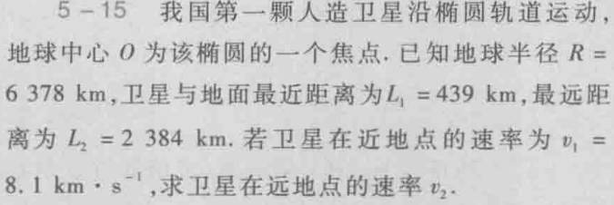

# 第四节 角动量守恒定律

## 一、定义

当**外力力矩的和**$\vec{M_\textrm{外}}=0$时，系统角动量守恒。

> 区别 - 动量守恒与角动量守恒：
>
> 之前说过：和外力和和外力矩虽然性质相同，但不能完全等同，  
> 即和外力为$0$时动量守恒，外力矩不一定为$0$角动量不守恒，反之亦然。  
> 两者彼此独立。

注意：  
角动量守恒对于不同物体，如果要当成一个系统来分析，  
须规定为**同一参考点**。  
否则角动量不能直接相加。

应用：

1. 直升飞机的尾翼安装螺旋桨。

## 二、有心力场中的运动

> 定义 - 有心力：
>
> 力的作用线始终通过某定点（力心）的力。

有心力对力心的力矩$\vec{r}\times\vec{F}$为零，  
故只受有心力作用的物体对力心的角动量守恒。

如：天体运动、微观粒子运动。

## 三、例题 - 卫星问题

卫星绕地球的地心运动，其力的作用线始终过力心（地心），  
故卫星的角动量守恒：

$$
J\omega_1=J\omega_2 \\
Jv_1r_1=Jv_2r_2
$$

可解得。
