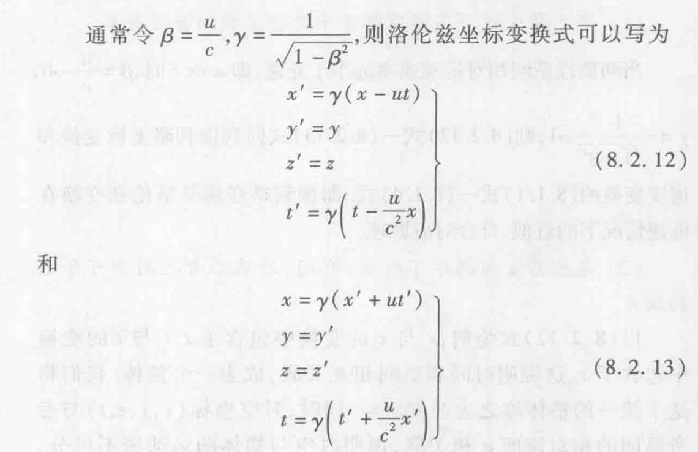
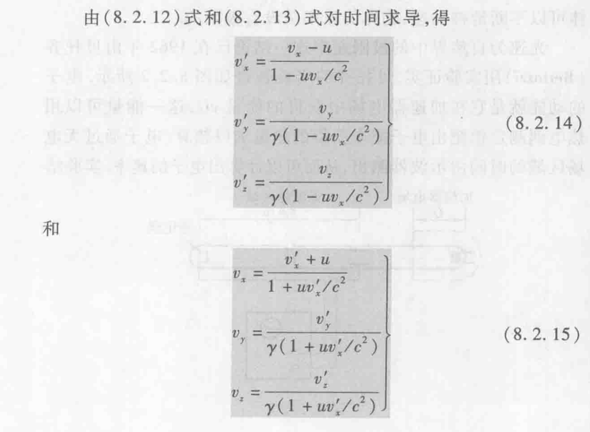

# 第四节 洛伦兹变换

## 一、洛伦兹坐标变换

* S系：$P(x,y,z,t)$
* S'系：$P(x',y',z',t')$

> 推导：
>
> 利用光速不变：  
> $r=\sqrt{x^2+y^2+z^2}=ct$  
> $r'=\sqrt{x'^2+y'^2+z'^2}=ct'$
>
> 平方移项后，两式相等，可得：
> $$
> x^2-c^2t^2=x'^2-c^2t'^2 \\
> y=y' \\
> z=z'
> $$

$$
\left\{\begin{array}{l}
x^{\prime}=\frac{x-u t}{\sqrt{1-\frac{u^{2}}{c^{2}}}} \\
y^{\prime}=y \\
z^{\prime}=2 \\
t^{\prime}=\frac{t-\frac{u}{c^2} x}{\sqrt{1-\frac{u^{2}}{c^{2}}}}
\end{array}\right.
$$

## 二、速度变换

上面为正变换，下面为逆变换。

## 三、洛伦兹变换的意义

1. 洛伦兹变换是不同惯性系中时空变换的普遍公式。
2. 与光速不变原理、真空中光速为极限速率的实验事实相协调。
