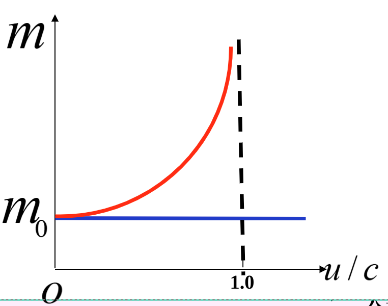
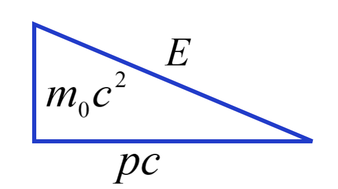
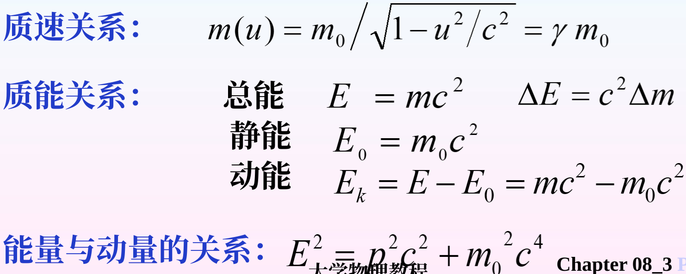

# 第六章 狭义相对论动力学基础

## 一、改造经典力学两条原则

1. 改造后的力学定律必须是洛伦兹变换的不等式。
2. 新理论包含旧理论。

改造的东西：

1. 质量
2. 动量
3. 能量

## 二、质量的修正

在相对论中，质量与时间、长度一样，与**惯性系的选择**有关。

静止关系系中：$m_0$  
运动惯性系中：$m(u)$（代表$m$是$u$的函数）

> 推导 - 全同粒子完全非弹性碰撞
>
> 在两个参考系中，分别推出碰撞后的速度，  
> 再代入洛伦兹变换，  

最终得到质速关系：
$$
⭐m(u)=\frac{m_{0}}{\sqrt{1-\frac{u^{2}}{c^{2}}}}=\gamma m_{0}
$$

随着速度的增大，质量越大越大，最后趋近$\infty$。  

> 验证 - 磁场中电子：
>
> 荷质比：$\frac{e}{m}=\frac{u}{BR}$
>
> * 在经典情况下：为常数。  
> * 在相对论情况下：$\frac{e}{m}=\frac{1}{\gamma}\frac{e}{m_0}$  
> $u\uparrow, \quad \frac{e}{m}\downarrow$

## 三、质能关系

> 推导 - 质能关系：
>
> 将质速关系泰勒展开：

* 总能量：$E=mc^2$
* 静能量：$E_0=m_0c^2$
* 相对论动能：$E_k=E-E_0=mc^2-m_0c^2$

> 验证 - 贝托齐实验：
>
> 测定电子动能与其速率的关系。
>
> * 在核嬗变（聚变和裂变）中，反映先后能量损失计算出的光速与实验值相符。  
>   $$
>   \Delta E=\Delta m c^2
>   $$
> * 在正负电子对湮灭中，由质能关系计算出的辐射波波长与实验值相符。
>   $$
>   e^-+e^+\rightarrow\gamma_1+\gamma_2
>   $$

## 四、质能关系的意义

1. 质能概念进一步深化。  
   相对论总能$E$包含了物体的全部能量（机械能、电磁能、原子能等），解决了经典物理未能解决的物体总能问题。  
   质量是**约束能量的形式**，是能量的载体。
2. 质能关系**统一了质量守恒定律**和**能量守恒定律**。  
   在经典物理学中：认为两者相互独立。  
   在相对论中：统一起来，都是质量不变。
3. 质能关系是人类**探索核能**的前提。  
   $\Delta E=\Delta m c^2$

## 五、质量与动量的关系

1. 相对论动量
   $$
   \vec{p}=m(u)\vec{v}=\gamma m_0\vec{v}
   $$
2. 能量与动量的关系
   $$
   E^2=p^2c^2+m_0^2c^4
   $$
   

## 六、相对论动力学基本方程

重新考虑经典力学基本定律在相对论中的表达：

1. 牛顿第一定律（惯性定律）  
   保持不变，相对论中仍成立。
2. 牛顿第二定律：
   $$
   \vec{F}=\frac{\textrm{d}\vec{p}}{\textrm{d}t}=\frac{\textrm{d}(\vec{\gamma m_0\vec{v})}}{\textrm{d}t}
   $$
   当$v\ll c$时，$\gamma\to1$，$\vec{F}=m_0\frac{\textrm{d}\vec{v}}{\textrm{d}t}=m_0\vec{a}$。
3. 牛顿第三定律：  
   认为**场**是传递相互作用的媒介，因此失去意义，  
   被动量守恒定律取代。

## 七、总结

## 八、例题

### 1. 光子

### 2. 碰撞粘合问题

> 例2 - 碰撞粘合问题：
>
> 一个静质量为$m_0$的粒子，以$v=0.8c$的速度运动，并与静质量为$3m_0$的静止粒子发生对心碰撞以后粘连在一起运动，  
> 求合成粒子的静止质量。
>
> 解：
>
> 用**相对论的**动量守恒和能量守恒：
> $$
> \left\{\begin{array}{l}
> m v=M u \\
> 3 m_{0} c^{2}+m c^{2}=M c^{2}
> \end{array}\right.
> $$
>
> ⚠但需要注意：方程里的$m$是动质量，不是题目给的静质量$m_0$！
>
> 动质量：
> $$
> m=\frac{m_{o}}{\sqrt{1-v^{2} / c^{2}}}=\frac{m_{0}}{\sqrt{1-0.8^{2}}}=\frac{m_{0}}{0.6}
> $$
>
> 代入得：
> $$
> M=3m_0+\frac{m_0}{0.6}=\frac{14}{3}m_0
> $$
