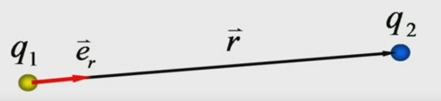
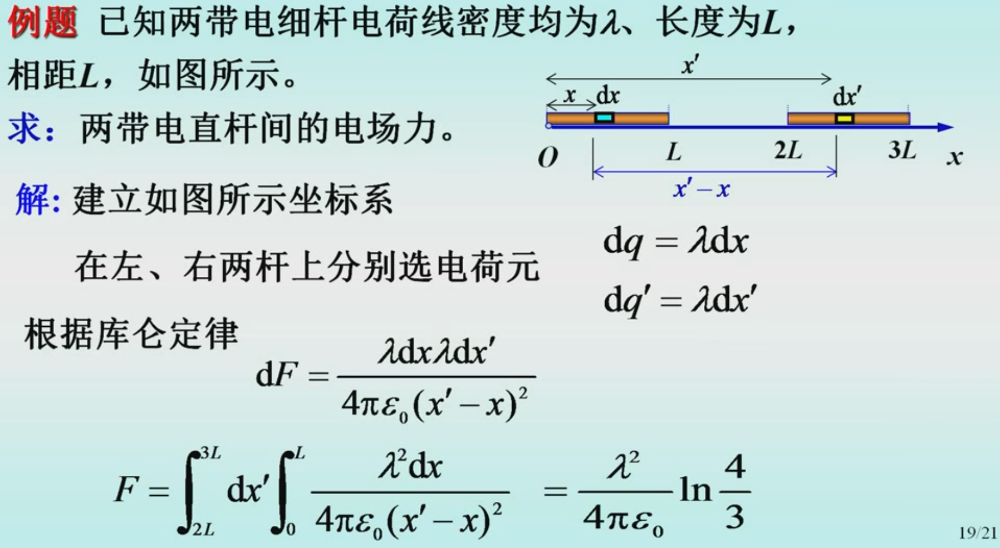
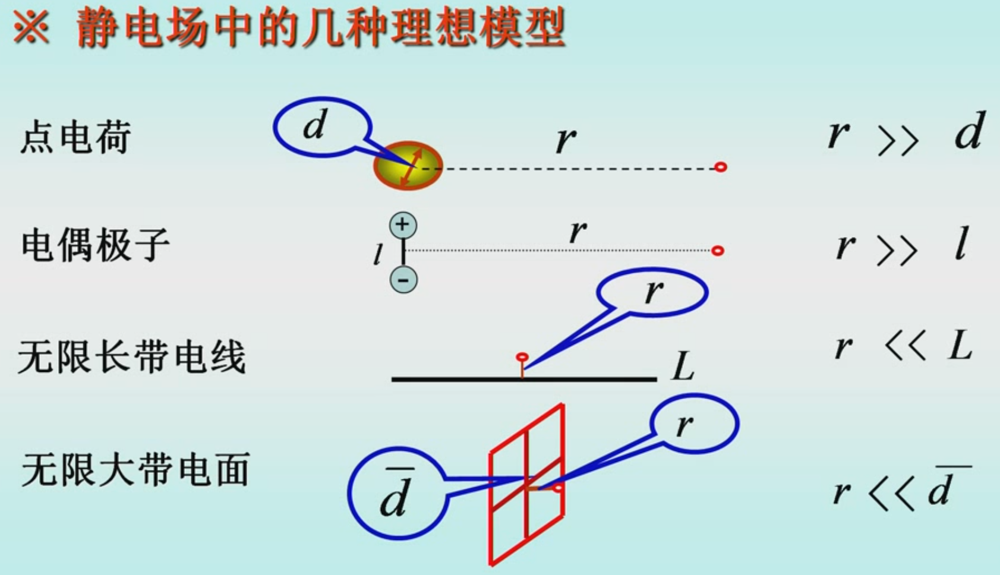
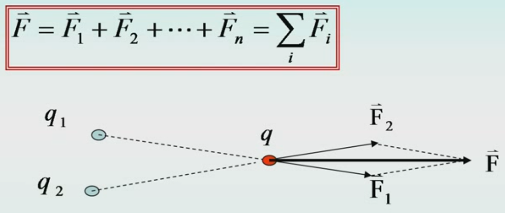

# 第一节 两条基本实验定律 静电场

## 一、电荷

* 电荷种类：正电荷、负电荷
* 电荷性质：同种相斥、异种相吸
* 电荷量度：$C$ - 库伦
* 电荷的量子化：$q=\pm ne(n=1,2,3,\cdots)$  
  其中$e=1.602\times 10^{-19}(C)$

  即电荷只能是元电荷$e$的整数倍。
* 满足定理：电荷守恒定律
  > 定义 - 电荷守恒定律：
  >
  > 在一个与外界没有电荷交换的系统内，无论进行怎样的物理过程，  
  > 系统内正负电荷的代数和保持不变。  
  > 因此系统总体对外呈不带电。

## 二、库仑定律

反映的是两**点电荷**之间的相互作用力。

> 定义 - 库仑定律：
>
> 点电荷$q_2$所受$q_1$的力为：
> $$
> \vec{F}=\frac{1}{4\pi\epsilon_0}\frac{q_1q_2}{r^2}\vec{e_r}
> $$
>
> $\vec{e_r}$为单位向量，由$q_1$指向$q_2$  
> $\epsilon_0$是“真空电容率”（真空介电常数），为常数。
>
> 

在$10^{-17}\sim10^7(m)$范围内均成立（范围外不好用实验证明）。

力的大小：与两电荷的电荷量成正比，与距离成反比。

> 拓展 - 利用库仑定律求解非点电荷带电物体的相互作用力
>
>   
> 先对两杆分别取出点电荷$\mathrm{d}q$，然后求作用力元$\mathrm{d}F$，最后对两边分别积分。

## 三、电场

有关电场，是针对电荷之间的力怎么产生的一个理论，而提出的**一种物质**。

> 拓展 - 场的提出：
>
> 由现象和库伦定律知：对于两个点电荷，存在相互作用，  
> 但很神必，为什么两个电荷没有接触却能产生相互作用？
>
> 在之前是“超距作用”的理论，  
> 认为这个力就是能跨空间、瞬间从一点传到另一点的力。
>
> 但后来发现存在很多问题，  
> 便提出了“近距作用”的理论，**产生了“场”这一概念**，  
> 认为**力是通过这个场**来传递的。

场是**客观真实存在**的（可以说是一种弥漫在空中的物质），  
其**产生是来自于电荷**。
并且其他物质可以进入到该物质中，因此十分抽象。

和物质一样，具有能量、动量的属性。  
因此为了研究它，引入了电场线，来描述场中力的方向和大小。

### 1. 电场的物质性

物质与物质之间发生作用，**必须借助物质**，  
而且作用的传递**需要时间**。

电荷作用的传递便是通过“电场”这一物质。  
“电场”这一物质**具有能量、动量等物质属性**。

### 2. 电场的性质

* 电场对放在其内的任何带电体都具有**作用力**  —— 动量传递  
  *对应之后学习的电场强度$\vec{E}$。*
* 电场力对在电场中移动的带电体**做功** —— 能量传递  
  *对应之后学习的电势$U$。*

### 3. 静电场与静电力

* 静电场：  
  相对于观察者静止的电荷，产生的电场。  
  是电磁场的一种特殊形式（静止时）。

  *当电荷运动时，产生的就是电磁场。*
* 静电力：  
  电场对处在其中的其他电荷的作用力。  
  电荷相互作用力的本质，就是一个电荷的电场作用在另一个电荷上的电场力。

### 4. 静电场理想模型

跟之前研究力学所用的质点和刚体一样，  
电学中，提出了“点电荷”、“电偶极子”等理想模型，  
用来更容易地研究电场。

> 定义 - 点电荷：
>
> 只有电量、没有大小和形状的物体。  
> 可以将：与带电体的距离$r$远大于带电体本身几何属性（如大小$d$），看作点电荷。  
> 需要满足：$r\gg d$
>
> ---
>
> 定义 - 电偶极子：
>
> 存在一对正负电荷，其电量相等。  
> 当参考点与两电荷的距离$r$、远大于两点电荷距离$l$，可近似视作电偶极子。  
> 需要满足：$r\gg L$

还有“无限长带电线”和“无限大带电面”，  
是看平均几何尺度$d$，是否**远大于**点电荷与线面的距离$r$。  
为：$r \ll d$。

## 四、静电力叠加原理

1. 两点电荷间相互作用力，不因其他电荷的存在而改变。
2. 点电荷系对某点电荷的作用，等于系内各点电荷**单独存在时**对该电荷作用的**矢量和**。  
   即：$\vec{F}=\vec{F_1}+\vec{F_2}+\cdots+\vec{F_n}$

