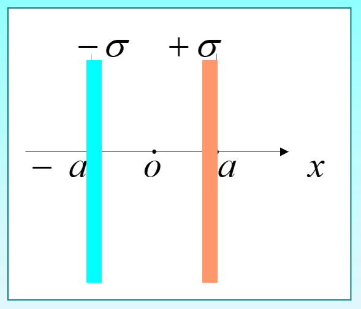
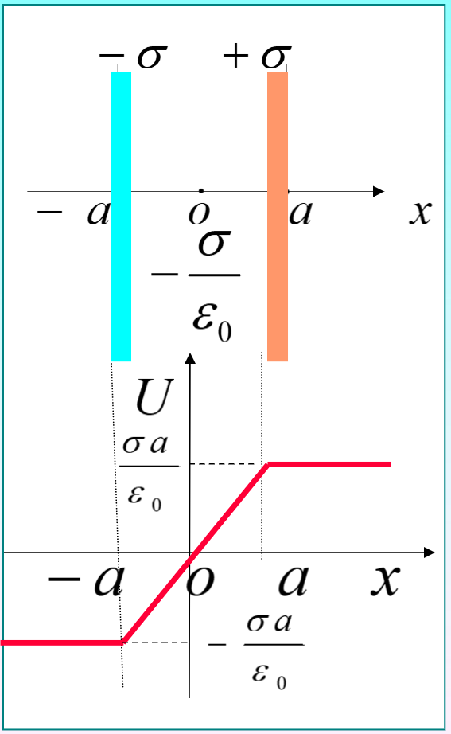
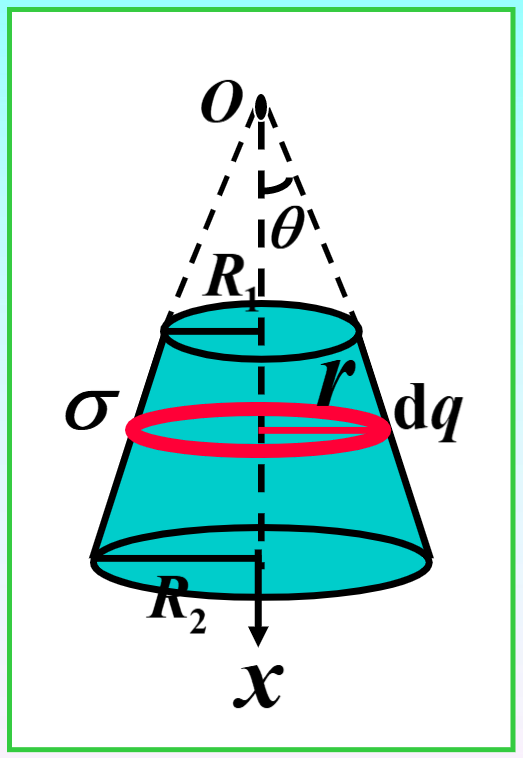
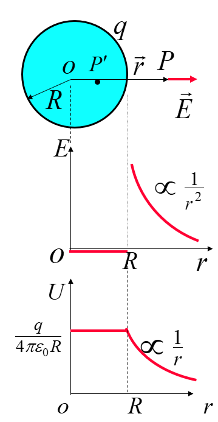
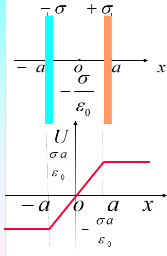
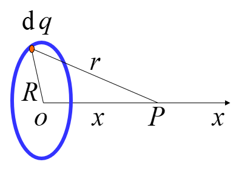
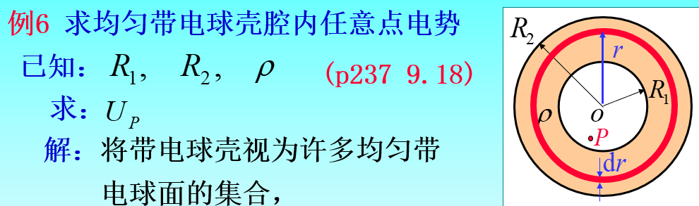
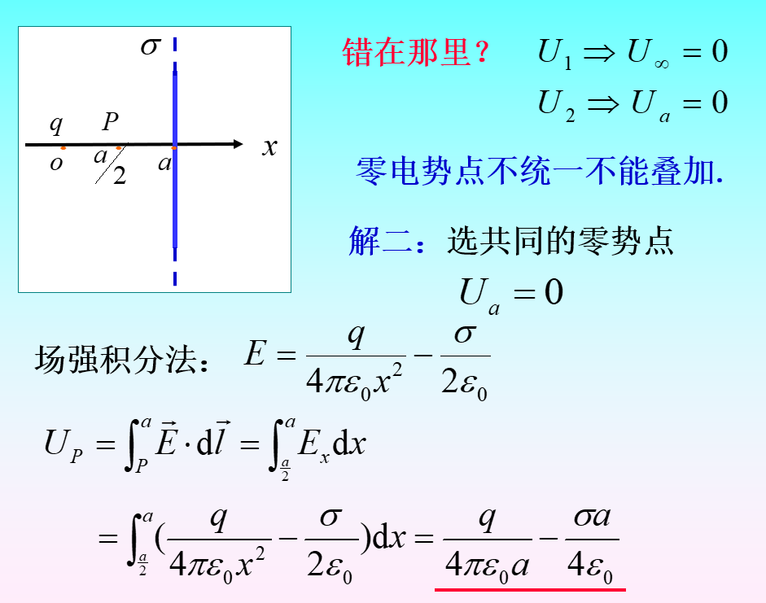

# 第四节 环路定理 电势

开始研究功了。

## 一、静电力的功

* 力：$\vec{F}=q_0\vec{E}$
* 功的微元：$\textrm{d}A=\vec{F}\textrm{d}\vec{I}$
* 功：$A=\int_{L} \mathrm{~d} A=\int_{r_{a}}^{r_{b}} \frac{q_{0} q d r}{4 \pi \varepsilon_{0} r^{2}}=\frac{q_{0} q}{4 \pi \varepsilon_{0}}\left(\frac{1}{r_{a}}-\frac{1}{r_{b}}\right)$

可见功只与起始位置$r_a,r_b$有关。

## 二、环路定理

静电力做功只与检验电荷**起点、终点位置有关**，  
与通过的路径无关，  
所以为保守力。

$$
A=\oint\vec{F}\cdot\textrm{d}\vec{l}=0
$$

对于静电场：$\oint_L\vec{E}\cdot\textrm{d}\vec{l}=0$  
说明静电场是保守力场。

保守力，都有其余相关的势能（如重力），  
所以静电场是有势场。

## 三、点势能

令：$W_b=0$
$$
W_a=q_0\int_a\vec{E}\cdot\textrm{d}\vec{l}
$$

$q_0$在场中某点的点势能，等于将$q_0$由该点移到零势能点过程中，电场力所做的功。

对于$\frac{W_a}{q}$，其只与电场强度分布、在场的位置和零势点有关，与检验电荷无关，  
所与也可以**用来描述电场**，定义为电势。

## 四、电势

$$
U_a=\frac{W_a}{q_0}=\int_a\vec{E}\cdot\textrm{d}\vec{l}
$$

某点电势等于单位正电荷在该点具有的点势能。

存在一个零势点。  
是一个相对的量，$U_a$与零势能点有关（而$U_{ab}$没有）。

电场强度$\vec{E}$是矢量，电势$U$是标量。

1. 遵守叠加原理
2. 保守力和势能关系  
   $\vec{F}=q_0\vec{E}=-\bigtriangledown W$

---

因为也可以描述电场，故也可以计算电场强度，  
公式为：$\vec{E}=-\textrm{grad}U$（为梯度）

## 五、电势的计算

### 1. 场强积分法

$$
U_a=\int\vec{E}\cdot\textrm{d}\vec{l}
$$

1. 确定$\vec{E}$分布
2. 选取便于计算的零势能点和积分路径
3. 套公式

若$\vec{E}$各段表达式不同，则分段积分。

### 2. 叠加法

1. 带电体划分为点电荷$\textrm{d}q$
2. 选零势点，写$\textrm{d}q$在场的电势$\textrm{d}U$
3. 叠加：$U=\int\textrm{d}U$

## 六、计算例题

### 1. 两平行平面 - 场强积分法

> 
>
> 电场分布：
> $$
> \vec{E}=\left\{\begin{array}{ll}
> -\frac{\sigma}{0} \vec{i} & (-a<x<a) \\
> 0 & (x<-a, x>a)
> \end{array}\right.
> $$

解：

先化简公式：
$$
U_{x}=\int_{x}^{0} \vec{E} \cdot \mathrm{d} \vec{l}=\int_{x}^{0} \vec{E} \cdot \vec{i} d x
$$

需要分段：

1. 中间部分$-a\le x\le a$
   $$
   U=\int_{x}^{0} \vec{E} \cdot \vec{i} d x=\left(-\frac{\sigma}{\varepsilon_{0}}\right)(-x)=\frac{\sigma x}{\varepsilon_{0}}
   $$
2. 右部分$x>a$
   $$
   \begin{aligned}
   U &=\int_{x}^{a}(\vec{E} \cdot \vec{i} d x)+\int_{a}^{0}(\vec{E} \cdot \vec{i} d x) \\
   &=0+\left(-\frac{\sigma}{\varepsilon_{0}}\right)(-a)=\frac{\sigma a}{\varepsilon_{0}}
   \end{aligned}
   $$
3. 左部分$x<-a$
   $$
   \begin{aligned}
   U &=\int_{x}^{-a} \vec{E} \cdot \vec{i} d x+\int_{-a}^{0} \vec{E} \cdot \vec{i} d x \\
   &=0+\left(-\frac{\sigma}{\varepsilon_{0}}\right) a=-\frac{\sigma a}{\varepsilon_{0}}
   \end{aligned}
   $$

最终$U-x$曲线：  
  

### 2. 去顶圆台 - 叠加法

> 

$$
\begin{aligned}
\mathrm{d} q &=\sigma \mathrm{d} S=\sigma 2 \pi r \cdot \frac{\mathrm{d} x}{\cos \theta} \\
&=\sigma 2 \pi x \operatorname{tg} \theta \cdot \frac{\mathrm{d} x}{\cos \theta}
\end{aligned}
$$

$$
\mathrm{d} U=\frac{\mathrm{d} q}{4 \pi \varepsilon_{0}\left(r^{2}+x^{2}\right)^{1 / 2}}=\frac{\sigma \operatorname{tg} \theta}{2 \varepsilon_{0}} \mathrm{~d} x
$$

$$
U=\int \mathrm{d} U=\frac{\sigma \operatorname{tg} \theta}{2 \varepsilon_{0}} \int_{R_{1} / \operatorname{tg} \theta}^{R_{2} / \operatorname{tg} \theta} \mathrm{d} x=\frac{\sigma}{2 \varepsilon_{0}}\left(R_{2}-R_{1}\right)
$$

## 七、电场与电势关系

### 1. 电场线与等势面

* 电场：用电场线描述
* 电势：用等势面描述

电场线与等势面正交。

### 2. 场强E与电势U关系

前面提到过：  
$\vec{E}=-\textrm{grad}U$，电势的梯度，  

$$
\vec{E}=-\frac{\partial U}{\partial x} \hat{i}-\frac{\partial U}{\partial y} \hat{j}-\frac{\partial U}{\partial z} \vec{k}
$$

## 总结 - 常见电势

* 点电荷
  $$
  U(r)=\frac{1}{4\pi\epsilon_0}\frac{Q}{r}
  $$
* 均匀带电球面
  $$
  U(r)_\textrm{外}=\frac{1}{4\pi\epsilon_0}\frac{Q}{r}
  $$
  跟点电荷相同。  
  内部的话为$U(r)_\textrm{内}=\frac{1}{4\pi\epsilon_0}\frac{Q}{R}$  
  
* 两个异种无限大带点平面  
  面密度为$\pm\sigma$
  $$
  U(r)=\frac{\sigma r}{\epsilon_0}
  $$
  

会发现以上三个其实就是电场$E$乘了个$r$。

* 均匀带电圆环轴线  
  $$
  U(r)=\frac{q}{4 \pi \varepsilon_{0}\left(R^{2}+x^{2}\right)^{1 / 2}}
  $$
    
* 带电空腔球体
  $$
  \frac{\rho}{2 \varepsilon_{0}}\left(R_{2}^{2}-R_{1}^{2}\right)
  $$
    
* 带电多个球壳  
  直接用球壳的叠加原理。
* ⚠需要注意：叠加原理需要保证共零电势点。  
  比如无限大平板零电势点是自己，点电荷零电势点是无穷远。
  此时只能积分算：$\int_P^a\vec{E}\cdot\mathrm{d}\vec{l}$。  
  