# 第二节 场影响荷

## 静止部分 - 静电场→静止电荷

### 一、电势相关

#### 1. 电势能

静电力是保守力，具有势能，为**电势能**$W_p$，  
规定无穷远的电势能为$0$，  
则点电荷的电势能：

$$
W_{pA}=\int_A^\infty q\vec{E}\cdot\mathrm{d}\vec{l}
$$

不仅取决于本身电荷$q$，还取决于到无穷远处每一点的电荷场强。  

#### 2. 电势、电势差

电势能除以电荷量，得到**电势**，排除电荷影响，  
其只与场强有关，因此可以表征电场的性质。

$$
U_A=\frac{W_{pA}}{q}=\int_A^\infty \vec{E}\cdot\mathrm{d}\vec{l}
$$
前提：$U_\infty=0$

电势能是某个电荷的电势能，电势是某点的电势。

**电势差**：$U_{AB}=U_A-U_B$  
注意，与$\Delta_{AB}$不同，$\Delta_{AB}=B-A$。

---

**点电荷的电势**：
$$
U(r)=\frac{1}{4\pi\epsilon_0}\frac{Q}{r}
$$

推导的话略，由高中公式$U=Ed$，点电荷场强$\frac{1}{4\pi\epsilon_0}\frac{Q}{r^2}$简单乘个$d$($r$)即得到。

#### 3. 电势叠加原理

场强$\vec{E}$是矢量，叠加用矢量叠加；  
电势$U$是标量，叠加直接算术运算。

#### 4. 等势面

就是处处垂直于电场线，  
所以“电场线”和“电势面”，都可以几何描述电场。

### 二、电源、电动势

用来把正电荷从低电势搬到高电势，抵抗电流做功。

* 非静电力$E_k$：逆电势，把正电荷从低电势搬到高电势的力。
* 电动势$\epsilon$：把一个单位$1C$的正电荷搬运所做的功。

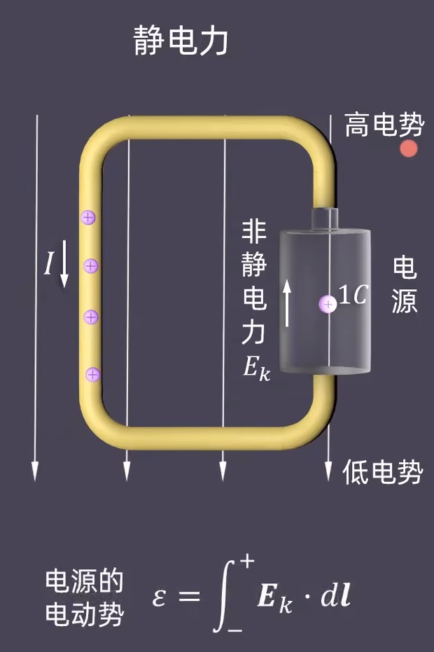

### 三、静电感应相关

#### 1. 静电感应、感应电荷、静电平衡

对于金属固体，将其置于一个电场，  
内部的自由电子会沿着电场相反的方向运动，  
导致电子多的部分呈负电、电子少的部分呈正电，  
这种现象称为“**静电感应**”。
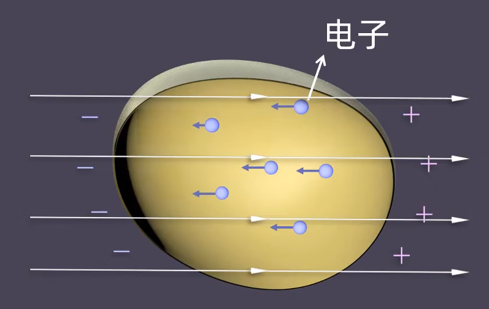  
因静电感应而带的电，称为“**感应电荷**”。

而感应电荷也会形成一个小电场，  
在内部由正指向负，与外部电场相反。  
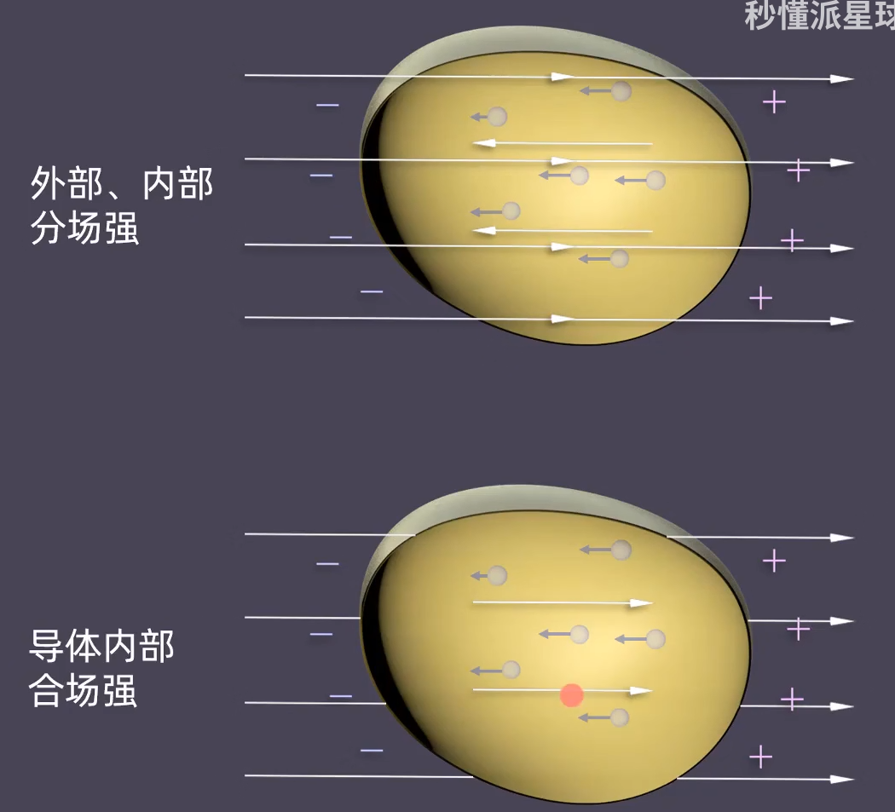

内部电场因为移动的电子不断增多而增强，  
最后在内部达到平衡，称为“**静电平衡**”。  
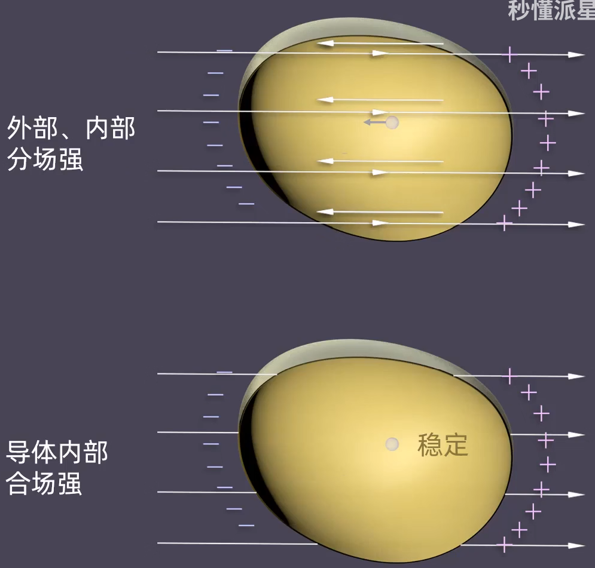

#### 2. 静电平衡条件与性质

导体达到静电平衡**条件**：

1. 导体内部场强处处为零  
   否则内部的电荷就会运动。
2. 导体表面场强沿着表面法线方向  
   否则表面的电荷就会运动。

是充要条件，静电平衡一定满足这两条件，满足这两条件一定静电平衡。

带来**性质**：

* 导体表面是等势面，导体是等势体。
* 净电荷只分布在导体表面。

#### 3. 静电屏蔽

**球壳导体**：

由静电平衡的性质推导，如果挖掉导体内部的一部分，  
因为“没有净电荷”，所以没有影响。  
因此直接挖成球壳。

此时球壳内部无净电荷、无电场、不受外部电场的影响，  
因此称为“**静电平衡**”：  

---

如果内部有带电体电荷$q$：
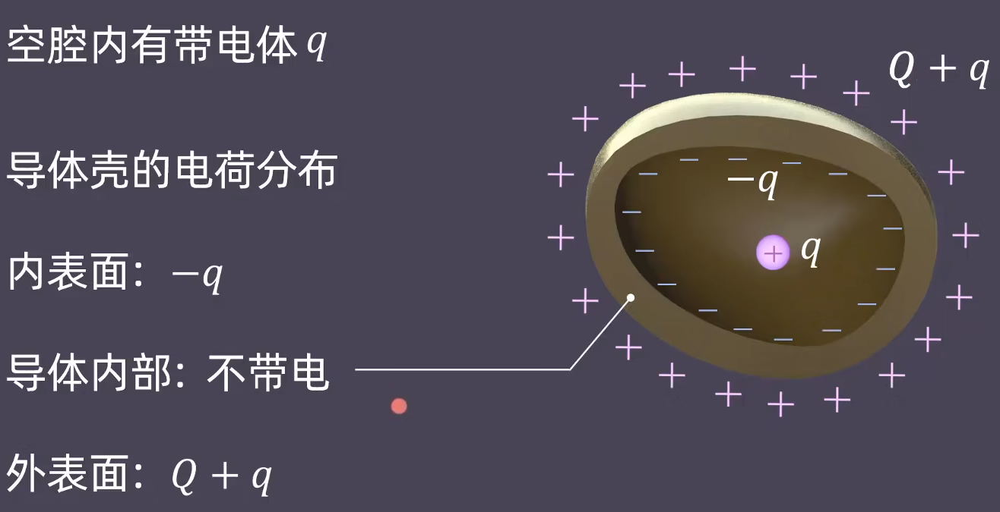  

* 内表面：$-q$
* 球壳内部：不带电
* 外表面：$Q+q$

### 四、带电导体附近的场强

**带电导体**：

$$
E=\frac{\sigma}{\epsilon_0}
$$
其中$\sigma$是导体的“**电荷面密度**”。

> 证明：
>
> 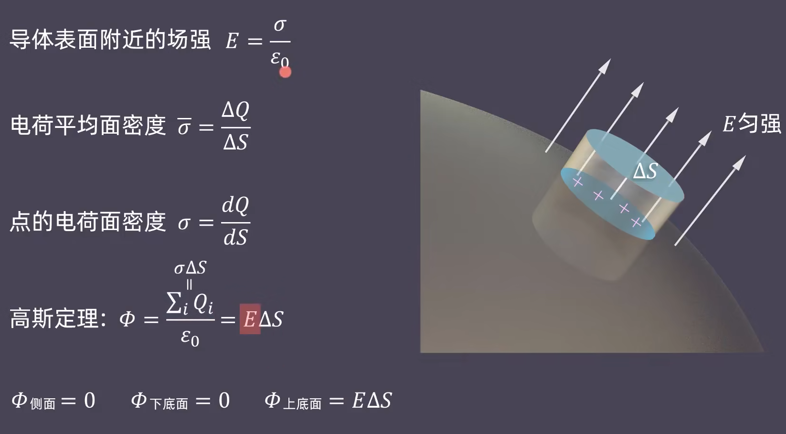

## 运动部分 - 磁场→运动电荷

### 一、电荷的洛伦兹力

$$
\vec{f_\textrm{洛}}=q\vec{v}\times\vec{B}
$$
（这里为叉乘，不然点乘的话会是一个标量，与左侧不等）

若$v\perp B$，则$f=qvB$

方向判断：**洛伦兹力右手定则**，  
四指指向运动方向，抓磁场方向，大拇指指向则为力的方向。

### 二、电荷垂直磁场圆周运动

只能在**垂直磁场**方向适用。

由$F_n=m\frac{v^2}{p}$推出：
$$
qvB=m\frac{v^2}{R}
$$

### 三、导线的安培力

导线里的所有电荷所受的洛伦兹力的总和。  
记得一个联系运动电荷与电流的公式：$\mathrm{d}q\vec{v}=I\mathrm{d}\vec{l}$

$$
F=BIL
$$

大学中：用右手判断，因为本质是洛伦兹力，就右手叉乘判断。
高中：**用左手判断**，四指指向电流方向,让磁力线穿过手心,大拇指的方向就是安培力的方向。  

### 四、磁力矩、磁矩

**导线的形状**对安培力有影响，  
一般研究载流线圈的。

对于矩形线圈，其形状和方位如下：  
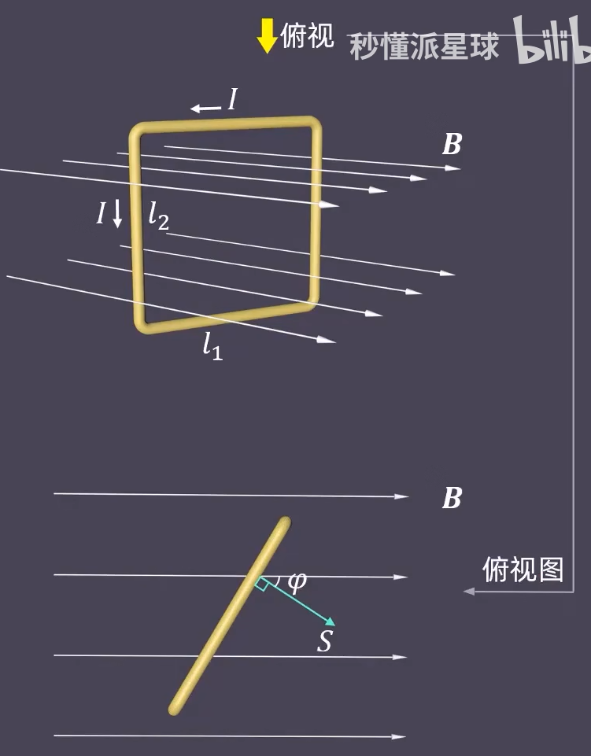

这个方位下，线圈受到的力如下所示：  
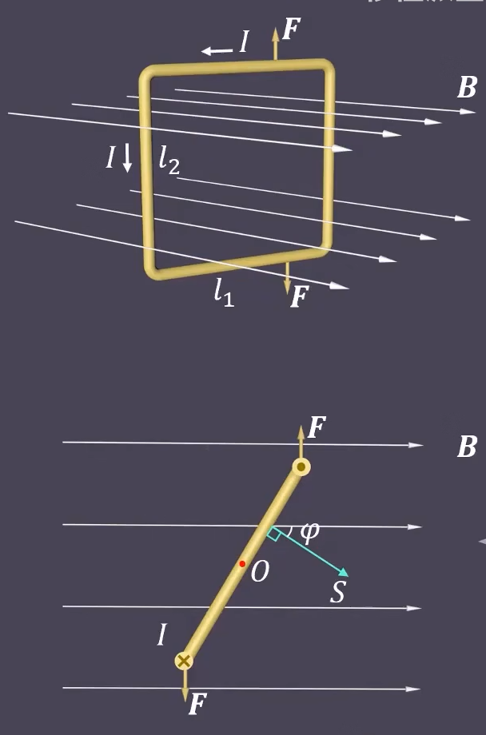  
因此一定会转起来，研究其[力矩](../../../大学物理%20-%20上/Ep.5%20角动量、角动量守恒定律/5.2%20角动量的时间变化率%20力矩/5.2-Angular_Momentum-2.md)。

单个力矩：

* 方向：右手定则 - $\vec{r}$指向$\vec{F}$→$O$的垂直纸面向外$\odot$（对应上面图上杆的向上方向）
* 大小：$M_1=M_2=\frac{l_1}{2}\sin\varphi F$

安培力：$F=BIl_2$

$N$匝线圈的合力矩：
$$
M=NFl_1\sin\varphi=NBIl_2l_1\sin\varphi=NBIS\sin\varphi={NIS}\times B
$$

其中，$NIS$跟线圈本身性质有关，因此称为“**磁矩**”，  
即$P_m=NIS$。

### 五、磁力的功

金属丝在导轨上形成载流导线，会在磁场中受磁力而平动起来，  
或线圈在磁场中，受磁力而转动起来
因此就会做功。

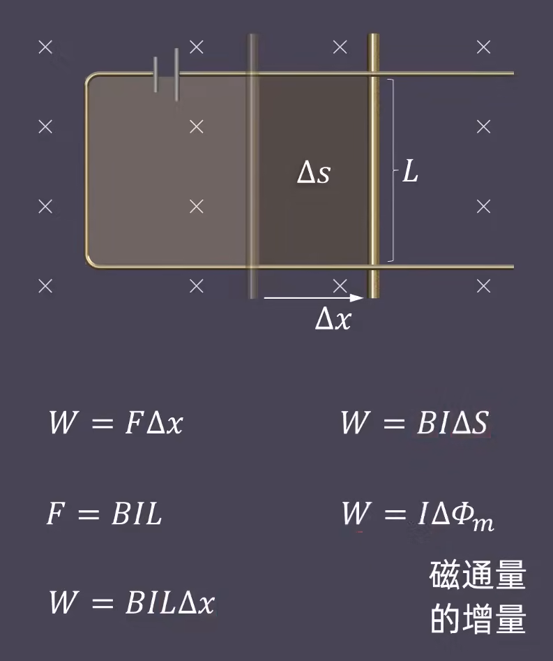  
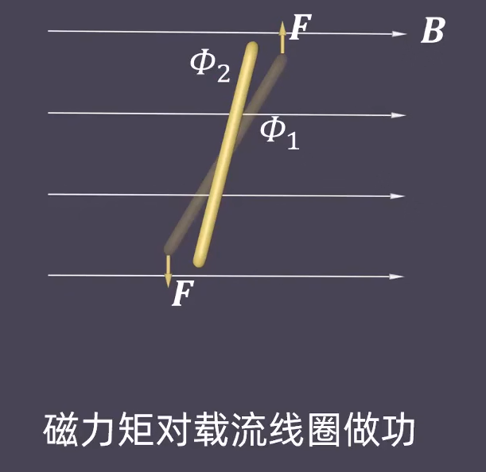  
两种情况，均为：
$$
W=BI\Delta S=I\Delta \varPhi_m
$$

## 知识联系总结

[视频链接](https://www.bilibili.com/video/BV1AE411t7hh?p=51)

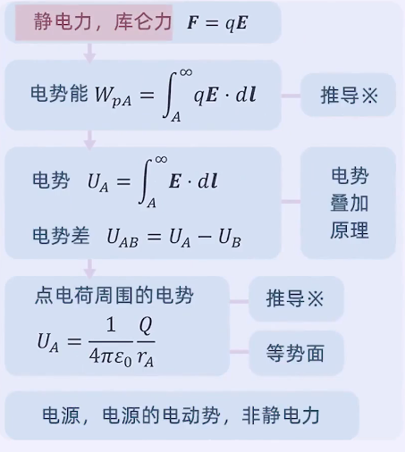 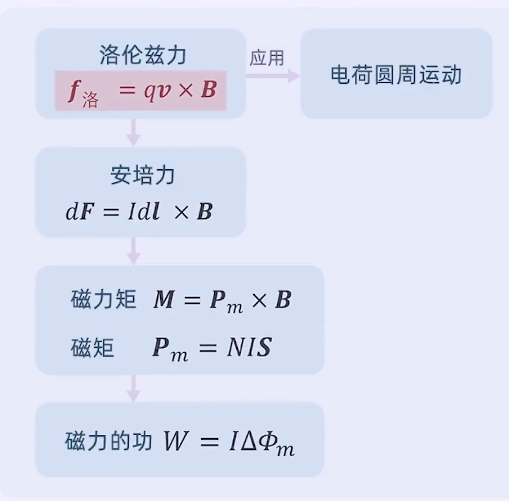

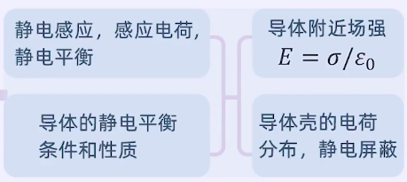

## 总结 - 常见电势

* 点电荷
  $$
  U(r)=\frac{1}{4\pi\epsilon_0}\frac{Q}{r}
  $$
* 均匀带电球面
  $$
  U(r)_\textrm{外}=\frac{1}{4\pi\epsilon_0}\frac{Q}{r}
  $$
  跟点电荷相同。  
  内部的话为$U(r)_\textrm{内}=\frac{1}{4\pi\epsilon_0}\frac{Q}{R}$  
  
* 两个异种无限大带点平面  
  面密度为$\pm\sigma$
  $$
  U(r)=\frac{\sigma r}{\epsilon_0}
  $$
  

会发现以上三个其实就是电场$E$乘了个$r$。

* 均匀带电圆环轴线  
  $$
  U(r)=\frac{q}{4 \pi \varepsilon_{0}\left(R^{2}+x^{2}\right)^{1 / 2}}
  $$
    
* 带电空腔球体
  $$
  \frac{\rho}{2 \varepsilon_{0}}\left(R_{2}^{2}-R_{1}^{2}\right)
  $$
    
* 带电多个球壳  
  直接用球壳的叠加原理。

⚠**需要注意**：叠加原理需要保证共零电势点。  
比如无限大平板零电势点是自己，点电荷零电势点是无穷远。
此时只能积分算：$\int_P^a\vec{E}\cdot\mathrm{d}\vec{l}$。

