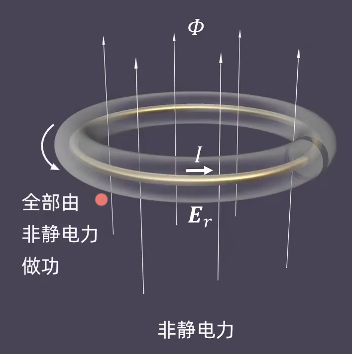
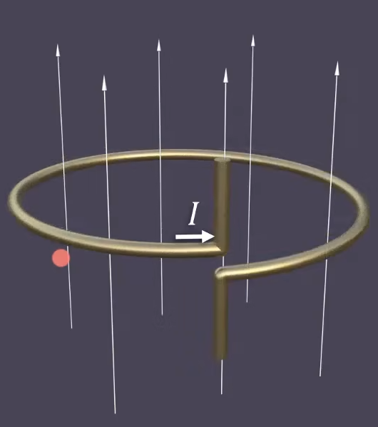
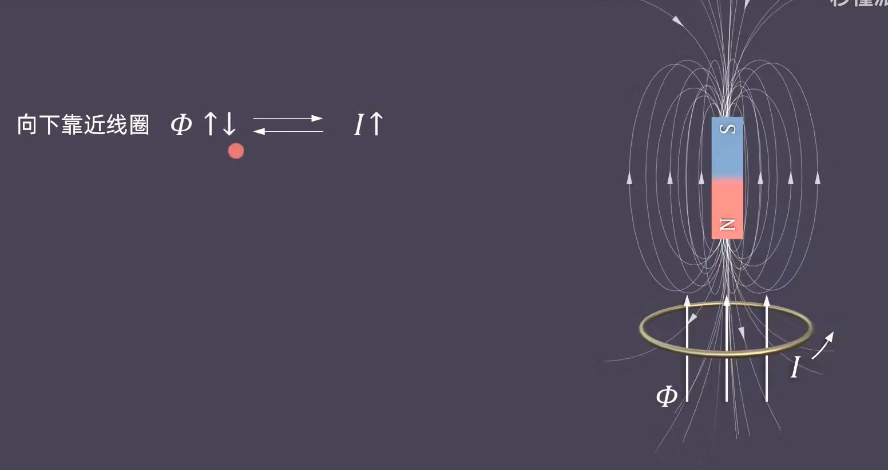
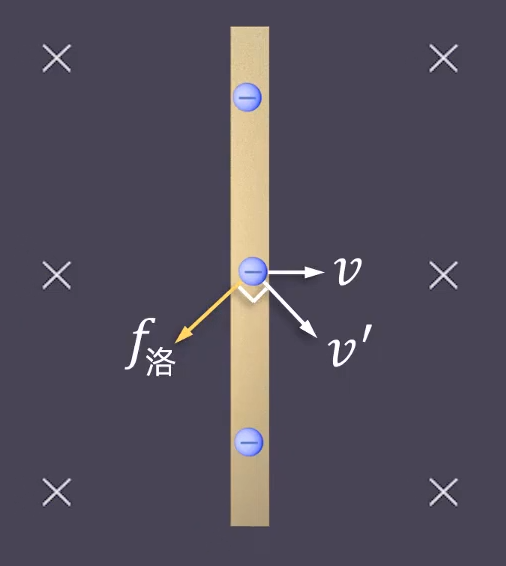
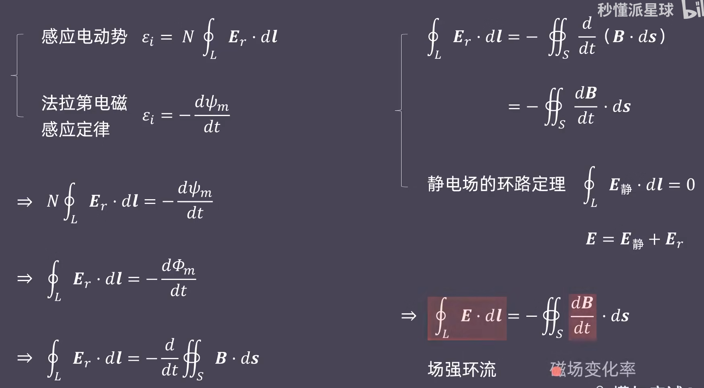
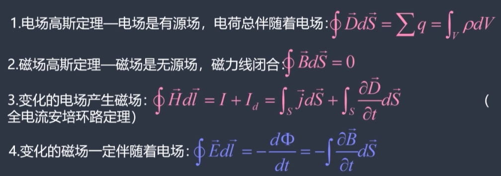
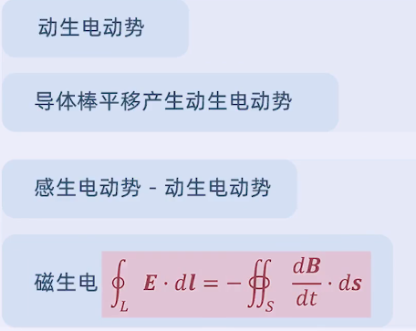

# 磁生电

## 一、电磁感应、涡旋（感生）电场、感应电流

空间磁场，研究一个圈，  
当磁场发生变化时，这个圈上每一点都有了电场。称为“**感生电场**”。  
这个电场每点的方向都沿着这个圈，因此又称为“**涡旋电场**”。

和普通电荷产生的静电场**完全不同**！体现在环流上

* 静电场：[保守场](../1.%20荷产生场/2.1-Electromagnetics-1.md#1-保守场)，$\oint\vec{E}\cdot\mathrm{d}\vec{l}=0$
* 涡旋场：非保守场，$\oint\vec{E}\cdot\mathrm{d}\vec{l}\ne 0$

---

如果放一个导体线圈在这个圈上，线圈中产生闭合电流，称为“**感应电流**”，  
产生感应电流的现象则为“电磁感应”。

若磁场持续变化，则会产生持续的感应电流，相当于一个“电源”，可以视作非静电力，  
但对于普通电源，**非静电力**只在电流**内部做功**，从而将电荷从低电势搬到高电势，**外部**是**静电力做功**，把电荷从高电势拽到低电势；  
而涡旋电场一致绕着环路做功，直接提供持续电流，不需要静电力的参与。

类比为等效电源的话，则整个涡旋电场都是电源。  

## 二、感生电动势

如果将其类比为电源，就有电动势属性，用以表述其非静电力在内部做功大小，  
如果按照这个定义来，涡旋电场的电动势就是$\infty$的。

因此单纯涡旋电场本身的电动势没有意义，其必须要与外部电路有个接入接出口，如下所示：  

如果只有一圈，就只做一圈的功，电动势就是$\epsilon_i=\oint \vec{E_r}\cdot\mathrm{d}\vec{l}$，  
有$N$圈，则感生电动势：
$$
\epsilon_i=N\oint_L \vec{E_r}\cdot\mathrm{d}\vec{l}
$$

这样就仍用$\frac{\epsilon}{R}=I$这个定理，反应电动势和感应电流的关系。

## 三、法拉第电磁感应定律、磁通链

研究**感生电动势**的**大小**、**方向**。

* 大小：磁通量的时间变化率
* 方向：在楞次定律中判断，均要**抵抗**原来磁通量的变化，故为负号。

对于$N$匝线圈，法拉第电磁感应定律表示为：
$$
\epsilon_i=-N\frac{\mathrm{d}\Psi_m}{\mathrm{d}t}=-\frac{\mathrm{d}(N\varPhi_m)}{\mathrm{d}t}
$$

其中，$N\varPhi_m$则称为“**磁通链**”，记为$\Psi_m$。

## 四、楞次定律

感应电流产生的磁场，要**抵抗**原来磁通量的变化趋势。  
故在法拉第电磁感应里，带了个负号。

## 五、动生电动势

非静电力对电荷做功，产生电动势。

金属棒在磁场中运动时，内部的电子会因为洛伦兹力而定向移动，  
故相当于电源，产生“**动生电动势**”。  
  

---

导体棒产生的动生电动势：
$$
\epsilon=BLv=\frac{1}{2}BL\omega
$$

方向：右手定则。（仍大拇指指$v$）

⚠注意！：此时这部分看作电源，是从**低电势到高电势**。  
$\epsilon_{ab}=C$，则$U_{ab}=-C$。

## 六、动生电动势与感生电动势

原本是因为洛伦兹力导致了动生电动势，  
但考虑能不能统一为感生电动势，用磁通量的变化来表示。

金属导体一动，线圈的面积变化，相当于磁通量变化，  
尝试套用法拉第电磁感应定律，计算如下：
$$
\varepsilon=-\frac{\mathrm{d}\varPhi_m}{\mathrm{d}t}=-\frac{\mathrm{d}(B S)}{\mathrm{d} t}=-B \frac{\mathrm{d} S}{\mathrm{d} t}
$$

金属棒运动速度为$v$，长度为$L$，则：
$$
\mathrm{d}S=Lv\mathrm{d}t
$$

带进去，则得到：
$$
\epsilon_i=-B \frac{\mathrm{d} S}{\mathrm{d} t}=-B\frac{\mathrm{d}(Lv\mathrm{d}t)}{\mathrm{d}t}=-BLv
$$
故可以统一，证明法拉第电磁感应定律既适用于感生电动势，也适用于动生电动势。

## 七、（额外 - 电生磁部分） - 位移电流

瞬时变化的电场可以看作位移电流。

* 电位移矢量：$\vec{D}=\vec{E}\epsilon_0$
* 电位移通量：$\varPhi_D=\vec{D}\cdot\vec{S}$

$$
I_D=\frac{\mathrm{d}\varPhi_D}{\mathrm{d}t}(\textrm{电位移通量的变化率})=(E\epsilon_0S)'
$$

方向由正负号决定，正号代表与电场场强方向相同。

## 八、麦克斯韦方程组

磁生电：

$$
\oint_{L} \vec{E} \cdot \mathrm{d} \vec{l}=-\oiint_{S} \frac{\mathrm{d} \vec{B}}{\mathrm{d} t} \cdot \mathrm{d} \vec{s}
$$
揭示了“总电场场强（静电+涡旋）环流”和“磁场变化率”的关系，是磁生电的定量描述。

  

全部：  

## 知识联系

 
