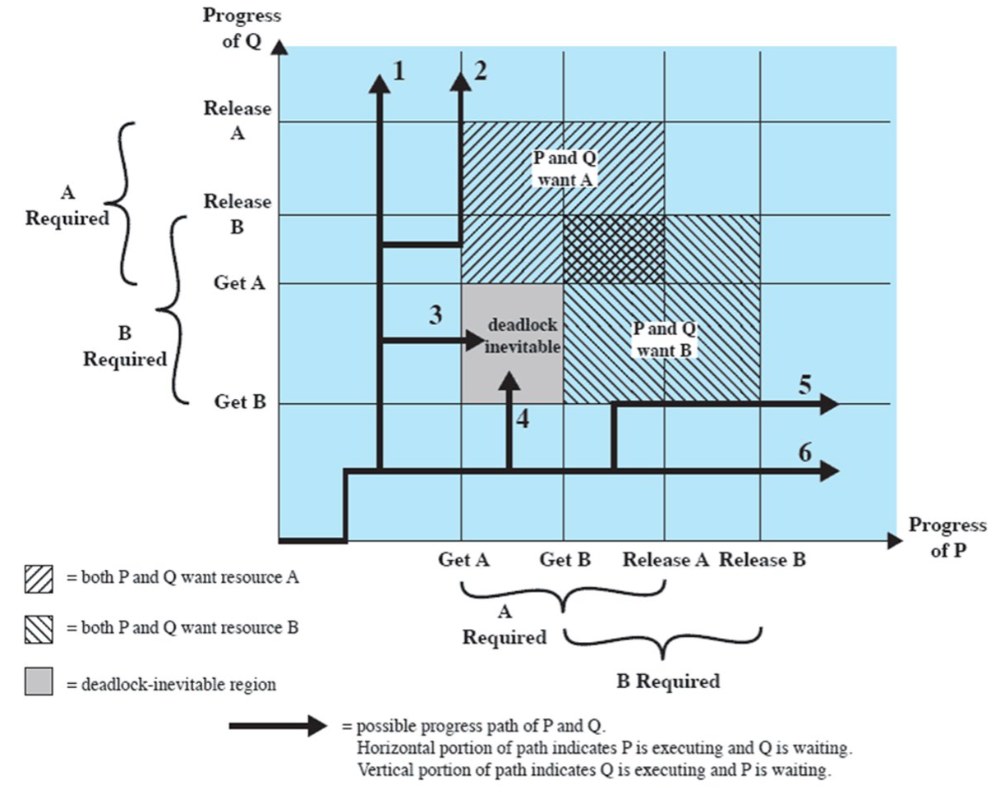
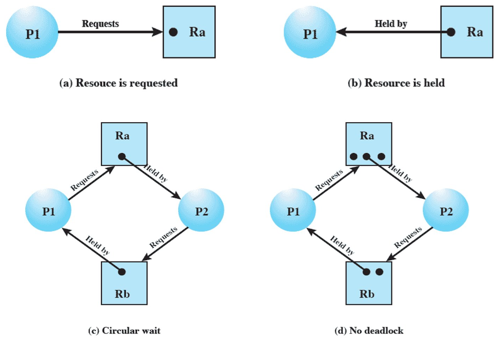
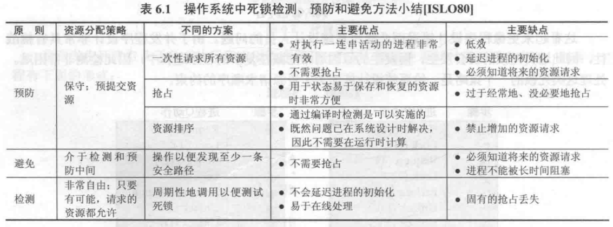
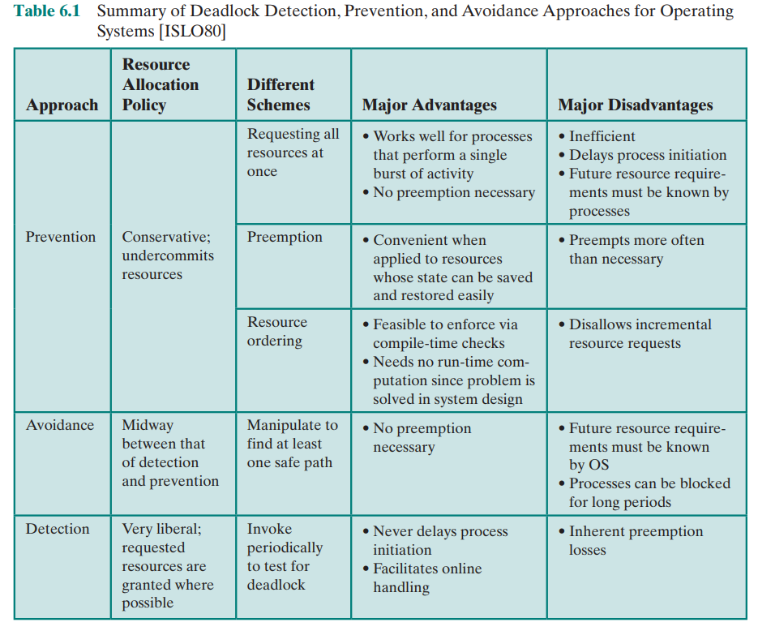
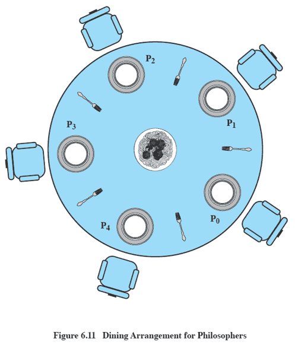

# 第四节 Concurrency: Deadlock and Starvation - 并发性：死锁与饥饿

死锁：多个进程在多个资源分配时，因为每个进程都占有其他进程所需要的资源，  
每个进程都在等待其他进程的资源被释放，互不相让，因此产生死锁。

> 与互斥的区别：
>
> 互斥 - 是对一个资源而言。  
> 死锁 - 对多个资源而言。

死锁只有缓解的方法，没有彻底解决的方法。

包含两个方面：

1. 设计程序的时候，尽量不存在死锁区域。
2. 执行程序的时候，尽量避开死锁区域。

## 一、Principles of Deadlock - 死锁原理

### 1. Joint Progress Diagram - 联合进程图

反应两个进程间的关系。

  

* 对于1、6：直接先一路梭哈到底，自然不会死锁
* 对于2、5：先让一进程把资源$A,B$都拿到，此时虽然另一个进程想要执行，但因为得不到资源而被阻塞，还是只能一路梭哈到底。
* 对于3、4：先让一个只拿到一个资源$A/B$，此时另一个进程再拿到另一个资源$B/A$，则会进入死锁区域。  
  在这个死锁区域中，无法继续向右（进程P要等待进程Q的B资源）和向上（进程Q要等待进程Q的B资源）执行。

### 2. Classification of Resources - 资源的分类

* 可重用资源
* 不可重用资源

对于可重用资源，有时候即便**只是一种资源**，但可能需要等待另一个进程的释放，  
此时**也会发生死锁**。

### 3. Resource Allocation Graphs - 资源分配图



* $R_i$ - 表示资源集，里面的黑点数代表资源个数
* $P_i$ - 表示进程

### 4. The Conditions for Deadlock - 死锁发生条件

四个条件：

* **Mutual Exclusion** - 互斥  
  Only one process may use a resource at a time.  
  一次只有一个进程可以使用一个资源。
* **Hold-and-Wait** - 持有等待  
  A process may hold allocated resources while awaiting assignment of other resource.  
  当一个进程等待其他进程的资源时，继续占有自己已分配的资源。
* **No Preemption** - 非抢占  
  No resource can be forcibly removed from a process holding it.  
  不能强行抢占进程已有的资源。
* **Circular Wait** - 循环等待  
   A closed chain of processes exists, such that each process holds at least one resource needed by the next process in the chain.  
   存在一个闭合的进程链，每个进程至少占有此链中下一个进程所需的一个资源。（如上图(c)所示）

## 二、Resolve Deadlock - 解决死锁

三种解决方式：

* Prevent Deadlock - 防止死锁  
  建立约束，直接规定不能产生死锁。
* Avoid Deadlock - 避免死锁  
  规划路径来避免死锁。
* Detect Deadlock - 检测死锁  
  随便做，运气好就无事发生；运气不好检测到死锁就退回。

干预越来越少、实现越来越简单、解决力度越来越弱。

 

### 1. Prevent Deadlock - 防止死锁

只要死锁发生条件有一个不满足，就不会发生死锁。  
所以就从这四个条件入手：

* 互斥  
  *是并发操作的必要条件，因此必须满足，无法解决。*
* 持有等待 → 一次性请求所有资源  
  对于所需要的资源，要么一点不给，要么一次性给完。  
  不存在只给部分的情况，因此解决该问题。

  缺点：会降低系统效率。
* 非抢占 → 抢占  
  由管理者介入来执行抢占。
* 循环等待 → 资源排序  
  在编程时，对进程给定一定顺序。

  缺点：不符合进程要求（进程都定死了，不能动态增加资源请求）。

虽然想法好、力度也大，但实现存在巨大问题。

### 2. Avoid Deadlock - 避免死锁

通过一些方式，干预执行路径，让其绕过死锁区。

可采用算法：**Banker algorithm**​（银行家算法）。  
将在后面详细讲解该算法。

## 三、具体的方法

### ⭐1. Banker's Algorithm​ - 银行家算法

又称资源分配拒绝策略(Resource Allocation Denia)。

首先定义两种状态：

* Safe State - 安全状态：指至少有一个资源分配序列不会导致死锁。
* Unsafe State - 危险状态：分配后无论如何都导致死锁。

建立“进程资源相关表”：

* Claim matrix $C$ - 需求表
* Allocation matrix $A$ - 已分配表
* $C-A$ - 还需要分配资源表

再建立“资源相关表”：

* Resources vector $R$ - 总共资源数
* Available vector $V$ - 剩余资源数

在做题的时候，就根据剩余资源数，去分配差一点就能全部分配完的进程，  
资源回收后，再继续这样分配，直到所有分配完。

---

每次进程请求分配时，判断是否为安全状态，如果是则允许，否则拒绝。

需要注意：拒绝会导致危险状态的分配请求后，并不是死锁状态，只是有死锁的可能，  
这个时候如果某进程自主释放了资源，又可以继续分配，【？  
因此死锁避免策略不能准确预测死锁，只是能预料死锁的可能性并确保永远不会出现这种可能性。

### 2. Deadlock Detection Algorithm - 死锁检测算法

让他随便做，定时来查岗。  
发现要死锁了（即便还没死锁只是快死锁了），马上制止。

检测频率可以很低。

* 优点 - 效率高
* 缺点 - 由检测频率决定：高了影响效率，低了死锁发生率高。

## 四、Dining Philosophers Problem - 哲学家就餐问题



这样一个圆形餐桌，每位哲学家吃饭的时候要**使用座位两侧的两把叉子**。

### 1. 信号量方法

用信号量来实现五个叉子的互斥，  
因此都赋初值为`1`。

程序指定每个人都先拿右边的叉子，再拿左边的叉子，  
但仍存在小概率出现“死锁”：所有人同时拿右边的，再同时拿左边的（结果都拿空）。

一种解决方法：  
增加一名“服务员”，限定只能接待最多$4$名哲学家，  
即规定每次最多几个人拿（新增信号量`room`，相当于限定房间只能最多存在$4$名哲学家）。

```c++
semphore fork[5] = {1},
         room = 4;
void philosopher(int i)
{
  while (true)
  {
    think(); // 哲学家先要沉思
    wait(room); // 申请进入房间
      wait(fork[i]);       // 尝试拿起左边的叉子
      wait(fork[(i+1)%5]); // 尝试拿起右边的叉子
        eat(); // 嗨吃狂吃
      signal(fork[(i+1)%5]); // 放下右边叉子
      signal(fork[i]);       // 放下左边叉子
    signal(room); // 退出这个房间！
  }
}
```
