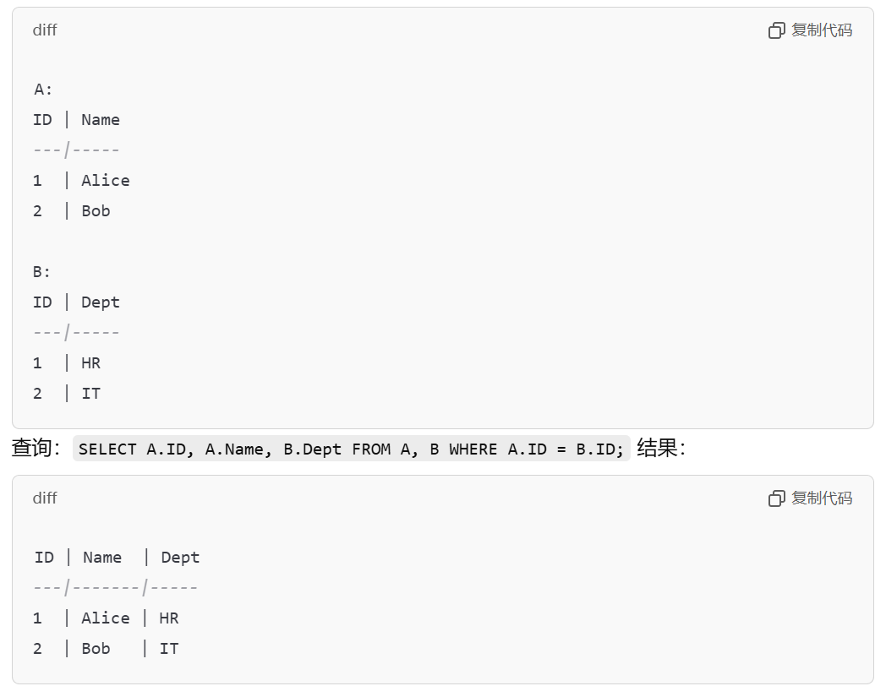

# 第五节 数据操作 - 查询

主要使用关系代数，进行数据操作中的查询操作。

## 一、关系代数与关系运算简介

关系代数与关系运算，可以当作关系模型中的两个“**查询语言**”(DML - 查)。

区别在于：

* 关系代数：查询操作着重于“过程”，由各种“操作符”集合组成，是“过程化”的查询。  
  类似于四则运算。
* 关系运算：查询操作着重于“结果”，查询是描述所需结果应满足的“条件”，是“非过程化”的查询。  
  类似于逻辑表达式。

只要求**掌握关系代数**。

有以下两点特性：

1. 查询的输入输出均为“关系”（表），因此**可以组合查询**。
2. 查询时，既可以用**属性名**（如`SID`、`SName`），也可以用**属性位置**（如`1`、`2`）。

## 二、关系代数

通过各种代数表达式，进行查询。

> 定义 - 基本的代数表达式：  
>
> 由基本的“**代数操作符**”(Operator)，对“**操作数**”(Operand)进行一元或二元的操作。

**操作数**则是各种**参与运算的表**，  
**代数操作符**则是下面提到的各种操作符。

### 1. 基本的操作符

*即四则运算中的加减乘除。*

最基本的是五种操作符：

* 选择(Selection)
* 投影(Projection)
* 并(Union)
* 差(Difference)
* 笛卡尔积(Cross Product)

拥有这五种则完备，  
其余基本运算（如：交(Intersection)）都可由这五种可以推导。

---

根据所需操作数的个数，分为“一元运算”和“二元运算”：

* 一元运算（特殊运算）：只需要一个表，相当于单目运算符。
* 二元运算（集合运算）：需要两个表进行运算，相当于双目运算符。

其中：**二元运算**是基本的集合运算（就是在数学的集合早就里存在的运算符），  
**不属于专门的关系运算**（不是数据库中发明特有的运算符）。  
一元运算的两个才是专门的关系运算。

#### (1) 选择 - Selection

从关系实例中，选择满足条件的元组（行），  
相当于对表的**横向裁剪**。

**代数上表示：**

$$
\sigma_C(R)
$$

其中$C$为条件式，$R$为关系实例。  
$C$中可用关系符为：$<,<=,>,>=,=,!=(<>),\wedge,\vee,\neg$。

**SQL中表示：**  

```sql
SELECT * From <表名R> Where <选择条件C>
```

> e.g.  
> $\sigma_{grade>=3}(S)$

#### (2) 投影 - Projection

从关系实例中，选择满足条件的属性（列），  
相当于对表的**纵向裁剪**。
代数上表示为$\pi_C(R)$，  
跟选择的代数式相同。

> 一元运算对应SQL语句：
>
> ```sql
> SELECT <投影条件> from <表名> where <选择条件>
> ```
>
> e.g.
>
> ```sql
> SELECT * from Stu where SAge >= 18
> SELECT SName, SAge from Stu
  > SELECT SName from Stu where SGrade >= 90 and ender = '
  > ```
>
> **⚠注意：**  
> 关系代数中默认**去除重复元素**（集合要去重、因此**元组个数会变少**）；  
> 而SQL中默认不去重。  
> 若需要去重，则写成`SELECT DISTINCT`。

**同构**：  
属性的**个数以及类型一样**，  
但属性名可以不同，以第一个表的名为主。

#### (3)`UNION` - 并

  需要同构，取第一个表的属性为主。  
  会**删除相同元组**。

#### (4)`DIFFERENCE` - 减

  需要同构，取第一个表的属性为主。

#### (5) `INTERSECTION` - 交

  需要同构，取第一个表的属性为主。

#### (6) `EXCEPT` - 除去

  需要同构，取第一个表的属性为主。

#### (7) `CROSSPRODECT` - 笛卡尔积

  $R\times S$，$R$中每一个元素都跟$S$中每一个元素相并。  
  $R$有$m_R$个属性、$n_R$个元组；$S$有$m_S$个属性、$n_S$个元组，  
  则生成的有$m_R+m_S$个属性、$n_R*n_S$个元组。

  作用为：将两个不同构的表，合并为一个表。  
  主要是将两个不同构但有关系的表给合并，  
  搭配`select ... where`语句，则可以得到需要的数据。

  在SQL中用`,`表示，  
  如：

  ```sql
  select * from R, S
  ```

**并**与**减**为最基本的运算。  

> 举例 - 笛卡尔积作用：
>
> 学生表和选课表，  
> 要得到学生的选课成绩。

此时两表中可能存在相同元素，  
连接后需要把相同元素用表名加`.`前缀表示。  
如：

```sql
SELECT R.ID FROM R, S
```

---

$$
\pi_{Cid, Cname}(\sigma_{Teracher='Liu'}(C)) \\
\pi_{Sid, Sname}(\sigma_{Age>=23 \wedge Sgender='\textrm{男}'}(S))
$$

```sql
SELECT * from Stu where ClassID = '物联网-1' and SGender = '男'

SELECT cid, cname from C where credit >= 3

SELECT Cid, Cname from C where Teacher = 'LIU'
SELECT Sid, Sname from S where Age >= 23 and Sgender = '男'
```

### 2. 扩展操作符

#### (1) 改名 - $\rho(\textrm{new table}, \textrm{old table})$

   $\rho(StuWithScore(1\to Sid, 5\to Sid2), S\times E)$

#### (2) 除操作 - $\div(/)$

 是笛卡尔积的逆操作，但不是完全逆操作（乘回来不一定相同）。  
 即：$(R/S)\times S\in R$。

 相当于：选择含有相同属性的元组，最后再删除所除属性。  
 最常用于：查询跟指定属性


#### (3) 连接 - $\Join$

   对于笛卡尔积，是将两个不同构的表连接，  
   但其效率不高（会有大量不满足要求的元组要删除），  
   因此出现了扩展操作“连接”。  

   会将**相同属性合并**。

   种类有：

   1. 条件连接  
      笛卡尔积合并后，根据给定条件，选择元组。
      $S\Join_{S.level>R.level}R$  
      
   2. 等连接  
      条件连接的一个特例，其条件为$=$。  
      $S\Join_{S.id=R.id}R$  
        
      例子中不要求表A和表B的"ID"列名子一样，可以A中的ID列叫iD、B中的ID列名字叫Id，连接时条件为 A.iD=B.Id 即可。
   3. 自然连接  
      等连接的一个特例，  
      两表具有相同属性，则自然地将该两表中**相同属性**的**相同值**连接在一起。
      $S\Join R$

      只会保留一个相同属性。

      ```sql
      SELECT sid,sname,age,grade from S1 NATURAL JOIN E
      ```

        
        

      等连接的条目数，一定小于等于两表最少的条目数。

   4. 外连接  
      自然连接的一个特例。

      自然连接条件严格，只会保留两表中有相同属性的元组，而两表中没有相同的属性的元组**均会被删除**。
      若希望保留某表或两表的所有元组，则可以用外连接，此时对于不存在于另一表的元组，对应另一表的属性为空。

      分为“左外连接”、“右外连接”、“全外连接”。
      * 左外连接：对左侧的表“开门”，若没有相同属性，保留左侧表的该元组，而另一表的各属性为 NULL。
      * 右外连接：对右侧的表“开门”。
      * 全外连接：对两侧表均“开门”。

      符号为：对哪侧开门，在$\Join$哪侧上下加横线。

      

## 三、分析过程

1. 条件在哪个表里
2. 查询的结果属性在哪个表里
3. 如果这两个表没联系，通过什么表建立关系。

> 例2 - 查询选某教师课的学生的学号和姓名。
>
> 1. 条件`Tname='Liu'`在$T$表
> 2. 结果属性`Sid, Sname`在$S$表
> 3. $T$表和$S$表无直接关系，需要**依次通过**$C$和$SC$表建立关系。
> 4. 先“选择”条件，  
>    然后不断“连接”到结果属性的表（其间可以通过投影只选择需要的连接属性），  
>    最后再“投影”所需属性。  
>    1. $\sigma_{\textrm{Tname='Liu'}(T)}$
>    2. $\Pi_{Tid}(\sigma_{\textrm{Tname='Liu'}(T)})$