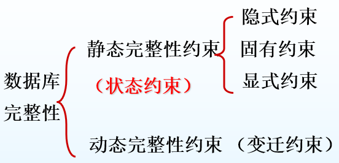

# Ep.5 数据库的保护

DBMS的基本功能：

* 数据独立性
* 安全性
* 故障恢复
* 并发控制
* 完整性

本章主要讲：安全性、故障恢复和并发控制。

---

* 数据库完整性 - 数据的正确性、相容性
  
  * 静态完整性约束（状态约束）
    * 固有约束 - 原子性  
      指：关系的属性不可分。
    * 隐式约束 - 数据更新时，**DBMS按相应约束条件自动完成验证**。
      * 域完整性
      * 主键约束
      * 唯一约束
      * 一般性约束
        * 检查
        * 约束
        * 断言
      * 参照完整性
        * 外键约束
        * 断言
        * 触发器
    * 显式约束
      * 触发器 - 定义开发人员编写，验证由数据库负责。
      * 断言 - 定义用断言定义语言，验证由数据库的ICS负责。
      * 过程化定义 - 定义和验证都由开发人员进行。
  * 动态完整性约束（变迁约束）
    * 触发器 - 同上
    * 过程化定义 - 同上
* 故障恢复两件事：“转储”和“建立日志”
* 提交事务更新规则
  * 提交规则
  * 先记后写规则
* 事务的特性  
  是最小的“执行”、“并发控制”、“故障恢复”单元。
  * 原子性 A - 原子操作，可以提交和回滚。
  * 一致性 C - 数据一致性
  * 隔离性 I - 对多个用户而言相当于单独使用（并发控制）
  * 持久性 D - 修改是持久的
* 日志的内容
  * 活动的事务表ATL：记录正在执行、未提交事务
  * 提交的事务表CTL：记录已提交事务
  * 前像BI - 针对未提交事务，做Undo处理
  * 后像AI - 针对已提交事务，做Redo处理
* 并发导致的问题
  * 丢失更新（写写）
  * 读脏数据（写读撤回）
  * 读值不可复现（读写再读）
    * **不可重复读**：重点是修改，记录不同。
    * **幻影读**：重点是增删，记录数不一样。
* 锁
  * X锁 - 排它锁  
    写操作申请。
  * S锁 - 共享锁  
    读操作申请。
  * IX、IS意向锁
