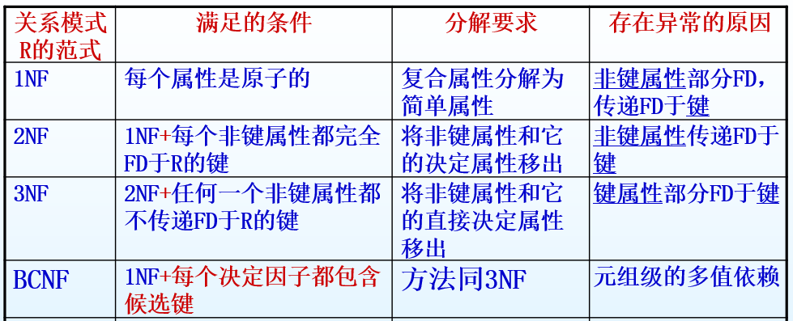

# Ep.6 关系数据库设计

关系模式中存在**数据依赖**。

对于联合主键，部分字段可能并不是由这个联合主键所决定，  
而是由其中某一个主键决定，导致数据出现异常。

* 数据依赖
  * **函数依赖**
  * 多值依赖
  * 连接依赖

解决异常方法：对关系模式进行相应的**分解**，使其符合相应的范式。

## 一、函数依赖

### 1. 定义

对于函数$y=f(x)$，可以说$x$函数决定$y$，也可以说$y$函数依赖于$x$。  
关系数据库中讨论函数或函数依赖，注重的是**语义**上的关系。

如：$\textrm{省}=f(\textrm{城市})$，只要给出具体城市，就有唯一的省与之对应。

把$Y$依赖于$X$表示为$X\to Y$。

> 定义 - 数据库中的函数依赖：
>
> 若有一个关系模式$R(A_1,A_2,\cdots,A_n)$，$X$和$Y$为其子集，$r$是$R$中任意具体关系，$t_1,t_2$是$r$中任意两个元祖。  
> 如果由$t_1[x]=t_2[x]$推导出$t_1[y]=t_2[y]$，则可以推导出$Y$依赖于$X$，即$X\to Y$。
>
> 如：对于关系$SC(Sno,Cno,Grade)$，存在函数依赖：$(Sno,Cno)\to Grade$。

⭐**对应于数据库**：

* AB呈$1:n$关系，则$B\to A$。
* 都是**候选键**去**决定**其他属性。

### 2. 基本术语

* 非平凡函数依赖：$X\to Y$，但$Y\not\subseteq X$，则$X\to Y$为非平凡的函数依赖。  
  *我们学的都是非平凡函数依赖，有个印象就行。*
* 完全函数依赖：对于$X$的任意子集$X'$，其都有$X'\not\to Y$，则称$Y$完全依赖于$X$，记作：$X\xrightarrow{f}Y$  
  即$Y$只能由$X$这一个整体属性决定，而不能由其子属性决定。
* 部分函数依赖：有$X'\to Y$，记作：$X\xrightarrow{p}Y$
* 传递函数依赖：$X\xrightarrow{f}Y$、$Y\xrightarrow{f}Z$，则称$Z$传递函数依赖于$X$。  
  ⚠注意：需要满足$Y\not\rightarrow X$！  
  也就是说：是$a$、$b$等价的话，$a\to b\to c$或者$b\to a\to c$这种不算传递依赖，**中间的变量**也要是**非主属性**。  
  
* 等价：$X\to Y$并且$Y\to X$，且$X$与$Y$一一对应，记作$X\leftrightarrow Y$（**在$1:1$关系中**体现）

> 举例 - 完全和部分函数依赖：
>
> 关系1$SC(Sno,Sname,Cno,Credit,Grade)$  
> 关系2$S(Sno,Sname,Dept,Dept_master)$：
>
> * 完全函数依赖 - $(Sno,Cno)\xrightarrow{f}Grade$
> * 部分函数依赖 - $(Sno,Cno)\xrightarrow{f}Sname$、$(Sno,Cno)\xrightarrow{f}Credit$
> * 传递函数依赖 - $Sno\xrightarrow{f}Dept$、$Dept\xrightarrow{f}Dept_master$，则$Sno\xrightarrow{f}Dept_master$。

### 3. 最小函数依赖集

可以看到有很多个候选键，每个候选键又决定其他属性，因此直接列出所有依赖明显累到，  
考虑减小函数依赖集合的规模。

> 定义 - 最小函数依赖集：
>
> 1. $F$中每个函数的右边都只有一个属性。
> 2. 对$F$中的任何函数依赖$A\to B$，都不存在$A$的一个真子集$C$，使函数依赖$C\to B$代替函数依赖$A\to B$后得到和原来的$F$等价的一组依赖。
> 3. 从$F$中移出任何一个函数依赖，都无法再得到和原来的$F$等价的一组函数依赖。
>
> 如果某个函数依赖可以由其他依赖推导出来，或者为部分函数依赖，便可以转化成最小函数依赖集。

方法：

* 分解：  
  若$A\to B$右侧的$B$有多个$(b_1,\cdots)$，分解为若干个右侧只有一个的。
* 去掉多余的函数依赖$X\to Y$：  
  依次将所有的函数依赖$X\to Y$从$F$中去除，然后求剩下的$F'$中$X$的闭包$X_{+}$，看$X_{+}$是否包含$Y$，  
  包含则可去除，否则不能。
* 去除复合函数依赖$(x_1,\cdots)\to Y$多余的属性：  
  一个个检查每个复合函数依赖$X(x_1,\cdots)\to A$，要判断$x_i$多余，则以$X'(x_1,\cdots,x_{i-1},x_{i+1},\cdots)\to A$代替原关系，判断是否$X_i\in X'_{+}$，  
  包含则可去除，否则不能。
  **对应到做题：**如$AB\to X$，看是否有$A\to B$或者$B\to A$，则可以去除被决定的那个。

闭包：按照一个依赖集合$X$，推导出的所有函数依赖的集合，称为$X$的闭包，记为$X_{+}$。  
推导方式举例：如问$(BCD)^+$，则先把$BCD$列到闭包中，然后判断$B,C,D,BC,BD,BCD$是否能推导出新的属性（如存在关系$BC\to F$），能则纳入闭包，再根据新的属性判断能不能纳入其他新的属性。

## 二、关系规范

### 0. 基本概念

* 候选键
* 主属性：只要出现在候选键里的属性就是主属性
* 非主属性

> 题目类型 - 判断候选键：
>
> 所给的函数依赖集$F$，可把所有属性$U$分成以下四种状态：
>
> 1. 只出现在左边$L$ - 一定属于**候选键的组成部分**
> 2. 只出现在右边$R$ - 一定不属于
> 3. 两边都不出现$N$ - 一定属于（只能自己决定自己）
> 4. 两边都出现$LR$ - 不知道，慢慢试
>
> 按照划分后，得到哪些属性一定属于候选键部分，然后写到一个集合$K$中，  
> 接着与那些不确定的（即第4类）的一个个组合，直到$K^+=U$，则为一个候选键。  
> 此时可能有多个候选键，试出了一个后再慢慢组合。
>
> 如$K=AB$，其他还剩$CDE$，要把组合$ABC,ABCD,ABCDE,ABD,ABDE,ABE$都给试完，  
> 不过试出了$ABCD$是候选键，就不用试$ABCD\cdots$了，直接换$ABD$继续往后试。
>
> 存在性质：如果刚开始$1,3$类的属性集合$K_0$，已经$K_0^+=U$了，  
> 则**这是唯一候选键**。

### 1. 第一范式 - 1NF

需要满足：

1. 没有复合属性。
2. 每行每列的交叉处**只有一个值**。  

*相当于Excel表格里初始的那样，没有合并单元格，单元格内不允许换行。*

关系的最基本要求，否则不叫关系。

---

为最基本的范式，会造成很多异常情况：

* 数据冗余：因为直接把单元格内多个值给拆分成了多条记录，会造成某些属性被重复多次
* 插入异常：插入新的记录，但不是完整的记录（学生选课表，只想多增加一门课），会出现空值属性。
* 删除异常：如删除学生选课记录，会把其教师课程等信息一起删除（只是额外删除而已，并不是直接删除不见）
* 更新异常：更新某门课任课教师名字，必须要更新所有选了该课的元组。

根本原因：存在非主属性，其**不是完全依赖于候选键**。  
也就是说本来是$(A,B)$共同指挥整个军队，但$(a_1,a_2,\cdots)$是$A$的士兵，$(b_1,b_2,\cdots)$是$B$的士兵，  
这个时候$A$的士兵其实并不服$B$来管，$B$的士兵也不服$A$，就造成不是依赖于$(A,B)$这个总指挥体系了。

想想都知道：是因为把所有东西都放在一张表里导致的这种情况。  
直接利用外键拆分成多张表，就能避免这种情况。

### 2. 第二范式 - 2NF

在满足第一范式的基础上，若关系的主键有多个类型构成的复合主键，则需要：  
**非主属性都完全依赖于主键**。  
对于多个候选键，仍选一个作主键，然后判断（在下面分解也是基于所选的主键）。

因此**若主键只有一个属性**，则一定是2NF。

---

1NF转换2NF方法 - **模式分解**：  

1. 用组成主键的属性集合的**每一个子集**，作为主键构成一个关系（如主键有$3$个属性就有$C_3^1+\cdots+C_3^3=2^3-1$种关系）。
2. 将依赖于这些主键的属性，放置到相应的关系中。
3. 去掉只有一个属性（即原来主键的某子集）的关系。

---

但注意，此时只是消除了“部分函数依赖”这个东西，  
还有一个在阴暗中爬行的“传递函数依赖”可还没被注意到。

因此仍存在上述四个缺陷，都因为传递函数依赖而造成的，不过没那么严重：

* 数据冗余：因为传递函数依赖，还是存在大量容易记录（如$SID\to SDept\to SDept\_master$），会产生大量的冗余master。
* 插入异常：没法插入空的系$SDept$。
* 删除异常：当某系$SDept$所有的学生都被删除后，相应的$SDept$信息也不复存在。
* 更新异常：更新某系信息，所有在该系的学生都要更改。

### 3. 第三范式 - 3NF

在第二范式的基础上，需要：  
**非主属性都不传递依赖于主键**。

只要存在传递函数依赖，就不是3NF。

升级方法 - 分解！  
直接把传递函数依赖（一般就$A\xrightarrow{f}B\xrightarrow{f}C$啦）分解成$A\to B$的表和$B\to C$的表。

如$SID\to SDept\to SDept\_master$，分解成$(SID, SDept, SName,\cdots)$和$(SDept, Dept\_master)$。

【仍存在异常orz，但我不是很明白，过……

### 4. Boyce-Codd范式 - BCNF

第三范式不允许存在**对主键**的部分依赖和传递依赖，但并没有考虑**对所有候选键**的依赖问题，  
因此可能存在引起数据冗余的函数依赖。

感觉只会考判断，因此判断方法：  
关系中每个函数依赖的决定因子（**左侧**）**都是候选键**时，为BCNF。

虽然BCNF难以用“在3NF的基础上……”来描述，但**BCNF就是3NF**，3NF也通常是BCNF，  
只有特殊情况下3NF不是BCNF：

1. 关系中包含两个或更多的复合候选键。
2. 候选键有重叠，通常至少有一个重叠的属性。

最后总结：  
  
