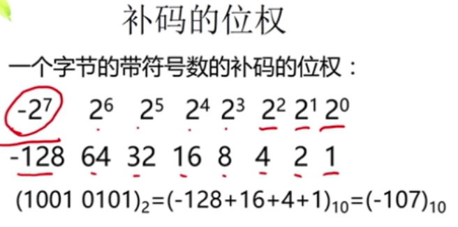

# 第一节 数值数据的表示

## 一、计算机中的数值数据

数的进制有两种表达方式：

* 下标法：
  e.g. $(1010)_2$、$(1010)_8$、$(1010)_{10}$、$(1010)_{16}$
* 后缀字母法：  
  e.g. 214、375D、101B、76Q、A1DH
  * 二进制 - B
  * 八进制 - Q  
    原本为O，但易与$0$混淆，故常用Q表示。
  * 十进制 - D  
    后缀D可以省略。
  * 十六进制 - H
* 前缀法（常用在计算机中）：
  e.g. `037`、`0x7fff`
  * 八进制 - `0`
  * 十六进制 - `0x`

## 二、无符号数和带符号数

* 无符号数  
  $n$位表示范围：$0 \sim 2^{n}-1$
* 带符号数  
  规定最高位为符号位，$0$代表正，$1$代表负。
  * 真值$X$：现实中数的表示，如$+1011$、$-1110$。
  * 原码$[X]_{\textrm{原}}$
  * 补码$[X]_{\textrm{补}}$
  * 反码$[X]_{\textrm{反}}$

对于纯小数，虽然写作`0.xxxx`，但计算机中仅有后面的`?xxxx`，其中`?`是符号位。  
前面的`0.`只是方便理解。

## 三、原码表示法

最高位根据正负决定，其余跟真值的二进制相同。

计算公式：

* 真值为纯小数：
  $$
  [X]_{\textrm{原 }}=\left\{\begin{array}{lr}
  X & 0 \leqslant X<1 \\
  1-X=1+|X| & -1<X \leqslant 0
  \end{array}\right.
  $$
* 真值为纯整数：
  $$
  [X]_{\textrm{原 }}=\left\{\begin{array}{lr}
  X & 0 \leqslant X<2^{n} \\
  2^{n}-X=2^{n}+|X| & -2^{n}<X \leqslant 0
  \end{array}\right.
  $$

*原码就是符号位根据正负判断，其余就是真值，直接写即可。*

> e.g.
>
> * $X=0.1101$，$[X]_{\textrm{原}}=0(.)1101$
> * $X=-0.1000$，$[X]_{\textrm{原}}=1.1000$
> * $X=1001$，$[X]_{\textrm{原}}=01001$
> * $X=-0010$，$[X]_{\textrm{原}}=10010$

原码乘除简单，加减复杂。

## 四、补码表示法

最高位根据正负决定，其余为取反加$1$。  
**更高效的方法**：自低位起，将第一个$1$和右边的$0$保持不变，左部取反（除符号位）。

### 1. 计算公式

* 真值为纯小数：
  $$
  [X]_{\textrm {补 }}=\left\{\begin{array}{lr}
  X & 0 \leqslant X<1 \\
  2+X=2-|X| & -1 \leqslant X<0
  \end{array}\pmod 2\right.
  $$
* 真值为纯整数：
  $$
  [X]_{\textrm {补 }}=\left\{\begin{array}{lr}
  X & 0 \leqslant X<2^{n} \\
  2^{n+1}+X=2^{n+1}-|X| & -2^{n} \leqslant X<0
  \end{array}\pmod{2^{n+1}}\right.
  $$

可将纯小数记为：
$$
[X]_\textrm{补}=(X+2^1)\bmod2^1
$$

公式可以方便由**补码转化为真值**。

> e.g.
>
> * $X=0.1101$，$[X]_{\textrm{补}}=0(.)1101$
> * $X=-0.1100$，$[X]_{\textrm{补}}=1.0100$
> * $X=1001$，$[X]_{\textrm{补}}=01001$
> * $X=-0010$，$[X]_{\textrm{补}}=11110$

补码的$1.000\cdots000$是特殊的补码，**表示$-1.000\cdots000$**，  
但其没有原码（原码只能表示$-0.999\cdots999\sim0.999\cdots999$）。

4位补码如下对应真值顺序如下表格所示：
| 真值 | 补码 |
| ---- | ------ |
| 7    | `0111` |
| 6    | `0110` |
| 5    | `0101` |
| 4    | `0100` |
| 3    | `0011` |
| 2    | `0010` |
| 1    | `0001` |
| 0    | `0000` |
| -1   | `1111` |
| -2   | `1110` |
| -3   | `1101` |
| -4   | `1100` |
| -5   | `1011` |
| -6   | `1010` |
| -7   | `1001` |
| -8   | `1000` |

可以看到：正值跟原码一样，从大到小减少；但到负值是从大到小减少，而不是增加。

> 补充 - 补码位权：
>
> 补码也可以直接转十进制，其位权除了最高位是$-2^n$，其他与原二进制相同。  
> 

### 2. 变形补码

采用双符号位或更多的符号位，可扩大数的表示范围，用于解决溢出问题（能判断是否溢出）。  

以双符号位为例，计算公式变为：
$$
[X]_\textrm{补}=(X+2^2)\bmod2^2
$$

> e.g.
>
> * $X=0.1010$，$[X]_{\textrm{双补}}=00(.)1010$
> * $X=-0.1100$，$[X]_{\textrm{双补}}=11.0100$

当变形补码运算结果的**双符号位不同**时，代表其真值超出了一般补码的表示范围（即溢出）。

### 3. 变补

已知$X$的补码$[X]_{\textrm{补}}$，直接求$-X$的补码$[-X]_{\textrm{补}}$。

**方法**：包括符号位一起求反，再末位加1。

> e.g.
>
> * $[X]_\textrm{补}=0.0010\rightarrow[-X]_\textrm{补}=1.1110$

### 4. 移位

*具体的原码和补码的移位可以看[带符号数的移位和舍入操作](../../Ep.4%20数值的机器运算/4.4%20带符号数的移位和舍入操作/4.4-Machine_Arithmetic-3.md)这一节。*

1. 右移（由$[X]_\textrm{补}$求$[X/2]_\textrm{补}$）  
   方法：⭐**连同符号位**一起向右移，符号位保持原来的。  
   ⚠即带符号位的负数右移时，增加的是`1`！
   > e.g.
   >
   > * `0;1100`($12$)→`0;0110`($6$)
   > * `1.1000`($-0.5$)→`1.1100`($-0.25$)

2. 左移（由$[X]_\textrm{补}$求$[2X]_\textrm{补}$）  
   方法：所有位向左移，符号位保持原来的，末尾加$0$。  
   ⚠需要注意：只有$[X]_\textrm{补}$的**最高两位（含符号位）相同**，左移才是正确的$[2X]_\textrm{补}$，否则溢出了。
   > e.g.
   >
   > * `0;0111`($-7$)→`0;1110`($-14$)
   > * `1.1000`($-0.5$)→`1.0000`($-1$)
   >
   > 溢出情况：
   >
   > * `0;1100`($12$)→`0;1000`($6$)，溢出！
   > * `1.0111`($-0.5625$)→`1.1110`($-0.125$)，溢出！

## 五、反码表示法

*直接取反即可，略。*

## 六、3种机器数的比较

* 补码、反码的符号位可以参与运算，原码不行。
* 真值$0$，原码、反码有两种，补码只有一种`0000`。
* 因此补码可以多表示一个数$-2^n$，为`1000...`。  
  故$n+1$字长（8位，则$n=7$）的范围为：
  * 纯小数
    * 原码、反码：$-(1-2^{-n})\sim1-2^{-n}$
    * 补码：$-1\sim1-2^{-n}$
  * 纯整数
    * 原码、反码：$-(2^{n}-1)\sim2^{n}-1$
    * 补码：$-2^{n}\sim2^{n}-1$

## 七、补充 - 溢出运算规则

* 无符号数：直接$\bmod 2^n$（$n$为位数）
* 有符号数：减去$k$个$2^n$，直到满足范围。
