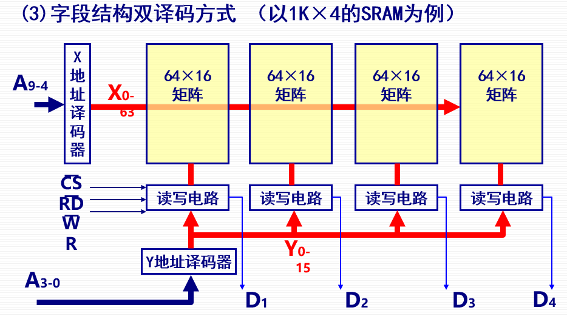
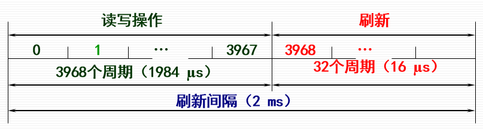
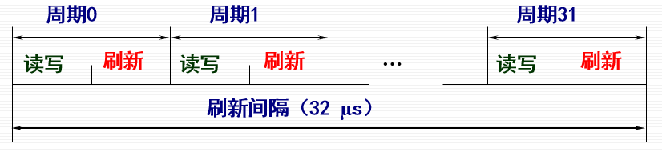
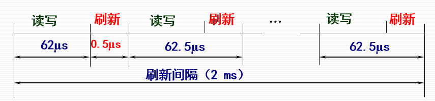

# 第三节 半导体随机和只读存储器

半导体存储器，是主存（内存）的基本部件，  
均由双极型或者MOS型制成。  
分为随机存储器和只读存储器。

* 随机存储器(RAM) - 可读可写、断电丢失。  
* 只读存储器(ROM) - 只读不写、断电保存。

多个记忆单元构成一个存储单元，  
多个存储单元构成一个存储体。

## 一、RAM记忆单元电路

半导体存储器RAM：

* 双极型存储器（静态）
* MOS存储器
  * 静态存储器SRAM
  * 动态存储器DRAM

用双稳态触发器，来存储1bit的二进制信息。

动态和静态区别：  

* 静态用双稳态D触发器存储，  
  只要不断电不变化，不用刷新；  
* 动态用电容存储，  
  因为会漏电流，需要刷新。

### 1. 6管SRAM记忆单元电路

字线：控制与外界（I/O，红框之外）的联通、断开。

静态的，不用刷新。

### 2. 4管DRAM记忆单元

动态的，要刷新。

### 3. 单管DRAM记忆单元

通过电容$C$中的电荷来代表1bit信息。

字线：

* 低电平：截止、不读也不写。
* 高电平：接通、可读可写。

特性：

* 保存信息：  
  为破坏性读出（电容放电），  
  同时也会漏电流（电荷自己会跑），因此需要刷新。
* 写入操作
* 读入操作

## 二、RAM芯片分析

### 1. RAM芯片总览

* 地址线（单向）  
  决定内存由多少个单元（字）。
* 数据线（双向）  
  决定每个单元有多少位。
* 读/写控制线$\overline{WE}$、$\overline{OE}$  
  只控制操作为读还是写。
* 片选线$\overline{CS}$  
  相当于各种总控制开关，输出使能端。  
  只控制读出的数据是否输出，而不控制是否读入（在下面刷新有区别）。

### 2. 地址移码方式

一般内存的容量表示都是字$\times$位数，  
而不是按字节编址。

#### (1) 单译码方式

内存容量：$2^k\times N$

只用一维，地址编码是多少就有多少根译码线。  
每次能读$N$位。
因此若存储容量变大，地址位数变多，则译码线过多。

#### (2) 双译码方式

内存容量：$2^k\times 1$

对于这种方式，每个字只有$1$位！

则将地址编码二分成前后两个相同部分，均为$\frac{k}{2}$根线，分别用译码器控制。  
前半部分为行，后半部分为列。

前半部分直接选择哪一行，
后半部分是选择哪一列，然后用MOS管控制是否打开。

#### (3) 字段结构双译码方式

内存容量：$2^k\times N$

$N$个双移码方式（$N$个芯片）组合。  
以下以$1K\times4$举例($k=10$)。

需要注意，此时行列不再是均分为$\frac{k}{2}$！  
即不是行选为$5$位，列选为$5$位，  
实际上是行选为$6$位，列选为$4$位，  
具体原因见下：

因为还是要尽量把所有**记忆单元**排成方阵，  
但注意：记忆单元指的是**存储一位(1bit)**，而非一字(1word)！  
而在双译码方式中，一字就是一位，所以可以直接均分。

那么$1K\times4=4096bit$，方阵的话就是按$64\times64$这样排列记忆单元，  
但字段结构，一次能同时输出$4$位，是由$4$个双译码方式组成的，  
所以列选就是$64\div4=16$，为$4$位，  
而行选依旧是$64$，为$6$位。

可以按如下方式计算：

总位数：$k+\log N$（如1K×4，是$12$位）

* 行：是$\frac{k+\log N}{2}$根线（相当于均分，上例中为$6$）
* 列：是$\frac{k+\log N}{2}-\log N$根线（均分过后，**减掉片数**，上例中为$4$）  
  因为列会同时控制$N$个芯片的某一位，一起写入读出，所以要减掉片数$N$。

⭐**总的地址线仍是$k$个！**。

### 3. 静态存储器(SRAM)芯片

### 4. 动态存储器(DRAM)芯片

## 三、动态存储器(DRAM)的刷新

> 定义 - 刷新
>
> DRAM是用电容存储信息，经过一定时间后电容上的电荷可能被泄放掉，  
> 因此每个一定时间必须向存有电荷的电容补充一次电荷，称为“刷新”。

一般最大刷新间隔为2ms。

### 2. 刷新方式

对于二维地址译码，都是采用一行一行地刷新。

刷新时间=存储矩阵行数×刷新周期  
*注：刷新周期指的是**刷新一行**所需时间。*

1. 集中刷新方式  
   就是所有单元一起刷新。

   在允许的最大刷新间隔内，按照芯片容量的大小集中安排若干个刷新周期，  
   **刷新时停止读写操作**。

   

   刷新过程类似于读写过程，为“假读”，  
   因此刷新周期就是存取周期。

   特点：
   * 读写速度快。
   * 存在刷新死区（此时不能读写），且容量越大越长。
2. 分散刷新方式  
   把刷新操作**强制加到每个存取周期**内进行，  
   在一个系统存取周期内**刷新**存储矩阵中的**某一行**。

   

   特点：
   * 没有死区（刷新包含在读写操作内，不算死区）
   * 加长了存储周期（变为2倍，等于刷新周期），降低整机速度
   * 刷新频繁（间隔明显小得多），没有利用好最大刷新间隔
3. 异步刷新方式  
   充分利用“最大刷新间隔”。
     

   刷新周期$=$最大刷新间隔$\div$行数，  
   然后刷新周期$-$刷新时间，为允许读写的时间

   特点：
   * 有死区，不过较于集中刷新没那么长时间集中。
   * 较于分散刷新减少刷新次数。

### 3. 刷新控制

* 刷新控制电路的主要任务是解决刷新和CPU访问存储器之间的矛盾。  
  当刷新请求和访存请求同时发生时，应**优先进行刷新操作**。
* 刷新**对CPU是透明**的。  
  即刷新是由内存管理单元负责的，CPU只负责读取。  
  *但最近的CPU部分也负责管刷新。*
* 刷新**以行为单位进行**，每一行中各记忆单元同时被刷新，  
  故刷新操作时仅需要行地址，不需要列地址。
* 刷新操作类似于读出操作，但不需要信息输出。  
  故刷新时**不需要加片选信号**。
* 考虑刷新问题时，只需从**单个芯片的存储容量着手**，而不是从整个存储器的容量着手。  
  存储器一般芯片规格一样，一个芯片在刷新时，其他芯片跟其一样的方式同步刷新。

## 四、半导体只读存储器(ROM)

* 特点
  * 非易失性存储器
  * 造价比RAM低
  * 集成度高
  * 组成结构比RAM简单
* 用途
  * 存放软件
  * 存放微程序
  * 存放特殊编码

### 1. 类型

1. 掩模式ROM (MROM)  
   制造芯片时把数据用光刻掩摸写入芯片，制作好后**不能修改改**。  
   如液晶显示屏中，可以将要显示的英文、汉字等字库刻在MROM中。

   特点：可靠性高，集成度高，批量生产价格便宜，但用户对厂家依赖性大，灵活性差。
2. 一次可编程ROM (PROM)  
   用户可用专门的编程器或写入器，加过载电压来写入信息，但**只能写入一次且无法修改**。  
   存储单元可分为熔丝型、二极管型等。  

   稍微灵活了一点（不是只能套模板，可以自己定义）。
3. 可擦除可编程ROM (EPROM)  
   对于UVEPROM，采用MOS，对光敏感。  
   可以用紫外线等制作的擦抹器，照射存储器上的透明窗口，来擦除芯片中所有信息。

   但擦除比较麻烦。

   而对于EEPROM，采用电气方法进行擦除
4. 闪速存储器(Flash Memory)  
   结构与EEPROM相似，但擦除、重写速度更快。  
   密度高、可靠性高、体积小、功耗低。

   分为两种类型：
   1. NOR型：读速度快，擦除和写很慢，接口简单。  
      常用于存程序。
   2. NAND型：擦除和写速度快，读速度慢，接口复杂。  
      常用于存数据。

### 2. ROM芯片

跟RAM一样：

* 地址线
* 数据线
* 片选线
* 读入/编程输入线
* 电源线等