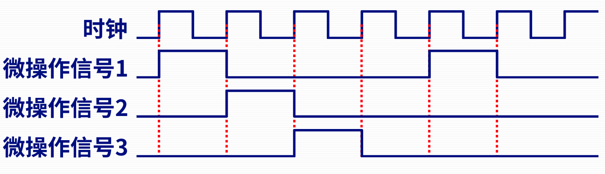
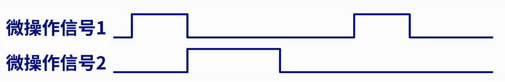
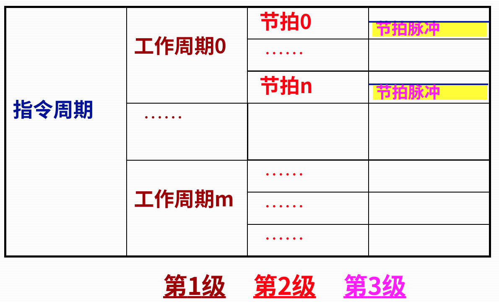
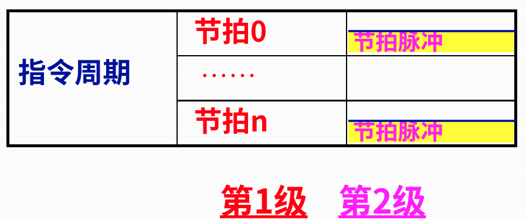

# 第二节 时序控制方式与时序系统

由于计算机极高速工作（1s几百万次操作），因此执行每个动作的时间非常严格，  
稍有偏差就可能导致处理器错误（本来要在第1ns的任务延迟到了第2ns执行，使得其他任务无法执行）。

时序系统是控制器的心脏，其功能是为指令提供各种**定时信号**。

## 一、时序控制方式

* 同步控制方式
* 异步控制方式
* 准同步控制方式

### 1. 同步控制方式

所有微操作都由固定的、统一的时序进行控制。  
存在主时钟作为基准。

*相当于白天上课，都由铃声统一控制。*

特点：

* 控制方式简单
* 容易实现
* 存在时间浪费  
  所有微操作都要等待最慢的那个做完。

### 2. 异步控制方式

各微操作按其需要选择不同的时间间隔，不受统一的时间的约束；  
各微操作之间的衔接与各部件之间的信息交换采用应答方式。  

特点：

* 没有时间上的浪费，提高了机器的效率
* 但是控制比较复杂

### 3. 准同步控制方式

异步控制方式的同步化。

### 4. 联合控制方式

同步控制和异步控制相结合的方式。

## 二、同步控制方式下的多级时序系统

> 定义 - 指令周期：
>
> 从取指到一条指令执行结束所需的时间。

在同步控制方式下，常将时序关系把指令周期划分为几个层次，称为多级时序。

最常见的是二级时序和三级时序。

### 1. 三级时序

  

* CPU工作周期  
  对应于指令执行的某个阶段（如取指、取操等）,
  通常伴随着一次总线操作（访内）。
* 节拍  
  完成CPU内部一些最基本操作所需的时间。​  
  比如寄存器之间的数据传送等。
* 节拍脉冲  
  通常作为触发器（寄存器）的**打入脉冲**，​
  **与节拍相配合**完成一次数据传送（相当于上面说的铃声）。

### 2. 二级时序

常用在微程序控制器中。

## 三、工作周期与节拍的信号生成

### 1. CPU工作周期信号发生器

### 2. 节拍信号发生器
