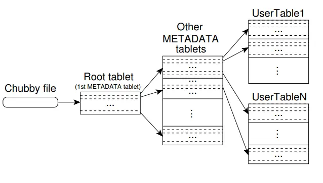

# 复习

## 目录
<!-- TOC -->

- [复习](#%E5%A4%8D%E4%B9%A0)
    - [目录](#%E7%9B%AE%E5%BD%95)
    - [一、概述](#%E4%B8%80%E6%A6%82%E8%BF%B0)
        - [云计算定义](#%E4%BA%91%E8%AE%A1%E7%AE%97%E5%AE%9A%E4%B9%89)
        - [云计算特点](#%E4%BA%91%E8%AE%A1%E7%AE%97%E7%89%B9%E7%82%B9)
        - [云计算体系架构](#%E4%BA%91%E8%AE%A1%E7%AE%97%E4%BD%93%E7%B3%BB%E6%9E%B6%E6%9E%84)
        - [云计算服务类型](#%E4%BA%91%E8%AE%A1%E7%AE%97%E6%9C%8D%E5%8A%A1%E7%B1%BB%E5%9E%8B)
        - [云计算优势](#%E4%BA%91%E8%AE%A1%E7%AE%97%E4%BC%98%E5%8A%BF)
        - [多租户概念](#%E5%A4%9A%E7%A7%9F%E6%88%B7%E6%A6%82%E5%BF%B5)
        - [多租户问题（租户隔离）](#%E5%A4%9A%E7%A7%9F%E6%88%B7%E9%97%AE%E9%A2%98%E7%A7%9F%E6%88%B7%E9%9A%94%E7%A6%BB)
        - [云部署模式 - 公有云、私有云、混合云](#%E4%BA%91%E9%83%A8%E7%BD%B2%E6%A8%A1%E5%BC%8F---%E5%85%AC%E6%9C%89%E4%BA%91%E7%A7%81%E6%9C%89%E4%BA%91%E6%B7%B7%E5%90%88%E4%BA%91)
        - [商⽤云平台](#%E5%95%86%E2%BD%A4%E4%BA%91%E5%B9%B3%E5%8F%B0)
        - [开放云平台](#%E5%BC%80%E6%94%BE%E4%BA%91%E5%B9%B3%E5%8F%B0)
        - [云计算相关技术](#%E4%BA%91%E8%AE%A1%E7%AE%97%E7%9B%B8%E5%85%B3%E6%8A%80%E6%9C%AF)
    - [二、虚拟化技术](#%E4%BA%8C%E8%99%9A%E6%8B%9F%E5%8C%96%E6%8A%80%E6%9C%AF)
        - [虚拟机技术介绍](#%E8%99%9A%E6%8B%9F%E6%9C%BA%E6%8A%80%E6%9C%AF%E4%BB%8B%E7%BB%8D)
        - [虚拟化架构层次 - 寄居虚拟化、裸机虚拟化](#%E8%99%9A%E6%8B%9F%E5%8C%96%E6%9E%B6%E6%9E%84%E5%B1%82%E6%AC%A1---%E5%AF%84%E5%B1%85%E8%99%9A%E6%8B%9F%E5%8C%96%E8%A3%B8%E6%9C%BA%E8%99%9A%E6%8B%9F%E5%8C%96)
        - [系统虚拟化](#%E7%B3%BB%E7%BB%9F%E8%99%9A%E6%8B%9F%E5%8C%96)
        - [CPU 虚拟化技术方式 - 全虚拟化、半虚拟化、硬件辅助虚拟化](#cpu-%E8%99%9A%E6%8B%9F%E5%8C%96%E6%8A%80%E6%9C%AF%E6%96%B9%E5%BC%8F---%E5%85%A8%E8%99%9A%E6%8B%9F%E5%8C%96%E5%8D%8A%E8%99%9A%E6%8B%9F%E5%8C%96%E7%A1%AC%E4%BB%B6%E8%BE%85%E5%8A%A9%E8%99%9A%E6%8B%9F%E5%8C%96)
        - [CPU 虚拟化的概念](#cpu-%E8%99%9A%E6%8B%9F%E5%8C%96%E7%9A%84%E6%A6%82%E5%BF%B5)
        - [内存虚拟化的概念](#%E5%86%85%E5%AD%98%E8%99%9A%E6%8B%9F%E5%8C%96%E7%9A%84%E6%A6%82%E5%BF%B5)
        - [I/O 虚拟化的概念](#io-%E8%99%9A%E6%8B%9F%E5%8C%96%E7%9A%84%E6%A6%82%E5%BF%B5)
        - [虚拟机迁移 - 内存、⽹络、存储资源](#%E8%99%9A%E6%8B%9F%E6%9C%BA%E8%BF%81%E7%A7%BB---%E5%86%85%E5%AD%98%E2%BD%B9%E7%BB%9C%E5%AD%98%E5%82%A8%E8%B5%84%E6%BA%90)
        - [虚拟机隔离](#%E8%99%9A%E6%8B%9F%E6%9C%BA%E9%9A%94%E7%A6%BB)
    - [三、 Openstack 的基本概念](#%E4%B8%89-openstack-%E7%9A%84%E5%9F%BA%E6%9C%AC%E6%A6%82%E5%BF%B5)
    - [四、分布式⽂件系统 - ⾕歌⽂件系统 GFS](#%E5%9B%9B%E5%88%86%E5%B8%83%E5%BC%8F%E2%BD%82%E4%BB%B6%E7%B3%BB%E7%BB%9F---%E2%BE%95%E6%AD%8C%E2%BD%82%E4%BB%B6%E7%B3%BB%E7%BB%9F-gfs)
        - [GFS 的设计动机、假设条件](#gfs-%E7%9A%84%E8%AE%BE%E8%AE%A1%E5%8A%A8%E6%9C%BA%E5%81%87%E8%AE%BE%E6%9D%A1%E4%BB%B6)
        - [GFS 的接⼝及操作](#gfs-%E7%9A%84%E6%8E%A5%E2%BC%9D%E5%8F%8A%E6%93%8D%E4%BD%9C)
        - [GFS的基本架构](#gfs%E7%9A%84%E5%9F%BA%E6%9C%AC%E6%9E%B6%E6%9E%84)
    - [五、分布式⽂件系统 - ⼩⽂件系统 Haystack](#%E4%BA%94%E5%88%86%E5%B8%83%E5%BC%8F%E2%BD%82%E4%BB%B6%E7%B3%BB%E7%BB%9F---%E2%BC%A9%E2%BD%82%E4%BB%B6%E7%B3%BB%E7%BB%9F-haystack)
        - [Haystack 的设计背景](#haystack-%E7%9A%84%E8%AE%BE%E8%AE%A1%E8%83%8C%E6%99%AF)
        - [Haystack Directory 的功能](#haystack-directory-%E7%9A%84%E5%8A%9F%E8%83%BD)
        - [Haystack Cache 的功能](#haystack-cache-%E7%9A%84%E5%8A%9F%E8%83%BD)
        - [Haystack Store 的功能](#haystack-store-%E7%9A%84%E5%8A%9F%E8%83%BD)
        - [Needle 的结构、 Index File 的结构](#needle-%E7%9A%84%E7%BB%93%E6%9E%84-index-file-%E7%9A%84%E7%BB%93%E6%9E%84)
    - [六、并⾏编程模型 - MapReduce](#%E5%85%AD%E5%B9%B6%E2%BE%8F%E7%BC%96%E7%A8%8B%E6%A8%A1%E5%9E%8B---mapreduce)
        - [背景知识](#%E8%83%8C%E6%99%AF%E7%9F%A5%E8%AF%86)
        - [Map 和 Reduce 的基本概念](#map-%E5%92%8C-reduce-%E7%9A%84%E5%9F%BA%E6%9C%AC%E6%A6%82%E5%BF%B5)
        - [MapReduce 的例⼦](#mapreduce-%E7%9A%84%E4%BE%8B%E2%BC%A6)
        - [MapReduce 实现的基本流程](#mapreduce-%E5%AE%9E%E7%8E%B0%E7%9A%84%E5%9F%BA%E6%9C%AC%E6%B5%81%E7%A8%8B)
        - [容错机制](#%E5%AE%B9%E9%94%99%E6%9C%BA%E5%88%B6)
        - [任务粒度](#%E4%BB%BB%E5%8A%A1%E7%B2%92%E5%BA%A6)
        - [备份任务](#%E5%A4%87%E4%BB%BD%E4%BB%BB%E5%8A%A1)
    - [七、并⾏编程模型 - Spark](#%E4%B8%83%E5%B9%B6%E2%BE%8F%E7%BC%96%E7%A8%8B%E6%A8%A1%E5%9E%8B---spark)
        - [Spark 的设计动机](#spark-%E7%9A%84%E8%AE%BE%E8%AE%A1%E5%8A%A8%E6%9C%BA)
        - [RDD 的基本概念、并⾏操作、共享变量](#rdd-%E7%9A%84%E5%9F%BA%E6%9C%AC%E6%A6%82%E5%BF%B5%E5%B9%B6%E2%BE%8F%E6%93%8D%E4%BD%9C%E5%85%B1%E4%BA%AB%E5%8F%98%E9%87%8F)
        - [容错机制](#%E5%AE%B9%E9%94%99%E6%9C%BA%E5%88%B6)
        - [示例 - Log mining](#%E7%A4%BA%E4%BE%8B---log-mining)
        - [示例 - Logistic regression](#%E7%A4%BA%E4%BE%8B---logistic-regression)
    - [八、分布式⼀致性算法 - Paxos](#%E5%85%AB%E5%88%86%E5%B8%83%E5%BC%8F%E2%BC%80%E8%87%B4%E6%80%A7%E7%AE%97%E6%B3%95---paxos)
        - [相关概念](#%E7%9B%B8%E5%85%B3%E6%A6%82%E5%BF%B5)
        - [算法描述 - 阶段1、阶段2](#%E7%AE%97%E6%B3%95%E6%8F%8F%E8%BF%B0---%E9%98%B6%E6%AE%B51%E9%98%B6%E6%AE%B52)
        - [示例](#%E7%A4%BA%E4%BE%8B)
    - [九、分布式锁服务 - Chubby](#%E4%B9%9D%E5%88%86%E5%B8%83%E5%BC%8F%E9%94%81%E6%9C%8D%E5%8A%A1---chubby)
        - [Chubby cell 的概念](#chubby-cell-%E7%9A%84%E6%A6%82%E5%BF%B5)
        - [缓存机制](#%E7%BC%93%E5%AD%98%E6%9C%BA%E5%88%B6)
        - [会话机制](#%E4%BC%9A%E8%AF%9D%E6%9C%BA%E5%88%B6)
        - [Fail-over机制](#fail-over%E6%9C%BA%E5%88%B6)
    - [十、分布式存储系统 - Bigtable](#%E5%8D%81%E5%88%86%E5%B8%83%E5%BC%8F%E5%AD%98%E5%82%A8%E7%B3%BB%E7%BB%9F---bigtable)
        - [数据模型](#%E6%95%B0%E6%8D%AE%E6%A8%A1%E5%9E%8B)
        - [SSTable的概念及结构](#sstable%E7%9A%84%E6%A6%82%E5%BF%B5%E5%8F%8A%E7%BB%93%E6%9E%84)
        - [Chubby 和 Bigtable 的联系](#chubby-%E5%92%8C-bigtable-%E7%9A%84%E8%81%94%E7%B3%BB)
        - [Tablet的位置信息（三层层次结构）](#tablet%E7%9A%84%E4%BD%8D%E7%BD%AE%E4%BF%A1%E6%81%AF%E4%B8%89%E5%B1%82%E5%B1%82%E6%AC%A1%E7%BB%93%E6%9E%84)
        - [Tablet的分配](#tablet%E7%9A%84%E5%88%86%E9%85%8D)
        - [Tablet的服务 - 读、写、恢复](#tablet%E7%9A%84%E6%9C%8D%E5%8A%A1---%E8%AF%BB%E5%86%99%E6%81%A2%E5%A4%8D)
        - [Compaction压缩 / 合并的三种类型及概念](#compaction%E5%8E%8B%E7%BC%A9--%E5%90%88%E5%B9%B6%E7%9A%84%E4%B8%89%E7%A7%8D%E7%B1%BB%E5%9E%8B%E5%8F%8A%E6%A6%82%E5%BF%B5)
    - [十一、⼤规模图计算模型 - Pregel](#%E5%8D%81%E4%B8%80%E2%BC%A4%E8%A7%84%E6%A8%A1%E5%9B%BE%E8%AE%A1%E7%AE%97%E6%A8%A1%E5%9E%8B---pregel)
        - [计算模型的基本概念 - 输⼊、输出、超级步、停⽌条件](#%E8%AE%A1%E7%AE%97%E6%A8%A1%E5%9E%8B%E7%9A%84%E5%9F%BA%E6%9C%AC%E6%A6%82%E5%BF%B5---%E8%BE%93%E2%BC%8A%E8%BE%93%E5%87%BA%E8%B6%85%E7%BA%A7%E6%AD%A5%E5%81%9C%E2%BD%8C%E6%9D%A1%E4%BB%B6)
        - [示例 1 - Maximum value](#%E7%A4%BA%E4%BE%8B-1---maximum-value)
        - [示例 2 - SSSP](#%E7%A4%BA%E4%BE%8B-2---sssp)
        - [理解 MapReduce 和 Pregel 的不同](#%E7%90%86%E8%A7%A3-mapreduce-%E5%92%8C-pregel-%E7%9A%84%E4%B8%8D%E5%90%8C)
        - [Combiner 函数](#combiner-%E5%87%BD%E6%95%B0)
        - [Pregel 的实现流程](#pregel-%E7%9A%84%E5%AE%9E%E7%8E%B0%E6%B5%81%E7%A8%8B)
        - [容错机制 - 局部恢复](#%E5%AE%B9%E9%94%99%E6%9C%BA%E5%88%B6---%E5%B1%80%E9%83%A8%E6%81%A2%E5%A4%8D)
        - [worker、master、aggregator的实现](#workermasteraggregator%E7%9A%84%E5%AE%9E%E7%8E%B0)
        - [PageRank 算法实现](#pagerank-%E7%AE%97%E6%B3%95%E5%AE%9E%E7%8E%B0)
        - [二部图Bipartite算法实现](#%E4%BA%8C%E9%83%A8%E5%9B%BEbipartite%E7%AE%97%E6%B3%95%E5%AE%9E%E7%8E%B0)
    - [十二、⼤规模图计算模型 - Graphlab](#%E5%8D%81%E4%BA%8C%E2%BC%A4%E8%A7%84%E6%A8%A1%E5%9B%BE%E8%AE%A1%E7%AE%97%E6%A8%A1%E5%9E%8B---graphlab)
        - [基于图的数据表示](#%E5%9F%BA%E4%BA%8E%E5%9B%BE%E7%9A%84%E6%95%B0%E6%8D%AE%E8%A1%A8%E7%A4%BA)
        - [更新函数 - Update Function](#%E6%9B%B4%E6%96%B0%E5%87%BD%E6%95%B0---update-function)
        - [调度器 - Scheduler](#%E8%B0%83%E5%BA%A6%E5%99%A8---scheduler)
        - [⼀致性模型](#%E2%BC%80%E8%87%B4%E6%80%A7%E6%A8%A1%E5%9E%8B)
        - [Label Propagation 算法的实现](#label-propagation-%E7%AE%97%E6%B3%95%E7%9A%84%E5%AE%9E%E7%8E%B0)
    - [十三、实际⼯程问题](#%E5%8D%81%E4%B8%89%E5%AE%9E%E9%99%85%E2%BC%AF%E7%A8%8B%E9%97%AE%E9%A2%98)
        - [基本解决⽅案](#%E5%9F%BA%E6%9C%AC%E8%A7%A3%E5%86%B3%E2%BD%85%E6%A1%88)
        - [从技术⻆度对⽅案进⾏分析](#%E4%BB%8E%E6%8A%80%E6%9C%AF%E2%BB%86%E5%BA%A6%E5%AF%B9%E2%BD%85%E6%A1%88%E8%BF%9B%E2%BE%8F%E5%88%86%E6%9E%90)
        - [从⾮技术⻆度对⽅案进⾏分析](#%E4%BB%8E%E2%BE%AE%E6%8A%80%E6%9C%AF%E2%BB%86%E5%BA%A6%E5%AF%B9%E2%BD%85%E6%A1%88%E8%BF%9B%E2%BE%8F%E5%88%86%E6%9E%90)

<!-- /TOC -->

## 一、概述

### 1. 云计算定义

1. 云计算是一种商业计算模型。它将计算任务分布在大量计算机构成的资源池上，使各种应用系统能够根据需要获取计算力、存储空间和信息服务。
2. 云计算是分布式计算 (Distributed Computing)、并行计算 (Parallel Computing)、效用计算 (Utility Computing)、网络存储 (Network Storage Technologies)、虚拟化 (Virtualization)、负载均衡 (Load Balance)、热备份冗余 (High Available)等传统计算机和网络技术发展融合的产物。
3. 云计算是通过网络按需提供可动态伸缩的廉价计算服务。
4. 云计算是一种按使用量付费的模式，这种模式提供可用的、便捷的、按需的网络访问，进入可配置的计算资源共享池（资源包括网络、服务器、存储、应用软件、服务），这些资源能够被快速提供，只需投入很少的管理工作，或与服务供应商进行很少的交互。

### 2. 云计算特点

1. 超大规模
2. 虚拟化
3. 高可靠性
4. 通用性
5. 高可伸缩性
6. 按需服务
7. 极其廉价

### 3. 云计算体系架构

1. **SOA 构建层**: 封装云计算能力成标准的 Web Services 服务，并纳入到 SOA 体系
2. **管理中间件层**: 云计算的资源管理，并对众多应用任务进行调度，使资源能够高效、安全地为应用提供服务
3. **资源池层**: 将大量相同类型的资源构成同构或接近同构的资源池
4. **物理资源层**: 计算机、存储器、网络设施、数据库和软件等

**管理中间件层**和**资源池层**是云计算技术的最关键部分， SOA 构建层的功能更多依靠外部设施提供。

### 4. 云计算服务类型

1. **IaaS** (Infrastructure as a Service, 基础设施即服务)
   * 定义: 服务提供商将多台服务器组成的“云端”服务（包括内存、 I/O 设备、存储和计算能力等等）作为计量服务提供给用户。
   * 特点:
     * 消除资金投入并降低后续费用
     * 改进业务连续性和灾难恢复
     * 快速创新
     * 专注于核心业务
     * 增强稳定性、可靠性和可支持性
     * 更安全
   * 示例: Amazon EC2 、 Eucalyptus 等
2. **PaaS** (Platform as a Service, 平台即服务)
   * 定义: 将服务器平台或者开发环境作为服务进行提供。开发简单、部署简单、维护简单。
   * 特点:
     * 减少编码时间
     * 无需增员便可提高开发能力
     * 使用经济实惠的先进工具
     * 支持地理位置分散的开发团队
     * 有效管理应用程序生命周期
   * 示例: Google App Engine 、 Microsoft Azure 、 Force.com 、Heroku 、 Engine Yard 等
3. **SaaS** (Software as a Service, 软件即服务)
   * 定义: 是一种通过Internet提供软件的模式，用户无需购买软件，而是向提供商租用基于Web的软件。
   * 特点:
     * 可以使用先进的应用程序
     * 只为自己使用的东西付费
     * 免客户端软件使用
     * 轻松增强员工移动性
     * 从任何位置访问应用数据
   * 示例: Citrix 公司的 GoToMeeting 、 Cisco 公司的 WebEx 等
4. **CaaS** (Container as a Service, 容器即服务)
   * 定义: 是以容器为资源分割和调度的基本单位，封装整个软件运行时环境，为开发者和系统管理员提供用于构建、发布和运行分布式应用的平台。

**IaaS、PaaS、SaaS 三者对比**：

| 云交付模型 | 服务对象             | 使用方式                       | 关键技术                      | 用户的控制等级 | 系统实例                                  |
| ---------- | ------------------------ | ---------------------------------- | --------------------------------- | -------------- | --------------------------------------------- |
| IaaS       | 需要硬件资源的用户 | 使用者上传数据、程序代码、环境配置 | 虚拟化技术、分布式海量数据存储等 | 使用和配置 | Amazon EC2、Eucalyptus 等                   |
| PaaS       | 程序开发者          | 使用者上传数据、程序代码 | 云平台技术、数据管理技术等 | 有限的管理 | Google App Engine、Microsoft Azure、Hadoop 等 |
| SaaS       | 企业和需要软件应用的用户 | 使用者上传数据              | Web服务技术、互联网应用开发技术等 | 完全的管理 | Google Apps、Salesforce CRM 等               |

### 5. 云计算优势

1. 能提供弹性的服务，在超大资源池中动态分配和释放资源
2. 云计算平台的规模极大，比较容易平稳整体负载
3. 资源利用率达到 80% 左右，是传统模式 5~7 倍
4. 降低硬件和系统采购成本、电力成本和管理成本

**拓展 - 数据中心定义**：

* 数据中心是一整套复杂的设施。它不仅仅包括计算机系统和其它与之配套的设备(例如通信和存储系统),还包含几余的数据通信连接、环境控制设备、监控设备以及各种安全装置，
* 数据中心是多功能的建筑物，能容纳多个服务器以及通信设备。这些设备被放置在起是因为它们具有相同的对环境的要求以及物理安全上的需求并且这样放置便于维护，而并不仅仅是一些服务器的集合。

### 6. 多租户概念

* 概念起源: “多租户”的概念最早起源于软件领域，指**一个软件实例服务于多个用户的架构，每个用户称为一个租户**。
* **多租户应用**: 多个租户共享硬件资源，硬件资源提供一个共享的应用和数据库实例。每个租户认为自己独占资源，因为实例提供高度的定制以满足租户所需。
* **云计算中的多租户**: “多租户”也是“云计算”的基本属性之一。云计算的三种服务层次 —— SaaS 、 PaaS 和 IaaS 均体现了对“多租户”不同的支持。
  | 服务层次 | 出租的资源                                                              | 举例说明                                                                |
  | -------- | ---------------------------------------------------------------------------- | --------------------------------------------------------------------------- |
  | SaaS     | 软件的使用权                                                           | 电子邮件系统: 用户（租户）拥有使用账号，租户登录使用系统。 |
  | PaaS     | 软件开发平台资源（如开发支撑系列工具，应用存储空间，运行容器，平台服务等等） | 某租户拥有1G应用存储空间，应用容器（数量不限，总内存上限4G），2个缓存服务。 |
  | IaaS     | 硬件基础设施（如CPU、内存，存储，IP，网络设备等等）   | 某租户拥有2颗CPU，8G内存，80G硬盘，10IP，2负载均衡器，创建主机数量不限。 |

### 7. 多租户问题（租户隔离）

随着“多租户”在应用架构中**实现层次的增高**，租户间**共享资源也越来越多**。  
租户间**共享资源越来越多**，**资源利用率越来也高**，**单位资源成本越来越低**，租户间的**隔离性越来越差**。

**导致**：

1. 租户间**隔离性降低**: 会导致许多问题，如数据安全性降低，
2. 租户间**性能、异常相互影响**

这些问题是应用为保证对租户的服务质量而必须解决的。这类行为业内称为**租户隔离**。  
显然，租户间**共享资源越多的架构**，**租户隔离难度越大，成本越高**；租户隔离难度越大，应用开发难度，测试与维护成本都会上升。  
理论上，在**单位资源成本和租户隔离成本取最佳平衡点**，就能找到最合理的架构。

### 8. 云部署模式 - 公有云、私有云、混合云

1. **公有云**
   * 定义: 指为外部客户提供服务的云，它所有的服务是供别人使用，而不是自己用。在此种模式下，应用程序、资源、存储和其他服务，都由云服务供应商提供给用户，这些服务多半是免费的，也有部分按需按使用量来付费，这种模式只能使用互联网访问和使用。
   * 特点:
     * 安全性
     * 可用性
2. **私有云**
   * 定义: 是指企业自己使用的云，它所有的服务不是供别人使用，而是供自己内部人员或分支机构使用。
   * 特点:
     * 优点: 安全性、可用性相比公有云好一些
     * 缺点: 成本较大
3. **混合云**
   * 定义: 是指供自己和客户共同使用的云，它所提供的服务既可以供别人使用，也可以供自己使用。混合云是两种或两种以上的云计算模式的混合体，如公有云和私有云混合。
   * 特点:
     * 相比较而言，混合云的部署方式对提供者的要求较高

### 9. 商⽤云平台

1. **amazon**: 亚马逊的云计算称为 Amazon Web Services (AWS)
   * 组成:
     1. Amazon Elastic Compute Cloud (Amazon EC2)
        * Amazon EC2是一种Web 服务，可以在云中提供安全并且可调整大小的计算容量
        * 主要包括了Amazon机器映象、实例存储模块等组成部分
        * 能与S3等其他Amazon云计算服务结合用
     2. Amazon Simple Storage Service (Amazon S3)
        * Amazon S3是一种对象存储服务，提供行业领先的可扩展性、数据可用性、安全性和性能
        * 各种规模和行业的客户都可以使用它来存储和保护各种用例（如网站、移动应用程序、备份和还原、存档、企业应用程序、 IoT 设备和大数据分析）的任意
     3. Amazon 分布式架构 Dynamo
        * 底层存储架构Dynamo 采用了无中心的模式
        * Dynamo 支持简单键/值 (key / value) 方式的数据存储，不支持复杂的查询
        * Dynamo 中存储的是数据值原始形式即按位存储，并不解析数据的具体内容数量的数据
2. **Google**: 谷歌是最大的云计算技术的使用者  
   * 特点:
     * 应用向互联网迁移
     * 数据向互联网迁移
     * 计算能力向互联网迁移
     * 存储空间向互联网迁移
   * 组成:
     1. 文件系统 - GFS
     2. 分布式数据处理 - MapReduce
     3. 分布式结构化数据表 - Bigtable
     4. 分布式锁服务 - Chubby
     5. 分布式存储系统 - Megastore
     6. 大规模分布式系统监控架构 - Dapper
     7. 海量数据的交互式分析工具 - Dremel
     8. 内存大数据分析系统 - PowerDrill
     9. Google 应用程序引擎
3. **Microsoft**: 微软紧跟云计算步伐，推出了 Windows Azure 操作系统
4. BigCloud: 中国移动
5. 阿里云
6. 腾讯云
7. 华为云
8. 百度云
9. 京东云

### 10. 开放云平台

1. Hadoop: Google 云计算的开源实现
2. OpenStack: 云平台管理的项目， NASA 和 Rackspace 合作研发
3. Eucalyptus: Amazon 云计算的开源实现
4. Cassandra: 结合了 Dynamo 的分布技术和 Google 的 BigTable 数据模型，是高度可扩展、最终一致、分布式的结构化键值存储系统。
5. Enomaly ECP: 提供类似于 EC2 的云计算框架
6. Nimbus: 基于网格中间件 Globus ，提供与 EC2 类似的功能和接口
7. Abiquo: 以快速、简单和可扩展的方式创建和管理大型、复杂的 IT 基础设施

### 11. 云计算相关技术

1. **分布式计算**: 分布式计算是计算机科学的一个领域，研究分布式系统。分布式系统是一种其组件位于不同网络计算机上的系统，这些组件通过传递消息进行通信和协调它们的行动。这些组件相互交互以实现共同的目标。分布式系统的三个显著特征包括：组件的并发性、缺乏全局时钟以及组件的独立故障。分布式系统的例子涵盖了基于服务导向架构的系统、大规模多人在线游戏以及点对点应用。
2. **并行计算**: 并行计算是一种计算类型，其中许多计算或进程的执行同时进行。通常可以将大问题分解为较小的部分，然后可以同时解决这些部分。并行计算有几种不同形式：位级、指令级、数据和任务并行。
3. **雾计算**: 在该模式中数据、（数据）处理和应用程序集中在网络边缘的设备中，而不是几乎全部保存在云中，是云计算（Cloud Computing）的延伸概念，由思科（Cisco）提出的。这个因“云”而“雾”的命名源自“雾是更贴近地面的云”这一名句。
4. **边缘计算**: 指在靠近物或数据源头的一侧，采用网络、计算、存储、应用核心能力为一体的开放平台，就近提供最近端服务。其应用程序在边缘侧发起，产生更快的网络服务响应，满足行业在实时业务、应用智能、安全与隐私保护等方面的基本需求。边缘计算处于物理实体和工业连接之间，或处于物理实体的顶端。

## 二、虚拟化技术

### 1. 虚拟机技术介绍

随着云计算的发展，传统的数据中心逐渐过渡到虚拟化数据中心，即采用虚拟化技术**将原来数据中心的物理资源进行抽象整合**。

**特点**：

* 实现资源的动态分配和调度，提高现有资源的利用率和服务可靠性
* 提供自动化的服务开通能力，降低运维成本
* 具有有效的安全机制和可靠性机制，满足公众客户和企业客户的安全需求
* 方便系统升级、迁移和改造

**数据中心虚拟化技术**：

* 服务器虚拟化: 将一个或多个物理服务器虚拟成多个逻辑上的服务器
* 存储虚拟化: 把分布的异构存储设备统一为一个或几个大的存储池
* 网络虚拟化: 在底层物理网络和网络用户之间增加一个抽象层

**应用**：

* 把**一个物理的服务器**虚拟成**若干个独立的逻辑服务器**，比如分区
* 把**若干分散的物理服务器**虚拟为**一个大的逻辑服务器**，比如网格技术

**好处**：

1. 封装性：以虚拟机为粒度封装,，故支持虚拟机快照、虚拟机克隆、虚拟机挂起
2. 支持多实例
3. 隔离，保障系统安全
4. 硬件无关性，能实时迁移
5. 具有特权功能，使虚拟机有更高权限，同时能进行入侵检测

### 2. 虚拟化架构层次 - 寄居虚拟化、裸机虚拟化

1. 寄居虚拟化  
   
   * 寄居虚拟化的虚拟化层一般称为虚拟机监控器 (VMM)
   * 这类虚拟化架构系统损耗比较大
   * 就操作系统层的虚拟化而言，没有独立的 Hypervisor 层
   * 如果使用操作系统层虚拟化，所有虚拟服务器必须运行同一操作系统
2. 裸机虚拟化  
   
   * 架构中的 VMM 也可以认为是一个操作系统，一般称为 Hypervisor
   * Hypervisor 实现从虚拟资源到物理资源的映射
   * Hypervisor 实现了不同虚拟机的运行上下文保护与切换，保证了各个客户虚拟系统的有效隔离

**对于各个抽象层的虚拟化**：


1. 硬件抽象层上的虚拟化: 宿主机和客户机的ISA相同；虚拟化的指令由虚拟化软件处理
2. 操作系统层上的虚拟化: 提供多个互相隔离的用户态实例；客户机操作系统相同，开销小
3. 库函数层上的虚拟化: 隐藏操作系统内部的细节，编程简单；应用程序不需要修改，在不同操作系统上运行
4. 编程语言层上的虚拟化（进程级虚拟化）: 代码由虚拟机运行时，翻译成机器语言再执行

### 3. 系统虚拟化


* 定义: 将一台物理计算机系统虚拟化成一台或多台虚拟计算机系统，虚拟化层为 VMM
* 特征:
  * **同质**: 虚拟机和物理机的运行环境相同，表现上有所差异
  * **高效**: 虚拟机运行的软件要有接近物理机上直接运行的性能
  * **资源受控**: VMM对系统资源要有完全控制和管理的能力

### 4. CPU 虚拟化技术方式 - 全虚拟化、半虚拟化、硬件辅助虚拟化

1. 全虚拟化
   * 实现方式: 客户操作系统运行在 Ring 1 级，VMM 运行在 Ring 0 级。对于不能虚拟化的特权指令，通过二进制转换方式转换为同等效果的指令序列运行；而对于用户级指令，则可直接运行。
   * 特点:
     * 不需要修改操作系统，虚拟机具有较好的隔离性和安全性
     * 具有很好的兼容性，在服务器虚拟化中得到广泛应用
     * 性能损耗非常大
2. 半虚拟化
   * 实现方式: 修改操作系统内核，将不能虚拟化的指令替换为 Hypercall ， Hypercall 直接与虚拟层通信。
   * 特点:
     * 显著减少了虚拟化开销，性能较高
     * 由于需要修改操作系统内核，对于非开放的操作系统，如 Windows 2000/XP ，则无法支持。
3. 硬件辅助虚拟化
   * 实现方式: CPU 厂商硬件支持虚拟化，如 Intel-VT 技术，使 CPU 在 Ring 0 级之下还提供了一个 Root Mode ， VMM 运行在 Root Mode 下。特权指令自动被 VMM 捕获，不需要进行二进制转换或调用 Hypercall 。
   * 特点：
     * 效率较高，且无需修改操作系统

### 5. CPU 虚拟化的概念

在客户操作系统中，将若干物理 CPU 抽象为虚拟 CPU 。

* 虚拟 CPU 的正确运行是要**保证虚拟机指令正确运行**，现有的实现技术包括模拟执行和监控执行
* 调度问题是指 VMM 决定**当前哪个虚拟 CPU 在物理 CPU 上运行**，要保证隔离性、公平性和性能

### 6. 内存虚拟化的概念

内存虚拟化技术把**物理内存统一管理，包装成多个虚拟的物理内存**提供给若干虚拟机使用，每个虚拟机拥有各自独立的内存空间。

**管理包括三种地址**：

1. 机器地址
2. 物理地址
3. 虚拟地址

**对于客户机物理地址空间的管理**：

* 客户机: 采用客户页表维护虚拟地址到客户机物理地址的动态映射
* VMM: 负责维护客户机物理地址到宿主物理地址的动态映射

### 7. I/O 虚拟化的概念

I/O 设备虚拟化技术把**真实的设备统一管理起来，包装成多个虚拟设备**给若干个虚拟机使用，响应每个虚拟机的设备访问请求和 I/O 请求。  
I/O 设备虚拟化同样是由 VMM 进行管理。

**技术**：

1. 全虚拟化
2. 半虚拟化
3. I/O 直通或透传技术

### 8. 虚拟机迁移 - 内存、⽹络、存储资源

**定义**：

虚拟机迁移是将**虚拟机实例从源宿主机迁移到目标宿主机**，并且**在目标宿主机上能够将虚拟机运行状态恢复到其在迁移之前相同的状态**，以便能够继续完成应用程序的任务。

**分类**：

  1. 物理机到虚拟机的迁移
  2. 虚拟机到虚拟机的迁移
  3. 虚拟机到物理机的迁移

**实时迁移技术**：

* 定义: 保持虚拟机运行的同时，把它从一个计算机迁移到另一个计算机，并在目的计算机恢复运行的技术
* 用途:
  1. 云计算中心的物理服务器负载经常处于动态变化中，当一台物理服务器负载过大时，若此刻不可能提供额外的物理服务器，管理员可以将其上面的虚拟机迁移到其他服务器，达到负载平衡
  2. 云计算中心的物理服务器有时候需要定期进行升级维护，当升级维护服务器时，管理员可以将其上面的虚拟机迁移到其他服务器，等升级维护完成之后，再把虚拟机迁移回来

**步骤**：

1. 预迁移
2. 预定资源
3. 预复制
4. 停机复制
5. 提交
6. 启动

**内存迁移**：

内存的迁移是虚拟机迁移最困难的部分。  
具体分为三个阶段：

1. Push 阶段
2. Stop-and-Copy 阶段
3. Pull 阶段

实际上，迁移内存没有必要同时包含上述三个阶段，目前大部分的迁移策略只包含其中的一个或者两个阶段。  
即实际上的方案：

| 迁移方案                   | 优势                               | 劣势                                                                                     |
| ------------------------------ | ------------------------------------ | ------------------------------------------------------------------------------------------ |
| Stop-and-Copy                  | 方法比较简单；总迁移时间也最短 | 停机时间无法接受                                                                   |
| Stop-and-Copy 和 Pull 阶段结合 | 停机时间很短                   | 总迁移时间很长； Pull 阶段复制造成的性能下降                            |
| Push 和 Stop-and-Copy 阶段结合 | 平衡了停机时间和总迁移时间之间的矛盾 | 需要有一种算法能够测定工作集，以避免反复重传；可能会占用大量的网络带宽，对其他服务造成影响 |

**网络资源迁移**：

虚拟机这种系统级别的封装方式意味着**迁移时 VM 的所有网络设备，包括协议状态（如 TCP 连接状态）以及 IP 地址都要随之一起迁移**。
在**局域网**内，可以通过发送 ARP 重定向包，将 VM 的 IP 地址与目的机器的 MAC 地址相绑定，之后的所有包就可以发送到目的机器上。

**存储资源迁移**：

迁移存储设备的最大障碍在于需要占用大量时间和网络带宽，通常的**解决办法是以共享的方式共享数据和文件系统**，而非真正迁移。

目前大多数集群使用 NAS (Network Attached Storage, 网络连接存储) 作为存储设备共享数据。  
NAS 实际上是一个带有瘦服务器的存储设备，其作用类似于一个专用的文件服务器。  
在局域网环境下， NAS 已经完全可以实现异构平台之间，如 NT 、 UNIX 等的数据级共享。

基于以上的考虑，Xen 并没有实现存储设备的迁移，实时迁移的对象必须共享文件系统。

### 9. 虚拟机隔离

* 定义: 虚拟机隔离是指虚拟机之间在没有授权许可的情况下，互相之间不可通信、不可联系的一种技术
  * 从软件角度讲，互相隔离的虚拟机之间保持独立，如同一个完整的计算机
  * 从硬件角度讲，被隔离的虚拟机相当于一台物理机，有自己的 CPU 、 内存、硬盘、 I/O 等，它与宿主机之间保持互相独立的状态
  * 从网络角度讲，被隔离的虚拟机如同物理机一样，既可以对外提供网络服务，也一样可以从外界接受网络服务
* 隔离机制:
  * 网络隔离
  * 构建虚拟机安全文件防护网
  * 基于访问控制的逻辑隔离机制
  * 通过硬件虚拟，让每个虚拟机无法突破虚拟机管理器给出的资源限制
  * 硬件提供的内存保护机制
  * 进程地址空间的保护机制， IP 地址隔离

## 三、 Openstack 的基本概念

**介绍**：

OpenStack 是由全球三大数据中心之一的 Rackspace 公司与美国国家航空航天局 (NASA) 共同研发的云计算平台，是一个旨在为公共及私有云的建设与管理提供软件的开源项目。  
OpenStack 包括很多核心和拓展的组件，所有组件和服务通过标准化公用服务接口 API 实现集成，组件之间可以通过 API 互相调用。

**核心组件**：

1. **Nova** - 计算服务
   * 是计算系统的结构控制器，提供虚拟机 (VM) 和实例管理，可以管理多种计算资源，包括虚拟机、裸金属 (bare-metal) 等。
   * 能根据用户需求来提供计算服务，配置虚拟机规格，负责对虚拟机进行创建，并管理虚拟机使用的整个生命周期（创建、删除、迁移虚拟机，创建虚拟机快照、虚拟机扩容等）。
   * 本身不包括任何的虚拟化软件，但它可以通过与虚拟化技术有关联的驱动程序来集成许多常见的虚拟机管理程序。
   * 通过 Libvirt API 与被支持的虚拟机监控程序交互，通过 Web 服务 API 对外提供服务。
2. **Swift** - 对象**存储服务**
   * 提供分布式的对象存储服务。
   * 适用于大规模数据的存储和检索。
   * 为 Glance 提供镜像存储，为 Cinder 提供卷备份服务
3. **Glance** - 镜像**存储服务**
   * 管理和检索虚拟机镜像，提供虚拟磁盘镜像的目录分类管理以及镜像库存储管理功能。
   * 允许用户使用预定义的镜像启动虚拟机。
4. **Cinder** - 卷**存储服务**
   * 提供持久的数据块存储服务，用于虚拟机的持久性存储。
   * 提供块设备的控制功能，允许创建、加载和卸载块存储卷。
5. Neutron - 网络服务
   * 管理和连接计算实例的网络。
   * 提供网络资源的抽象和配置。
6. Horizon - 仪表板
   * 提供 Web 用户界面，用于云资源的管理和监控。
   * 允许用户通过图形界面执行操作。
7. Keystone - 身份认证服务
   * 提供身份认证和授权服务。
   * 管理用户、项目 (tenants) 和角色等身份信息。
8. Heat - 编排服务
   * 提供基于模板的云资源编排服务。
   * 允许用户定义和部署多个云资源的模板。
9. Ceilometer - 计量服务
   * 用于收集和处理云资源的计量和监控数据。
   * 用于生成计费报告和性能分析。
10. Trove - 数据库服务
    * 提供数据库即服务 (DBaaS)。
    * 管理和提供数据库实例。

## 四、分布式⽂件系统 - ⾕歌⽂件系统 GFS

### 1. GFS 的设计动机、假设条件

**设计动机**：

* **部件故障是常态而非例外**
  * 分布式系统中大部分使用的都是**普通廉价的硬件**
  * 在任何给定时间内，有些部件可能无法正常工作，而有些部件可能无法从最近的故障中恢复
  * 由应用程序错误、操作系统错误、人为错误、硬件故障等引起的问题
  * 监控、错误检测、容错和自动恢复必须集成在 GFS 中
* **传统标准下的文件非常庞大**
  * **多 GB 的文件很普遍**
  * 需要处理数以 TB 的数据集时，采用管理数亿个 KB 大小的小文件的方式是非常不明智的
  * 设计的假设条件和参数，比如 I/O 操作和 Block 的尺寸都需要重新考虑
* **大多数文件通过追加新数据，而不是覆盖现有数据**
  * 文件内的**随机写入几乎不存在**
  * **一旦写入，文件基本上被顺序读取**，比如大型仓库、数据流、存档数据、中间结果
  * 在客户端缓存数据块不再有良好效果
  * 数据的追加操作是性能优化和原子性保证的主要考量因素
* 应用程序和文件系统 API 简易，灵活性高
  * 例如放宽 GFS 的一致性模型，减轻了文件系统对应用程序的苛刻要求，大大简化了 GFS 的设计
  * 引入了原子性的记录追加操作，允许多个客户端同时追加到一个文件而无需额外的同步

**假设条件**：

* 该系统由许多经常发生故障的廉价组件组成，**部件故障率高**，必须必须不断地自我监控，并定期检测，容忍并从组件故障中迅速恢复。
* 大文件数量适中，每个文件的大小通常为 100 MB 或更大，多 GB 文件是常见情况。
* 目标程序的**读**主要是两种读取方式，顺序读取大量数据，随机读取小数据。
* 目标程序的**写**主要是追加写大量数据，一旦写入，就不再修改。
* 系统必须为同时附加到同一文件的多个客户端有效地实现定义良好的语义，能支持并发追加到同一文件。
* 高持续带宽比低延迟更重要。

### 2. GFS 的接⼝及操作

GFS 提供了一个熟悉的文件系统接口，具有创建，删除，打开，关闭，读取和写入文件的**常规操作**，文件以目录层次结构组织，并通过路径名标识。  
此外，GFS具有快照和记录这些**特殊操作**。

即操作有：

* 常规操作：创建、删除、打开、关闭、读取和写入文件。
* 特殊操作：快照和记录追加。

### 3. GFS的基本架构

#### (1) GFS 集群架构

一个 GFS cluster 的架构：

* 一个 GFS master 和 GFS chunkserver 组成
* 可由多个 GFS client 访问

#### (2) ⽂件块、元数据的概念

* ⽂件块 (File chunks): GFS 将大文件分割为固定大小的文件块（通常为 64MB），每个文件块都是独立存储和处理的单元。为了提高可靠性，每个块都复制到多个 chunk server 上，默认情况下将存储三个副本。这样的设计有助于简化数据的管理和处理。
* 元数据 (System Metadata): GFS 使用单一的主节点 (master) 来管理文件系统的元数据，包括文件和文件块的命名空间、访问控制信息等，将文件映射为文件块。元数据的集中管理简化了文件系统的整体控制。

#### (3) 单 master 的优化机制

GFS 采用单一的主节点作为文件系统的管理者。这种设计**简化了系统的管理和维护，减少了一致性和同步的复杂性**。主节点负责维护元数据，而数据块的存储和处理由多个分布式的 Chunk Server 完成。

但单 master 可能成为瓶颈，解决方法则是**最小化 master 的参与**:

1. 切勿通过主节点读写文件数据
2. 直到缓存信息过期或文件重新打开，避免客户端与主节点的交互
3. 在同一请求中请求多个数据块

#### (4) ⽂件块的⼤⼩设计

GFS 将文件分割为固定大小的文件块，通常为 64MB ，每个分块副本都存储为一个普通的 Linux 文件，可以按需扩展。

**大 chunk size 优点**：

* 减少客户端与主服务器的交互需求
* 降低网络开销
* 减小存储在主服务器上的元数据大小

**大 chunk size 缺点**：

* 一个**小文件**由少量块组成，也许只有一个。如果许多客户端正在访问同一文件，则存储这些块的块服务器**可能会成为热点**。

#### (5) 元数据的设计

* 全局的 metadata 存储在 master 中，如文件和文件块的命名空间；从文件到文件块的映射；每个 chunk 的冗余的位置。
* 所有的元数据都存放在 Master 的内存
  * 优点: 操作速度快
  * 缺点: 块的数量以及整个系统的容量受到主机拥有多少**内存的限制**
* 数据块位置
  * Master 不保留有关哪个块服务器具有给定块副本的持久记录，只是在启动时轮询 chunkserver 以获取该信息
  * 可以通过心跳消息保持最新状态
* 操作日志
  * 包含关键元数据更改的历史记录
  * 由于操作日志至关重要，因此我们必须可靠地存储日志，因此将其复制到多台远程机器上
  * 回放 + 检查点：发生灾难时，通过重演操作日志和检查点把文件系统恢复到最近的状态

#### (6) 系统交互活动

1. **租约与写⼀致性机制**
   使用租约(Leases)来维护副本之间一致的变化顺序(Mutation Order)，旨在最大程度地减少主服务器上的管理开销。  
   **流程**如下：
   1. **Client 向 Master 询问**自己要写的 chunk 的 lease(primary) 在哪个 chunk server 上。（如果此时没有 lease 则 Master 会当场选择一个当 lease）
   2. **Master 向 Client 回复** chunk lease 所在位置。 Client 会把这个 chunk lease 的位置信息缓存起来，直到 the primary 变成 unreachable 或者不再是 the primary 了 client 才会再次询问 master。
   3. **Client 向 chunkservers 中最近的一个 server 发送自己要写的数据**。 这种 Control Flow 和 Data Flow 分离的方法改善了性能。每个 chunkserver 有个 LRU cache 来缓存这些暂不能立马使用的数据。
   4. **Client 向 primary (chunk lease) 提交自己的 write 申请**。 chunk lease 对不同 client 发送过来的请求进行编号排序，并运用到自己 chunk 的更新。
   5. **primary 向所以其他同组的 secondary replica (chunkserver) 发送 write 请求**，使得其他的 chunkserver 上的这些请求的先后顺序和 chunk lease 的相同。
   6. 每个 Secondary Replica 更新完成后便会**向 Primary 回复**。
   7. Primary 收到所有其他 Secondary 的回复后才会**向 Client 回复操作完毕**。如果在这期间有哪一步发生了错误，就认为 Client 的请求发生了失败，相应修改区域的状态被认为是 inconsistent ， Client 此时会重试几次 write ，如果重试几次都失败了才会给 Client 上层的应用返回 Error 。
2. **数据流优化**
   1. 将数据流与控制流分离开来，以有效地使用网络。
   2. 为了充分利用每台机器的网络带宽，数据会沿着区块服务器链线性推送，而不是以其他拓扑结构（如树）进行分发。
   3. 为了尽可能避免网络瓶颈和高延迟链接（如交换机间链接经常同时出现），每台计算机都将数据转发到网络拓扑中尚未接收到数据的“最近”计算机。
   4. 通过流水线化TCP连接上的数据传输来最大程度地减少延迟。
3. **原⼦记录追加**  
   GFS提供了一个称为记录追加的原子追加操作。
   * GFS 保证至少有一次原子的写入操作成功执行，记录追加在其分布式应用程序中被大量使用。
   * 记录追加的数据大小严格控制在 Chunk 最大大小的 1/4
   * 保证数据作为一个整体原子的被至少写入一次
4. 快照  
   快照操作几乎**可以瞬间复制文件或目录树**

#### (7) Master的操作

1. 副本放置的原则
   1. 最大化数据可靠性和可用性
   2. 最大化网络带宽利用率
2. 垃圾回收机制  
   删除文件后，GFS不会立即回收可用的物理存储，它仅在文件和块级别的常规垃圾回收期间懒惰地执行此操作。  
   * **优点**：
     * 在组件故障常见的大型分布式系统中**既简单又可靠**
     * 将存储回收活动合并到主数据库的常规后台活动中
     * 回收存储的**延迟**为防止意外的，不可逆的删除提供了一个安全网
   * **缺点**：
     * 延迟删除有时会妨碍用户在存储空间时进行微调使用
3. 旧副本检测  
   对于每个 Chunk ， Master 维护一个块**版本号 (Chunk version number)**，以区分最新副本和旧副本。

## 五、分布式⽂件系统 - ⼩⽂件系统 Haystack

是 Facebook 用来管理照片的。

### 1. Haystack 的设计背景

Facebook 状况：

* Facebook 存储了超过 2600 亿张图片，有 20PB 数据
* 用户每周上传十亿张新图片，为 60TB 数据
* Facebook 在高峰期每秒提供超过 100 万张图片
* 两种类型的图像服务工作负载
  * 个人资料图片: 访问量大，尺寸较小
  * 相册: 间歇性访问，开始时较高，随着时间的推移而减少

有关照片服务主要目标：

* 高吞吐量和低延迟: 提供良好的用户体验
* 容错: 处理服务器崩溃和硬盘故障
* 性价比高: 比传统方法节省资金（减少对 CDN 的依赖）
* 简单性: 使其易于实施和维护

### 2. Haystack Directory 的功能

* 提供逻辑卷到物理卷的映射卷
* 跨逻辑卷的负载平衡写入
* 确定是否应处理照片请求通过 CDN 或 Haystack 缓存
* 标识只读逻辑卷: 可能因为操作原因，或达到存储容量

### 3. Haystack Cache 的功能

分布式哈希表，使用照片的 id 来定位缓存数据。

* 接收来自 CDN 和浏览器的 HTTP 请求
  * 如果照片在缓存中，则返回照片
  * 如果照片不在缓存中，则从缓存中获取照片 Haystack 存储并返回照片
* 如果满足两个条件，则将照片添加到缓存
  * 请求直接来自浏览器，而不是 CDN
  * 照片是从可写入的存储中获取的

### 4. Haystack Store 的功能

每个 Store 机器管理多个物理卷

* 仅使用 ID 即可快速访问照片对应的逻辑卷和文件偏移量照片
* 处理三种类型的请求: 读、写、删除

### 5. Needle 的结构、 Index File 的结构

总体：


Needle：


Index File：


## 六、并⾏编程模型 - MapReduce

### 1. 背景知识

大规模数据处理很困难：

1. 需要管理数百或数千个处理器
2. 需要管理并行化和分布
3. 需要 I/O 调度
4. 需要容忍故障和崩溃

因此需要设计一个新的抽象层，隐藏实现的复杂细节。

### 2. Map 和 Reduce 的基本概念

1. Map 阶段: 输入数据集被分割成若干小块，每个 Map 任务对其中一小块数据执行映射操作，生成键-值对作为中间结果。
2. Reduce 阶段: Map 阶段的输出被分组，相同键的数据传递给同一个 Reduce 任务。每个 Reduce 任务对分组的数据执行归约操作，生成最终的输出结果。

### 3. MapReduce 的例⼦

考虑一个简单的例子 WordCount ，统计一系列文档中每个单词的出现次数。

1. 在 Map 阶段，每个文档被分解成单词，并为每个单词输出键值对（单词，1）
2. 在 Reduce 阶段，相同单词的键值对被合并，生成最终的单词频率统计。

### 4. MapReduce 实现的基本流程

1. 将输入文件分割成通常为 16 MB到 64 MB的$M$个片段。在机器集群上启动多个程序副本。
2. 主节点选择空闲的工作节点，并为每个节点分配一个 map 任务或 reduce 任务。需要分配$M$个 mape任务和$R$个 reduce 任务。
3. 被分配 map 任务的工作节点读取输入片段的内容，将中间键/值对数据缓存在内存中。
4. 定期将缓冲的键/值对写入本地磁盘，通过分区函数分为$R$个区域。
5. reduce 工作节点使用远程过程调用(RPC)从 map 工作节点的本地磁盘读取缓冲数据，将中间数据按键值排序。
6. reduce 节点迭代排序后的中间数据，并将键和值的集合传递给 reduce 函数， reduce 函数的输出追加到此 reduce 分区的最终输出文件。
7. 当所有 map 任务和 reduce 任务都已完成时，主节点唤醒用户程序。

### 5. 容错机制

* 工作节点 (worker) 故障
  * 通过周期性心跳消息(heartbeat message)来检测故障
  * **对于 map 任务**: 重新执行已完成和进行中的 map 任务
  * **对于 reduce 任务:** 重新执行进行中的 reduce 任务
  * 通过主节点提交任务完成情况
* 主节点 (master) 故障
  * 对于多个主节点: 从上次检查点状态启动新副本
  * 对于单个主节点: 中止 MapReduce 计算 / 客户端重新尝试 MapReduce 操作

### 6. 任务粒度

$M$是 map 片段的数量，$R$是 reduce 片段的数量，  

* 理想情况: $M$和$R$远远大于 workers 的数量。
* 实际情况: master 做出$O(M+R)$的调度决策，并在内存中保留$O(M*R)$个状态。
  * $M$由输入数据的大小计算得出。
  * $R$通常受用户限制。

例子：2000台机器 –> $M=200000$ & $R=5000$。

### 7. 备份任务

* 缓慢的 workers 会显著延迟完成时间，比如：
  * 在机器上存在占用资源的其他工作
  * 具有软错误的坏盘，使得传输数据较慢
* 解决方案：在阶段接近尾声时，生成备份任务，先完成任务的获胜。  
  能极大地缩短作业完成时间。

## 七、并⾏编程模型 - Spark

### 1. Spark 的设计动机

* 大多数当前的集群编程模型，都是基于从稳定存储（如分布式文件系统）到稳定存储的**非循环数据流**的。
* 对于那些在多个并行操作之间重用工作数据集的应用，**非循环数据流不太适合**，包括：
  * 迭代算法（机器学习、图算法）
  * 交互式数据挖掘工具（R、Excel、Python）
* 在当前的框架中并不明确支持工作集，在每次查询时都需要从稳定存储重新加载数据，带来较大的开销。

因此，Spark 提出了一种分布式的内存抽象，称为弹性分布式数据集 (Resilient Distributed Datasets, RDD)。  
它支持基于工作集的应用，同时具有数据流模型的特点：自动容错、位置感知调度和可伸缩性。  
RDD 允许用户在执行多个查询时显式地将工作集缓存在内存中，后续的查询能够重用工作集，这极大地提升了查询速度。

### 2. RDD 的基本概念、并⾏操作、共享变量

* **基本概念**: RDD (Resilient Distributed Dataset, 弹性分布式数据集)本质上是一种只读、分区的记录集合，是一个高效、通用、容错的抽象。通过对稳定存储中的数据源进行并行转换操作（映射、过滤、分组、连接等）创建。 RDD 可以缓存以实现高效重用。
* **并行操作**:
  * `collect`: 将数据集的所有元素发送到 driver 程序
  * `reduce`: 在 driver 程序中使用关联函数合并数据集元素
  * `foreach`: 将每个元素传递到用户提供的函数中
* **共享变量**:
  * 广播变量(Broadcast variable): 只读、在多个并行操作中使用、仅分发给 worker 一次
  * 累加器(Accumulators): worker 只能通过可结合的操作进行增加、只有 driver 程序可以读取

### 3. 容错机制

与分布式共享内存系统需要付出高昂代价的检查点和回滚机制不同，RDD 通过 Lineage(血统)信息来重建丢失的分区。  
一个 RDD 中包含了如何从其他 RDD 衍生所必需的相关信息，从而不需要检查点操作就可以重构丢失的数据分区。

### 4. 示例 - Log mining

假定有一个大型网站出错，操作员想要检查 Hadoop 文件系统（HDFS）中的日志文件（TB级大小）来找出原因。  
通过使用 Spark ，操作员只需将日志中的错误信息装载到一组节点的内存中，然后执行交互式查询。

用户还可以在RDD上执行更多的转换操作，并使用转换结果，如：

```c++
messages = spark.textFile("hdfs://...")
                .filter(_.startsWith("ERROR"))
                .map(_.split("\t")(2))
                .collect()
```

第1行从 HDFS 文件定义了一个 RDD（即一个文本行集合）；第2行获得一个过滤后的 RDD ；第3行获得一个映射后的 RDD；最后在这个 RDD 上执行`collect`操作。  


### 5. 示例 - Logistic regression


**目的**：找到最佳的直线分割两组点。
**方法**：利用梯度下降方法计算 - 开始时$w$为随机值，在每一次迭代的过程中，对$w$的函数求和，然后朝着优化的方向移动$w$。

```c++
// 从 text file 中读取点集并缓存
val data = spark.textFile("...").map(readPoint).cache()
// 将 w 初始化为随机 D 维向量
var w = Vector.random(D)
// 运行多次迭代以更新 w
for (i <- 1 to ITERATIONS) {
    val grad = spark.accumulator(new Vector(D))
    for (p <- points) { // 并行运行
        val s = (1 / (1 + exp(-w dot p.x) -p.y)
        grad += s * p.x
    }
    w -= grad.value
}
println("Final w: " + w)
```

首先定义一个名为`data`的缓存 RDD，这是在文本文件上执行`map`转换之后得到的，即将每个文本行解析为一个`Point`对象。  
然后在`data`上反复执行梯度下降操作，每次迭代时通过对当前`w`的函数进行求和来计算梯度。

由于在内存中缓存了`data`，使得其效率比 Hadoop 快得多。

## 八、分布式⼀致性算法 - Paxos

### 1. 相关概念

#### (1) 问题描述

假设有一组能够提出若干个值的进程，一致性算法需要确保在这些提出的值中，只有一个值被选中，即分布式系统中的节点需要就某个值达成一致意见。  
如果没有值被提出，就没有被选中的值；如果一个值被选中了，所有进程都应该知道这个值。

#### (2) ⻆⾊类型

* 提议者(Proposers): 为提出提案的节点，试图引导其他节点接受某个值。
* 接收者(Acceptors): 为负责接受或拒绝提案的节点，具有记忆机制以避免重复接受相同提案。
* 学习者(Learners): 用于接收已经被多数节点接受的值，以达成共识。

一个进程可能扮演多个角色。

#### (3) ⼯作环境

* 智能体以任意速度运作，可能因停止而失败，并可重新启动。
* 消息可能需要任意长的时间才能被传递，可能会被复制，也可能丢失，但它们不会被损坏。

称为"Asynchronous, non-Byzantine Model"。

#### (4) 接收者模式

* 单接收者模式(A single acceptor agent): 是最容易实现的方式，选择它收到的第一个提议的值；缺陷是唯一的接收者可能失效。
* 多接收者模式(Multiple acceptor agent): 选择大多数接受者已接受所提议的值。

### 2. 算法描述 - 阶段1、阶段2

1. 阶段1 - Prepare:
   1. Proposer 选择一个提案编号$n$，给集群中的 Acceptor 发起广播消息，发送一个提案编号为$n$的 prepare 提案请求。
   2. Acceptor 收到提案编号为$n$的 prepare 提案请求，则进行以下判断:  
      * 如果该 Acceptor 之前接受的 prepare 请求编号都小于$n$，或者之前没有接受过prepare请求:  
        则它会响应接受该编号为$n$的 prepare 请求，并承诺不再接受编号小于$n$的 Accept 请求， Acceptor 向 Proposer 的响应数据包含已经接受的最高编号的提案（如果有的话）。
      * 如果该 Acceptor 之前接受过至少一个编号大于$n$的 prepare 请求:  
        则它会拒绝该次prepare请求。
2. 阶段2 - Accept阶段:
   * 如果 Proposer 从大多数 Acceptor 那里收到其编号为$n$的 prepare 的响应:  
     则它向每个接受者发送一个 accept ，要求提案编号为$n$，值为$v$，其中$v$是响应中最高编号提案的值（或者如果响应中没有提案，则可以是任何值）。
   * 如果 Proposer 收到一个提案编号为$n$的 accept:  
     除非它已经对一个具有大于$n$编号的准备请求做出了回应，否则它会接受该提案。

### 3. 示例

* Proposer 节点: A, B
* Acceptor 节点: X, Y, Z

**阶段1**：

  
  
  


**阶段2**：

  


## 九、分布式锁服务 - Chubby

### 1. Chubby cell 的概念

> 来自 GPT 的回答：
>
> Chubby Cell 是 Chubby 的基本单元，用于组织和管理 Chubby 服务的节点。一个Chubby Cell 包含多个 Chubby 节点，这些节点协同工作以提供锁服务和存储。

* Chubby Cell 包含一组副本，通常是5个。这些副本被分布在不同的机器上，以提高系统的可用性和容错性。
* 使用 Paxos 选举主节点（主租约），Paxos用于实现分布式系统中的一致性，确保在Chubby Cell中的主节点的选举是可靠和一致的。
  * 在主节点选举中，其他节点在获得主租约时承诺在该租约期间不会选举新的主节点。这有助于维持系统的稳定性。
  * 主租约定期由副本进行更新。这有助于确保主节点的连续性，并避免因主节点失效而导致系统中断。
* Chubby Cell中的副本维护了一个简单数据库的多个副本。这个数据库用于存储Chubby服务所需的小量数据。
* 只有主节点有权发起对数据库的读写操作。这有助于避免冲突和确保数据一致性。  
  数据库的更新通过一致性协议进行（通常是Paxos）。这确保了在分布式环境中对数据库的更改是一致的。
* 当某个副本失败时，Chubby Cell使用替代系统进行副本的替换，步骤为：
  1. 从空闲池中选择一个新的机器
  2. 更新DNS表，替换IP地址以通知系统有关更改
  3. 主节点轮询 DNS 并注意到变化
  4. 从备份和活动副本获取数据库的副本

### 2. 缓存机制

1. **客户端缓存文件数据和节点元数据：**
   * Chubby允许客户端在本地缓存文件数据和节点元数据，这有助于减少对Chubby服务器的频繁访问，提高性能。
   * 缓存采用写透传（write-through）策略，即数据首先写入内存中的缓存，然后再写入持久存储，以确保缓存中的数据与Chubby服务器上的数据同步。
2. **失效（Invalidation）：**
   * 主服务器维护客户端可能已缓存的数据列表，当写操作发生时，主服务器发送失效消息（invalidations）通知客户端刷新已更改的数据。
   * 客户端在接收到失效消息后，通过KeepAlive RPC刷新本地缓存，确保与Chubby服务器上的数据同步。
   * 一轮失效完成后，数据变为不可缓存状态，这允许读操作在没有延迟的情况下进行，因为此时客户端的缓存已经更新。
3. **失效数据但不更新：**
   * 在Chubby中，失效操作主要用于通知客户端刷新缓存，而不直接更新数据。直接更新可能效率低下，因此通过失效来触发客户端刷新。
4. **严格一致性与弱一致性：**
   * 强一致性模型（strict consistency）对于程序员来说使用起来更容易，因为它确保所有节点都具有相同的视图。但是，弱一致性模型可能更难以使用，因为它允许在不同节点之间存在一定程度的数据不一致。
   * 为了保持向后兼容性，Chubby选择了较弱的一致性模型，以避免修改现有的通信协议。
5. **句柄和锁也被缓存：**
   * Chubby不仅缓存文件数据和节点元数据，还缓存句柄和锁的信息。这有助于提高对Chubby服务器的访问效率。
   * 当发生与缓存中锁的冲突请求时，Chubby通过事件通知客户端，使客户端能够处理相应的锁请求。

总的来说，Chubby的缓存机制通过有效的失效策略、写透传的缓存实现、对句柄和锁的缓存等手段，旨在提高系统性能、降低延迟，并确保与Chubby服务器上的数据保持一致。同时，Chubby选择了较弱的一致性模型，以确保向后兼容性，并避免对现有通信协议的修改。

> 来自 GPT 的回答：
>
> 在Chubby中，缓存机制是指为了提高性能而采用的一种策略，其中一些数据被暂时存储在本地，以减少对Chubby服务器的频繁访问。这样可以降低延迟并提高系统的响应速度。以下是Chubby中缓存机制的一些关键特点：
>
> * 数据缓存： Chubby客户端可以在本地缓存一些Chubby服务器上的数据，如文件内容、锁的状态等。这样，当需要访问某些数据时，首先在本地缓存中查找，如果存在则避免了对Chubby服务器的实际访问，提高了性能。
> * 缓存失效： Chubby中的缓存并不是永久有效的，而是会定期失效或在特定事件触发时失效。例如，在会话维护过程中，如果发生了缓存失效的事件，客户端可能需要重新从Chubby服务器获取最新的数据。
> * KeepAlive机制： Chubby使用KeepAlive机制来维持与服务器的会话，并通过KeepAlive RPC（Remote Procedure Call）来更新本地缓存。这有助于保持本地缓存的数据与Chubby服务器上的数据同步。
> * 租约超时： 在Chubby中，与锁相关的操作通常会涉及租约（lease）。租约超时是一个重要的机制，用于控制缓存的有效期。如果租约超时，客户端可能需要重新获取锁或更新相关数据。

### 3. 会话机制

> 来自 GPT 的回答：
>
> 在 Chubby 中，会话（Session）机制是指客户端与 Chubby 服务器之间的持续连接，用于执行一系列的 Chubby 操作。  
> Session 的存在可以提高效率，因为客户端可以在同一个会话中执行多个操作而无需每次都重新建立连接。  
> 在 Chubby 中， Session 通常与客户端对 Chubby 文件的锁定操作相关联。如果一个客户端持有某个文件的锁定，并且该客户端的 Session 终止， Chubby 会释放该文件的锁定，以确保系统的一致性。

* KeepAlives 维持会话： Chubby 使用 KeepAlives 来维持客户端和服务器之间的会话。通过定期发送 KeepAlive 消息，客户端可以告知服务器它仍然活跃。这有助于防止因为长时间无活动而终止连接。
* 缓存数据和锁的有效性： 会话机制确保在会话期间**客户端使用的句柄、锁和缓存数据保持有效**。客户端需要在**收到失效消息时进行确认**，以便及时处理无效的资源。
* 终止会话的方式： 会话可以由客户端**显式终止**，也可以在**租约超时后**自动终止。  
  租约超时的情况包括：
  * 会话创建时
  * 主服务器故障切换发生时
  * 主服务器响应 KeepAlive RPC 时
* 提前租约超时的处理
  1. 主服务器提前租约超时：在接收到KeepAlive时阻止RPC；接近租约超时时响应
  2. 客户端立即发送另一个KeepAlive，确保在主服务器上阻止一个KeepAlive
  3. 缓存失效与KeepAlive一同发送：客户端必须失效以维持会话；RPC从客户端到主服务器流动；允许通过防火墙进行操作
* 本地租约超时： 客户端维护一个本地租约超时，它是一个保守的估计。  
  当本地租约到期时，客户端可能需要禁用缓存；会话可能处于危险状态，客户端等待一个宽限期；然后在重新连接时重新启用缓存。  
  应用程序被通知有关会话更改。

### 4. Fail-over机制

> 来自 GPT 的回答：
>
> Fail-over 机制是指在 Chubby 集群中发生故障时，系统是如何从失败的状态中恢复并继续提供服务的过程。

* In-memory state discarded - 内存状态丢弃  
  意味着在发生故障时，Chubby 集群可能会丢弃内存中的状态，**包括会话（sessions）、句柄（handles）、锁（locks）等信息**。  
  这是为了确保在重新选举时，新的主节点可以从持久化的存储中恢复到一个一致的状态。
* Quick re-election - 快速重新选举  
  在快速重新选举中，客户端会在租约到期之前重新连接。这有助于在短时间内尽快将新的主节点选出来，以便系统能够快速恢复正常运行。
* Slow re-election - 慢速重新选举  
  在慢速重新选举中，客户端会禁用缓存并进入宽限期（grace period）。这样做的目的是允许会话在重新选举过程中保持有效，从而确保系统的稳定性。
* 重新选举新的 master 步骤：
  1. 选择新的时代号（epoch number）  
     新主节点首先选择一个新的时代号。时代号是一个单调递增的值，有助于区分系统运行的不同时期。
  2. 仅响应主位置请求  
     最初，新主节点仅响应关于主位置的请求。这使得系统中的其他组件能够发现并与新主节点通信。
  3. 从数据库中构建会话/锁的内存状态  
     新主节点通过从持久存储（数据库）中检索必要的信息，重建活动会话和锁的内存状态。此步骤确保系统在一致的状态下恢复其操作。
  4. 响应 KeppAlive  
     新主节点响应KeepAlive消息，这是客户端发送的信号，指示它们仍然处于活动状态并已连接。确认KeepAlive消息对于维持系统的活跃性至关重要。
  5. 向缓存发出故障转移事件
     新主节点通知系统中的缓存发生故障转移。这使得缓存可以更新其状态并了解主节点的变化。
  6. 等待确认/会话过期
     新主节点等待来自系统中其他节点的确认，以确认它们已经认识到领导权的变化。此外，它等待会话过期，以处理之前主节点上仍然活动的会话。
  7. 允许所有操作进行
     一旦新主节点收到必要的确认并确保了稳定的状态，它允许所有操作继续。客户端现在可以将其请求发送到完全运行的新主节点。
  8. 处理在故障切换前创建但已使用的句柄
     * 对于之前主节点创建但尚未使用（或正在使用）的句柄，新主节点会在内存中重新创建它们并执行相应的调用。  
     * 如果这些句柄在使用之前被关闭，新主节点会在内存中记录这一信息。
  9. 在一段时间后删除没有打开句柄的临时文件  
     新主节点定期清理由之前主节点创建但没有与之关联打开句柄的临时文件。这有助于管理资源并保持系统状态的整洁。

## 十、分布式存储系统 - Bigtable

### 1. 数据模型

Bigtable是一个稀疏的，分布式的，持久化的多维有序映射表。

键是由(row key, column key, timestamp)组成，  
值是一个不需解释的字符串。  


---

如下图为存储了 web 页面的一张表。  


* row key: 是反的 URL
* column key: 包含一个 content 和若干个 anchor 列
  * content 列包含了网页内容
  * anchor 列包含引用该页面的任何铺点的文本  
    CNN 主页同时被 Sports llustrated 和 MY-ook 主页用了，所以 row 包含了名为"anchor:crnsi.com"和"anchor:my.look.ca"两列
* timestamp: 每个 anchor 格子 (cell) 都有一个版本； content 列有三个版本: 在时间戳 t3 、 t5 和 t6 。

---

**具体说明：**

* Rows Keys (行键): 数据以行为单位存储，每行由一个唯一的行键标识。  
  在网页的例子中，行键可以是网页的 URL 或者其他唯一标识。
* Column Key (列键): 列被分组为**列族**(Key Families)的集合，构成访问控制的基本单位，  
  Column Key 由列族和列限定符(Qualifier)组成，使用`family:qualifier`格式命名。  
  * 列族（Column Family）： 列族是列的集合，它是数据的一个逻辑分组。如上例的"content"和"anchor"
  * 列限定符（Column Qualifier）： 列限定符是列族中的具体列，用于唯一标识一个数据项。如上例中""、"cnnsi.com"、"my.look.ca"
* Timestamp (时间戳): Bigtable 允许存储多个版本的数据，每个版本都有一个关联的时间戳。  
  这样，可以存储同一行、列族、列限定符下的多个版本数据，以支持历史数据的查询。

### 2. SSTable的概念及结构

> GPT：
>
> 在Bigtable中，SSTable（Sorted String Table）是一种数据存储结构，它用于持久化存储有序的键值对。  
> SSTable的设计目标是在读取大规模数据时提供高效的性能，并且能够有效地进行范围查询。

**概念**：

* SSTable是一个以键值对的形式存储数据
  * 三个特点
    * Persistent（持久化）: SSTable是一种持久化存储结构，数据在磁盘上长期存储。
    * Immutable（不可变）: 一旦SSTable被创建，其内容是不可变的。任何修改都需要创建新的SSTable。
    * Sorted（有序）: SSTable中的数据是按键有序排列的，这样有助于实现高效的范围查询。
  * 数据在SSTable中被划分为一系列块（blocks），每个块通常的大小是64KB。这样的块划分有助于提高I/O效率和减小存储空间的浪费。
  * 当SSTable被打开时，其块索引会加载到内存中。这样，在进行键值查询时，可以通过内存中的索引快速定位到相应的数据块，从而提高查找效率。
* 操作
  * 查找指定键的数据值：通过在内存中的块索引进行二进制搜索，找到包含指定键的数据块，然后从磁盘读取相应的块并检索出与键关联的值。
  * 在指定键范围内迭代所有的键值对：通过在内存中的块索引定位到指定范围的数据块，然后逐一读取块中的键值对，实现范围查询。
* 查找方式
  * 二进制搜索并从磁盘读取块：查找特定键的值时，通过在内存中的块索引进行二进制搜索，找到包含目标键的数据块，然后从磁盘读取该块以检索相应的键值对。
  * 将 SSTable 完全映射到内存：当SSTable被完全映射到内存时，所有块索引都可以直接在内存中进行快速查找，而不需要频繁地访问磁盘。这样能够显著提高查找性能，特别是在处理大量数据时。

**结构**：


* **DataBlock**  
  DataBlock包含实际的键值对数据，是SSTable中存储有效信息的主要部分。  
* **FilterBlock**  
   FilterBlock是布隆过滤器（Bloom Filter）的一种，用于加速查找操作。
* **MetadataIndexBlock**  
  MetadataIndexBlock包含与数据块相关的元信息，可能包括数据块的偏移量、大小等信息。
* **IndexBlock**  
  IndexBlock是SSTable的主要索引结构，包含一组键范围和相应数据块的偏移量。
* **Footer**  
  Footer是SSTable的结尾部分，包含了一些元信息，标志着SSTable的结束。

### 3. Chubby 和 Bigtable 的联系

> Chubby 和 Bigtable 在 Google 基础设施中相互关联。  
> Chubby 作为分布式锁服务在 Bigtable 内部协调和同步各种任务。 Bigtable 使用 Chubby 来管理一些全局的元数据信息，如 Bigtable 的表模式 (Table Schema) 等。 Chubby 帮助 Bigtable 在分布式环境中协调各个节点的操作，确保数据的一致性和可靠性。  
> 对 Chubby 的依赖突显了在支持 Bigtable 等分布式系统时具有容错性和高可用性的协调服务的重要性。

* 高可用性和持久性的分布式锁服务  
  Bigtable依赖Chubby进行协调和同步。Chubby确保任何时候只选举一个主节点来处理请求，从而提供了一致性并防止分布式环境中的冲突。
  * 由5个副本组成
  * 选举一个主节点来处理请求
* 各种任务
  * 提供命名空间并保证读/写的原子性
  * 在任何时候最多只有一个活动服务器
  * 用于发现 table servers 并完成 table servers 的终止
* 如果 Chubby 长时间不可用， Bigtable 将变得不可用  
  Bigtable 依赖 Chubby 进行协调和锁服务。如果 Chubby 长时间不可用，可能会影响 Bigtable 维持一致性和协调的能力，导致 Bigtable 不可用。

### 4. Tablet的位置信息（三层层次结构）

Tablet 位置信息(location)是由一种类似于B+树的**三层层次结构**来存储的，如下图所示：  


* Root Tablet: 包含所有 METADATA tablets 的 location 信息  
  METADATA表包含了整个Bigtable的元数据信息，包括Tablet的分布情况等。Root Tablet存储了这些METADATA表的位置，使得系统能够找到所有其他Tablet的位置。
* Other Metadata Tablets:  METADATA Tablet 存储了一个 Tablet 的位置信息，包括其标识符（identifier）和结束行（end row）  
  每个METADATA Tablet对应着Bigtable中一个Tablet的元数据信息。这些信息包括了Tablet的范围，通过标识符和结束行来定义。每个METADATA Tablet通常存储了约1KB的数据，包括Tablet的元信息，用于管理和定位数据。
  * METADATA Tablets的大小是有限制的，通常限制在较为适度的大小，例如128MB。  
    这个限制有助于控制METADATA Tablets的大小，防止其过大导致性能问题，限制大小也有助于维护METADATA Tablets的高效读写操作。
* UserTable

为了定位具体的Tablet，系统需要遍历层次结构以获取相关信息。  
从Root Tablet开始，系统可以获取METADATA Tablet的位置信息，然后逐层遍历，最终找到所需的UserTable Tablet。

为了提高效率，系统可能会在遍历Tablet层次结构时进行缓存和预取（prefetch）。  
将相关的Tablet信息缓存到内存中，以便快速响应对特定数据的查询和操作。

### 5. Tablet的分配

> 这个部分就是Chubby(zookeeper)来做分布式协调服务的案例。  
> 一个tablet一次只能分配给一个tablet server。master节点维护tablet server的健康信息，负责分配tablet。  
> 当一个tablet待分配时，master就会查找当前有哪些tablet server有空间，然后就会发送一个tablet分配请求给tablet server，等待分配。

**分成两种**：

1. **Master:**
   * **跟踪活动的Tablet服务器集和Tablet的分配：** Master负责维护一个活动的Tablet服务器集的列表以及Tablet与Tablet服务器之间的当前分配情况。
   * **分配Tablet：** 当需要分配一个Tablet时，Master会向适当的Tablet服务器发送一个Tablet加载请求。
   * **监视Chubby目录以发现Tablet服务器：** Master通过监视Chubby目录来发现和跟踪活动的Tablet服务器的信息。
2. **Table Server:**
   * **在特定的Chubby目录中创建独占锁时启动：** Table Server在创建了特定Chubby目录中的独占锁时启动。
   * **如果失去锁就停止服务：** 如果Table Server失去了锁，它将停止提供服务。
   * **释放锁时终止：** 当Table Server释放了锁时，它将终止。

* **Master在Chubby会话过期时自行终止：**
   Master会在其Chubby会话过期时自行终止。Chubby是一个用于协调分布式系统的服务，如果Master失去了与Chubby的联系，它可能无法有效地执行其任务，因此选择终止自身以防止不一致的状态。
* **Master启动步骤：**
  1. **获取唯一的Master锁：** 在启动时，Master首先尝试获取一个唯一的Master锁，以确保系统中只有一个Master。
  2. **扫描服务目录以发现活动服务器：** Master会扫描服务目录，以找到当前活动的Tablet服务器。
  3. **与活动服务器通信以发现已分配的表格：** Master与活动服务器通信，以发现已经分配的Tablet，并更新它们对当前Master的概念。
  4. **扫描METADATA表以发现未分配的Tablet：** Master扫描METADATA表，以找到尚未分配的Tablet，以便进行新的分配。

通过这些步骤，Master能够协调并有效地分配Tablet给活动的Tablet服务器，以及在Chubby中维护Master的唯一性，确保系统的稳定和一致性。

### 6. Tablet的服务 - 读、写、恢复

* **读(Read)**
  * 步骤:
    1. 检查读操作是否合法（格式正确性）
    2. 检查权限（是否有授权）
    3. 在 SSTable 序列和 memtable 的合并视图上执行读操作
  * 特点:
    * 高效形成（词法有序）: 读操作在词法有序的数据结构上进行，这有助于实现高效的范围查询和数据检索。
* **写(Write)**
  * 步骤:
    1. 检查读操作是否合法
    2. 检查权限
    3. 将有效的变更写到 commit log 中（提交日志）
    4. 写提交后，内容被插入到 memtable
* **恢复(Recover)**
  * 步骤:
    1. 从 METADATA 表中读取元数据
    2. 从 SSTable 内存中读取索引
    3. 从重做点(read point)开始重建 memtable

### 7. Compaction(压缩 / 合并)的三种类型及概念

* **Minor compaction**
  * 操作: 将 memtable 转换为 SSTable  
    当memtable到达一定的阈值后，memtable就会被冻结，然后创建一个新的memtable，冻结的memtable就会被转化成SSTable，并写到GFS中。
  * 作用:
    * 减少 tablet server 内存使用
    * 减少 tablet server 崩溃后恢复时，需要读取太多未合并的 commit log ，影响恢复速度
* **Merging compaction**
  * 操作: 如果每次 compact 都创建新的 SST，那么显然容易数目过多，因此这个 Merging compaction 用来把 SST 和 memtable 进行合并
  * 作用:
    * 减少 SSTable 的数量
    * 适用“仅保留 N 个版本”的策略
* **Major compaction**
  * 操作: 合并 Compaction 结果为单个 SSTable，即把所有的 SST 都进行合并到一个 SST
  * 特点:
    * 仅保留活跃数据，不会保留被删除的特殊条目  
      Minor compaction 生成的 SSTable 可能还包含已删除的数据，但在 Major compaction 的过程中，会将这些数据清除掉。

## 十一、⼤规模图计算模型 - Pregel

> GPT:
>
> Pregel是由Google提出的一种用于大规模图计算的计算模型。它专注于处理大规模图结构数据，如社交网络、网络图等。
>
> Pregel的主要思想是将图分割成小的子图（vertex-centric programming model），然后在分布式计算环境中并行处理这些子图。每个子图被称为一个顶点（vertex），它包含一些与图的节点相关的计算逻辑。  
> 这样的分布式计算模型使得Pregel能够有效地处理大规模图数据，并在分布式计算集群上运行。
>
> Pregel提供了一种简单而强大的编程模型，允许用户定义顶点上的计算逻辑，并通过消息传递的方式进行通信和协作。  
> 这使得用户能够方便地实现各种图算法，如PageRank、最短路径等，而无需过多关注底层的分布式计算细节。
>
> ---
>
> 论文中的背景介绍 - 为什么开发Pregel:
>
> * 为每一种图算法都定制开发一个分布式程序需要非常大的工作。
> * 对于现有的分布式计算平台，**不能满足图计算的需求**。像 MapReduce 可以处理非常大的数据量，但是处理图计算的性能稍差。
> * 对于单机版本的图算法，**限制了能处理的图的规模**。
> * 对于现有的并行图计算系统，**没有容错能力**。容错能力对大数据系统非常重要。
>
> Pregel的框架受块同步并行(Bulk Synchronous Parallel)模型的启发。  
> Pregel的计算由一系列的迭代组成，每步迭代叫一个超级步(superstep)。在一个超级步中，框架为每一个顶点并行执行用户的自定义函数。  
> 函数有顶点信息V和超级步S信息，可以读取S-1步发送过来的信息，并且可以发送信息给其他顶点，这些信息会在S+ 1步收到。

### 1. 计算模型的基本概念 - 输⼊、输出、超级步、停⽌条件

> 典型的 Pregel 计算过程:
>
> 1. 读取输入、初始化该图
> 2. 当图被初始化好后，运行一系列的超级步，直到整个计算结束  
>    这些超级步之间通过一些全局的同步点分割
> 3. 输出结果、结束计算

#### (1) 输入

输入是一个有向图(Directed graph)，表示了待处理的图结构数据。

* 顶点 (vertex): 每个顶点由唯一的顶点标识符(vertex identifier)标识，与可修改的用户定义值相关联。
* 有向边 (directed edge): 每条有向边与源顶点、可修改的用户定义值、目标顶点三者关联。

#### (2) 输出

Pregel 的输出是**一组由顶点显式输出的值**。  
通常是一个与输入同构的有向图，但不一定必须是。

#### (3) 超级步

有以下要点:

* **分割方式**: 超级步之间通过全局同步点(global synchronization points)分隔。
* **并行计算**: 在超级步内，顶点的计算都是并行的，每个顶点执行相同的用于表达给定算法逻辑的用户自定义函数。
* **修改状态或图拓扑结构**:
  * 顶点可以修改自身的状态或出边的状态。其接收前一个超级步(S-1)中发送给它的消息，并发送消息给其他顶点（这些消息将会在下一个超级步中被接收）
  * 顶点甚至可以改变图的拓扑结构。

*边在这种计算模式中并不是核心对象，没有相应的计算运行在其上。*

#### (4) 停止条件

两个终止条件:

1. **所有顶点同时不活跃**: 当所有顶点都处于不活跃状态时，算法终止。
2. **没有在传递中的消息**: 当消息都被处理完毕，没有在传递中的消息时，算法终止。

> 顶点状态机：
>
> 
>
> 算法在 superstep 0 阶段，所有顶点状态都是激活状态，都参与 superstep 阶段的计算。  
> 然后当顶点发送 voting to halt 消息给自身之后，那么该顶点就会进入非激活状态，模型在下一个 superstep 阶段就不会处理该顶点的消息。  
> 该顶点除非收到一个外部消息才会重新进入激活状态。

### 2. 示例 1 - Maximum value

* **要求**: 求一个图中的最大值。
* **算法**: 在每个超级步中，顶点会从接收到的消息中选出一个最大值，并将这个值传送给其所有的相邻顶点。
* **终止条件**: 当某个超级步中已经没有顶点更新其值，那么算法就宣告结束。
* **算法过程**:  
  

### 3. 示例 2 - SSSP

* **要求**: 求单源最短路（一点到另一点的最短路）
* **思路**: 不断进行松弛操作，当某一结点当前储存的最小值，小于其它结点走过来的值，则更新当前值，并向其他节点发出新的走过去的值尝试更新。  
  同时只用对上一轮进行过松弛的结点的邻接点进行继续更新（其它结点则一定不会更新）
* **代码**:

```c++
// Pregel 提供的顶点类，通过继承该类并重写 Compute 以实现图的计算
template <typename VertexValue, typename EdgeValue, typename MessageValue>
class Vertex
{
public:
    const string& vertex_id() const; // 返回当前顶点的 id
    int64 superstep() const;

    const VertexValue& GetValue(); // 获取顶点的值
    VertexValue* MutableValue(); // 修改顶点的值
    OutEdgeIterator GetOutEdgeIterator(); // 获得该顶点所有边

    void SendMessageTo(const string& dest_vertex, const MessageValue& msg); // 向某顶点发消息，重新激活目标顶点
    void VoteToHalt(); // 用来暂停该顶点，将状态设为 Halt

    virtual void Compute(MessageIterator* msgs) = 0; // 为“用于表达给定算法逻辑的用户自定义函数”，需要重写
};

// 实现的最短路算法
class ShortPathVertex : public Vertex<int, int, int>
{
    void Compute(MessageIterator* msgs)
    {
        int mindist = IsSource(vertex_id()) ? 0 : INF; // 初始化源点到该点的当前最短路值 (如果是源点则为 0)
        // 在上一轮松弛操作时，如该点邻接点被松弛，则会传递 msg 给该点（表示该点的 mindist 可能发生变化）
        for (; !msgs->Done(); msge->Next()) // 遍历所有 msgs ，求得 mindist
            mindist = min(mindist, msgs->Value()); 
        if (mindist < GetValue()) { // 如果存储的 mindist 确实要发生变化
            *MutableVale() = mindist; // 修改为新的 mindist 值
            for (OutEdgeIterator iter = GetOutEdgeIterator(); !iter.Done(); iter.Next()) // 向所有邻接点发送消息
                SendMessageTo(iter.Target(), mindist + iter.GetValue());
        }
        VoteToHalt();
    }
};
```

* **算法过程**:


### 4. 理解 MapReduce 和 Pregel 的不同

图算法可以作为一系列链接起来的 MapReduce 调用来编写，但有以下不同：

* Pregel
  * 在执行计算的机器上保留顶点和边  
    Pregel 将顶点和边保留在执行计算的机器上，不需要在不同机器之间传递整个图的状态。
  * 仅在消息传递时使用网络传输  
    Pregel 仅在消息传递时使用网络传输，减少了数据在计算节点之间的移动。
* MapReduce
  * 将整个图的状态从一个阶段传递到下一个阶段  
    MapReduce 需要将整个图的状态从一个阶段传递到下一个阶段，这可能涉及大量的数据移动。
  * 需要协调和链接的 MapReduce 步骤  
    链接的 MapReduce 步骤需要协调，确保正确的数据流和计算顺序。

总体而言， Pregel 与 MapReduce 的不同在于 Pregel 更专注于图计算，并在执行计算的机器上保留了图的局部状态，通过消息传递进行通信。  
相比之下， MapReduce 在不同阶段需要传递整个图的状态，并需要更多的协调来管理一系列链接的计算步骤。

### 5. Combiner 函数

> 发送消息，尤其是当目标顶点在另外一台机器时，会产生一些开销，而某些情况可以在用户的协助下降低这种开销。
>
> 如：`Compute()`收到许多的 int 值消息，而它仅仅关心的是这些值的和，而不是每一个int的值，  
> 这种情况下，系统可以**将发往同一个顶点的多个消息合并成一个消息**，该消息中仅包含它们的和值，这样就可以减少传输和缓存的开销。  
> 则可以用 Combiner 函数实现这个效果。

Combiner 使得 Worker 可以组合其顶点报告的消息，然后合并为一条消息发送出去，  
可以减少消息传递造成的开销，以及减少磁盘占用空间。


比如只需要最小值发送出去，代码：

```c++
class MinIntCombiner : public Combiner<int>
{
    virtual void Combine(MessageIterator* msgs)
    {
        int mindist = INF;
        for (; !msgs->Done(); msgs->Next())
            mindist = min(mindist, msgs->Value());
        Output("combined_source", mindist);
    }
};
```

### 6. Pregel 的实现流程

1. **多个程序副本在机群上开始执行：**
   * **其中一个副本充当主节点：** 主节点负责协调整个计算过程。
   * **工作节点发现主节点的位置：** 工作节点发现主节点的位置，以便与主节点建立通信。
   * **工作节点向主节点发送注册消息：** 工作节点向主节点发送注册消息，表示它已准备好参与计算。
2. **主节点对图进行分区，并将一个或多个分区分配给每个工作节点：**
   * **分区编号由用户控制：** 用户可以控制分区的编号，允许在分区之间进行并行计算。
   * **允许在分区之间的并行性：** 每个工作节点获得完整的分区分配，允许在分区之间实现并行计算。
3. **主节点还为每个工作节点分配输入的一个分区：**
   * **输入的划分与图的分区正交：** 输入的划分与图的分区是正交的，允许并行加载和处理输入数据。
   * **每个工作节点加载顶点并标记为活跃：** 每个工作节点加载其分区的顶点并将它们标记为活跃状态。
4. **主节点指导每个工作节点执行一个超级步：**
   * **每个工作节点循环处理其活跃顶点并计算：** 每个工作节点通过循环处理其活跃的顶点并进行计算。
   * **消息是异步发送的，但在超级步结束前必须被传递：** 消息是异步发送的，但必须在超级步结束之前被传递。
   * **重复此步骤，直到所有顶点都不再活跃或没有消息在传递：** 这一步骤会重复进行，直到所有顶点都不再活跃或没有消息在传递。
5. **计算停止后，主节点可能指导每个工作节点保存其图的部分：**
   * **保存计算结果：** 在计算停止后，主节点可能指导每个工作节点保存其部分图的状态，以便后续分析或存储。

### 7. 容错机制 - 局部恢复

结合Pregel的容错机制，我将以下内容进行翻译：

1. **检查点机制 (Checkpointing):**
   * 主节点定期指导工作节点将它们的分区状态保存到持久存储中  
     例如，保存顶点值、边值和传入消息等。
2. **故障检测 (Failure detection):**
   * 使用定期的“ping”消息  
     通过定期发送“ping”消息，系统可以检测到工作节点的状态，以便及时发现故障。
3. **恢复过程 (Recovery):**
   * 主节点重新分配图的分区给当前可用的工作节点  
     当发生故障时，主节点会重新分配图的分区给目前可用的工作节点。
   * 所有工作节点从最近的可用检查点重新加载它们的分区状态  
     在重新分配后，所有工作节点都会从最近的可用检查点重新加载它们的分区状态，以便继续计算。
4. **有限范围的恢复 (Confined Recovery):**
   * 记录出站消息  
     在有限范围的恢复中，系统记录出站消息，以便在发生故障时可以进行局部恢复。
   * 仅涉及正在进行恢复的分区  
     有限范围的恢复仅涉及正在进行恢复的分区，以最小化对整个系统的干扰。

### 8. worker、master、aggregator的实现

1. **工作节点实现 (Worker Implementation):**
   * **维护其图部分的状态：**
     * 包括每个顶点的状态，例如当前值、出边列表、标志等。
     * 顶点和边值的单一副本。
     * 两个标志和传入消息的副本。
   * **向另一个顶点发送消息：**
     * 使用缓冲阈值来控制消息的发送。
2. **主节点实现 (Master Implementation):**
   * **协调工作节点的活动：**
     * 包括唯一标识符、寻址信息和图分区等。
   * **维护关于计算进展和图状态的统计信息：**
     * 例如，图的总大小、出度直方图等。
3. **聚合器实现 (Aggregator Implementation):**
   * **在超级步期间，工作节点将供给聚合器实例的所有值组合成一个本地值：**
     * 在超级步期间，工作节点将所有提供给聚合器实例的值合并为一个本地值。
   * **将部分减少的聚合器缩减为全局值：**
     * 使用树结构允许并行化地将部分减少的聚合器合并为全局值。

### 9. PageRank 算法实现

PageRank 用于根据网页的引用次数和源网页本身的重要性，来确定某网页的重要性。

**公式**：

$$
PR(A)=(1-d)+d \bullet\left(\frac{P R\left(T_{1}\right)}{C\left(T_{1}\right)}+\frac{P R\left(T_{2}\right)}{C\left(T_{2}\right)}+\ldots \ldots \ldots+\frac{P R\left(T_{n}\right)}{C\left(T_{n}\right)}\right)
$$

* $A$ - 给定的网页
* $T_i$ - 指向页面 A 的页面（引用）  
  链接到页面 A 的其他页面，被称为页面 A 的引用或引用页面。
* $d$ - 介于0和1之间的阻尼因子（通常保持为0.85）  
  表示一个用户在任何时候都按链接继续浏览的概率，以提高模型的实际性。
* $C(T_i)$ - 指向页面 T 的链接数量  
  表示页面 T 上的出链数量，即指向其他页面的链接数量。
* $PR(A)$ - 页面 A 的PageRank值  
  衡量页面 A 重要性的数值，通过迭代计算得出，考虑了页面 A 的入链以及入链所连接页面的PageRank值。


**代码**：

```c++
virtual void Compute(MessageIterator *msgs)
{
    if (superstep() >= 1)
    {
        double sum = 0;
        for (; !msgs->done(); msgs->Next())
            sum += msgs->Value();
        *MutableValue() = 0.15 + 0.85 * sum;
    }
    if (supersteps() < 30)
    {
        const int64 n = GetOutEdgeIterator().size();
        SendMessageToAllNeighbors(GetValue() / n);
    }
    else
    {
        VoteToHalt();
    }
}
```

### 10. 二部图(Bipartite)算法实现

* **输入 (Input):**
  * 两个不同的顶点集，仅在这两个集合之间存在边  
    输入是一个二部图，其中存在两个不同的顶点集，边仅连接这两个集合之间的顶点。
* **输出 (Output):**
  * 边的子集，没有共同的端点  
    输出是图的一个边的子集，这些边的两个端点没有共同的顶点。
* **Pregel 实现**：随机极大匹配算法  
  在Pregel中实现的算法是一个随机的极大匹配算法，用于在二部图中找到一个最大的不相交边集，即一个极大匹配，其中没有两条边共享相同的顶点。
* 顶点值是一个包含两个值的元组
  * 指示顶点属于哪个集合的标志（L或R）  
    顶点值包含一个标志，指示该顶点属于哪个集合（左侧集合L或右侧集合R）。
  * 一旦已知，它的匹配顶点的名称  
    一旦顶点的匹配顶点已知，顶点值还包含其匹配顶点的名称。
* 步骤:
  1. 每个尚未匹配的左侧顶点向其每个邻居发送请求匹配的消息，然后无条件投票停止。
  2. 每个尚未匹配的右侧顶点随机选择其中一条接收到的消息，发送一条同意该请求的消息，并向其他请求者发送否决消息。然后无条件投票停止。
  3. 每个尚未匹配的左侧顶点选择其中一条接收到的同意消息，并发送一个接受消息。
  4. 未匹配的右侧顶点最多接收一条接受消息。它记录已匹配的节点并无条件投票停止。
* 代码:

```c++
class BipartiteMatchingVertex : public Vertex<tuple<position, int>, void, boolean>
{
public:
    virtual void Compute(MessageIterator *msgs)
    {
        switch (superstep() % 4)
        {
        case 0:
            if (GetValue().first == 'L')
            {
                SendMessageToAllNeighbors(1);
                VoteToHalt();
            }
        case 1:
            if (GetValue().first == 'R')
            {
                Rand myRand = new Rand(Time());
                for (; !msgs->Done(); msgs->Next())
                {
                    if (myRand.nextBoolean())
                    {
                        SendMessageTo(msgs->Source, 1);
                        break;
                    }
                }
                VoteToHalt();
            }
        case 2:
            if (GetValue().first == 'L')
            {
                Rand myRand = new Rand(Time());
                for (; !msgs->Done(); msgs->Next)
                {
                    if (myRand.nextBoolean())
                    {
                        *MutableValue().second = msgs->Source();
                        SendMessageTo(msgs->Source(), 1);
                        break;
                    }
                }
                VoteToHalt();
            }
        case 3:
            if (GetValue().first == 'R')
            {
                msgs->Next();
                *MutableValue().second = msgs->Source();
            }
            VoteToHalt();
        }
    }
};
```

## 十二、⼤规模图计算模型 - Graphlab

### 1. 基于图的数据表示

具有与每个顶点和边关联的任意数据（C++ 对象）的图：


### 2. 更新函数 - Update Function

更新函数是用户定义的程序，当应用于顶点时，它会转换顶点范围内的数据。

### 3. 调度器 - Scheduler

调度程序确定顶点更新的顺序。  
会反复执行过程直到调度器为空。


### 4. ⼀致性模型

* Full Consistency
* Edge Consistency
* Vertex Consistency

可以帮助用户锁住该锁的数据，保证数据每次都只会被一个update操作影响。  
这样整个计算模型就非常类似数据库，要求使用人员有一定的锁知识来决策应该使用哪种锁来获得最高的并发度和数据一致性。

### 5. Label Propagation 算法的实现

> 标签传播算法（Label Propagation）基本思路是：
>
> 1. 初始时，为每个顶点分配一个标签；
> 2. 每一次迭代都要计算新的标签，规则是：统计顶点所有邻居的标签，出现次数最多的标签将被设置成这个顶点的新标签，如果有多个就随机选择一个；
> 3. 经过多次迭代，直到所有的顶点都满足：顶点的标签是它的邻居标签中出现次数最多的（或最多的之一）。
>
> ---
>
> 算法的大致思想描述如下：
>
> 1. 构造图graph。为graph中的每个顶点，分配一个唯一的label。一般可以考虑用node的id当成它的label id;
> 2. 开始计算每个node新的label。规则是，统计node周围所有邻居的label，出现次数最多的label将被设置成这个node的新label;
> 3. 如果邻居中出现次数最多的label有多个，那么随机的选择其中的一个label (例如在起始计算中，因为每个node的label都是唯一的，所以每个node周围所有的label出现次数都是1，这时候相当于随机的选择一个邻居的label作为自己的label);
> 4. 计算所有node之后，判断是否达到了终止条件，如果没有，回到第2步继续计算;
> 5. 经过几次迭代，到达终止条件，算法完成。现在图中，具有相同label的node属于同一个community。
>
> 算法终止条件：  
> 它要求所有的node都满足：node的label一定是它的邻居label中出现次数最多的(或最多的之一)，这意味着，每个node的邻居中，和它处于同一个community的数量一定大于等于处于其它community的数量。

## 十三、实际⼯程问题

### 1. 基本解决⽅案

以下是一些基本的解决方案和思路，具体取决于应用场景和需求：

1. **任务划分与并行计算：**
   * **问题描述：** 大规模计算任务需要更快的处理速度。
   * **解决方案：** 将任务划分为多个子任务，使用并行计算技术，如分布式计算或GPU并行计算，以提高计算效率。
2. **弹性伸缩与资源管理：**
   * **问题描述：** 需要根据负载情况动态调整计算资源。
   * **解决方案：** 利用云计算平台的弹性伸缩功能，根据需求自动增减计算资源。可以使用负载均衡技术确保资源平衡。
3. **数据存储与管理：**
   * **问题描述：** 大量数据需要高效存储和管理。
   * **解决方案：** 利用云存储服务，将数据存储在分布式存储系统中，并采用合适的数据管理策略，如数据分区、备份和恢复策略。
4. **安全性与隐私保护：**
   * **问题描述：** 对于敏感数据和应用，需要确保安全性和隐私。
   * **解决方案：** 使用加密技术保护数据传输和存储，采用身份验证和访问控制机制，确保只有授权用户可以访问敏感信息。
5. **服务可用性与容错性：**
   * **问题描述：** 需要确保服务的高可用性和容错性。
   * **解决方案：** 使用多地域部署和负载均衡来提高系统的可用性，同时采用容错机制，如备份和自动故障恢复。
6. **成本管理与优化：**
   * **问题描述：** 需要有效管理和优化云计算资源成本。
   * **解决方案：** 定期审查和优化资源配置，使用预留实例或按需实例来控制成本，同时采用成本监控工具。
7. **实时数据处理与分析：**
   * **问题描述：** 对实时数据进行快速处理和分析。
   * **解决方案：** 使用流式处理技术，如Apache Kafka或Spark Streaming，实现实时数据处理和分析。
8. **容器化与微服务架构：**
   * **问题描述：** 需要灵活部署和管理应用服务。
   * **解决方案：** 采用容器化技术，如Docker和容器编排工具，结合微服务架构，提高应用的可维护性和扩展性。

### 2. 从技术⻆度对⽅案进⾏分析

从技术角度对解决方案进行分析是确保所选择方案符合实际需求且能够成功实施的关键步骤。以下是一些从技术角度进行方案分析的一般性步骤：

1. **明确问题和需求：**
   * 完全理解业务问题和需求。
   * 确保所有利益相关者的期望都得到明确并且一致的定义。
2. **系统架构分析：**
   * 研究系统的整体架构，包括硬件、软件、网络和数据层。
   * 确定系统各个组件之间的交互方式。
3. **技术可行性分析：**
   * 评估所选技术是否能够满足项目需求。
   * 考虑技术的成熟度、可维护性、性能等方面。
4. **集成性分析：**
   * 确保新方案能够与现有系统或第三方服务进行有效集成。
   * 考虑数据格式、接口标准等因素。
5. **性能分析：**
   * 分析方案的性能，包括响应时间、吞吐量、资源利用率等。
   * 考虑可能的瓶颈和性能调优策略。
6. **安全性分析：**
   * 评估方案的安全性，包括数据加密、身份验证、授权等方面。
   * 考虑潜在的安全威胁和风险。
7. **可扩展性分析：**
   * 考虑方案的可扩展性，确保系统能够处理未来的增长和变化。
   * 考虑负载均衡、分布式架构等因素。
8. **维护性和可管理性分析：**
   * 评估方案的维护难度和可管理性。
   * 考虑代码结构、文档、监控和日志等方面。
9. **成本分析：**
   * 考虑方案的实施、运维和维护成本。
   * 比较不同方案的经济效益。
10. **技术风险评估：**
    * 识别可能的技术风险和障碍。
    * 制定相应的风险缓解计划。
11. **技术选型：**
    * 根据分析结果，选择适当的技术和工具。
    * 考虑技术的社区支持、文档质量等方面。
12. **验证与测试：**
    * 制定验证方案，确保所选方案满足实际需求。
    * 进行全面的单元测试、集成测试和系统测试。
13. **评估备份和恢复策略：**
    * 考虑数据备份、灾难恢复和业务连续性计划。
    * 确保系统可以在意外情况下迅速恢复。

通过对这些方面的分析，可以更全面地了解和评估技术方案的优劣，并为实施过程提供清晰的指导。在实际项目中，这些步骤可能需要交叉合作，并且可能需要周期性的评估和调整，以适应项目的演进和变化。

### 3. 从⾮技术⻆度对⽅案进⾏分析

从非技术角度对方案进行分析是确保所选方案在业务和组织层面都能够成功实施的关键步骤。以下是一些从非技术角度进行方案分析的一般性步骤：

1. **业务需求与战略目标：**
   * 确保方案与业务需求和战略目标相一致。
   * 评估方案对业务增长、效率和盈利能力的潜在影响。
2. **成本与投资回报：**
   * 评估方案的总体成本，包括实施、培训、运维和可能的潜在风险成本。
   * 比较不同方案的经济效益和投资回报率。
3. **组织文化和变革管理：**
   * 了解组织文化，并确保方案与之相符。
   * 制定变革管理计划，包括培训、沟通和支持措施，以便组织更容易接受和适应变化。
4. **法规和合规性：**
   * 确保方案符合适用的法规和合规要求。
   * 考虑数据隐私、安全标准等方面的法规要求。
5. **用户体验和接受度：**
   * 评估方案对用户体验的影响，确保用户可以轻松使用新系统。
   * 考虑用户培训和支持的需求，以提高方案的接受度。
6. **风险管理：**
   * 识别和评估实施方案可能面临的风险。
   * 制定风险缓解计划，确保在面对不确定性时能够及时作出反应。
7. **供应商和合作伙伴关系：**
   * 评估方案中涉及的供应商和合作伙伴，确保他们有足够的可靠性和可信度。
   * 考虑与供应商的合同和服务级别协议。
8. **社会和环境责任：**
   * 考虑方案对社会和环境的潜在影响。
   * 遵循可持续发展的原则，关注方案可能带来的社会责任和环境可持续性。
9. **管理支持和赞成：**
   * 确保高层管理层的支持和理解。
   * 与管理层沟通方案的价值和对组织的重要性。
10. **业务流程影响：**
    * 评估方案对现有业务流程的影响。
    * 确保新系统的集成和协同工作不会导致业务中断或效率降低。
11. **可伸缩性和可维护性：**
    * 考虑方案的可伸缩性，确保它能够支持未来的业务增长。
    * 确保方案的可维护性，以降低日后的维护成本。

通过这些非技术角度的分析，可以更全面地了解方案对业务和组织的影响，帮助做出更为综合和全面的决策。在实施过程中，定期回顾和调整这些非技术因素的评估是确保方案成功实施的关键。
