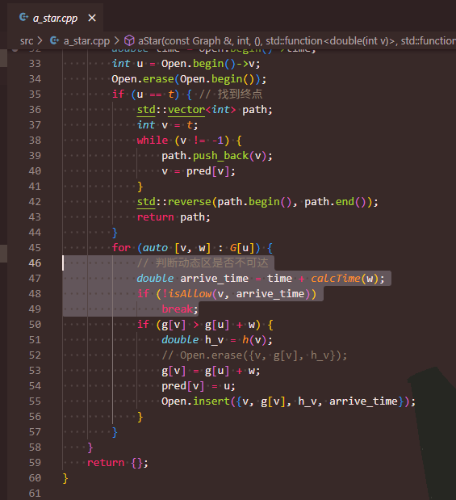
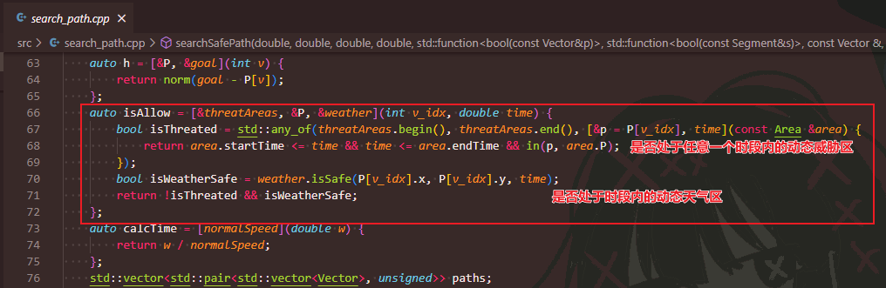
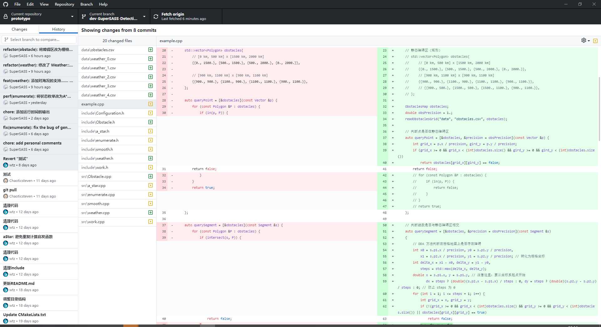
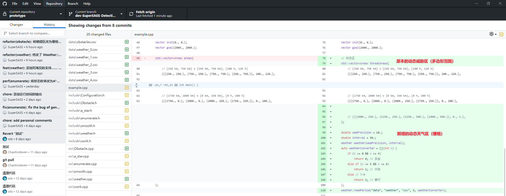
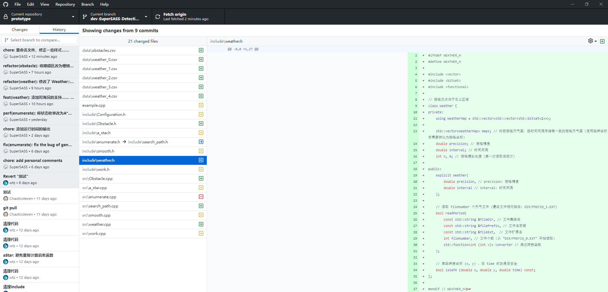
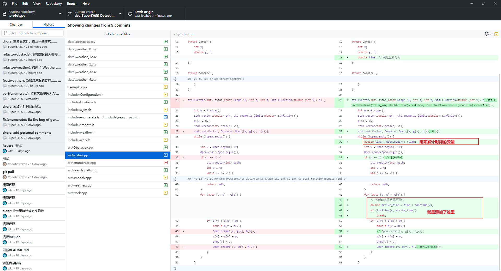
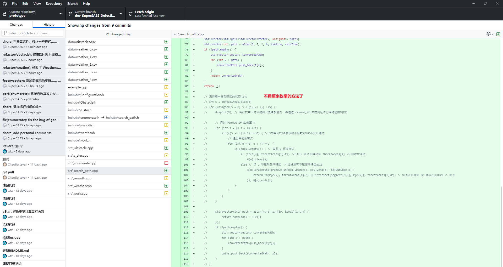
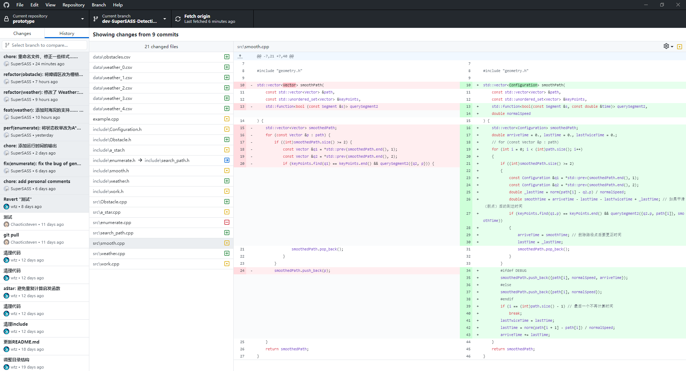

# 与原来代码的变化

## 目前代码说明

目前一共考虑了三种区域：

1. 地形栅格 -> **静态障碍区**  
   这种区域是**一直不允许走**的，在 PRM 建图的时候便排除了。
2. 威胁多边形 -> **动态威胁区**  
   在 A* 搜索的时候，根据下一个点的**坐标和到达时间**，判断其是否处于**任意一个 在威胁时段**内的动态威胁区。
3. 天气栅格 -> **动态天气区**  
   在 A* 搜索的时候，根据下一个点的**坐标和到达时间**，判断其对应**天气栅格在此时是否不能通过**（值为`1`(海况为5~6)或`2`（海况为7~9））。

---

现在的输出，只给出一条路径，即：**保证不暴露**（暴露时间为0）的前提下，**航程最短**的路径。  
原来则是三条路径（航程最短、航行时间最短（跟航程最短差不多一个意思）、暴露时间最短）。

---

现在的方法仍为：**PRM 建图** + **A\* 搜索**，  
只是在 A\* 中，对于原本搜索的过程，增加了一个**即时（在线）的判断**：  
对于当前搜索到的顶点，**如果运动到下一个顶点的时候，该顶点到达时间属于两个动态区域不可通行的时候，则中止搜索。**

因此**便可以不用再枚举**。  
原本枚举，是因为A*中没有存储时间，不知道是否经过某个动态区是否处于不能通行的时间，  
因此只能用枚举的方式，每个区域要么可以通过，要么不能通过，枚举完后再检测路径是否合理（不处于某一动态区不可通行时间）。

对应`a_star.cpp`如下代码：  
  
只有当满足`isAllow()`时，才继续这条路径的搜索（`isAllow()`）方法。

对应`isAllow()`代码如下：  

---

以下为具体代码变化说明。

## 重要修改

### 1. 将地形图变（静态障碍区）为栅格形式

原本的地形图（静态障碍区）由多边形定点给出。  
现在改为了**由栅格地图给出**。

变动代码 - `example.cpp`:  

其中精度定义为`obsPrecision = 1.`(km)，  
具体栅格数据可见`data/obstacles.csv`。

### 2. 添加了对天气（海况）区域的支持

原来的动态区域只考虑了“威胁区域”（由多边形给出），  
没有考虑“天气区域”（由栅格给出）。

变动代码 - `example.cpp`:  

具体的实现类为`weather.h/.cpp`:  

其中栅格精度定义为`weaPrecision = 10.`(km)、时间间隔为`interval = 50.`(h)（即每50h给一个天气数据），  
具体栅格数据可见`data/weather_(0~4).csv`。

### 3. 修改 A\* 算法为“实时检测型 A\* 算法”(Detective-A\*)

具体见图:  

⭐⭐⭐因此可以**不用再枚举**:  

## 杂项修改

### 1. 修改了平滑算法以适应现在的方法

并**没有修改平滑的方法**，  
只是由于平滑时要求平滑后的线段不能经过动态区域，所以也要按照时间来判断。  
则在平滑时也计算了时间。  

变动代码 - `smooth.cpp`:  

### 2. 修改了代码，以匹配现在的输出方式

原本因为输出多条路径，在找到路径(`enumerate`返回)后，会存在以下处理步骤：

1. ~~去重~~
2. 平滑处理
3. ~~求速度~~
4. 求评价指标
5. ~~筛选~~
6. ~~求排名~~

现在因为只返回一条路径，故不在需要上述被删除线删掉的步骤。

还有一些方法参数的修改。

变动代码范围：

* `search_path.h/.cpp`(原`enumerate.h/.cpp`)
* `work.h/.cpp`
