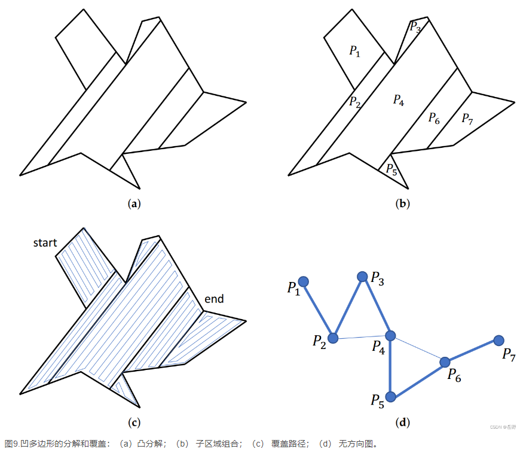
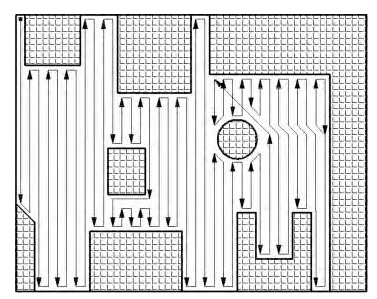

# 巡弋

对无人艇（群）在指定区域进行巡逻，直到搜索完整片海域。

* 问题定义：全覆盖路径规划问题(Complete Coverage Path Planning, CCPP)
* 指标
  * 覆盖率 -> 必要条件 - 全覆盖
  * 路径重复度 -> 主要优化目标 - 重复度越小、路径长度越短
  * 转弯次数 -> 考虑优化目标 - 转弯次数越少、控制难度越小、能量消耗越小

## 基本方法

* 基于区域分割的传统搜索方法  
  将区域按照障碍物分割成若干不包含障碍物的子区域，然后在每个区域内可进行简单的全覆盖搜索方法（往返、螺旋），再按子区域连通性前往下一个子区域，直至对所有子区域全覆盖搜索完毕，则整个区域全覆盖搜索完毕。  
  
* **生物激励神经网络**(Biological Inspired Neural Network, BINN)  
  方法较优，目前看来是重复度最小的方法。  
  
  可参考论文：
  * [**水面无人艇区域覆盖任务路径规划方法研究** - 邢鹏帅 沈阳工业大学](https://kns-cnki-net-s.era.lib.swjtu.edu.cn/kcms/detail/detail.aspx?dbcode=CMFD&filename=1022705112.nh)  
    提到了一种改进的 BINN 方法，表现优秀
  * [移动机器人完全遍历路径规划研究 - 朱博 天津职业技术师范大学](https://kns-cnki-net-s.era.lib.swjtu.edu.cn/kcms/detail/detail.aspx?dbcode=CMFD&filename=1015032991.nh)
  * [基于生物激励神经网络的移动机器人遍历路径规划 - 朱博等 天津职业技术师范大学](https://www.lib.swjtu.edu.cn/asset/detail/0/20336652297)