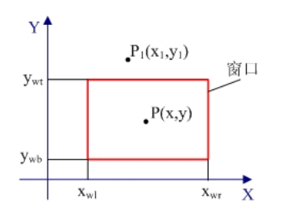
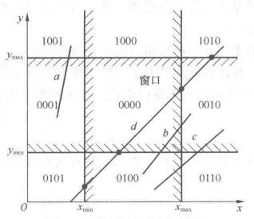
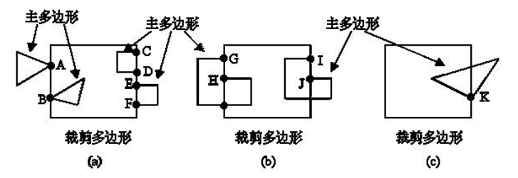

第四次作业

# 二维图形裁剪原理

通过定义窗口和视图区，要求把图形的某一部分显示于屏幕上的指定位置，需要对图形在窗口内和窗口外的部分进行识别，即通过裁剪方法选取可见图形部分提供给显示系统输出，并去除不可见图形部分。

二维图形裁剪根据裁剪窗口的不同可以分为：矩形窗口裁剪、圆形窗口裁剪和一般多边形窗口裁剪；根据被裁剪对象的不同可以分为：线段裁剪、字符裁剪、多边形裁剪和曲线裁剪。

对于矩形窗口裁剪，即裁剪的边界定义为标准矩形，假设矩形边与坐标轴平行，由上($y=y_{wt}$)、下($y=y_{wb}$)、左($x=x_{wl}$)、右($x=x_{wr}$)四条边界组成。

**裁剪的基本原理为：**

1. 图形元素在窗口区域内外的判断，舍弃在区域外的图形
2. 计算图形元素与窗口相交的地方，保留区域内与交点形成的图形

所有裁剪算法的核心问题均在于如何避免或减少求交运算。

**对于点的裁剪的基本原理为：**

判断点是否在窗口内，即点$P(x,y)$在窗口内的充分必要条件是同时满足下列不等式：

$$
\left\{\begin{array}{l}
x_{w l} \leq x \leq x_{w r} \\
y_{w b} \leq y \leq y_{w t}
\end{array}\right.
$$

**对于直线段的裁剪的基本原理为：**

求取该线段位于裁剪窗口内的部分。其中直线段与窗口的位置关系有以下四种：

* 直线段两个端点在窗口内，则可以判断直线段一定在窗口内。
* 直线段两个端点在窗口外，且与窗口不相交，则可以判断直线段一定在窗口外。
* 直线段两个端点在窗口外，但与窗口相交，则直线段有部分在窗口内
* 直线段一个端点在窗口内，另一个端点在窗口外，则直线段有部分在窗口内。

根据上述位置关系，按照以下步骤对直线段进行裁剪：

1. 首先判断被裁直线段是否完全在窗口内，若是则予以保留，裁剪过程结束。
2. 判断被裁直线段是否完全在窗口外，若是则予以舍弃，裁剪过程结束。
3. 计算线段与窗口边界的交点，舍弃窗口外的部分，保留窗口内的部分。

**对于多边形的裁剪的基本原理为：**

多边形可描述为由一组顶点按照一定顺序连接而成的有向点列，是由若干直线段围成的平面封闭图形。其裁剪时的方法可描述为以下步骤：

1. 从顶点序列中删除落在边界外的顶点。
2. 向顶点序列中加入与窗口边界形成的交点，作为新的顶点。
3. 形成裁剪后的多边形的正确的顶点序列。

即裁剪后的多边形仍应保留原多边形各边的连接顺序，并加入一些新顶点（交点、窗口顶点）和删除界外顶点。需要注意的是一个凹多边形裁剪后，可能分裂为若干个多边形。

# 直线段和多边形裁剪算法

## 直线段裁剪算法

### (1) Cohen-Sutherland裁剪算法

**算法原理：**

编码裁剪算法的基本思想是将被裁剪线段分成以下三个步骤处理：

1. 若线段两端点均在窗口内，即该线段完全落在窗口内，则应保留该线段。
2. 若线段两个端点均落在窗口某边界线外的同侧，则线段完全落在窗口外，则应舍弃该线段。
3. 若线段不满足上述两个条件，则求线段与窗口边界线的交点，在交点处把线段分为两段：其中一段完全在窗口外，可舍弃该段；然后对剩下的另一段重复上述处理。

在此基础上考虑优化求交运算，于是该算法按照裁剪区域边界，将边界延长后可将平面分为九个区域，并对其分别进行4位的编码如下：

* 窗口左边界左方，第1位表示为`1`
* 窗口右边界右方，第2位表示为`1`
* 窗口下边界下方，第3位表示为`1`
* 窗口上边界上方，第4位表示为`1`

根据某点$P(x,y)$所处的区域，便能对其进行相应的编码（若点在边界延长线上，则使用阴影线内部的编码）。在得到直线段两端点的编码后，便能根据编码快速确定直线段与裁剪窗口的位置关系，从而减少求交运算。

**算法步骤：**

记：被裁剪线段的两个端点分别为$P_1(x_1,y_1)$、$P_2(x_2,y_2)$，分别对应一个4位的编码$code_1$、$code_2$，编码格式为$c_tc_bc_rc_l$。

1. 按如下判断式求得两端点各自的编码：
   $$
   c_{t}=\left\{\begin{array}{cc}
   1 & y>y_{w t} \\
   0 &  { other }
   \end{array} \quad c_{b}=\left\{\begin{array}{cc}
   1 & y<y_{w b} \\
   0 &  { other }
   \end{array} \quad c_{r}=\left\{\begin{array}{cc}
   1 & x>x_{w r} \\
   0 &  { other }
   \end{array} \quad c_{l}=\left\{\begin{array}{cc}
   1 & x<x_{w l} \\
   0 &  { other }
   \end{array}\right.\right.\right.\right.
   $$
2. 根据$code_1$和$code_2$的值进行如下判断
   1. 两个端点编码均为`0000`，即$code_1 | code_2 = 0$，表明两端点全在窗口内，因此整个线段全在窗口内，保留。
   2. 两端点编码按位逻辑与结果不为`0000`，即$code_1 \& code_2 \ne 0$，表明两端点必定处于某一边界的同一外侧，因此整个线段全在窗口外，舍弃。
   3. 若不属于上面两种情况，则说明线段可能部分在窗口内、或完全在窗口外。需要求直线段与窗口边界线的交点，在交点处把线段一分为二，其中必有一段完全在窗口外，然后舍弃该段。再对另一段重复上述步骤进行处理，直到该线段完全被舍弃或者找到位于窗口内的一段线段为止。

为了再加快求交点的速度，避免无用的求交计算，只需要检测到端点$P_i$编码$code_i$的某位不为`0`时，再把线段与该位对应的窗口边界求交。即按左、右、下、上的顺序检查该端点的编码对应为是否不为`0`：如不为`0`，则需要求该线段与窗口对应边界的交点，并按照步骤2.3进行。

### (2) 中点分割裁剪算法

**算法原理：**

中点分割裁剪算法是基于编码裁剪算法的一种改进，避免了编码裁剪算法求交点时大量的乘除运算，提升了裁剪效率。

其首先对线段端点进行编码，并把线段与窗口的关系分为三种情况: 全在窗口内、完全不在窗口内和需要求与窗口相交部分。对前两种情况，进行与编码裁剪算法一样的处理。对于第三种情况，则是用连续平分线段，用中点逼近线段与窗口边界交点的方法代替用乘除法实现求交运算。

利用中点逼近求得交点的具体方法是：不断地在中点处将线段一分为二，对每段线段重复编码裁剪算法的线段可见性测试方法（利用编码进行判断），直至找到每段线段与窗口边界线的交点或分割子段的长度充分小可视为一点为止。

其相当于二分搜索的求交方式，用此方法分别**找到离线段两个端点最远的可见点**$P_mP_m'$，两个可见点之间的连线即为要输出的可见段。

**算法步骤：**

1. 利用线段的编码判断$P_1P_2$是否完全在窗口内，若是则绘制线段$P_1P_2$，结束裁剪过程；若不是，则再判断$P_1P_2$是否完全在窗口外，若是则不绘制线段，结束裁剪过程；若不是继续下步骤。
2. 固定$P_1$，测试$P_2$是否在窗口内，若是则$P_2$是离$P_1$最远的可见点，转到步骤5；否则继续下步骤。
3. 将线段$P_1P_2$二分，求出中点$P_m$，编码判断线段$P_mP_2$是否全在窗口外，若是则舍弃。$P_mP_2$，用$P_1P_m$代替$P_1P_2$；若不是则用$P_mP_2$代替$P_1P_2$。
4. 对新的$P_1P_2$重复步骤1~3，直至线段的长度小于给定的误差为止，此时可以认为在给定精度内$P_m$为$P_1$的最远可见点。
5. 固定$P_2$，按步骤2相同方法测试$P_1$，并继续后续步骤直至找到$P_2$的最远可见点$P_m'$。
6. 绘制可见线段$P_mP_m'$。

### (3) Liang-Barsky裁剪算法

**算法思想：**

Liang-Barsky裁剪算法将二维裁剪问题化为一维裁剪问题，并向$x$（或$y$）方向投影以决定可见线段。

其首先将线段参数化为如下格式：

$$
\left\{\begin{array}{l}
x=x_1+u(x_2-x_1)=x_1+u \Delta {x} \\
y=y_1+u(y_2-y_1)=y_1+u \Delta {y}
\end{array} \quad 0 \leq u \leq 1\right.
$$

其中参数$u$取值为$0\sim1$，当$u=0$时，代表点$P_1(x_1,y_1)$；当$u=1$时，代表点$P_2(x_2,y_2)$。

如果点$P(x,y)$位于由左下角坐标$(xw_{min},yw_{min})$和右上角坐标$(xw_{max},yw_{max})$确定的窗口内，则需要满足以下不等式：

$$
\left\{\begin{array}{l}
x {w}_{min } \leq x_1+u \Delta {x} \leq xw_{max } \\
{yw}_{min } \leq y_1+u\Delta y \leq {yw}_{max }
\end{array}\right.
$$

上述不等式可表示为：

$$
up_k \le q_k,\qquad k=1,2,3,4
$$

其中：

$$
\left\{\begin{array}{ll}
p_1=-\Delta x, & q_1=x_1-x w_{{min }} \\
p_2=\Delta x, & q_2=x w_{max }-x_1 \\
p_3=-\Delta y & q_3=y_1-y w_{{min }} \\
p_4=\Delta y, & q_2=y w_{max }-y_1
\end{array}\right.
$$

则裁剪时，可以通过计算出位于窗口内线段的两端点的参数$u_1,u_2$，得到窗口内线段。$u_1$的值由线段从外到内遇到的矩形边界所决定（$p_k<0$），对这些边界计算$r_k=\frac{q_k}{p_k}$，$u_1$取0和各个$r$值之中的最大值；$u_2$的值由线段从内到外遇到的矩形边界所决定（$p_k>0$），对这些边界计算$r_k=\frac{q_k}{p_k}$，$u_2$取0和各个$r$值之中的最小值。如果$u_1> u_2$，则线段完全落在裁剪窗口之外，应当被舍弃；否则，被裁剪线段的端点可以由$u_1$和$u_2$计算出来。

**算法步骤：**

1. 初始化线段交点的参数：$u_1=0, u_2=1$。
2. 计算出各个裁剪边界的$p$、$q$值。
3. 根据$p$、$q$来判断：是舍弃线段还是改变交点的参数。
   1. 当$p<0$时，参数$r$用于更新$u_1$（$u_1=\max\{ u_1,\cdots,r_k\}$）。
   2. 当$p>0$时，参数$r$用于更新$u_2$（$u_2=\min\{ u_2,\cdots,r_k\}$）。
   3. 如果更新了$u_1$或$u_2$后，使$u_1>u_2$，则舍弃该线段。
   4. 当$p=0$且$q<0$时，因为线段平行于边界并且位于边界之外，则舍弃该线段。
4. $p$、$q$的四个值经判断后，该线段未被舍弃，则裁剪线段的端点由$u_1$和$u_2$的值决定。

## 多边形裁剪算法

### (1) Sutherland-Hodgman算法

**算法思想：**

每次用窗口的一条边界(包括延长线)对要裁剪的多边形进行裁剪。裁剪时，顺序地测试多边形各顶点，**保留边界内侧的顶点**，**删除外侧的顶点**，同时，适时地**插入新的顶点**——即交点和窗口顶点，从而得到一个新的多边形顶点序列。然后以此新的顶点序列作为输入，相对第二条窗边界线进行裁剪，又得到一个更新的多边形顶点序列。依次下去，相对于第三条、第四条边界线进行裁剪，最后输出的多边形顶点序列即为所求的裁剪完成的多边形。

各边界输出顶点序列产生规则为：以窗口的一条边以及延长线构成的裁剪线。该线把平面分成两部分；一部分包含窗口，称为可见一侧；另一部分称为不可见一侧。依序处理输入多边形各边的两端点S→P（箭头表示顺序关系，S为前一点，P为当前点），与裁剪线的位置关系有以下四种：

1. S在外侧，P在内侧。则交点I、当前点P保存到新多边形中。
2. S、P均在内侧。则当前点P保存到新多边形中。
3. S在内侧，P在外侧。则交点I保存到新多边形中。
4. S、P均在外侧。则没有点被保存到新多边形中

对于凹多边形，需要分解为多个凸多边形然后分别处理，否则会在多边形沿窗口边界产生多余的线段。

### (2) Weiler-Atherton算法

**算法思想：**

设：被裁剪多边形为主多边形，记为A；裁剪窗口为裁剪多边形，记为B。则主多边形A和裁剪多边形B的边界将整个二维平面分成了四个区域：

* $A\cap B$（交：属于A且属于B）
* $A-B$（差：属于A不属于B）
* $B-A$（差：属于B不属于A）
* $C_U(A\cup B)$ (补：不属于A且不属于B)

对于内裁剪即通常意义上的裁剪，取图元位于窗口之内的部分，结果为$A\cap B$；外裁剪取图元位于窗口之外的部分，结果为$A-B$。

裁剪结果区域的边界**由$A$的部分边界和$B$的部分边界两部分构成**，并且**在交点处边界发生交替**，即由$A$的边界转至$B$的边界，或由$B$的边界转至$A$的边界。各多边形的外部边界取顺时针方向，而其内部边界或孔取逆时针方向，如果主多边形与裁剪多边形有交点，则交点成对出现，它们被分为如下两类：

* 进点：主多边形边界由此进入裁剪多边形内
* 出点：主多边形边界由此离开裁剪多边形区域

该算法从被裁剪多边形$A$的一个进点开始，沿着被裁剪多边形$A$按顺时针方向搜集顶点序列，而当遇到出点时，则沿着裁剪窗口$B$按顺时针方向搜集顶点序列。按上述规则，如此交替地沿着两个多边形的边线行进，直到回到起始点为止。这时，收集到的全部顶点序列就是裁剪所得的一个多边形。

由于可能存在分裂的多边形，因此算法要考虑：将搜集过的入点的入点记号删去，以免重复跟踪。将所有的入点搜集完毕后算法结束。

若主多边形$A$的顶点或边落在裁剪多边形$B$边上时，如下图。，交点的处理办法为：

* 与裁剪多边形边重合的主多边形的边不参与求交点；
* 对于顶点落在裁剪多边形的边上的主多边的边，如果这条边落在该裁剪边的内侧，将该顶点算作交点；而如果这条边落在该裁剪边的外侧，将该顶点不看作交点。

**算法步骤：**

1. 分别按顺时针建立主多边形$A$和裁剪多边形$B$的顶点表
2. 求出主多边形与裁剪多边形的实交点（进点和出点）并分别建立进点表和出点表
3. 将交点按顺时针加入各顶点表中
4. 如果进点表为空，则搜索裁剪结束，否则执行以下步骤
   1. 取一进点作为始点，将其入点标记删去
   2. 顺时针跟踪主多边形$A$顶点表，将顶点依次加到输出表中，直至发现下一交点
   3. 根据交点处指针，转到裁剪多边形$B$顶点表中的相应位置，顺时针跟踪裁剪多边形顶点表，将顶点依次加到输出表中，直至发现下一交点
   4. 如果该交点不是起始点则继续4.2；如果进点表中还有未遍历到的交点则转4.1；均不满足则本次裁剪结束，返回步骤4。

# 裁剪算法的适应性分析

**对于直线段裁剪算法：**

* 编码裁剪算法 - 适用两种场合：大窗口场合；窗口特别小的场合(如, 光标拾取图形时，光标看作小的裁剪窗口）；但编码裁剪算法的效率较低。
* 中点分割裁剪算法 - 求交点效率高于编码裁剪算法；但其只适合在硬件实现使裁剪速度更快，若用软件实现效率可能更低。
* Liang-Barsky裁剪算法 - 比编码裁剪算法的效率高很多，适用于更多环境。

**对于多边形裁剪算法：**

* 逐边裁剪算法 - 适用于裁剪凸多边形，凹多边形需要拆分为若干个凸多边形；以及裁剪窗口必须是凸多边形，否则会出现错误。
* 双边裁剪算法 - 被裁减多边形、裁剪窗口可以是任意多边形。
