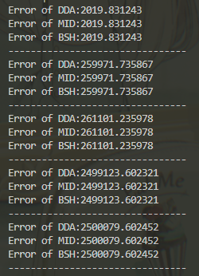

# 作业

## 任意斜率直线画线法

### DDA 画线法

#### 算法原理

对于任意一直线段$L(P_0,P_1)\quad (P_0\ne P_1)$，其两端点坐标为$P_0(x_0,y_0)$和$P_1(x_1,y_1)$，若斜率存在，则直线的微分方程为：
$$
\frac{\textrm{d}y}{\textrm{d}x}=\frac{\Delta y}{\Delta x} = k
$$

DDA 是通过在某一位置$(x_i,y_i)$分别加上增量$\Delta x$和$\Delta y$，求得下一点$(x_{i+1},y_{i+1})$的坐标，不断迭代从而生成直线。  
具体原理如下：

* 若斜率存在，且当$x_1-x_0$绝对值较大($x_0\ne x_1,|k|\le1$)，以$x$方向作为步进方向，且每步增量为单位步长（$\Delta x=1$，即一个像素），计算$y$方向的增量（$\Delta y=\Delta x\cdot k =k$），把每次计算出的$(x_{i+1},y_{i+1})$经取整后送到显示器输出，则得到扫描转换后的直线。
* 若斜率存在，且当$y_1-y_0$绝对值较大($x_0\ne x_1,|k|\ge1$)，以$y$方向作为步进方向，且每步增量为单位步长（$\Delta y=1$，即一个像素），计算$x$方向的增量（$\Delta x=\Delta y\cdot k =k$），把每次计算出的$(x_{i+1},y_{i+1})$经取整后送到显示器输出，则得到扫描转换后的直线。
* 若斜率不存在（$x_0=x_1$），以$y$方向作为步进方向，且每步增量为单位步长（$\Delta y=1$，即一个像素），$x$方向不存在增量（$\Delta x=0$），把每次计算出的$(x_{i+1},y_{i+1})$经取整后送到显示器输出，则得到扫描转换后的直线。

以上两种情况可以转换为如下通法：

> 分别计算两端点坐标$P_0(x_0, y_0), P_1(x_1, y_1)$的横纵坐标差值$\Delta x = x_1 - x_0, \Delta y = y_1 - y_0$，选绝对值最大的值作为迭代次数$steps$，则每次迭代的增量为$\mathrm{d}x = \frac{\Delta x}{steps}, \mathrm{d}y=\frac{\Delta y}{steps}$。然后令初始点为$P=P_0$，每次在点$P$处放置像素点后将$P$的横纵坐标加上相应增量，迭代$steps$次后即可生成直线。

#### 算法表示

伪代码：……

代码：

```c++
void Line_DDA(int x0, int y0, int x1, int y1, Color color)
{
    int delta_x, delta_y, steps, dx, dy;
    // 计算delta_x, delta_y, 确定steps，并计算dx, dy
    delta_x = x1 - x0, delta_y = y1 - y0;
    steps = max(abs(delta_x), abs(delta_y));
    dx = delta_x / steps, dy = delta_y / steps;
    for (i = 1; i <= steps + 1; i++)
    {
        putpixel((int)(x + 0.5), (int)(y + 0.5), color); // 四舍五入生成像素点
        x += dx, y += dy;
    }
}
```

### 中点画线法

#### 算法原理

对于任意一直线段$L(P_0,P_1)\quad (P_0\ne P_1)$，其两端点坐标为$P_0(x_0,y_0)$和$P_1(x_1,y_1)$（保证$x_0<x_1$），先讨论直线斜率$0\le k\le 1$的情况。

令直线方程为为如下形式：

$$
F(x,y):ax+by+c = 0
$$

可计算得到相应的参数为：$a = y_0-y_1, b=x_1-x_0, c=x_0y_1-x_1y_0$，且可知$b>0$。

则对于平面上任何点$P_i(x_i,y_i)$，与直线的相对位置有且只有三种情况：

$$
F(x_i, y_i)\left\{\begin{array}{ll}
<0 & \textrm { 点 }(x_i, y_i) \textrm { 位于直线下方 } \\
=0 & \textrm { 点 }(x_i, y_i) \textrm { 位于直线上 } \\
>0 & \textrm { 点 }(x_i, y_i) \textrm { 位于直线上方 }
\end{array}\right.
$$

从直线左侧向右生成直线，设当前已确定与直线最近的像素点坐标为$P_i(x_i,y_i)$，则下一个与直线最近的右方像素，只能是正右方像素$P_{RB}(x_i+1,y_i)$或右上方像素$P_{RU}(x_i+1,y_i+1)$，称二者为“候选像素”。  
记$P_{RB}$和$P_{RU}$的中点为$M$，易知其坐标为$M(x_i+1,y_i+0.5)$。

再假设$Q$为直线$L$与垂直线$x=x_i+1$的交点，则$M$与$Q$有三种关系：

* 若$F(M)>0$，即$M$在$Q$(直线$L$)上方，说明$P_{RB}$离直线最近，应作为下一个像素。
* 若$F(M)=0$，即$M$与$Q$重合(在直线$L$上)，说明$P_{RB}$与$P_{RU}$离直线等距离，两者均可作为下一个像素，这里约定$P_{RB}$作为下一个像素。
* 若$F(M)<0$，即$M$在$Q$(直线$L$)下方，说明$P_{RU}$离直线最近，应作为下一个像素。

故可用中点$M$的函数值$F(M)$作为决策变量$d_i$，根据$d_i$的符号确定下一个像素的选取。

$$
d_i\left\{\begin{array}{ll}
<0 & \textrm { 取右上方像素 } P_{RU}\left(x_{i}+1, {y}_{i}+1\right) \textrm { 作为下一个像素 } \\
\ge 0 & \textrm { 取正右方像素 } P_{RB}\left(x_{i}+1, {y}_{i}\right) \textrm { 作为下一个像素 }
\end{array}\right.
$$

选择相应像素后，下一个决策变量可以直接推导出来：

$$
d_i\left\{\begin{array}{ll}
<0 & d_{i+1}=d_i+a+b \\
\ge 0 & d_{i+1}=d_i+a
\end{array}\right.
$$

注意到初始的决策变量为$d_0=a+0.5b$，会造成$d_0$为浮点数，进行浮点数加法，  
但$d$只需要关注与0的关系，所以可以将$d_0$乘2，转换为整数加法，即$d_0=2a+b$，$d_{i+1}=d_i+2a$或$d_{i+1}=d_{i}+2(a+b)$。

---

对于$k>1$的情况，其情况相当于$0\le k\le1$情况按直线$y=k$对称处理。  
故可将点$P_i(x_i,y_i)$与直线的三种相对位置情况中的下方改称为右方，上方改称为左方，判断条件仍相同；  
两个候选像素变为正上方像素$P_{LU}(x_i,y_i+1)$或右上方像素$P_{RU}(x_i+1,y_i+1)$，中点坐标为$M(x_i+0.5,y_i+1)$。

仍用中点$M$的函数值$F(M)$作为决策变量$d_i$，决策变量$d_i$的每次迭代处理为：
$$
d_i\left\{\begin{array}{ll}
<0 & \textrm { 取正上方像素 } P_{LU}\left(x_i, {y}_{i}+1\right) \textrm { 作为下一个像素 }, d_{i+1}=d_i+2b \\
\ge 0 & \textrm { 取右上方像素 } P_{RU}\left(x_{i}+1, {y}_{i+1}\right) \textrm { 作为下一个像素 }, d_{i+1} = d_i+2(a+b)
\end{array}\right.
$$

其中：$d_0=a+2b$。

---

对于其他情况也采用类似分析方法，故只给出决策变量$d_i$每次迭代的处理如下表，不再给出详细分析过程。

| $k$情况       | $k\in[0,1]$           | $k\in(1,+\infty)$     | $k\in[-1,0)$          | $k\in(-\infty,-1)$    |
| ------------- | --------------------- | --------------------- | --------------------- | --------------------- |
| $d_0$         | $d_0=2a+b$            | $d_0=a+2b$            | $d_0=2a-b$            | $d_0=a-2b$            |
| $d_i<0$情况   | `x++, y++, d+=2(a+b)` | `y++, d+=2b`          | `x++, d+=2a`          | `y--, x++, d+=2(a-b)` |
| $d_i\ge0$情况 | `x++, d+=2a`          | `y++, x++, d+=2(a+b)` | `x++, y--, d+=2(a-b)` | `y--, d+=-2b`         |

#### 算法表示

伪代码：


代码：

```c++
void Line_Midpoint(int x0, int y0, int x1, int y1, Color color)
{
    if (x0 > x1) // 保证x0 <= x1
        swap(x0, x1), swap(y0, y1);
    int a = y0 - y1, b = x1 - x0,   // 直线L的参数（c因为没有用到不用计算）
        d,                          // 决策变量d
        dd_L, dd_G,                 // 决策变量d的增量(L代表小于0的情况，G代表大于0的情况)
        x = x0, y = y0,             // 初始P坐标
        dPx_L, dPy_L, dPx_G, dPy_G; // P坐标的增量(L代表小于0的情况，G代表大于0的情况)
    // 根据k值分情况生成决策变量和增量
    if (-b <= a && a <= 0) // k ∈ [0, 1]
    {
        d = 2 * a + b;                            // d0 = 2a + b
        dPx_L = 1, dPy_L = 1, dd_L = 2 * (a + b); // d < 0情况
        dPx_G = 1, dPy_G = 0, dd_G = 2 * a;       // d >= 0 情况
    }
    else if (a < -b) // k ∈ (1, +∞)
    {
        d = a + 2 * b;                            // d0 = a + 2b
        dPx_L = 0, dPy_L = 1, dd_L = 2 * b;       // d < 0情况
        dPx_G = 1, dPy_G = 1, dd_G = 2 * (a + b); // d >= 0 情况
    }
    else if (0 < a && a <= b) // k ∈ [-1, 0)
    {
        d = 2 * a - b;                             // d0 = 2a - b
        dPx_L = 1, dPy_L = 0, dd_L = 2 * a;        // d < 0情况
        dPx_G = 1, dPy_G = -1, dd_G = 2 * (a - b); // d >= 0 情况
    }
    else // k ∈ (-∞, -1)
    {
        d = a - 2 * b;                                  // d0 = a - 2b
        dPx_L = 1, dPy_L = -1, dd_L = 2 * (a - b);      // d < 0情况
        dPx_G = 0, dPy_G = -1, dd_G = -2 * b;           // d >= 0 情况
    }
    // 迭代生成直线
    while (x != x1 || y != y1)
    {
        putpixel(x, y, color);
        if (d < 0)
            x += dPx_L, y += dPy_L, d += dd_L;
        else
            x += dPx_G, y += dPy_G, d += dd_G;
    }
    putpixel(x, y, color);
}
```

### Bresenham 画线法

#### 算法原理

其与中点画线算法的思想基本一致，只是在判断选$P_{RB}$和$P_{RU}$方法不同，  
这里把用实际位置与中点的位置关系，变为了与$P_{RB}$和$P_{RU}$两距离的大小关系，  
且约定$d_1=d_2$时选择右上方像素$P_{RU}$。  
仍先考虑$0\le k\le 1$的情况。

用$d_1$和$d_2$来表示正右$P_{RB}$和右上两个候选像素的$y$值，与线段上理想$y$值（$Q$点$y$值）的差值，  
即$d_1=|P_{RB}Q|, d_2=|P_{RU}Q|$，可得$d_1-d_2=2k(x_i+1)-2y_i+2b-1$，  
其中$k=\frac{\Delta y}{\Delta x}$，代入并在两边同乘$\Delta x$后得：
$$
\Delta x(d_1-d_2) = 2x_i\Delta y - 2y_i\Delta x + C
$$
其中$C$为一常量，$C=2\Delta y + \Delta x(2b-1)$。

设决策变量$d_i=\Delta x(d_1-d_2)$，其符号与$d_1-d_2$相同，起判别作用。  
判别情况如下：

$$
d_i\left\{\begin{array}{ll}
<0 & \textrm { 取正上方像素 } P_{LU}\left(x_i, {y}_{i}+1\right) \textrm { 作为下一个像素 } \\
\ge 0 & \textrm { 取右上方像素 } P_{RU}\left(x_{i}+1, {y}_{i+1}\right) \textrm { 作为下一个像素 }
\end{array}\right.
$$

而对于决策变量的迭代如下：
$$
d_{i+1}=2x_{i+1}\Delta y - 2y_{i+1}\Delta x + C \\
d_{i+1}-d_i = 2(x_{i+1}-x_i)\Delta y - 2(y_{i+1}-y_i)\Delta x \\
d_{i+1}=d_i+2\Delta y -2\Delta x(y_{i+1}-y_i)
$$

* 当$d_i<0$时，$y_{i+1}=y_i$，故$d_{i+1}=d_i+2\Delta y$
* 当$d_i\ge0$时，$y_{i+1}=y_i+1$，故$d_{i+1}=d_i+2(\Delta y - \Delta x)$

总结如下：

$$
d_i\left\{\begin{array}{ll}
<0 & \textrm { 取正上方像素 } P_{LU}\left(x_i, {y}_{i}+1\right) \textrm { 作为下一个像素 }, d_{i+1}=d_i+2\Delta y \\
\ge 0 & \textrm { 取右上方像素 } P_{RU}\left(x_{i}+1, {y}_{i+1}\right) \textrm { 作为下一个像素 }, d_{i+1} = d_i+2(\Delta y - \Delta x)
\end{array}\right.
$$

而对于决策变量初始值$d_0$，仍取左端点$P_0(x_0,y_0)$，计算得到$d_0$为：
$$
d_0 = 2x_0\Delta y - 2y_0\Delta x \\
C = 2\Delta y + \Delta x(2b-1) \\
b = y_0 - \frac{\Delta y}{\Delta x}x_0
$$

整理得：
$$
d_0 = 2\Delta y - \Delta x
$$

---

对于其他情况按中点画线法类似分析，可得到决策变量$d_i$每次迭代的处理如下表：

| $k$情况       | $k\in[0,1]$              | $k\in(1,+\infty)$        | $k\in[-1,0)$              | $k\in(-\infty,-1)$       |
| ------------- | ------------------------ | ------------------------ | ------------------------- | ------------------------ |
| $d_0$         | $d_0=2\Delta y-\Delta x$ | $d_0=2\Delta x-\Delta y$ | $d_0=-2\Delta y-\Delta x$ | $d_0=2\Delta x+\Delta y$ |
| $d_i<0$情况   | `x++, d+=2Δy`            | `y++, d+=2Δx`            | `x++, d+=-2Δy`            | `y--, d+=2Δx`            |
| $d_i\ge0$情况 | `x++, y++, d+=2(Δy-Δx)`  | `x++, y++, d+=2(Δx-Δy)`  | `x++, y--, d+=-2(Δy+Δx)`  | `x++, y--, d+=2(Δx+Δy)`  |

#### 算法表示

伪代码：


代码：

```c++
void Line_Bresenham(int x0, int y0, int x1, int y1, Color color)
{
    if (x0 > x1) // 保证x0 <= x1
        swap(x0, x1), swap(y0, y1);
    int Delta_x = x1 - x0, Delta_y = y1 - y0,
        d,                          // 决策变量d
        dd_L, dd_G,                 // 决策变量d的增量(L代表小于0的情况，G代表大于0的情况)
        x = x0, y = y0,             // 初始P坐标
        dPx_L, dPy_L, dPx_G, dPy_G; // P坐标的增量(L代表小于0的情况，G代表大于0的情况)
    // 根据k值分情况生成决策变量和增量
    if (0 <= Delta_y && Delta_y <= Delta_x) // k ∈ [0, 1]
    {
        d = 2 * Delta_y - Delta_x;                            // d0 = 2Δy - Δx
        dPx_L = 1, dPy_L = 0, dd_L = 2 * Delta_y;             // d < 0情况
        dPx_G = 1, dPy_G = 1, dd_G = 2 * (Delta_y - Delta_x); // d >= 0 情况
    }
    else if (Delta_x < Delta_y) // k ∈ (1, +∞)
    {
        d = 2 * Delta_x - Delta_y;                            // d0 = 2Δx - Δy
        dPx_L = 0, dPy_L = 1, dd_L = 2 * Delta_x;             // d < 0情况
        dPx_G = 1, dPy_G = 1, dd_G = 2 * (Delta_x - Delta_y); // d >= 0 情况
    }
    else if (-Delta_x <= Delta_y && Delta_y < 0) // k ∈ [-1, 0)
    {
        d = -2 * Delta_y - Delta_x;                             // d0 = -2Δy - Δx
        dPx_L = 1, dPy_L = 0, dd_L = -2 * Delta_y;              // d < 0情况
        dPx_G = 1, dPy_G = -1, dd_G = -2 * (Delta_y + Delta_x); // d >= 0 情况
    }
    else // k ∈ (-∞, -1)
    {
        d = 2 * Delta_x + Delta_y;                             // d0 = 2Δx + Δy
        dPx_L = 0, dPy_L = -1, dd_L = 2 * Delta_x;             // d < 0情况
        dPx_G = 1, dPy_G = -1, dd_G = 2 * (Delta_x + Delta_y); // d >= 0 情况
    }
    // 迭代生成直线
    while (x != x1 || y != y1)
    {
        putpixel(x, y, color);
        if (d < 0)
            x += dPx_L, y += dPy_L, d += dd_L;
        else
            x += dPx_G, y += dPy_G, d += dd_G;
    }
    putpixel(x, y, color);
}
```

### 三种算法的比较分析

* 算法精度  
  对于三种算法生成的直线精度，在这里采用残差平方和$SSE$作为评判标准。  
  对于同样两端点分别调用三种算法生成直线并计算其$SSE$，多次运行比较后发现值均相同，如下图所示：  
  
  故可以判断三种算法的精度基本一致。
* 算法速度  
  由算法代码可分析：  
  对于DDA算法，其存在浮点数运算；  
  而对于中点画线法和 Bresenham 画线法，两者均把浮点数运算转换为了整数运算，而这两种算法的代码操作相近。  
  故DDA算法的速度慢于中点画线法和 Bresenham 画线法，而中点画线法和 Bresenham 画线法两算法速度相近。

## 画圆法

### 中点画圆法

#### 算法推导

### Bresenham 画圆法

#### 算法推导

### 多边形逼近画圆法

#### 算法推导

### 三种算法的比较分析

* 算法精度
* 算法速度