# Paddle Serving

实现的是将AI模型进行推理部署，供上层应用运用。

学习视频链接：

* 飞桨部署知识 - [飞桨工业级推理部署方案全貌及产业应用](https://www.bilibili.com/video/BV1gZ4y1H7UA?p=1)
* Paddle Serving - [一键部署，飞桨服务化部署框架](https://www.bilibili.com/video/BV1gZ4y1H7UA?p=3)

## 0x00 - 前提知识

### 1. 深度学习模型开发流程

1. 问题定义
2. 准备数据
3. 建模
4. 训练
5. （推理）部署

前四步好理解，都是深度学习方面的，  
经过前四步后，会得到能用于解决该问题的一个**深度学习模型**，  
此时可以用该模型进行“**推理**”，可以将从未见过的新输入推理得到输出，也就是实际应用。

但这个时候模型推理还不能给普通用户使用，没法很好的交互（或说只能在命令行中`python`输入输出，不易用），  
因此部署便为：无缝集成到生产环境中的任何代码单元，并可以接受输入并返回输出，  
也就是**让模型提供接口**，方便上层的应用（桌面端、Web、移动端、IoT端）调用，从而便于与用户交互。

因此部署是非常重要的一环，直接决定了该人工智能应用能否落地，给广大普通用户提供服务，  
如果没有这一步，也就没有如NovelAI、ChatGPT这类便于使用的强大人工智能应用了。  
同时因为直接与各类用户交互部署考虑的问题也很多，如硬件多样、性能优化等问题。

### 2. Paddle的部署方式

Paddle有四种部署方式，如下图蓝色部分：  
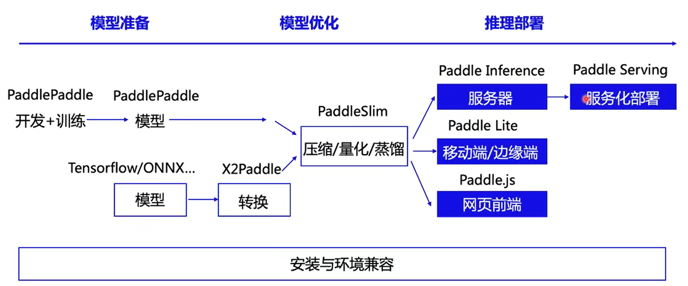

* "Paddle Interface"(飞桨原生推理库) - 提供最基本的接口，便于其他开发语言(C/C++/Python/...)的上层应用直接编程调用。
* "Paddle Serving"(飞桨服务化部署框架) - 将模型部署为一个**服务端**，转换为CS或BS架构中的Server，上层应用可以**通过HTTP或RPC协议**调用。
* "Paddle Lite"(飞桨轻量化推理引擎) - 将模型部署到移动端/边缘端上（如手机/物联网硬件平台）。
* "Paddle.js"(飞桨前端推理引擎) - 将模型部署为JavaScript，可以供浏览器前端直接调用。

四种部署方式的全景图如下：  
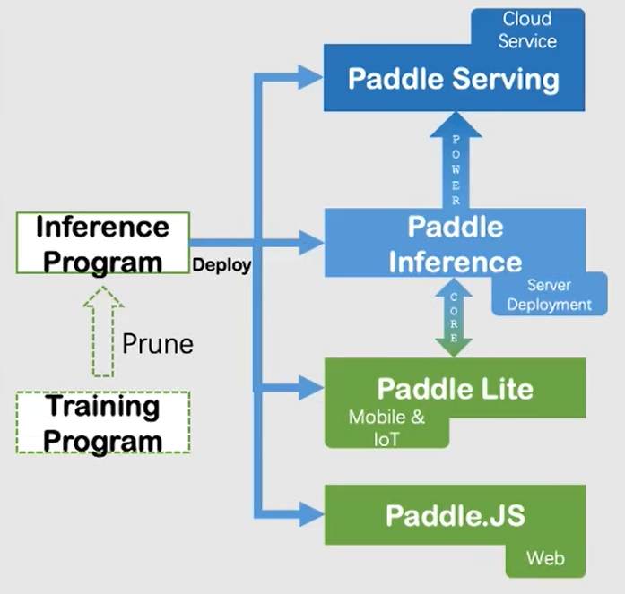

> 注 - "Paddle Serving"和"Paddle.js"的区别：
>
> 两者虽然看起来都主要是提供Web端的服务，但区别如下：
>
> * Paddle Serving是部署到一个服务器（Web中即是后端）上，推理是是**运行在服务端的硬件上**的。  
>   同时Paddle Serving不止提供Web端，其他如桌面应用、机器人也可以通过HTTP或RPC协议调用。
> * Paddle.js是部署到前端上，推理是是**运行在客户端的硬件上**的。

由于本次比赛**要求Web应用**，选用"Paddle Serving"部署为BS架构是最为合适的，下面具体学习这部分内容。

## 0x01 - Paddle Serving的基础介绍

**Paddle Serving的描述图如下：**  
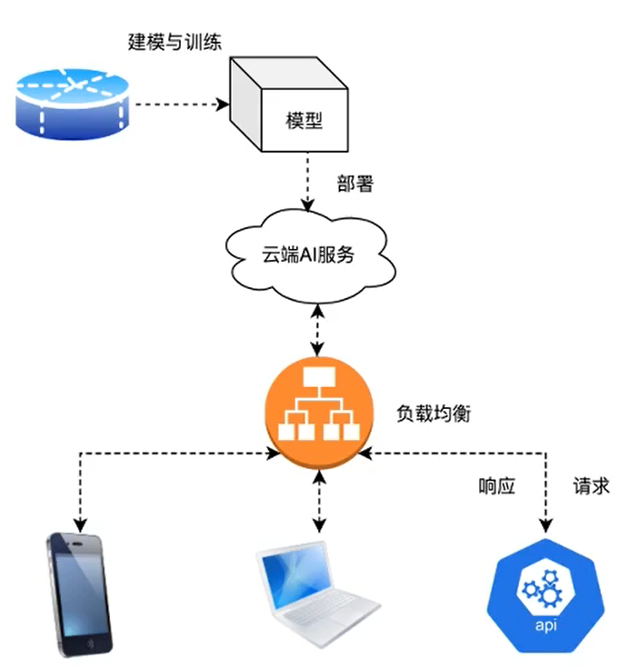

可以看见，Paddle Serving就是把模型部署在一个服务器上（图中的云端AI服务），  
然后给各种设备应用提供接口，使其能运用该模型解决问题。

**Paddle Serving的关注点/挑战：**

* 计算能力与模型规模  
  考虑如怎样让更少机器承担更多负载、计算能力如何在部署后最大化发挥（服务器的性能一般没训练时的好）、对较大模型的压缩等问题。
* 硬件平台（CPU/GPU/其他）  
  部署的时候写CPU程序可能很容易，但部署在如TPU上就需要即知道AI模型，又知道TPU，又知道网络工作等内容。
* 易用性和性能的平衡  
  通常两者之间存在冲突，训练时基本不考虑应用性，但部署面向用户的时候就需要做平衡。
* 训练模型衔接和裁剪  
  模型过大可能需要裁剪出来，用分布式部署。

## 0x02 - Paddle Serving的最小部署应用示例

**从部署模型到客户端应用的基本步骤：**

1. 模型端（就是训练好模型的主机）安装Paddle Serving
2. 模型端将模型部署为服务端（和客户端）
3. 启动服务端服务
4. 客户端调用

下面给出一个“房价预测模型”的部署应用过程示例：

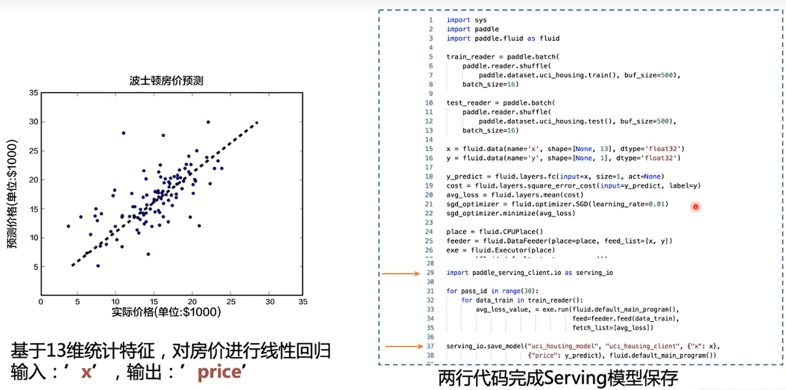  
左侧为这个模型的功能（解决的问题），  
右侧箭头上方则为模型的python代码，有输入、中间的网络、输出。

### 1. 安装Paddle Serving

```bash
pip install paddle-serving-server-gpu paddle-serving-client paddle-serving-app
```

### 2. 模型部署

在这一步就把Paddle模型变为Paddle Serving模型。

Paddle模型中有输入和输出，各种参数和描述，  
而对于线上服务，需要有客户端(Server)和服务端(Client)。

* 服务端：进行预测和推理，因此需要存有模型；接收客户端传来的信息，返回推理后的信息。
* 客户端：需要存在一个平台供用户使用，并于服务端进行交互。

提现到代码中即为以下部分
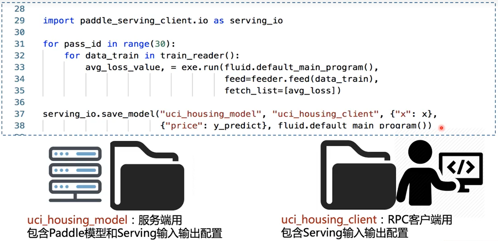  
在37行调用`save_model`接口，就能保存出两个文件夹：

* `model`文件夹：交给模型的服务端用，在服务器上启动相关命令，加载文件夹内容。
* （若使用RPC协议）`client`文件夹：交给模型的应用端（指谁调用模型，不一定是给用户的应用端），包含如何与服务端交互的数据格式。  
  *注：使用HTTP协议，若无前后处理应该就不用，若有则需要再封装，应该就需要把client放在Web后端，然后再由Web后端调用模型端（模型进行推理的服务器）。*

### 3. 启动服务端服务

```bash
python -m paddle_serving_server.serve --model MODEL_NAME --thread NUMBER --port PORT --name SERVER_NAME
```

* `model` - 模型的名称
* `thread` - 线程数
* `port` - 端口
* `name` - 指定web服务的名称（调用时的路由）

### 4. 客户端调用

#### (1) 使用HTTP协议

直接发一个POST请求，传过一个JSON字段，要求得到预测价格`fetch`，服务名字为`name`，调用指定接口`prediction`。

```bash
curl -H "Content-Type:application/json"
     -X POST
     -d '{"feed":[{"x":[0.137, ..., 0.332]}], "fetch":["price"]}'
     http://127.0.0.1:port/name/prediction
```

**返回值：**  
为一个词典（Web则为JSON），key为`fetch`变量指定的名字（即price），value为模型输出，numpy array类型。

#### (2) 使用RPC客户端

只支持Python、C++语言，  
如Python，内置百度的brpc模块。

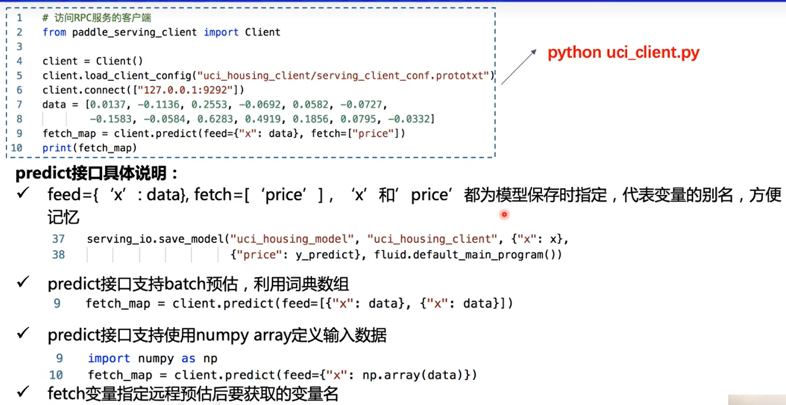

特点是**性能高、速度快**，  
但稍微复杂，要用Python写。

## 0x03 - 进阶功能

### 1. RPC和HTTP(WebService)比较

#### (1) RPC

**运行方式：**  
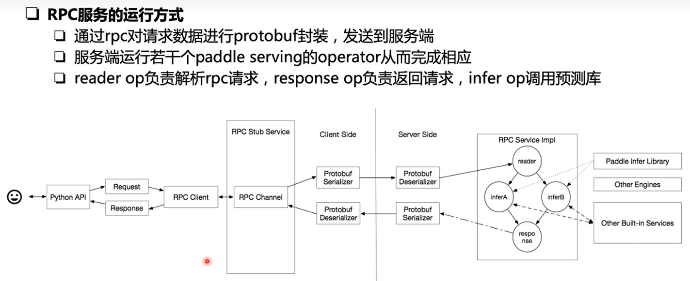

**优点：**

* 纯快

**缺点：**

* 封装深度浅  
  在实际过程中会对输入做很多前处理、对输出做很多后处理。  
  而RPC封装的深度浅，会导致各种功能（如归一化、分割后处理等）需要自己编写。  
  *正是因为快所以封装深度浅。*
* 平台支持少  
  只支持Linux、Python、C++平台。

#### (2) WebService

**优点：**

* 使用简单  
  不需要Python写代码去调用，直接用一个`POST`请求就可以完成。  
  符合“微服务架构”，直接调用API就可以。  
* 全平台支持  
  只要服务启用，很多问题在协议层面就不用考虑了（什么平台访问、什么操作系统等）。  
* 可包含前后处理  
  可以再封装一层前后处理，数据进来的时候先进行前处理，数据输出前先进行后处理（如打框等）。

**缺点：**

* 慢

### 2. ⭐WebService微服务

**注意：一般都是这种服务模式，我们比赛也应该是这种，即之前说的Serving得到的模型服务端（放在模型服务器）和模型客户端（放在Web后端服务器）都需要。**

虽然RPC快，但不易用，  
因此对于性能要求不高的场合，一般用WebService，会很方便提供HTTP服务。

但两者都只是简单的对模型进行输入输出调用，没有前后处理，  
若需要前后处理，可以考虑构建“**WebService微服务**”。

WebService微服务实际上是对RPC的一层封装，在其中加上了前后处理，  
因此用户上传图片的时候，并不需要考虑图片有没有限制（比如要多大、要归一化等）；  
返回数据时加上后处理，用户直接就可以收到所需要的模型输出。

*应该可以理解为：用户和RPC之间的桥梁，如下图：*  
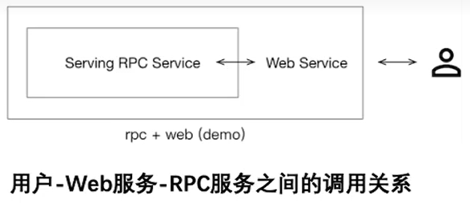

#### (1) 不带前后处理的WebService微服务

就是上面提到的最简单应用，  
直接一行代码`python -m paddle_serving_server.server ...`即可启用服务。

客户端发送HTTP POST请求过程：  
客户端调用`curl`命令发送请求，数据放在json → 客户端通过Web Service传给RPC Client（上图中RPC客户端，部署与服务端，这里相当于Web的后端） → 模型端

#### (2) 带前后处理的WebService微服务

如果模型有前处理后处理，启动服务就要写为一个python文件，其中继承`WebService`类，进行二次开发，  
在其中启动服务，并在接收请求前进行前处理，然后进行模型推理，再进行后处理。

**举例 - 图形分类：**

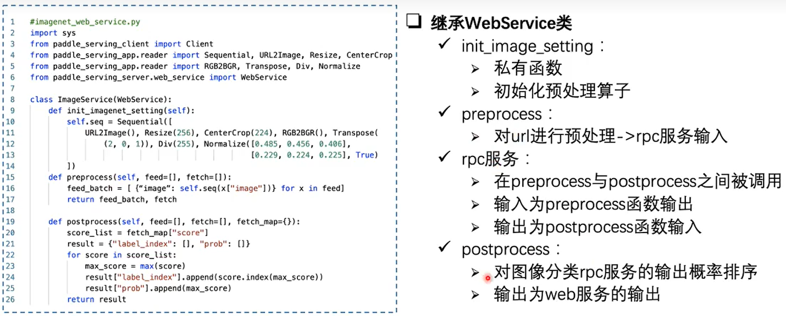  
`init_image_setting`中的`Sequential`就提供了前处理流程序列。  

流程：前处理(`preprocess`)→rpc服务(`predict`)→后处理(`postprocess`)

*注：对rpc服务的调用为之前的下图*


#### (3) WebService微服务意义

采用“微服务架构”，能够“服务调用服务”。

AI模型会保存成服务端和“客户端”，  
但这个“客户端”一般并不是直接拿给用户使用的。

因为一个应用（如网站）核心功能是利用AI模型进行图片分类，上传图片然后返回类别和概率，  
但业务架构肯定不止图片分类，还有用户登录、图像保存、检查输入等等。

AI模块的服务只是许多服务中的一个微服务，因此整个项目就是各个微服务之间的相互调用。  
将AI模型包装成一个微服务，就可以供其他系统（前端团队、后端团队）简单使用，  
其他团队也不需要关心我们算法团队是怎么实现的，**只需要提供相应的服务（接口）就好**。

*这就是各团队并行协作工作的前提。*

### 3. Paddle Serving App

是Paddle Serving中的一个库，用于提供各种预处理模块，  
上面微服务中`Sequential`里的各种前处理就是这里面的。

> 注：Paddle Serving中一共有三种库：
>
> 1. "Paddle Serving Server" - 提供模型服务端
> 2. "Paddle Serving Client" - 提供模型客户端(rpc客户端)
> 3. "Paddle Serving App" - 内置各种经典应用的预处理模块

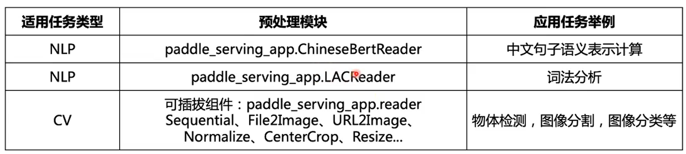

同时还提供了各种感受Serving的demo（模型demo，下载就可以用）  
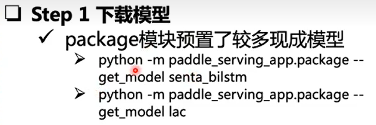

### 4. ⭐Paddle模型转换为Serving模型

之前讲的都是模型训练前，加代码然后变为Serving模型，  
但如果模型已经训练好，不想再训练，也可以**把已有的模型变为Serving模型**。

*注：因此这个就适合我们比赛中对训练好的模型进行部署了，可以重点了解尝试一下。*

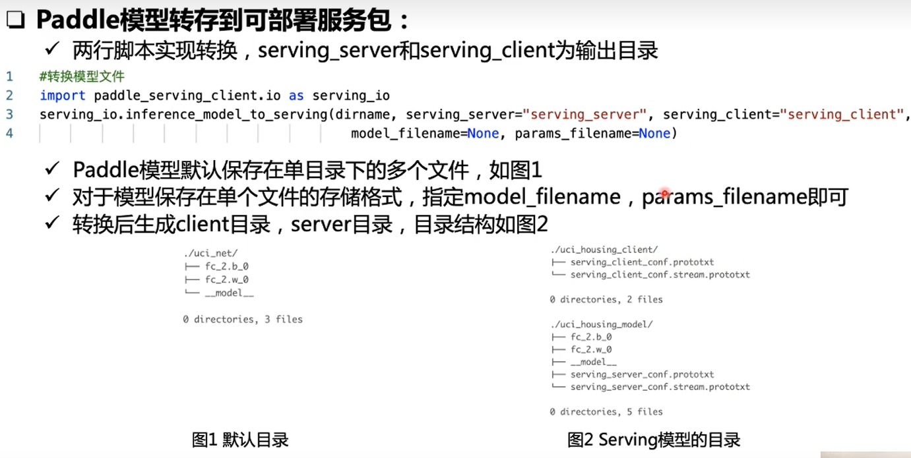  

### 5. 其他进阶功能

因为比较进阶，这里就只简单记录，需要用到再深入学习。

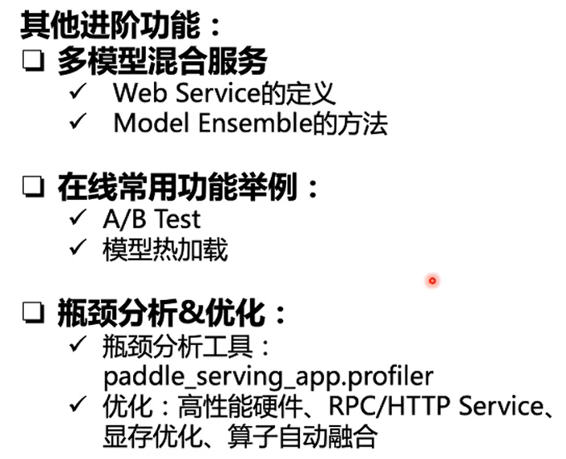

1. 针对不同类型开发者提供的功能  
     
2. A/B测试  
   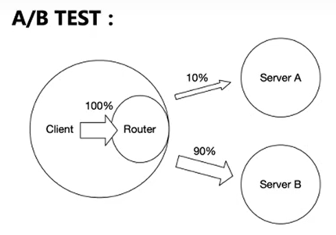  
   对于新模型迭代，客户端请求时一部分能运用新模型进行测试，一部分继续运用旧模型。
3. 模型热加载  
   切换模型时，如果关停重新加载一般需要较长时间，因此支持热加载可以在不关停旧模型的时候加载新模型。
4. 性能(Profiler)分析  
   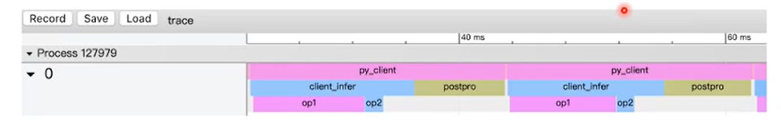

## 0x04 - 具体应用案例

*视频讲到两种具体应用案例，下面只给出时间节点，具体可以在视频中学习感受。*

1. 中文语句情感分析 - 47:19 ~ 53:26
2. Paddle OCR(提取文字信息) - 53:26 ~ 56:20
3. **图像分割** - 56:20 ~ 58:48  
   *这个跟我们的类似，可以参考。*
