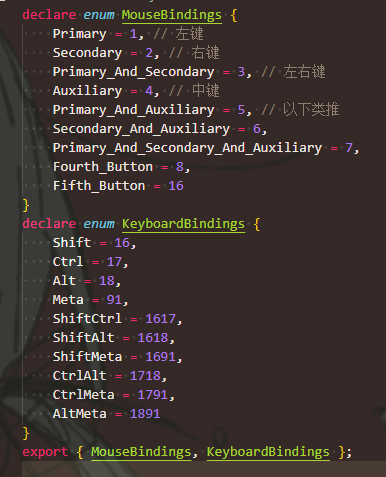

# Mode - 模式

## 1. 简介

Mode可以被认为是Viewer这个APP用来进行在某一特定任务的配置，比如追踪诊断、3D分割等。  
多种不同的Mode让这个应用能变成许多小应用。

在初始化时，Viewer会使用扩展和模式来建立所需的路由，然后通过研究列表访问，或者直接通过URL。

文档里又放了架构图，  
需要说明的是：图里的"Templates"就两个，"WorkList"代表的就是首页、"Viewer"代表的就是浏览器页面。  
现在已不用管这个【？……

Modes会试着整出来一个特定的路由，让多种不同的路由（模式）能在这一个应用里呈现，  
所以就让Viewer很强大和灵活。

### 1. Mode的组成

Mode的配置里有一个`route`属性，会在应用初始化的时候动态地被转换为Viewer的路由。  
Mode的配置指明了**需要哪些Extensions**，  
比如默认的模板里，会定义两侧的Panel、Viewports、displaySets、Hanging Protocol。

Mode其中由以下三个**基本属性**组成：

* `id` - ID
* `modeFactory` - 一个函数，也是返回Mode的特定配置的
* `extensionDependencies` - 所需要的插件

则**最顶层的模板**如下：

```js
function modeFactory() { // 关键属性的其中之一
  return {
    id: '',
    version: '',
    displayName: '',
    onModeEnter: () => {},
    onModeExit: () => {},
    validationTags: {},
    isValidMode: () => {},
    routes: [
      {
        path: '',
        init: () => {},
        layoutTemplate: () => {},
      },
    ],
    extensions: extensionDependencies,
    hangingProtocol: [],
    sopClassHandlers: [],
    hotkeys: [],
  };
}

// mode的三个关键属性
const mode = {
  id,
  modeFactory,
  extensionDependencies,
};

export default mode;
```

其中`modeFactory`的具体属性如下：

| Property | Description |
| :-- |  :-- |
| id | 跟mode.id一样的 |
| displayName | 在研究列表(WorkList)里展示的该Mode的名称 |
| [onModeEnter](https://v3-docs.ohif.org/platform/modes/lifecycle#onModeEnter) | 当从特定的路由进入该模式被调用的钩子 |
| [onModeExit](https://v3-docs.ohif.org/platform/modes/lifecycle#onModeExit) | 当从该模式退出时调用的钩子 |
| [validationTags](https://v3-docs.ohif.org/platform/modes/) | 暂时不知道什么用，都留的空 |
| [isValidMode](https://v3-docs.ohif.org/platform/modes/) | 检查该Mode在某Study下是否能使用（一般根据成像类型判断）（注意有一定问题，可见对默认mode的批注） |
| [routes](https://v3-docs.ohif.org/platform/modes/) | 定义该模式的路由，以及布局展示(layout) |
| [extensionDependencies](https://v3-docs.ohif.org/platform/modes/index#consuming-extensions) | 所需的插件（不知道外面定义了这为什么还要定义，跟外面一样就是） |
| [hanging protocol](https://v3-docs.ohif.org/platform/modes/) | 这个模式所能用的挂片协议（为数组，多个则会排名） |
| [sopClassHandlers](https://v3-docs.ohif.org/platform/modes/) | 这个模式所能用的SOP Class Handlers（为数组，一般是若干种成像类型对应一个，就是最前方定义的所有SOPClassHandler，可照抄） |
| [hotkeys](https://v3-docs.ohif.org/platform/modes/) | 快捷键，应该是导入的，可抄 |

### 2. 使用插件

就是讲了怎么把"插件.模组.东西"使用过来，格式为`${extensionId}.${moduleType}.${element.name}`。

更多的去看示例就可以，不是重点。

### 3. Route

Route配置是一个有关Route设置的数组【也就是一个Mode可以设置多个Route？】，并通过定义`layoutTemplate`设置和`init`函数来初始化Viewer总体的外观和行为，更多详细见后。

### 4. Hanging Protocols

在`hangingProtocols`属性里，可以传递自己定义的给该模式用的挂片协议。  
如果只赋一个代表挂片协议名字的字符串（而不是数组），该挂片协议是唯一的；  
如果传数组，则会根据挂片协议内部定义的`displaySetSelector`需求来排名【最终在整个Mode里应该还是只能用一种？只是在初始进模式时进行选择？……

注：如果不加这个属性的话，个人测试应该是默认用`"@ohif/extension-tmtv.hangingProtocolModule.ptCT"`（就是tmtv，插件模块表示），而不是`default`（id表示）

如上所说，应当存在两种等价表示方法：

* 插件模块表示（`'@ohif/extension-tmtv.hangingProtocolModule.ptCT`）
* ID表示（`default`）

**目前，总共三个挂片协议：**

* `mpr` - `@ohif/extension-cornerstone.hangingProtocolModule.mpr`
* `default` - `@ohif/extension-default.hangingProtocolModule.default`
* `@ohif/extension-tmtv.hangingProtocolModule.ptCT` - ~

### 5. SOP Class Handler

Mode的配置还接受`sopClassHandler`模组字段，会根据所提供的SOP Class模组用来初始化"DisplaySetService"，以处理DICOM文件到DisplaySet的转换创建。

### 6. Hotkeys

就是另一个可添加的属性字段。

*【我觉得抄*……

### 7. Registration - Mode的注册

*【没啥好说的，就用CLI*……

感觉除了在`pluginConfig.json`里可以看到，说在`pluginImport.js`也有？

## 2. 生命周期钩子

### 1. onModeEnter

用来在第一次渲染前初始化Viewer的数据、服务、外观，总之就是用来自定义Mode的。

**注意：**  
在现版本中，多了一个`ToolGroupService`服务，用来定义和管理Viewport的工具组(Tool Group)，【所以经常看到别人的`ToolGroupService`在这里配置，比如可参考默认Mode……  
这是借鉴于Cornerstone的新玩意，所以需要深究请看[官方文档](https://www.cornerstonejs.org/docs/concepts/cornerstone-tools/toolgroups/)。

**目前理解：**  
就是主要用来**初始化工具组**(ToolGroup)和**工具**(ToolBar)的。

```js
function modeFactory() {
  return {
    id: '',
    version: '',
    displayName: '',
    onModeEnter: ({ servicesManager, extensionManager }) => {
      // 获取服务
      const { ToolBarService, ToolGroupService } = servicesManager.services;

      // 初始化默认的和SR(标注)的工具组
      initToolGroups(extensionManager, ToolGroupService);

      ToolBarService.init(extensionManager);
      ToolBarService.addButtons(toolbarButtons);
      ToolBarService.createButtonSection('primary', [
        'MeasurementTools',
        'Zoom',
        'WindowLevel',
        'Pan',
        'Capture',
        'Layout',
        'MoreTools',
      ]);
    },
    /*
    ...
    */
  };
}
```

### 2. onModeExit

当从URL导航离开Route时调用，会在各个服务调用`onModeExit`**之前**被调用，因此还可以访问各种保留状态的数据，可以用来在服务清楚它们前缓存或存储。  
这里还主要用来清理非服务的特殊数据（不会自动清除），以及**让服务取消订阅事件**（这个取消订阅是在`onModeEnter`订阅时得来的）。

比如，可以用来重设`TollBarService`服务。

```js
function modeFactory() {
  return {
    id: '',
    displayName: '',
    onModeExit: ({ servicesManager, extensionManager }) => {
      // Turn of the toggled states on exit
      const { ToolBarService } = servicesManager.services;
      ToolBarService.reset();
    },
    /*
    ...
    */
  };
}
```

## 3. Route - 路由

对于"longitudinal"模式来说，`routes`部分由一个route组成，每个route都有不同的配置，主要有以下三种：

* "route path" - 路径
* "route init" - 注入进入这个路由的初始化函数（如果route内没定义，则运行默认的init（具体是哪个见后））
* "route layout" - 定义这个route下的页面布局（panels、viewports）

**结构：**

```js
function modeFactory() {
  return {
    id: 'viewer',
    version: '3.0.0',
    displayName: '',
    routes: [
      {
        path: 'longitudinal',
        /* init: ({ servicesManager, extensionManager }) => { // 可以看到这里有init函数
          //defaultViewerRouteInit
        }, */
        layoutTemplate: ({ location, servicesManager }) => { // 描述页面布局，为一个函数，最后返回布局
          return {
            id: ohif.layout,
            props: {
              leftPanels: [
                '@ohif/extension-measurement-tracking.panelModule.seriesList',
              ],
              rightPanels: [
                '@ohif/extension-measurement-tracking.panelModule.trackedMeasurements',
              ],
              viewports: [
                {
                  namespace:
                    '@ohif/extension-measurement-tracking.viewportModule.cornerstone-tracked',
                  displaySetsToDisplay: [
                    '@ohif/extension-default.sopClassHandlerModule.stack',
                  ],
                },
                {
                  namespace: '@ohif/extension-cornerstone-dicom-sr.viewportModule.dicom-sr',
                  displaySetsToDisplay: [
                    '@ohif/extension-cornerstone-dicom-sr.sopClassHandlerModule.dicom-sr',
                  ],      
              /*
              ...各种反括号
              */
```

### 1. path

一般都是通过按钮更改的，但也可以直接输URL。

*有句谜语：现在每个Mode只构建1个route，但我们可以加强route的创建，来创建单独的基于path配置的单独的route。*

**两种routes：**

* route带数据源 - `/${mode.id}/${dataSourceName}`
* route不带数据源 - `/${mode.id}`

用第一种时，如`http://localhost:3000/viewer/?StudyInstanceUIDs=1.3....`，会访问在配置里(App Config)定义的默认数据源(`defaultDataSourceName`)；  
而用第二种时，如`http://localhost:3000/viewer/dicomjson/?StudyInstanceUIDs=1.3....`，会访问指定的、在配置中注册的数据源。

### 2. init

mode内有init的钩子，在通过Study List进入该Mode后会调用，  
如果在这里没定义，就会运行默认的`init`函数（其在`Mode.jsx`中），  
但仍可以定义自己的初始化程序。

**注意：**Mode的`onModeEnter`的顺序再Route的`init`之前，  
Mode下的每个route都可以有自己的`init`，但共享该Mode的`onModeEnter`。

**默认的`init`：**

* 调用`retriveSeriesMetaData`，获取在URL定义的"studyInstanceUIDs"的这个研究的元数据。
* 订阅`instanceAdded`事件（感觉是Service->DICOM Metadata Store->INSTANCES_ADDED），用来在一个Series获取(retrieving)完所有的instances的元数据后，产生DisplaySet。
* 订阅`seriesAdded`事件（感觉一样），用来在这个Study的所有Series都获取完后，运行"HangingProtocolService"。

简化的伪代码如下：

```js
async function defaultRouteInit(
  {
    servicesManager,
    studyInstanceUIDs,
    dataSource,
  },
  hangingProtocol
) {
  const {
    DisplaySetService, // DisplaySet服务，用来产生Displa
    HangingProtocolService, // 挂片协议服务，
  } = servicesManager.services;


  // 订阅 - 当一个Series的所有Instances被加载完后触发
  DicomMetadataStore.subscribe(
    'INSTANCES_ADDED',
    ({ StudyInstanceUID, SeriesInstanceUID }) => {
      // 这里可能具体要debug才知道做的是什么
      // 个人目前理解：Store服务只是无序的把所有instances加载进来，加载完一个Series的触发这个
      // 然后则需要先getSeries，得到Series的元数据（DICOM文件数据流转换后的东西），然后通过这个里面的.instances获得DisplaySets
      const seriesMetadata = DicomMetadataStore.getSeries(
        StudyInstanceUID,
        SeriesInstanceUID
      );
      DisplaySetService.makeDisplaySets(seriesMetadata.instances);
    }
  );
  
  // 就是根据StudyUID，到数据源进行所有Series的查询【注意顺序可能不能在上个订阅的前面
  // 【这里暂时存在疑惑：每次打开的时候应该只会加载一个Study呀？为什么会遍历……
  /// 暂时的回答：实际上可以看到，左侧栏在All选项中还会打开属于该Patient的其他Study，所以这里在遍历
  studyInstanceUIDs.forEach(StudyInstanceUID => {
    dataSource.retrieve.series.metadata({ StudyInstanceUID });
  });

  // 订阅 - 当一个Study的所有Series都被加载完后触发
  // 【注意：实际的Mode.jsx并不是订阅，但也是在Series加载完后执行
  DicomMetadataStore.subscribe('seriesAdded', ({ StudyInstanceUID }) => {
    const displaySets = DisplaySetService.getActiveDisplaySets(); // 得到DisplaySets
    const studies = displaySets.reduce(/* ... */) // 得到所有Studies【reduce应该是去重】
    const activeStudy = studies[0]; // 默认让第一个Study作为活跃的（被选中的）【应该是让Viewport#0显示Studies#0（的Serial#0）……
    // 这个暂时不明，对挂片协议服务还不了解【run是干嘛的？】
    HangingProtocolService.run({studies, activeStudy, displaySets}, hangingProtocol);
  });

  return unsubscriptions;
}
```

**自定义可以做的事情：**

* 在从服务器打开特定Study后，自动获取批注(Annotations)
* 改变默认首先展示的Serial影像编号（比如默认都是0）
* 缓存下一个Study到WorkList里【？……
* 对Series进行自定义排序，再展示到Study浏览器左侧栏

无论如何，只需要像上面保证三件事就可以乱加自己的东西：

1. `dataSource.retrieve.series.metadata`获取所有Series
2. `makeDisplaySets`产生Series的DisplaySets
3. `run`挂片协议

*以下这段是文档举的一个例子，用在跳转到有批注测量的切片上【但我没看出来在哪跳转了orz*……

```js
init: async ({
  servicesManager,
  extensionManager,
  hotkeysManager,
  dataSource,
  studyInstanceUIDs,
}) => {
  const { DisplaySetService } = servicesManager.services;

  /**
  ...
  **/

  const onDisplaySetsAdded = ({ displaySetsAdded, options }) => {
    const displaySet = displaySetsAdded[0];
    const { SeriesInstanceUID } = displaySet;

    const toolData = myServer.fetchMeasurements(SeriesInstanceUID);

    if (!toolData.length) {
      return;
    }

    toolData.forEach(tool => {
      const instance = displaySet.images.find(
        image => image.SOPInstanceUID === tool.SOPInstanceUID
      );
    });

    MeasurementService.addMeasurement(/**...**/);
  };

  // subscription to the DISPLAY_SETS_ADDED
  const { unsubscribe } = DisplaySetService.subscribe(
    DisplaySetService.EVENTS.DISPLAY_SETS_ADDED,
    onDisplaySetsAdded
  );

  /**
  ...
  **/

  return unsubscriptions;
};
```

### 3. layoutTemplate

是最后的关键配置，`layoutTemplate`是一个函数，返回一个对象，用来配置展现的页面布局，主要有两个属性：

* `id` - 针对layoutTemplate的ID，注意哈，是来自于扩展的LayoutTemplateModule【但目前只看到了ohif.layout，应该可以抄？或者去了解这个模块
* `props` - 传来layoutTemplate的属性  
  `ohif.layout`是默认的layout模板，提供了左右栏和中间的Viewport视图，  
  因此，属性里应包括：
  * `leftPanels`
  * `rightPanels`
  * `viewports`

如果不是用`ohif.layout`，比如还要添加个脚注栏，  
则自己开发插件，编辑`LayoutTemplateModule`，  
然后对要用这个layout模板的模式，这里`id`用插件的id；属性里包括module里定义的区域（？）

### 4. FAQ

Q1：怎么更改WorkList（默认首页、浏览Studies的页面）的外观，或者加一个登录页？

A1：这正是OHIF-v3的闪光点（<ゝω・）☆Kira……，因为默认的`layoutTemplate`是用来展示Viewport的，所以需要新创建一个layoutTemplate，并使用为这个路由（页面）而写的自己的组件，然后Mode负责为特定的路由展示正确的Component。

## 杂项

### 个人觉得必须要带的Module

* `SopClassHandlerModule` - 用来将DICOM的SOP Class数据转换为OHIF的DisplaySet可展示数据
* `ViewportModule` - 用来管理Viewport（中间一大片）的模组

### 有关进入Mode的初始化（着重于数据的部分）

为了了解数据(StudyInstanceUIDs, SeriesUID, ...)是怎么在刚进入Mode后加载好的【此时只是DICOM-Web的元数据，还没变为DisplaySet】，  
大致在`Mode.tsx`中了解了数据初始化过程。

1. 首先进入Mode后，调用`defaultRouteInit`，首先就会导致全局状态（上下文）变量`location`变化。【个人调试时发现这个函数被重复执行了很多次，但不知道为什么orz，可以暂且当作只执行一次……
2. `location`的变化导致第182行左右的监听(`useEffect`)触发，于是会异步#1 - 从`dataSource.initialize`方法中（就是默认插件的`DicomWebDataSources.js`）根据URL返回StudyInstanceUIDs，并调用set进行设置  
   【有些怪，这个方法首先感觉UID只会返回一个不知道为什么用数组；其次这个方法也只返回当前URL的StudyUID，不知道为什么要叫初始化……
3. 在异步#1中成功加载`studyInstanceUIDs`后，会到大约202行左右，调用异步#2 - 获得layoutTemplate，也就是那个页面布局（有什么块、每个块用哪个插件的东西）  
   其中的`route.layoutTemplate()`，就是在 Mode 里的`routes`定义的那个函数，最后会返回这个布局，包含`id`和`props`。 
   然后，将其赋值给layoutTemplateData，**使得后面很多条件满足**
4. 在上面赋值后，会即刻从头加载一次。但这次到后面大约382行的`return`时，因为条件满足，会调用`renderLayoutData`函数  
   可以看到该函数中会添加`LayoutComponent`组件
5. 最后那个大监听（什么都在监听的东西，在249行附近），第一个`return`终于失效，开始执行  
   1. 初始化`DisplaySetService`展示集服务
   2. 应该是调用extensionMananger的`onModeEnter`函数进行什么初始化
   3. 设置`hangingProtocolService`挂片协议服务的激活挂片协议
   4. 调用`mode.onModeEnter`生命周期钩子
   5. 调用`setupRouteInit`异步初始化  
      其中：会进行路由的初始化(`defaultRouteInit`/`route.init`. 如定义)  
      1. 查询StudyInstanceUIDs的所有Series
      2. 上一步完成后，生成对应的DisplaySets【通过触发EVENTS.INSTANCES_ADDED订阅时，里面的makeDisplaySets实现的
      3. Promise实现，run挂片协议【但暂时还是不了解这个run……

### ⭐有关工具和工具组

`Toolbar`和`ToolGroup`几乎都是每个Mode都要配置的，都在`onModeEnter`钩子中配置，  
分别涉及到Extension的`ToolbarModule`（但这里一般都是用"default"插件的工具）和Service的`ToolbarService, ToolGroupService`。

首先是**有关Toolbar的配置**：

```js
import toolbarButtons from './toolbarButtons.js';

function modeFactory({ modeConfiguration }) {
  return {
    id: 'viewer',
    displayName: '基础影像浏览器',

    onModeEnter: ({ servicesManager, extensionManager }) => {
      const { ToolBarService } = servicesManager.services;

      /* 这要先处理有关工具组ToolbarGroup的东西 */

      ToolBarService.init(extensionManager); // 服务初始化
      ToolBarService.addButtons(toolbarButtons); // 添加按钮，有关按钮的具体介绍在下toolbarButtons.js，但此时并不会展示到工具类！（只是申明）
      toolbarService.createButtonSection('primary', [
        /* 各个要展示在上方工具栏的工具（对应toolbarButtons.js里每一个Tool的id） */
      ]);
    },
    /* 其他代码 */
  };
}
```

#### (1) toolbarButtons.js

**作用：**

* 直接定义到上方工具栏的东西（但并不能使用到Viewport，需要将该Tool与Viewport绑定到同一ToolGroup）

工具栏每一个**工具(Tool)按钮的骨架**定义如下：

```json
{
  "id": "Zoom", // 唯一标识
  "type": "ohif.radioGroup", // 种类，就是Extension的ToolbarModule里自动(?)注册的
  "props": { // 具体该工具的属性，有复杂的属性
    // ...
  }
}
```

##### 有关type

是在引用的Extensions，里的"ToolbarModule"注册的东西，  
可以看到只有`default`插件注册了6种。

常用的就四种：

* `ohif.radioGroup` - 可能是单个工具
* `ohif.action` - 也是单个工具，但带有复杂的命令（应该是调用Command吧）
* `ohif.splitButton` - 工具组(Nested Buttons)
* `ohif.layoutSelector` - 专门选择layout的

虽然在`default` Extension里注册了6种工具类别，但实际上感觉用到的就这四种。【其他具体的可以见Extension里写的……

> **我就把话说在这了：**
>
> `radioGroup`、`action`、`toggle`，这三个定义在Tool顶层属性的`type`，没有任何区别！！！……  
> 纯纯的搞人，真正决定调用方式的是`Tool.props.type`！！……  
> 因为本身这三者在`getToolbarModule.tsx`中，定义就是一模一样的！……  
> 也许在其他不知道的地方可能有区别，但反正目前我互换了之后，没发现任何区别！……  
> 或者是现在没区别，但以后会区别化【那就以后再放出来啊Kora！……
>
> 只有`splitButton`、`layoutSelector`和`divider`这三个和上面的会有区别……  
> 然后`divider`也有点问题，纯纯搞子……

##### 有关props

根据该Tool的不同`type`，会有不同的`props`配置。  
具体的话，可以在`extensions/default/src/getToolbarModule.tsx`里看到所有的type，然后导出函数里需要的参数，就是`props`。

**对于`type: "ohif.radioGruop"`（包括`action`和`toggle`）的：**

```js
  props: {
    type: 'tool', // 这个跟外面的type不同，只有以下三种
    icon: 'tool-zoom', // 该Tool展示的图标
    label: 'Zoom', // 该Tool显示的名字【Tool Tip悬浮显示的东西……
    commands: _createSetToolActiveCommands('Zoom'),
  }
```

**⭐`props.type`的三种**：

* `tool` - 就是激活工具  
  关键：点击后，会激活切换当前工具（一直高亮显示），一个时间只能有一个active的tool
* `toggle` - 切换开关量  
  关键：点击后，会切换开关状态（开的话就是蓝色显示，关的话就是白色显示），比如MPR那个
* `action` - 执行command  
  关键：点击后，不会切换到该工具（一直高亮显示），比如Capture那个

*代码级差别可见[Service](Service.md#点击后命令的调用流程)里。*

---

**对于`type: "ohif.splitButton"`的：**

```js
    props: {
      groupId: 'MeasurementTools',
      isRadio: true, // 是否是Radio类型的选项组：是的话选择子选项，会顶替该选项上去！如批注工具
      isAction: false, // 是否是Action类别的选项组：是的话选择子选项，只会执行操作，不会代替选项！如窗宽窗位（与isRadio互斥）
      primary: { // 首选工具，属性如下
        type: "", // 跟Tool.props一样，只有三种：tool、toggle、action
        id: "", // 这莫名其妙又来个id，可跟label相同【……
        label: "", // 展示名字
        icon: "", // 图标
        command: [ // 会执行的命令，有些复杂
          {}
        ],
        tooltip: "", // 工具的悬浮提示【区别于radioGruop，直接拿label作为提示
        uiType: "", // 虽然有这个属性，但一般不配置
      }
      secondary: { // 这个一般照抄，就是下箭头的那儿
        icon: 'chevron-down',
        label: '',
        isActive: true,
        tooltip: 'More Measure Tools', // 这个Tool Tip可以相应改改
      },
      items: [ // 选项卡里的东西 - 备选工具
        // ⚠注意：这里的Tool定义，跟上面的Tool定义不一样！
        // 这里每个Tool的属性跟渲染函数有关！默认的渲染函数就是上面primary里的属性，但也存在公共字段！！
        // 但如窗宽窗位的渲染函数(renderer: WindowLevelMenuItem)，就是title、subtitle这些
        /// ⚠再注意：如果isRadio，这里也需要把在primary里的写过来，不然在选别的工具组后会无之……
        {},
      ],
    },
```

有关`items`备选Tools，其每个Tool公有有以下字段：

* `id`
* `type` - 和id这两个，跟基本的Tool属性一样的
* `command` - 这个相当于直接把`Tool.props`里的`command`拿了出来

⭐渲染函数(`renderer`)，可见[UI笔记里的"ListItem"](../%E4%B8%B4%E6%97%B6%E8%AE%B0%E5%BD%95/4%20-%20UI/ui.md#内嵌---listitem)！

*这里用的是ui里的`SplitButton`，具体可以看源文件【】或者[UI笔记里的记录](../%E4%B8%B4%E6%97%B6%E8%AE%B0%E5%BD%95/4%20-%20UI/ui.md#4-splitbutton)。*  

---

**对于`type: "ohif.layoutSelector"`的：**

* `rows`：行数
* `columns`：列数

这个的悬浮提示，应该在`extensions\default\src\Toolbar\ToolbarLayoutSelector.tsx`里定义的

##### 有关commands

`ohif.splitButton`和`ohif.radioGruop`都有`commands`。

首先`commands`为数组，所以可以执行多个`command`，应当是按顺序执行(`forEach`)，  
一个`command`有三个属性：

* `commandName`
* `commandOptions`
* `context`，  

三个组合成一个`command`就是`commandManager.runcommand(...)`。

*不同`type`的执行在Service的执行区别、记忆Commands执行流程见[Service](Service.md#点击后命令的调用流程)部分。*  

#### (2) initToolGroup.js

**作用：**

* 申明创建工具组(ToolGroup)
* 并向工具组中添加工具(Tool)，工具有四种类型。

*【格式比较固定，抄新的tmtv的格式就好*……

解释一下`const tools`里的四个type：

| Tool Mode | Description |
| --- |  --- |
| Active | 该工具会进行绑定（一般都是鼠标）来相应交互。如果是批注(Annotation)工具，不在已有的批注上点击会创建新批注。【一般只有缩放、窗宽窗位、移动、滚片切片**这四个** |
| Passive (default) | 会交互，但应该不会绑定如果是批注工具，且如果对于的Handle(?)或线条被选中，其可以被移动和重新定位。【所以批注的东西一般就这 |
| Enabled | 这个工具会被渲染，但不会有交互？【所以一般不用 |
| Disabled | 既不会渲染，也不会交互【几乎不用吧 |

存在点点疑惑：

* Active比Passive就多了个`bindings`，但如果没填，是不是就是Passive
* 我大一货啊？？怎么`disabled`的反而会渲染，而不在`disabled`反而用不了？？？

**有关Bindings：**  

