# Windows 11 安装支持 Secure Boot 的 Grub 2

在一台正常安装（使用微软官方下载的镜像安装）的 Windows 11 电脑中（**启用了 Secure Boot**），安装 Grub 2（非 Grub4Dos），并利用 Grub 对 Windows 11 系统进行引导的方法。

**⚠注意**：本教程只针对个人的 Windows 11 物理机成功安装并使用，不保证通用性，即不保证在您的物理机中能成功。故建议先在虚拟机中尝试。  
如**因本教程对个人物理机造成的任何损失（如无法引导进系统）需自行承担责任**、并寻找对应解决修复方法（个人可尽量提供帮助或指导）。

**⚠注意**：**有关 Secure Boot**，在安装好 Grub 后，需要将`grubx64.efi`的密钥(SHA256 hash)添加到 BIOS 中"Authorized Signature Database"中（个人对这方面并不是很了解，不确定表达是否正确）才能进入 Grub，需要自己探索方法，可能会很复杂。  
如本人的 BIOS 中存在"Enroll Efi Image"这一功能，可以直接将某`efi`文件的 SHA256 hash 添加到 Authorized Signature DB 中，故该操作很简单。  
如果这步在全面搜索教程资料后、觉得仍难以实现，则可以考虑：1) 禁用 Secure Boot（不推荐，Win 11 有些地方会要求 Secure Boot）；2) 可以考虑通过安装 Ubuntu 等 OS 来安装 Grub，而非在 Windows 中安装 Grub。

## 1. 准备必要材料

在以后的教程中，将下方对应材料称为“材料x”。

1. [grub-2.12-for-windows.zip](https://ftp.gnu.org/gnu/grub/)  
   用于在 Windows 中安装 grub 2。
2. [grub-efi-amd64-bin_2.12-5_amd64.deb](https://ftp.debian.org/debian/pool/main/g/grub2/)  
   官网中下载的安装工具（上方1），安装完成使用时会出现如下图错误：  
     
   需要从这个文件中解包出"x86_64-efi"文件夹，替换到上面的 “材料1” 中。  
   > 参考教程：[[分享] Windows定制Grub2 (2.12版本) 出问题](http://bbs.wuyou.net/forum.php?mod=viewthread&tid=438916)中的第 11 楼。  
   > 
3. DiskGenius  
   用于对 EFI 分区添加文件。

## 2. 准备 Grub for Windows 安装工具（需要修复）

1. 解压“材料1”**到任意方便的位置**，得到下图文件夹。  
   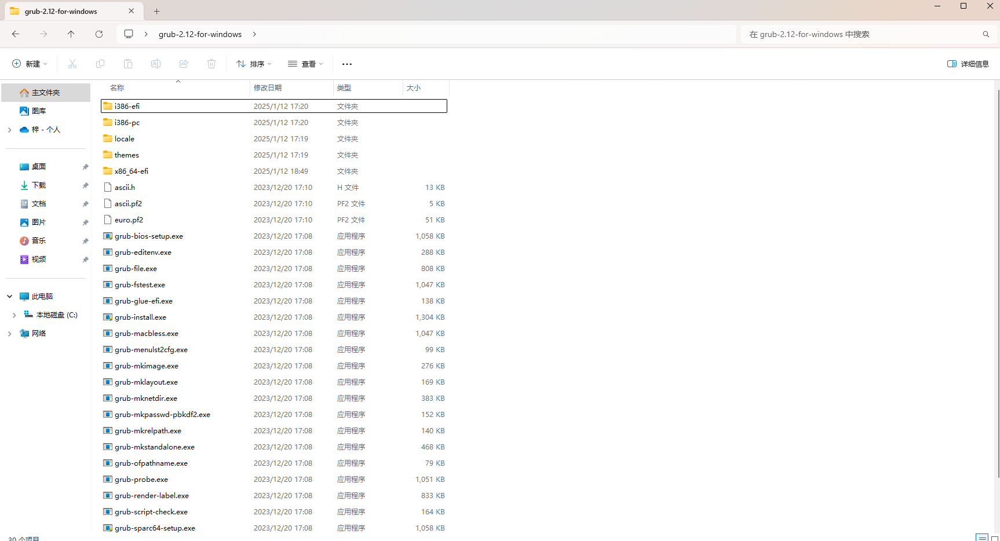
2. 解包“材料2”到任意方便的位置，得到其中"/usr/bin/grub/x86_64-efi"文件夹  
   
   > deb 解包的方法可自行搜索，如在 Windows 中可使用“[DebUnpacker](https://github.com/FlechazoPh/DebUnpacker)”这个工具。
3. 将从“材料2”中得到的"x86_64-efi"这个文件夹，替换掉原来“材料1”中的"x86_64-efi"文件夹。  
   *验证：原本“材料1”中的"x86_64-efi"中只有 280 个文件，替换后应有 283 个文件。*  
   **注意**：这一步是必须的，否则安装完 Grub 后，加载引导会出现如步骤 1.2 中提到的错误（符号`_stack_chk_guard`未找到）。

完成这节的步骤后，会得到一个修复后的 Grub for Windows 安装工具，之后将使用该工具在 Windows 11 下安装 Grub 引导。

## 3. 利用 DiskGenius 查看 EFI 分区信息

1. 打开 DiskGenius，查看原本 Windows Boot Manager 所在的 EFI 分区的位置：在哪个硬盘、哪个分区中。  
   如果为正常安装的 Windows 11，一般在系统盘（C 盘）所在的硬盘中的第一个分区，通常名为“EFI”或“ESP”。  
   该分区内会存在名为“EFI”的一个文件夹。  
   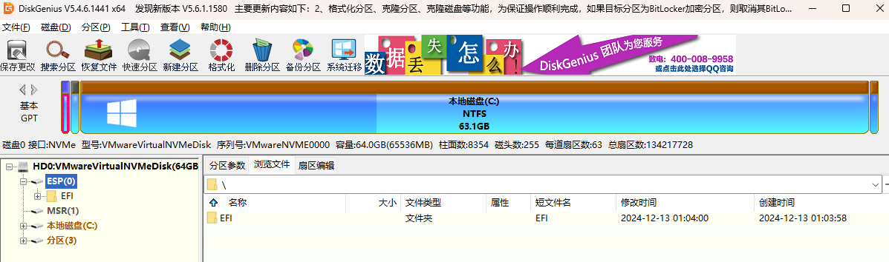  
2. 从 DiskGenius 中获取如下信息：
   1. 该分区**所在的硬盘编号**，以硬盘名称前方的"HDx"形式给出（如这里`HD0`，则编号为`0`）
   2. 该分区**所处的分区顺序**（如这里是第一个分区，则顺序为`1`）
3. 打开 cmd，输入`wmic diskdrive list brief`。  
   根据名称/容量等信息，确定 EFI 分区**所在硬盘的"DeviceID"**。  
   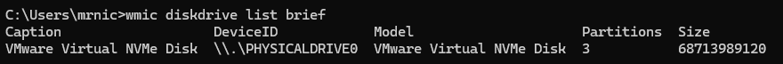  
   *通常来说，在上一步中获取的硬盘编号为`x`，这里就是`\\.\PHYSICALDRIVEx`。*

## 4. 利用 diskpart 为 EFI 分区分配盘符

*注：这一步也可以利用 DiskGenius 更简单地完成。*

1. 在**管理员身份**的 cmd 中，输入`diskpart`。
2. （验证）可以输入`list disk`，通过硬盘大小验证在步骤 3.2.1 中得到的编号是否正确。  
   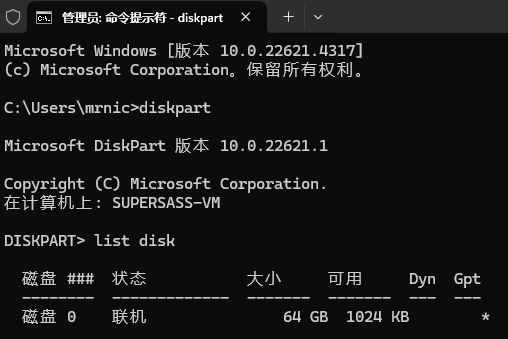
3. 输入命令`select disk x`，其中`x`是在步骤 3.2.1 中确定的编号（如果正确）。
4. （验证）可以输入`list partition`验证在步骤 3.2.2 中得到的顺序是否正确。  
   通常来说，EFI 分区的类型为“系统”。  
   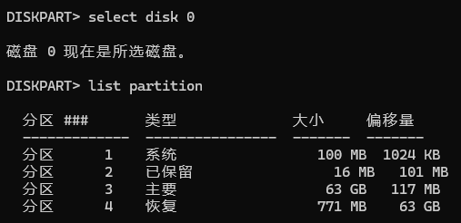
5. 输入命令`select partition x`，其中`x`是在步骤 3.2.2 中确定的顺序（如果正确）。
6. 输入命令`assign letter=x`，其中`x`是任意一个不重复的盘符，以下以`O`为例。  
   该步骤会为 EFI 分区分配对应盘符。  
   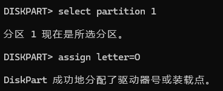

此时，可以在 Windows 资源管理器中看见盘符为`O`的 EFI 分区。  
如果是正常安装的 Windows 系统，通常大小为 100MB 左右。  


## 5. 使用 Grub for Windows 工具安装 Grub 引导

1. 在**管理员身份**的 cmd 中，进入在步骤 2 最后得到的"grub-2.12-for-windows"文件夹中。  
   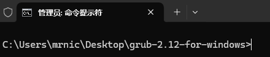
2. 输入如下命令，以安装 Grub：

   ```sh
   grub-install.exe --efi-directory=O: --boot-directory=O:/EFI --modules="part_gpt fat ext2 ntfs tpm chain play configfile echo ls cat normal linux all_video font gfxterm gfxmenu gettext gzio png search search_fs_file search_fs_uuid search_label probe test true sleep reboot halt efifwsetup" --disable-shim-lock \\.\PHYSICALDRIVE0
   ```

   **其中需要替换的内容有**：
   1. 将`O`**替换**为自己在步骤 4.6 中所分配的盘符
   2. 将`\\.\PHYSICALDRIVE0`**替换**为自己在步骤 3.3 中所获取的"DeviceID"

   > 说明：使用`--modules=`预先加载模块，是针对启用 Secure Boot 时，不允许在`grub.cfg`中使用`insmod`加载模块，并且如果没有预先加载完整模块会显示"error: prohibited by secure boot policy"无法进入 Grub，可参见[Arch Linux](https://wiki.archlinuxcn.org/wiki/GRUB#Shim-lock)文档中针对这一部分的描述。  
   > 故如果启用 Secure Boot，这里必须使用`--modules=...`指定预加载的模块。  
   >
   > 这里的`--modules=...`只列举了本人所需、且保障能正常进入 Grub 的模块，参考了[Arch Linux](https://wiki.archlinuxcn.org/wiki/GRUB#Shim-lock)文档和["在 Arch Linux 下启用安全启动并自动签名"里的内容](https://jixun.uk/posts/2022/endeavouros-secure-boot#设定机器密钥)
   > 如您个人有额外所需加载的模块（如要支持其他文件系统类型），请自行修改`modules`列表。
   >
   > 同时，使用`--disable-shim-lock`，指明使用“CA 密钥”而非“shim”方式进行安全启动，如果不添加该选项会导致因无法找到 Shim 而无法进入系统。这一部分也可以参见上方提到的 Arch Linux 文档中的描述。  
   > *【但如果您要使用 Shim 的话，那就不用带这个选项了……*
   >
   > 如果不启用 Secure Boot，则无需指定`--disable-shim-lock`和`--modules`（但需要在后续的`grub.cfg`中用`insmod`加载模块）。
3. 通常来说，等待一会便会完成安装，并提示"with no error"信息，代表 Grub 安装完成。
4. （验证）可以在 DiskGenius 中，查看 EFI 分区，  
   发现"EFI"目录下会多出一个"grub"文件夹，如下：  
   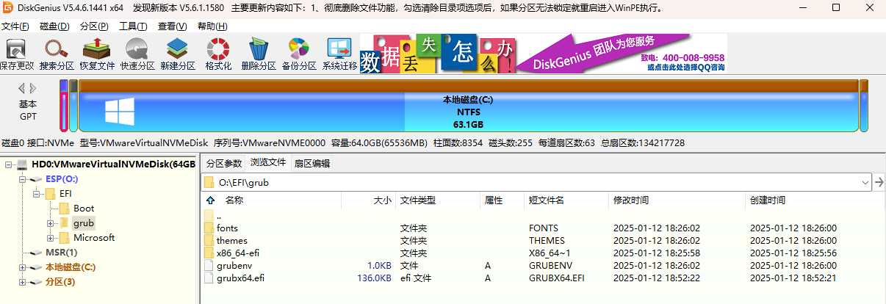

## 6. 编写并项 Grub 引导添加 grub.cfg 文件

此时安装 Grub 后，还没有对应的 grub.cfg 文件，无法进行 Windows 11 系统引导。

1. 在任意位置创建文件`grub.cfg`，填写以下内容，制作一个简单的 cfg：

   ```cfg
   ### 注意: 如果启用了 Secure Boot，则不可以使用 insmod 加载 mod（而要在 grub-install 时通过`--modules=`预加载 mod），原因可见"wiki.archlinuxcn.org/wiki/GRUB"的"2.2.2 Shim-lock"
   ### 反之，如果没使用`--modules=...`预加载 mod，则需要通过 insmod 加载。
   
   # 设置超时时间和默认选项
   set timeout=5
   set default=0
   
   # 设置引导项 - Windows 11
   menuentry "Windows 11" {
       # 由于启用了 Secure Boot，下方的 insmod 将被禁用
       #insmod part_gpt # 加载GPT分区表支持
       #insmod fat # 加载FAT文件系统模块（因为EFI分区通常是FAT32格式）
   
       set root='hd0,gpt1'  # EFI 分区为第 0 磁盘, 第 1 分区
       chainloader /EFI/Microsoft/Boot/bootmgfw.efi
   }
   ```

   **其中需要替换的内容有**：
   1. 将`set root='hd0,gpt1'`这行代码中的`0`替换为在步骤 3.2.1 中确定的“硬盘编号”、`1`替换为在步骤 3.2.2 中确定的“分区顺序”。
2. 利用 DiskGenius，将该文件复制到 EFI 分区中的`/EFI/grub`中。  
   最终该文件夹中有如下内容。  
   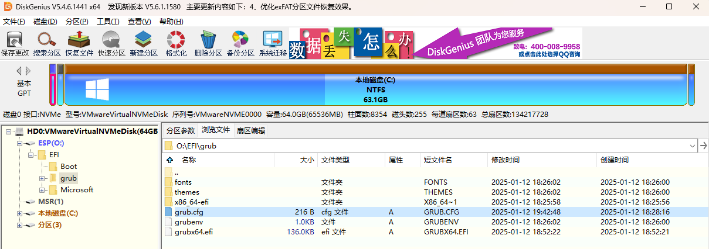

完成该步骤后，"grub.cfg"文件成功添加，没有问题的话通过 Grub 引导则能引导进 Windows 11 系统。

## 7. 在 BIOS 中添加 Grub 的 grubx64.efi 的密钥到 Authorized Signature DB

**⚠注意：如果不实现该步骤，则尝试进入 Grub 时会提示红色的"Invalid Signature detected"错误而无法进入 Grub**。

该步骤需要根据个人电脑实际情况进行实现，这里**只给出在 BIOS 中具有"Enroll Efi Image"这项功能**的实现方式。

1. 在 BIOS 中找到"Enroll Efi Image"功能，如个人的 BIOS 该功能在"Security/Security Boot/Key Management"中。  
   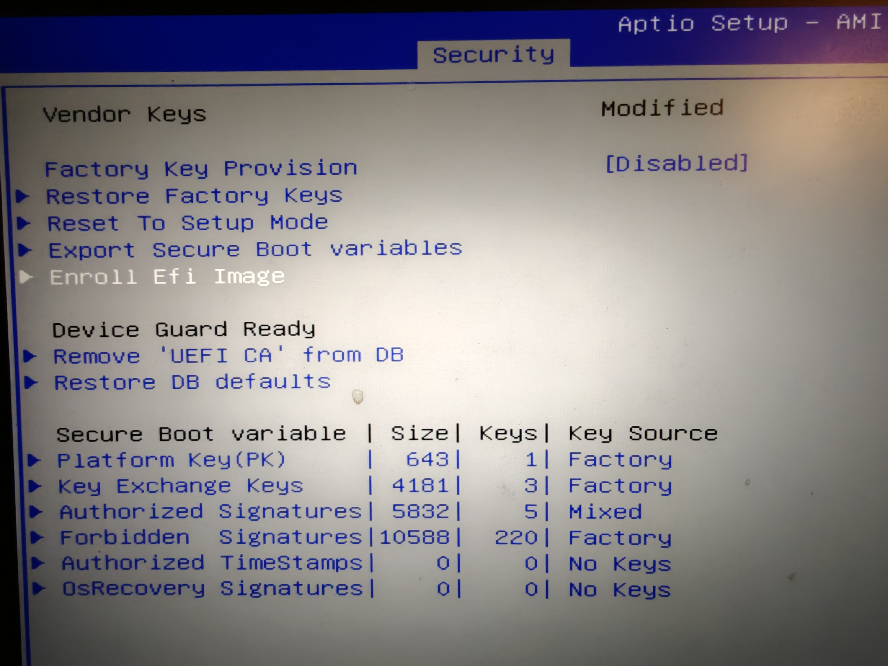
   *可能你还需要将"Secure Boot Mode"调为"Custom"，才能进入"Key Management"*
2. 选择 Grub 的 EFI 文件：即找到 EFI 分区所在硬盘分区位置，然后找到"EFI\grub\grubx64.efi"，按回车添加。  
   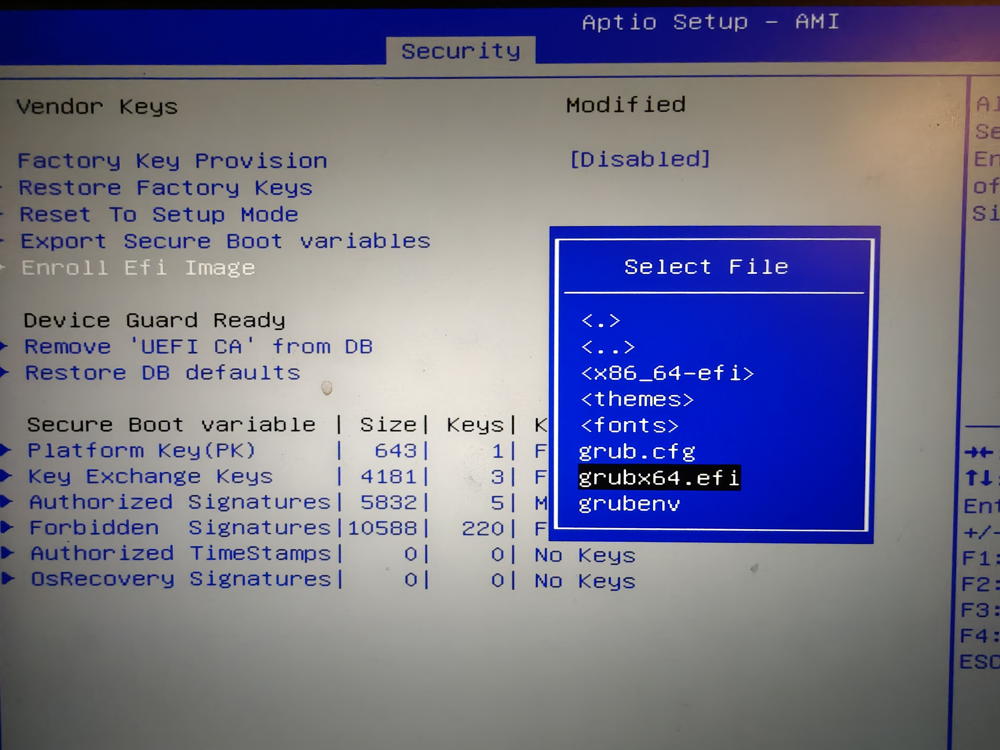

这样即完成了对 Grub 的 EFI 文件的密钥添加。  
如果可以查看"Authorized Signatures"列表，还可以在其中看到添加的 SHA256，如下。
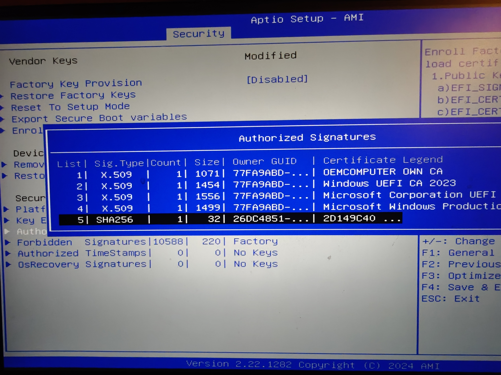

*这一部分个人并没有深入学习，故语言描述可能不正确。*

## 8. 检查是否能成功使用 Grub 引导，并重启验证

1. 使用 DiskGenius，选择菜单栏中的“工具” - “设置 UEFI BIOS 启动项”。  
   查看"grub"引导是否排列在第一位。  
   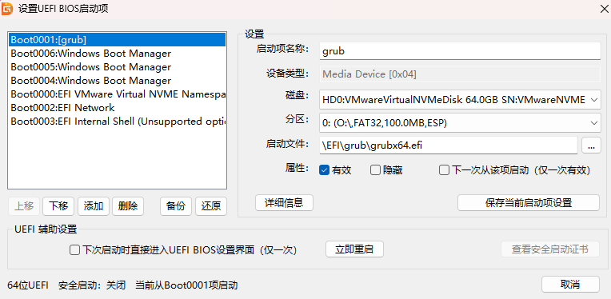  
   *注：通常来说，若还未使用过 Grub 引导，只会存在一个 Windows Boot Manager 引导，这里是因为已经使用过 Grub 引导，导致 Windows 又创建了几个相同的 Windows Boot Manager 启动项*
2. 重启设备，验证：
   1. 是否正常进入 Grub，而非弹出红色的"Invalid Signature detected"错误。
   2. 是否存在"Windows 11"引导项。  
      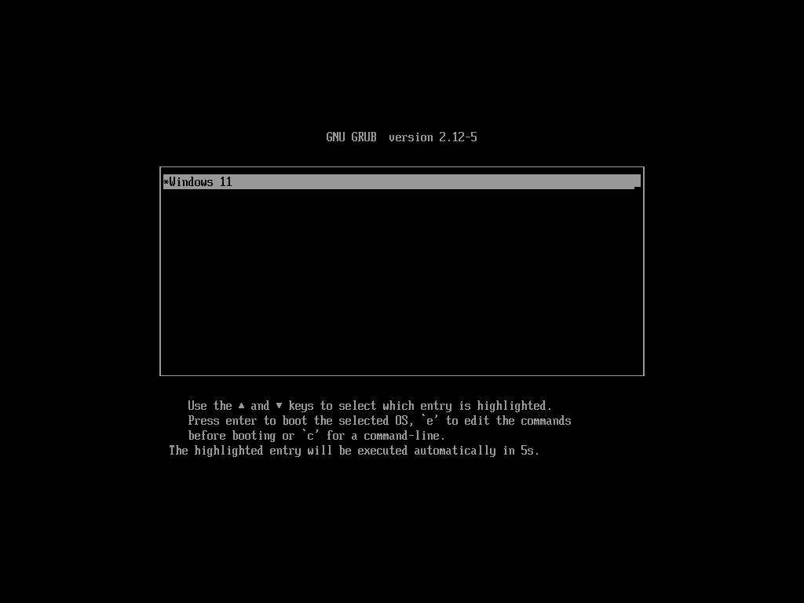
   3. 是否能通过 Grub 进入 Windows 11 系统。

如验证通过，则可以正常使用 Grub。  
接下来有关其他 Grub 的使用方式，可自行搜索相关教程（如主题更换）。

但需要注意：在通过 Grub 进入 Windows 系统后，Windows 会自动创建若干个"Windows Boot Manager"启动项，**并覆盖在"grub"启动项上方**，导致下一次启动又回到"Windows Boot Manager"引导。  
因此需要重新调整 Grub 引导顺序，如下步骤。

## 9. 利用 DiskGenuis 重新调整 Grub 引导到第一顺位

1. 利用与步骤 7.1 相同的工具，在 DiskGenuis 中查看 UEFI BIOS 启动项，  
   会发现多出了若干个"Windows Boot Manager"引导项，并且覆盖在"grub"上方（也可能不会多出，只是单纯的调整了顺序在 Grub 上方），导致下一次启动无法使用"grub"引导。
2. 此时，**只需要重新将"grub"引导放回第一顺位即可**。不需要对"Windows Boot Manager"进行禁用或删除。
   > 在“参考材料2”中，是通过将"Windows Boot Manager"禁用以解决的，但这样存在风险：如果 Grub 引导出现异常，则难以利用原本的'Windows Boot Manager"进入系统。  
   > 个人通过观察发现：在存在大约 3 个"Windows Boot Manager"后（如步骤 7.1 中的图所示）、或者反复调整顺序若干次后，再次进入 Windows 后便不会创建新的该启动项，也就不会再覆盖"grub"启动项了，故也可以解决该问题。
   > 故：**如果后续仍然存在此问题**，可以**再次通过该方法进行设置**，直至 Windows 不再创建新的"Windows Boot Manager"或置顶 Windows Boot Manager 引导顺序。

## 其他参考材料

1. [Windows环境下grub安装](https://www.jianshu.com/p/6bc9b14757c7)  
   注：该教程的 grub.cfg 配置存在问题，不过大致思路是基于此教程的。
2. [多系统、镜像引导神器，Grub4Dos For UEFI使用指南](https://www.bilibili.com/video/BV1ce411X78p)  
   该教程的"2:14 ~ 2:44"中提到了“Windows 会覆盖 grub 引导”，并给出了解决方案。
   注：该教程安装的是 Grub4Dos，而非本教程的 Grub2，故并不适用本教程。  
   该作者针对 Grub2 的安装教程使用了~~极为丑陋的~~"Grub2Win"安装管理器，个人并不喜欢，故使用了原生的"Grub for Windows"进行安装。
