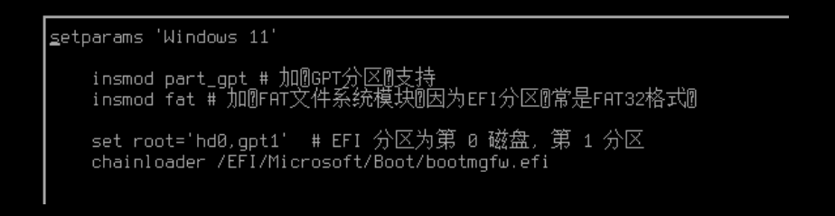

# Grub 手动安装主题

在上一个教程中对 Windows 11 系统安装了 Grub 2 引导，接下来进行手动的主题安装和配置。

## 1. Unicode 字体

1. Unicode 字体  
   
   自带的字体对中文支持不全，在这里将 Ubuntu 的 grub 里的"unicode.pf2"覆盖进来，即可解决。  
   [文件链接](c:/Users/SuperSASS/Desktop/unicode.pf2)。