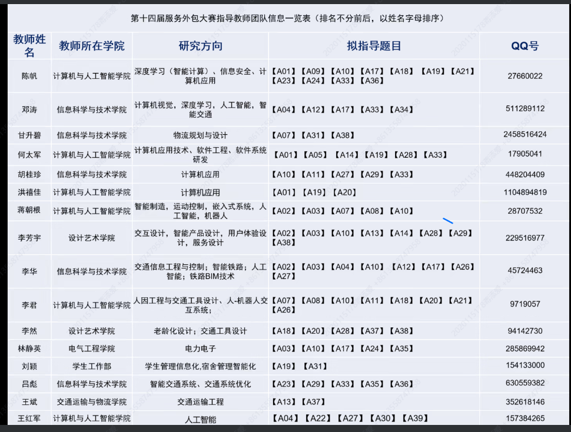
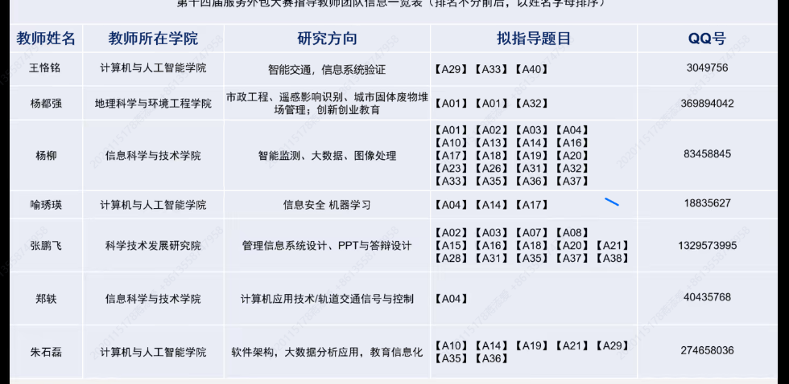
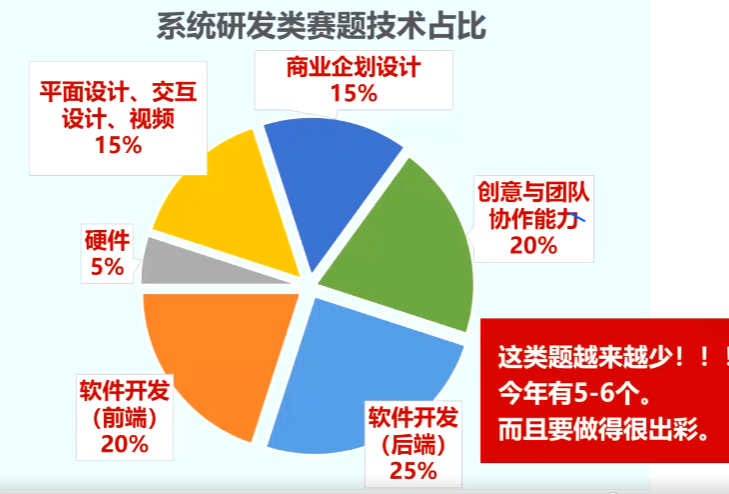
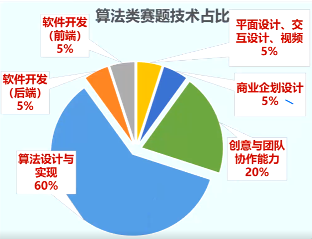
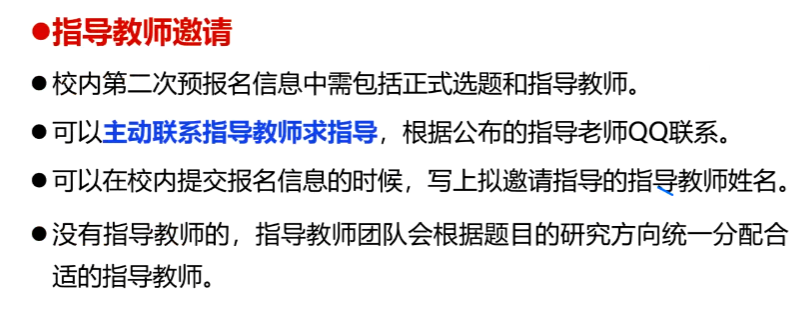
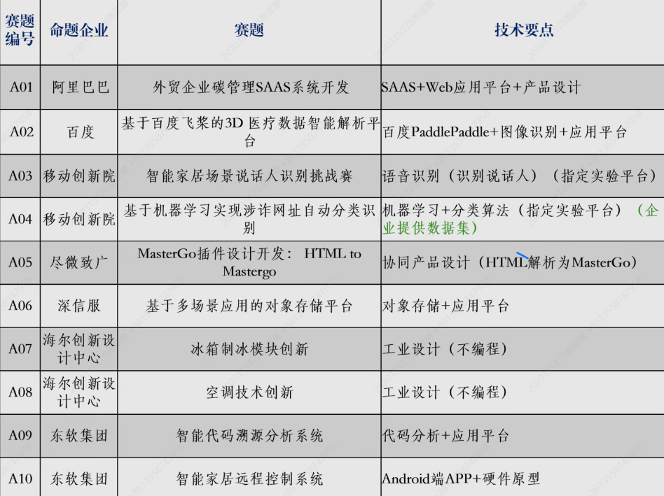
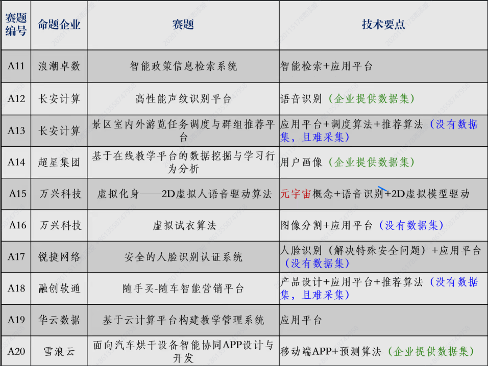
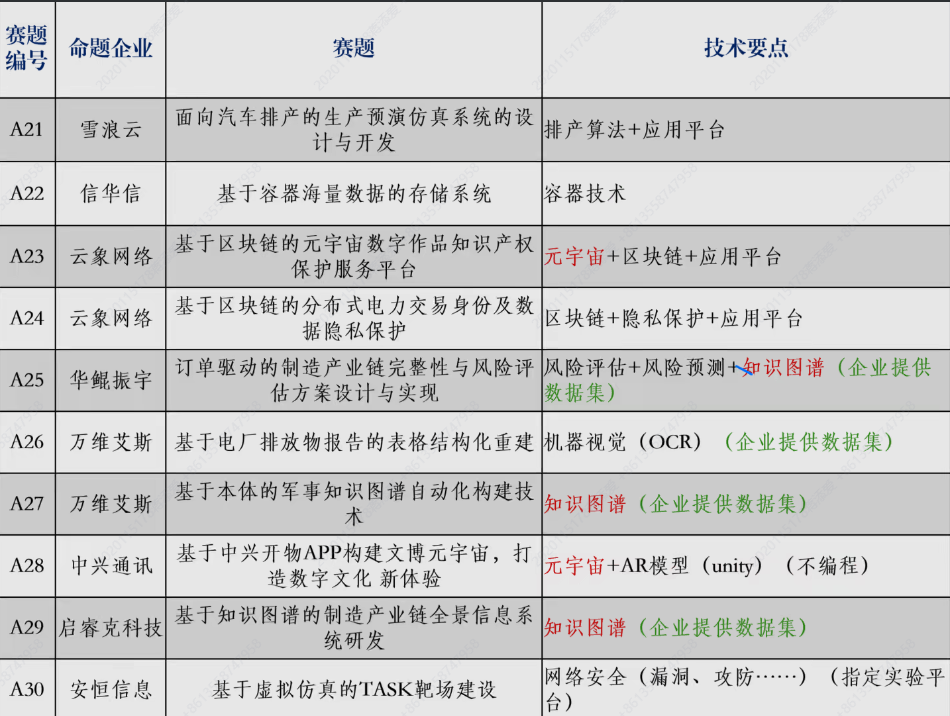
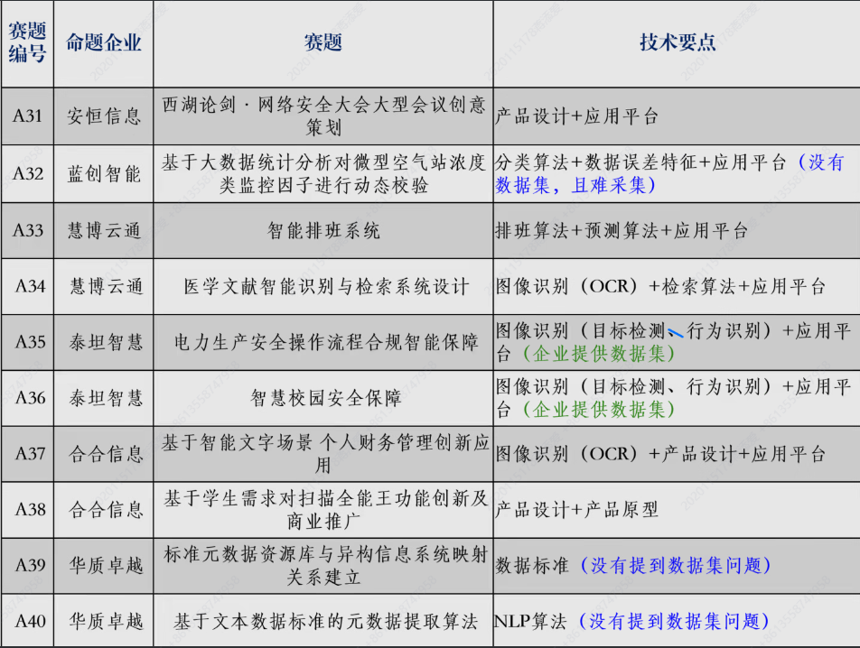

# 2022.11.29 - 宣讲会

[会议链接 - https://meeting.tencent.com/v2/cloud-record/share?id=6dbb0e25-0364-4ce1-b3c6-05c4d29f685f&from=3](https://meeting.tencent.com/v2/cloud-record/share?id=6dbb0e25-0364-4ce1-b3c6-05c4d29f685f&from=3)

## 0x01 - 比赛介绍

### 1. 三个特点

* 产品导向 - 服务**产业**、工程场景，提供现实的**可操作的解决方案**
* 技术导向 - 基于**信息技术**，或体现信息技术理念，存在**学科交叉**
* 应用导向 - 聚焦于**应用**而非学术（算法题也是解决工程上的问题）

### 2. 竞赛类别

*【肯定是选A类选题*……

* 企业命题类(A类)
  * 考察团队的专业技能和专业竞争力水平
  * 企业根据自己的**真实业务需求**发布赛题，参赛团队**按要求**回应。
  * 须接受**知识产权条款**（可以用开源代码、框架，但要**在赛题允许的条件**下，知识产权要无争议）

### 3. 评审方式

A类主要是由**企业、高校、科研机构**参与评审。  
区预赛中，高校和科研机构会更多一些；国赛中，企业会更多。

通过“**材料评审**”和“**答辩**”的方式来评审。  
答辩目前**一般是线上**。

## 0x02 - 获奖数据

学校整体实力优秀，排名靠前。

* 区域赛奖情况
  * 11届 - $36.6\%$（131只团队，区一$8(6.1\%)$、区二$15(11.5\%)$、区三$25(19.1\%)$）
  * 12届 - $36.4\%$（142只团队，区一$9(6.3\%)$、区二$10(7.0\%)$、区三$32(22.5\%)$）
  * 13届 - $49\%$（98只团队，区一$10(10.2\%)$、区二$20(20.4\%)$、区三$18(18.7\%)$）
* 国奖情况
  * 11届 - $17.6\%$（131只团队，国一$2(1.5\%)$、国二$6(4.6\%)$、国三$15(11.5\%)$）
  * 12届 - $13.4\%$（142只团队，国一$2(1.4\%)$、国二$7(4.9\%)$、国三$10(7.0\%)$）
  * 13届 - $31.3\%$（98只团队，国一$1(1.0\%)$、国二$9(9.2\%)$、国三$20(20.4\%)$）

上一届（十三届）中：  
参赛团队98个，提交作品63个，获奖作品48个，区域获奖比率$76.2\%$，国奖比率$46.2\%$。  
即：**尽可能完成并提交作品**。

## 0x03 - 指导老师

  
  

筛选了**有A02意向**的老师：

* 蒋朝根 - 28707532 - 男 - 计算机学院
  相关研究方向有：**人工智能**，  
  与A02中**算法方面**（人工智能处理医疗数据：标签、分割预测）相关
* 李芳宇 - 229516977 - 女 - 设计艺术学院
  相关研究方向有：交互、产品**设计**、**UE**(用户体验)，  
  与A02中**软件开发**（基于Web实现数据分析展示）相关
* 李华 - 45724463 - 男 - 信息学院  
  相关研究方向有：**人工智能**  
  与A02中**算法方面**相关
  *（指导细致、耐心，13届国一指导老师）*
* 杨柳 - 83458845 - 女 - 信息学院  
  相关研究方向有：数据分析、**图像处理**
  与A02中**算法方面**（人工智能处理医疗数据：医疗图象的处理）相关
  【*刘云杰已经找了这位老师了*……
* **张鹏飞** - 1329573995 - 男 - 信息学院  
  相关研究方向有：PPT与**答辩**设计、管理信息系统设计（即**Web应用**）  
  *（曾做过该比赛国一选手）*

【*个人推荐另一位就找张鹏飞老师*……

*如果后面根据情况要换题，可以再看其他老师的详细。*

## 0x04 - 比赛组织

### 1. 赛程

1. **报名**和赛题申报、**完成作品** - 2022.11.21~2023.3.10
   * 赛事指导安排
     1次宣讲、1次经验交流、2次解题
   * **预报名**（选题） - 12.11日前  
     会公布预选题结果、可**自行调整**（防止校内竞争过大）。
   * 正式报名 - 12.28日前  
     填写选题和指导教师。  
     **线上**填写信息收集表；**线下**打印参赛承诺书，团队成员与指导老师签字。
     *有参赛承诺书后才能到官网正式报名。*
2. **提交作品**和评审 - 2023.4.11~2023.4.17  
   * **制作阶段**
   * 预答辩 - 下学期开学两周后  
     此时**已经有产品原型**，是答辩环节。  
   * 提交材料
     ⭐需要**请指导老师非常仔细地看材料**，材料决定比赛能走多远。
3. **区域赛**评审、决赛 - 2023 5月中下旬
   * 第二次预答辩  
     针对区域赛决赛
4. **总决赛名单**公布 - 2023 6月中旬
   * 第三次预答辩  
     针对国赛决赛
5. **总决赛** - 2023 7月下旬

### 2. 题目构成

* 系统研发类  
  【*应该就是着重于应用、产品开发，最后写一款好看的程序这样……*  
  
* 算法类  
  【*会有应用的开发，但着重于算法上……*  
  

### 3. 队伍构成

* 1名队长 - 负责协调和安排工作
* 2~3名程序 - 算法设计、软件（前端、后端）开发
* 1名产品设计 - 原型、平面、交互设计，PPT(视频)
* 1名答辩手 - 熟悉整个项目、其中创新点

*个人根据团队情况推荐：*

* 1名队长 - 只负责好组织分工、进度安排、信息传达沟通等工作就行
* 4名程序  
  *注：以下程序分工可能不一定正确（比如可能不需要后端，直接调飞浆的API这样，到时候根据实际情况调整）*
  * 1名算法相关 - 百度飞浆、人工智能，打榜刷分
  * 2名Web前端开发
    * Web界面、UI设计（偏向设计）
    * 功能逻辑、交互设计（偏向代码实现）
  * 1名后端开发 - 在后端根据算法分析数据，实现各功能，设计接口API与前端对接
* 1名答辩 - PPT制作、答辩、了解项目整体框架与创新点

### 4. 指导老师邀请

【*刘云杰负责嗷x……*

## 0x05 - 技巧

* 团队组织合理、领导有力、分工明确
* 每位团员绝不划水
* 全身心投入、技术精益求精、答辩千锤百炼
* 题目完成度高是保证、考虑加分项突出

## 0x06 - 赛题解析

  
  
  
  

**其他题目要点记录：**

* A04 - 分类
* **A05** - 解析HTML、插件设计  
  理解网页构成(HTML和CSS)进行转换
* **A06** - 对象存储  
  类似于开发个数据库（get、create等操作、用户），概念是**对象存储**
* A09 - 代码分析（偏软件分析）
* A11 - 偏检索
* A12 - 云识别（声音）
* A13 - 应用+算法（调度、推荐）（没有数据集）
* A14 - 用户画像分析
* A15 - 语音识别+驱动2D虚拟模型
* A16 - 图像分割
* A22 - 存储
* A26 - OCR（不容易出彩）
* A30 - 网安
* A31 - 产品设计

**需要注意**：是否提供**数据集**，如果不提供是否容易获得。

## 0xff - 其他

老师推荐 - **算法结合软件研发**：

* 算法 - 可讲技术
* 软件研发 - 有产品、可推广

如：**A02**、A33（排班算法）、A34（检索算法）

*“对象存储+应用平台”不适合推广到其他比赛。*
