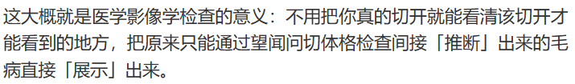
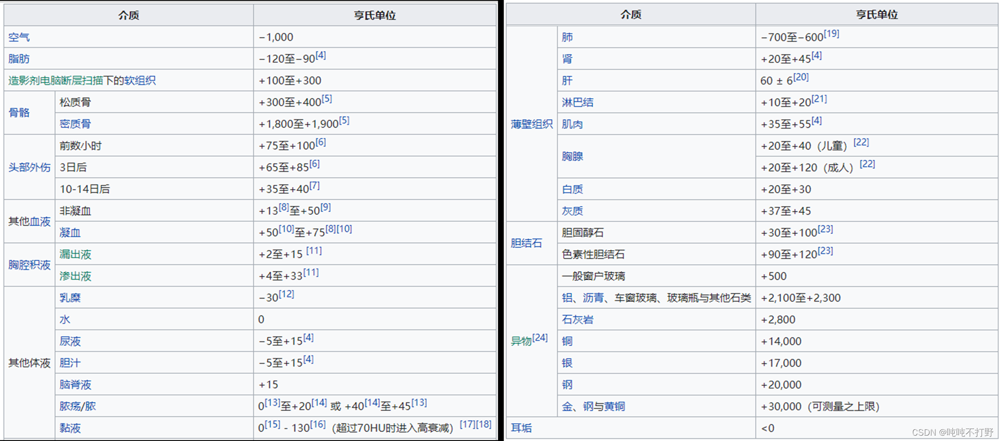
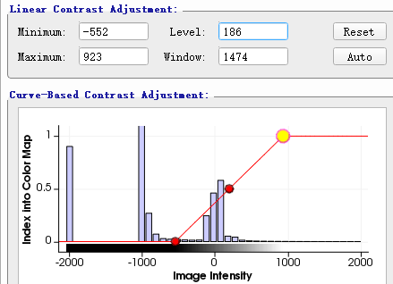
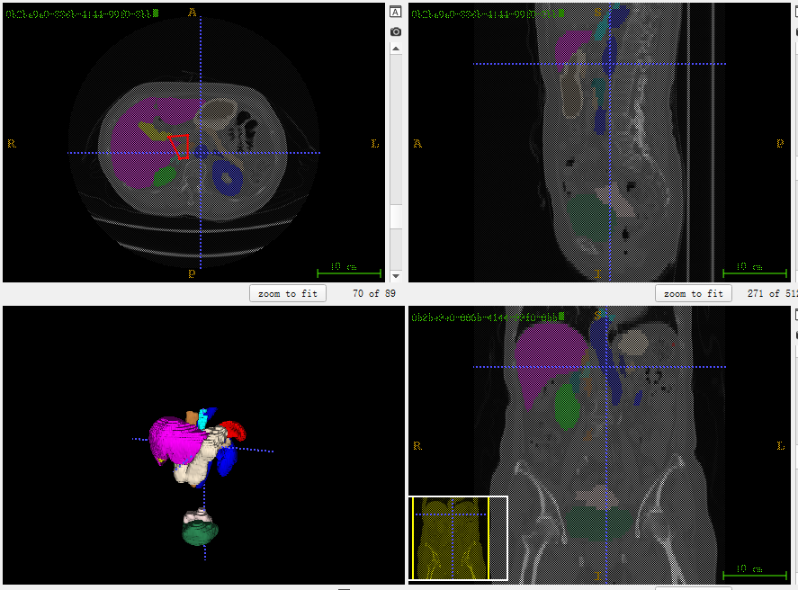
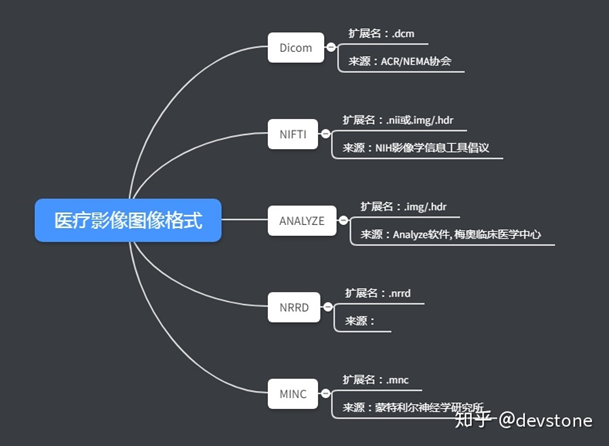
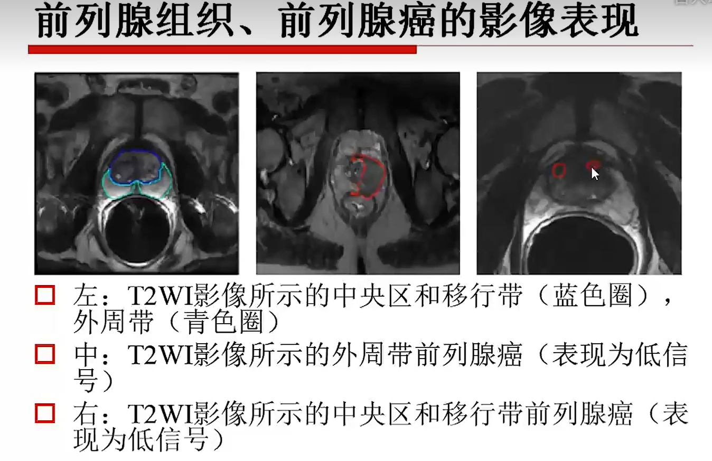
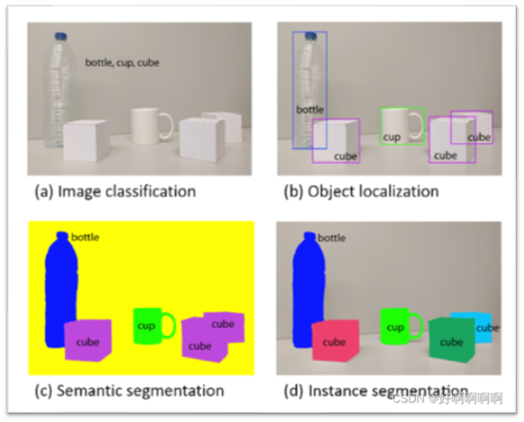

# 第一次集体会议介绍内容

## 0x01 项目基础知识

### 1. 医学影像基础

就是我们去医院拍的如X光那些片，目的是能看到我们**身体内部的组织器官骨骼等**。  

* 基础的**成像工具**：X光、CT、核磁、B超等。其中**CT、核磁**能形成**人体3D影像**，是我们处理的数据范围。*（各个成像工具的区别可以看[医生总让人拍片子，但看的到底是啥？](https://mp.weixin.qq.com/s?__biz=MjA1ODMxMDQwMQ==&mid=2657805626&idx=1&sn=db60144f3c01de3ae866ea1c1700b247)）*  
* CT的**成像原理**：发出高穿透射线，人体内部组织根据**密度**的不同，会产生不同程度吸收，故形成的片有亮暗区分。而这些**密度值**正是**检查是否病变**的关键（比如病变后密度增加）。  
    其中**暗部**为“**低密度**组织”（吸收少、感光多、沉淀多。如脂肪、气体），**亮部**为“高密度组织”（吸收多。如骨骼），中密度组织则在其间（如软骨、肌肉、各类器官）。
* CT值：CT值是对组织吸收程度，即关键的**密度**的量化指标，单位为Hu。把**水**的吸收程度定为$0$Hu；**密度最高骨皮质**（注意不是骨！骨为$350$Hu左右）吸收最高（最亮）定为$1000$Hu（即便骨皮质也有区别，这里是密度最高的定为$1000$Hu，实际范围为数百到$1000$Hu）；完全不吸收的**空气**定为$-1000$Hu。  
      
* **窗位窗宽**：可以简单理解为集中观察的灰度区间。  
    成像的图片一般用灰度图片，因此对于上述CT的定义中：$-1000$Hu即为黑色，$1000$Hu即为白色，如果以1Hu为区分则会有2000种灰度等级。为了准确区分，医学上设定为16种灰度等级（*注：网上大多说的是因为人眼只能分辨16种灰度，但我觉得明显很扯，个人就认为是因为能更准确区分吧*），故当CT值相差小于$2000/16=125$Hu影像上便不能区分。但人某组织病变与正常的CT值可能只相差个位数，这样明显不能区分。  
    因此产生**窗宽(Window)**概念，如果我们设置只观察某个范围的CT值，如$0$Hu到$80$Hu，这样最小能分辨的CT值则为$80/16=5$Hu，从而能够分辨病变组织。高于范围则全白；低于范围则全黑。  
    设置窗宽后，则要设置窗位，也就是范围的中值，这样才能确定要观察什么组织（比如骨的为$350$Hu左右、肝脏为$60$Hu左右）。  
    故一般**窗位(Level)**的值就是**要观察组织的CT值**；窗宽的值则根据需要具体设定（靠医生的经验）。  

    ITK-SNAP软件中设置窗位窗宽如下图。
      
    窗位为$186$Hu、窗宽为$1474$Hu，在最小值左侧的全黑、在最大值右侧的全白。
* *核磁(MRI)成像原理较为复杂，在这里就不讲了，尤其是其中的T1、T2等各种序列，但个人理解认为最终成像到电脑的文件也**跟CT一样**（故虽然CT值是针对CT讲的，但MRT成像也可以条窗位窗宽）*
* **轴位面**（横断面）、**冠状面**、**矢状面**：  
    指的是3D影像的观察方式，就跟正视图、俯视图、侧视图一样。  
      
    对应关系：正视图 - 冠状面；俯视图 - 轴位面；侧视图 - 矢状面。  
      
    左上为轴位面；右上为矢状面、右下为冠状面。
* 成像文件格式：NIFIT - .nii.gz(.nii跟其一样)；Dicom - .dcm；.mhd+.raw（两者是配套为一对的）  
  

### 2. 医学影像处理  

如果不做任何处理，医学影像直接看就是各种灰色块，需要各种调窗位窗宽才能观察想要的。所以为了给诊断医师更准确更迅速的影响结果，影像医师可以对医学影像进行处理。最主要的处理便是**标注（即分割）**，**也是本项目主要围绕的功能**。

* 标注/分割 - 将同类型区域从原始的灰度图中，打上同一类型的“标记”（即打标签）从而“分割”出来。  
    比如上图中ITK-SNAP的示例，就将各个器官给标注成了不同颜色，便于更快地定位到各个器官（左下3D图也是在打完标签后才生成出来的，不然即便强制根据三视图生成出来也是只五彩斑斓的灰）
* 目的：在分析某一组织器官的病变时，需要**先将这一组织器官给找出来**、从灰度图中分辨出来。  
      
    如上图右侧红圈，为前列腺病变表现。可以看见其表现很小，故应先把前列腺识别出来，再从中分析找病灶位置。

### 3. AI+医学影像处理

传统医学种标注需要一张张图片给手动标注出来（因为3D医学影像本质就是若干张二维X光叠起来的，所以需要一张张涂，后面也出现一些辅助手段，比如临近层的可以同时标注），因此产生需求：能不能自动各类组织（包括病灶）标注出来。  
而AI领域有门技术就是“**图像分割**”（具体示例可以百度看），其实现的功能跟这里的需求很相近，故诞生了AI医学影像分割技术，也就是本项目实现的核心功能。

### 2. 任务介绍

3D医疗数据解析平台：

1. 面向对象：需要进行医疗影像解析的医师（非AI专业人员）
2. 实现平台：Web
3. 核心功能
   * 医疗影像处理系统
     * 医疗影像导入：支持各种常见格式
     * 医疗影像可视化系统：可视化原图和标签
       * 展示：三视图、3D视图
       * 操控：拖动（三视图会带动3D视图原点变化）、切片切换、缩放、窗宽窗位
     * 医疗影像AI分割
       * 模型加载（应该是有多种不同效果模型，用户可选）
       * 模型推理（进行分割，得到AI分割后的标签，分割结果需要传入可视化系统）
       * 分割结果手动优化
         * 笔刷
         * 橡皮擦
         * 提取最大连通域
     * 标签管理系统
       * 增、删、改标签
       * 标签颜色切换
       * 导出标签
     * 医疗影像分析系统
       * 测量：某分割目标在三切面上的**直径、面积，体积**
       * 计数：不同类别数据个数（如某类病灶个数（肾上2处坏死这样））
       * 后处理【？……
       * 统计结果展示与筛选：针对用户上传的**所有医疗数据**进行上述分析，进行图表**展示**，并支持**筛选**【最好找实际应用参考，确定要展示什么之类的……
       * 多模态：根据“指定数据集”的不同，可以呈现不同的统计结果（比如选腹部多器官则统计每类器官个数（肾为2，肝为1这样）；选肾结石则统计肾结石个数。【不一定是想的这样，总之还是要问出题人或者找实际应用……
   * 数据存储功能（因为“统计结果展示”中会分析所有上传的数据，所以应当要将上传的数据给存储下来）
   * 账户功能（因为有数据上传存储的要求，所以应当要分帐号进行上传存储）

## 0x03 项目流程与分工

具体见“项目流程与分工”文件。

## 0x04 其他要点

* 架构草图讲解
* 周会
* 团队氛围
* 队内沟通
* 位次
