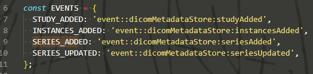

# OHIF Viewer

## Architecture - 项目架构

```t
│
├── extensions                # 其他各类插件，比如Cornerstone的东西
│   ├── _example              # Skeleton of example extension
│   ├── default               # default functionalities
│   ├── cornerstone           # 2D/3D images w/ Cornerstonejs
│   ├── cornerstone-dicom-sr  # Structured reports
│   ├── measurement-tracking  # measurement tracking
│   └── dicom-pdf             # View DICOM wrapped PDFs in viewport
│
├── modes                    # 包含一系列工作流，可注册于OHIF的路由中的“模式”
│   └── longitudinal         # longitudinal measurement tracking mode
│   └── basic-dev-mode       # basic viewer with Cornerstone (a developer focused mode)
│
├── platform                 # 由OHIF提供的基本框架，即平台
│   ├── core                 # Business Logic
│   ├── i18n                 # Internationalization Support
│   ├── ui                   # React component library
│   └── viewer               # Connects platform and extension projects
│
├── ...                      # misc. shared configuration
├── lerna.json               # MonoRepo (Lerna) settings
├── package.json             # Shared devDependencies and commands
└── README.md
```

### Extensions

`extensions`目录包含了许多提供必要功能的包，如渲染图像、Study/Serial浏览器、测量追踪，  
这些可被Modes使用以创建特定的工作流

OHIF提供了许多基本的Extensions：

| Extension名称        | 描述                                                                                                                            | Modules                                                                                                                                                         |
| ---------------------- | --------------------------------------------------------------------------------------------------------------------------------- | --------------------------------------------------------------------------------------------------------------------------------------------------------------- |
| `default`              | 基本插件，提供默认的Viewer Layout(影像查看器), Study/Series Browser(Study/Serial浏览器), 配置映射到"DICOMWeb服务器后端"的数据源。 | `commandsModule`, `ContextModule`, `DataSourceModule`, `HangingProtocolModule`, `LayoutTemplateModule`, `PanelModule`, `SOPClassHandlerModule`, `ToolbarModule` |
| `cornerstone`          | 提供2D/3D渲染功能                                                                                                           | `ViewportModule`, `CommandsModule`, `UtilityModule`                                                                                                             |
| `dicom-pdf`            | Renders PDFs for a specific SopClassUID.【暂时不懂……                                                                     | `Viewport`, `SopClassHandler`                                                                                                                                   |
| `dicom-video`          | 渲染"DICOM Video"文件.                                                                                                        | `Viewport`, `SopClassHandler`                                                                                                                                   |
| `cornerstone-dicom-sr` | 提供"Cornerstone"的插件，可视化"DICOM Structured Reports"(DICOM结构化报告文件)                                    | `ViewportModule`, `CommandsModule`, `SOPClassHandlerModule`                                                                                                     |
| `measurement-tracking` | 在右侧的"Measurement"栏中，追踪"Measurements"(即批注, Annotations)                                                    | `ContextModule`, `PanelModule`, `ViewportModule`, `CommandsModule`                                                                                              |

### Modes

一旦用户打开了`viewer`的注册的路由，这些Mode就会被使用。

> Modes与Extensions的关系：
>
> 插件提供各种功能，用来构建自己的Viewer，但面对医疗影像，我们经常有一些特殊需求，需要我们用一些核心功能、增加特殊的UI、使用自己的工作流。  
> 对于现在的`OHIF-v3`，引入了Modes的概念，通过重用来自Extension的核心功能，来构建这样的工作流。
>
> 一些典型的工作流如：
>
> * 对病变的追踪测量(Measuerment)
> * 对大脑异常的分割(Segmentation)
> * 使用AI探针(Probe)来探测前列腺癌
>
> 在上面这些工作流中，都会共享同样来自`defalut`Extension提供的核心渲染Module，但是，只有分割模式需要分割工具(Segmentation Tools)。  
> 所以，Modes是Extensions的上层，你可以自己配置来达成不同的工作流。

### Platform

#### @ohif/viewer

是有关Modes,Extensions和构建应用的核心库。  
Extensions可以传送到应用配置中，并被应用在需要的时候初始化和使用。  

在初始化时，Viewer会配置好Extensions和Modes，并构建相应路由，可以在Study List【注：就是首页】使用，或直接通过URL参数使用。  
在发布时，Modes会根据配置(Configuration)添加到应用中。

#### @ohif/core

这个库里维护并测试了基于Web的医疗影像相关的功能和类，包括在Viewer应用中用到的Managers和Services。

#### @ohif/ui

一个UI组件(Components)库，包含了所有用来构建自己的Viewer的组件，所有组件对于任意的逻辑都可以被复用。  
可以更快捷地开发一个OHIF应用，但并不是一定要使用这些组件。

### 其他问题

* 可以用Vue.js/Angular.js，但比如核心业务逻辑`@ohif/core`可直接用，但组件库`@ohif/ui`需要自己重构。

## Configuration - 配置

### 1. Configuration Files - 配置文件

Viewer的特性、注册的插件的特性，都被放在配置文件中。

配置文件存放在`<root>/platform/viewer/public/config`，可以看到有很多配置文件，  
使用的配置文件根据环境变量`APP_CONFIG`决定，默认是`config/default.js`。

## OHIF CLI - OHIF手脚架

用来“创建/删除/安装/卸载”各种“扩展/模式”的工具。

输入`yarn run cli --help`可以看到帮助列表。

### 1. create-(mode/extension)

用来创建新的Mode（模板）或Extension（插件）。

注意这个与实际项目无关，这里创建的是一个通用的Mode，  
所以需要输入绝对路径，需要添加到该项目时使用`link-mode`。

### 2. (link/unlink)-(mode/extension)

将本地(local)的mode或extension，链接或取消链接到这个Viewer中。

暂时不清楚在部署时的作用等，先放着。

### 3. (add/remove)-(mode/extension)

`add`将在线发布(存在于npm中)的mode或extension，安装到本项目中，  
安装mode时，会自动安装依赖的extension。  
直接安装发布的插件也可以。

官网上有个例子，[安装提供的`mode-clock`的示例mode](https://v3-docs.ohif.org/development/ohif-cli#add-mode)。

`remove`就是移出，移出mode时会自动移出依赖的包。

### 4. list / search

`list`展示已安装(`add`)的mode和extension（不清楚是否会展示链接进来的）；  
`search`搜索已发布的npm包（mode和extension），还可以加上`--verbose`获得更多详细信息。

### 5. 其他

* 有关`PluginConfig.json`，存放在`platform/viewer/PluginConfig.json`，手脚架自动管理，不需要手动修改
* [有关npm的私有仓库，如果需要用到可以参考](https://v3-docs.ohif.org/development/ohif-cli/#private-npm-repos)

## 插件开发方法

在[Contributing](https://v3-docs.ohif.org/development/contributing#when-changes-impact-multiple-repositories)中展示了，在本地开发插件的方法。

## Platform - 整个平台

### Scope of Project - 项目范围

「图」

"Viewer"平台只保有了很少的私有数据，范围仅局限于缓存用户偏好项、以前的查询参数等内容，  
因此"Viewer"本身是高度可配置的，通用的，能通过任何可以通过Web访问的数据源访问（Image）数据。

OHIF本身是HTML+CSS+JS的集合，是静态的资源，所以只要放在能存放展示静态资源的网站上即可。  
其类似于PWA(Progressive Web Application, 渐进式网页应用)。

> 拓展 - PWA：
>
> 是谷歌提出的新时代的Web应用方式，让网页变为类似于手机的原生App应用，  
> 可以像App一样“安装”在手机上，以某种程度离线使用，拥有通知推送，以及就像原生App而非Web运行（有应用图表、打开没有地址栏等）。  
> 就类似于Chrome中“添加到桌面上”，以及Chromebook中各种网页应用。
>
> 核心原理是Servive Worker，内部的Cache技术让其可以离线使用，Web App Manifest允许定义应用的metadata，使其类似于App。

因此"Viewer"只是个**不提供任何Image数据的浏览器**，  
所有的studies, series, images, imageframes, metadata都要来自于外部的数据源，有许多方式来提供这些数据，  
"OHIF Viewer"提供对受 *OpenID-Connect* 保护的服务的配置和支持。

*OpenID-Connect的概念在之后再做了解。*

### Theming - 主题

跟**CSS**相关的，本项目采用的是“Tailwind CSS”，  
简单理解用法的话，就是直接在HTML标签的`class`属性里，加上对应样式的值，从而应用各种样式。

在本项目应该配置了一些Tailwind CSS属性，部分代码如下：

```js
module.exports = {
  prefix: '',
  important: false,
  separator: ':',
  theme: {
    screens: {
      sm: '640px',
      md: '768px',
      lg: '1024px',
      xl: '1280px',
    },
    colors: {
      overlay: 'rgba(0, 0, 0, 0.8)',
      transparent: 'transparent',
      black: '#000',
      white: '#fff',
      initial: 'initial',
      inherit: 'inherit',

……
```

需要自定义的时候可以去改改看。

同时，最后举了一个设置“White Labeling”（相当于项目logo）的教程，  
直接在所使用的配置文件`default.json`中，按照教程修改即可。

其中用到了React的`createElement()`，来创建HTML元素，简单解释一下：  
三个参数：

* 第一个 - 标签名，字符串，如`'a'`
* 第二个 - 各类标签属性，对象，如`{className: 'w-8 h-8', href: '/'}`
* 之后若干个（可选） - 若干子元素，每个使用`React.createElement()`创建。

### Internationalization - 国际化

*之后有需要再补充*……

### 四个重要层次

很重要的四个层次：

* Extension - 插件
  * Modules - 模块
* Mode - 模式
* Service - 服务
* Managers - 管理容器

---

## 杂项

### 插件/模式开发

~~在[Contributing](https://v3-docs.ohif.org/development/contributing#when-changes-impact-multiple-repositories)中展示了，在本地开发插件的方法。~~

不知道是这个方法是远古方法还是什么，总之不用这样……  
直接在Viewer的`cli`中`link`模式或插件，然后就可以联调了……

### propTypes - 类型严格检查

#### (1) Panel

可选传三个Manager，如下：

```js
PanelTest.propTypes = {
  commandsManager: PropTypes.shape({
    runCommand: PropTypes.func.isRequired,
  }),
  servicesManager: PropTypes.shape({
    services: PropTypes.shape({
      SegmentationService: PropTypes.shape({
        getSegmentation: PropTypes.func.isRequired,
        getSegmentations: PropTypes.func.isRequired,
        toggleSegmentationVisibility: PropTypes.func.isRequired,
        subscribe: PropTypes.func.isRequired,
        EVENTS: PropTypes.object.isRequired,
      }).isRequired,
    }).isRequired,
  }),
  extensionManager: PropTypes.shape({
    getModuleEntry: PropTypes.func.isRequired,
  }),
};
```

### 等待页面相关、事件(Event)特殊订阅方式

在加载进应用，或者加载进影像的时候，会弹出等待页面。  
实际上就是UI组件`LoadingIndicatorProgress`。

在App处有一个属性`showLoadingIndicator`，在配置中定义，为真则显示。  
或通过状态`useState`，然后通过`setShowLoadingIndicator`，在组件处加上判断，从而使得加载出影像后（订阅`HangingProtocolService.EVENTS.HANGING_PROTOCOL_APPLIED_FOR_VIEWPORT`事件），进行设置。

一个加载的事件发布顺序：

1. 若干个`DicomMetadataStore.EVENTS.INSTANCES_ADDED`，加载Serial中的任意一组Instance发布
2. 一个`DicomMetadataStore.EVENTS.SERIES_ADD`，加载完该Series发布
3. 一个`HangingProtocolService.EVENTS.PROTOCOL_CHANGED`
4. 一个`HangingProtocolService.EVENTS.HANGING_PROTOCOL_APPLIED_FOR_VIEWPORT`

发现一个特殊的事件说明方法：
  
订阅的时候，直接`Event.STUDY_ADDED`

### 自定义服务

可用自定义服务(Customization Service)，来做很多事情。

比如说自定义路由，在`extensions/default/src/getCustomizationModule.js`中，定义了一个自定义路由`customRoutes`，  
路由是`/custom`，内容就是一句"Hello Custom Route"。

然后有很多种方法激活这些自定义服务，比如简单的在`appConfig.js`的`customizationService`里添加【`default.json`里面有一个示例，取消注释后，就可以访问`http://localhost:3000/custom`……

---

添加一点目前有关自定义路由了解到的东西：  
格式都是如下：

```js
// .../getCustomizationModule.js
// -----------------------------
export default function getCustomizationModule() {
  return [
    {
      name: 'Routes',
      value: {
        id: 'customRoutes', // id必须为这个！！！！
        routes: [ // 路由列表
          {
            path: '/custom1',
            children: () => (
              <h1 style={{ color: 'red' }}>Hello Custom Route#1</h1>
            ),
          },
          {
            path: '/custom2',
            children: () => (
              <h1 style={{ color: 'blue' }}>Hello Custom Route#2</h1>
            ),
          },
        ],
      },
    },
  ];
}
```

但！存在问题：因为都是相同id，所以在配置文件中的`customizationService`，添加该`name`的自定义路由后，  
因为id相同，后添加的`routes`列表会**覆盖**前面的！！

所以，感觉只能一个插件专门管理自定义路由，然后只在`customizationService`添加这一个自定义路由，  
而不能若干个自定义服务都添加自定义路由。  
现在暂无解决方法。

### WorkList和Viewer、与路由的理解

在架构图中的Templates，出现了这两个。  
个人理解：WorkList就是主界面（选择影像(工作)列表）；Viewer就是浏览器界面。

这里的两个就是路由的基础（第一级），可以在`platform/viewer/src/routes`里看到。  
可以看到还存在几个路由，如：

* `loacl`/`debug`
* `Mode` - 对应各个模式的路由
* `WorkList` - 主页面（根）路由
* `NotFound` - 404路由【但根本没发现这个orz……
