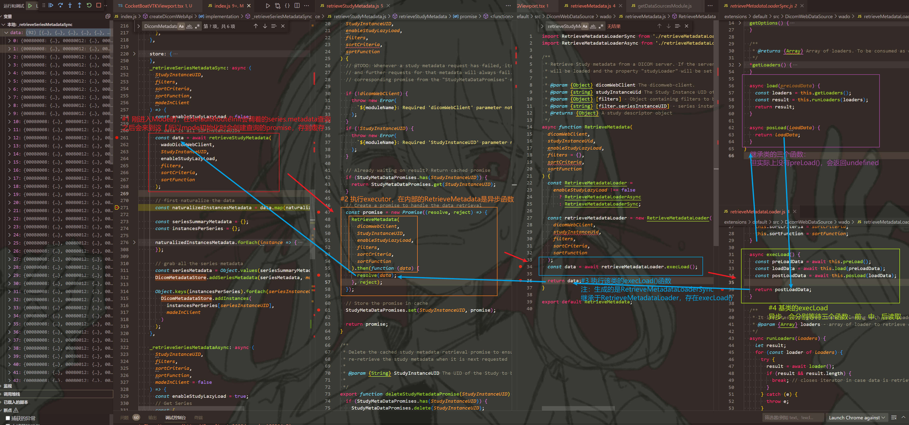
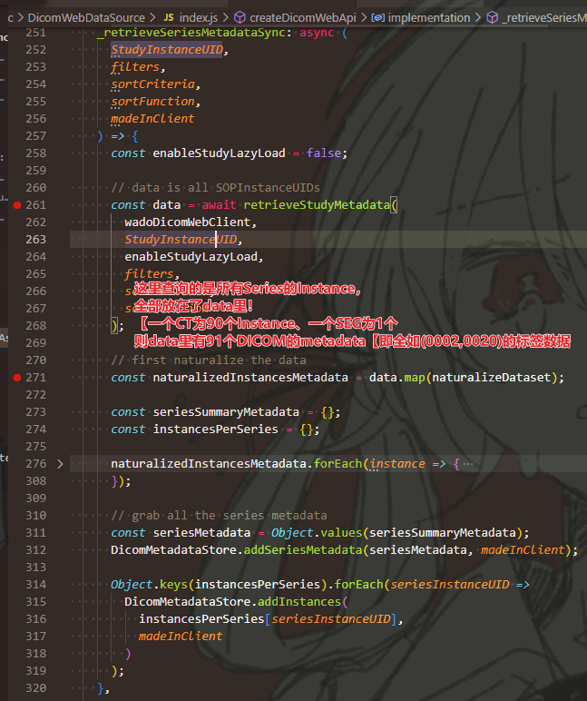

# Data Source

目前已清楚：Data Source, 数据源，就是各种Study的来源。

然后，在刚进应用的时候，会调用`platform\viewer\src\routes\DataSourceWrapper.tsx`里的`getData()`，  
通过`dataSource`里的`query.studies.search`，可以数据库里所有的Studies。

`dataSource`来源于Extension Manager的`getDataSources()`方法，还有其他方法，可以得到Data Source，  
查询时`search()`传的参数，是由内部的`_getQueryFilterValues()`方法构造的一个对象。

---

**有关存储：**

关键就在于从Extension Manager里得到的Data Sources对象，其中包含了对数据源的基本方法，如下图：  
  
其中的`store.dicom()`方法，但参数还未知。

## 进入Mode后，会先查询Series的Metadata，导致后面查询时取缓存

  

## 对于同步(Sync)与不同步(Async)RetrieveSeriesMetadata的差异

**同步：**  
  

**不同步：**  
