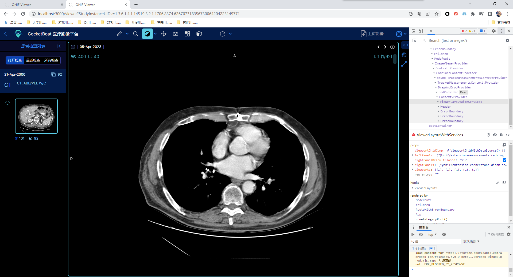
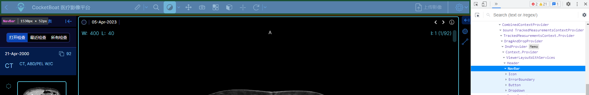
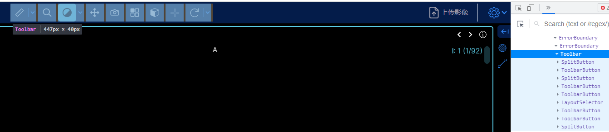

# OHIF-UI

OHIF-UI可能还有一些定义好的、获取上下文的命令。

## 1. 有关ViewportGrid - 获得上下文

**导入：**

```js
import { useViewportGrid } from '@ohif/ui';
```

**获得上下文：**

* `viewportState` - 有关Viewport的当前状态
* `viewportGridService` - 有关Viewport的服务（API）

具体可见下方：

```js
const DEFAULT_STATE = {
  numRows: null, // Grids的行数
  numCols: null, // Grids的列数
  layoutType: 'grid', // 一般都是grid吧
  viewports: [
    {
      displaySetInstanceUIDs: [], // 正在展示的DisplaySet的UID（OHIF中的UID）？
      viewportOptions: {}, // 
      displaySetOptions: [{}],
      x: 0, // left
      y: 0, // top
      width: 100,
      height: 100,
      viewportLabel: null,
    },
  ],
  activeViewportIndex: 0, // 当前选中（就是被高亮）的Viewport Index
  cachedLayout: {},
};

const api = {
  getState,
  setActiveViewportIndex: index => service.setActiveViewportIndex(index), // run it through the service itself since we want to publish events
  setDisplaySetsForViewport,
  setDisplaySetsForViewports,
  setLayout,
  setCachedLayout,
  restoreCachedLayout,
  reset,
  set,
}; // 有些类似于Service中的Viewport Grid Service，但也有一点区别
```

**调用示例：**

```js
// extensions/measurement-tracking/src/panels/PanelStudyBrowserTracking.tsx
//-------------------------------------------------------------------------
import { useViewportGrid } from '@ohif/ui';

function name() {
    const [
        { activeViewportIndex, viewports, numCols, numRows },
        viewportGridService,
    ] = useViewportGrid();
}
```

## 2. Segmentation Group Table

说明：

* `Segmentation` - 标签组
* `Segment` - 具体到某一个标签

具体UI组件：

* `SegmentationGroupTable` - 整个组件
  * `GetSegmentationConfig` - 上方的配置栏
  * `SegmentationGroup` - 一个标签组
  * AddSegmentation

## 3. ListMenu

三个属性：

* `items: list<object>`* - 下拉选项组  
  每一个item的属性：
  * 各种属性，搭配渲染函数`renderer`解包用的
  * `onClick` - 点击该选项后的处理函数
* `renderer: function`* - 每个选项的渲染函数，参数为`{ ...item, index, isSelected }`
* `onClick: function`* - 点击任意一个选项的处理函数，参数为`{ item, selectedIndex }`

### 内嵌 - ListItem

* `index: number`
* `isSelected: boolean`
* `item: object`

子选项(ListItem)通过**渲染函数**显示，为：

```js
<div className={classnames(flex, theme, 'cursor-pointer')} onClick={onClickHandler} data-cy={item.id}>
  {renderer && renderer({ ...item, index, isSelected })}
</div>
```

`renderer`举例：

```js
// 用在SplitButton中的默认渲染函数
const DefaultListItemRenderer = ({ type, icon, label, t, id }) => {
  // type - 子工具选项的种类（只有toggle会发生奇妙变化）
  // icon - 图标
  // label - 名字，会被t(label)
  // t - i18n函数（UI中自动给！！）
  // id - 只有当type是toggle的时候用（在splitButton中，id一般就是label
  const isActive = type === 'toggle' && toggles[id] === true;

  return (
    <div
      className={classNames(
        'flex flex-row items-center p-3 h-8 w-full hover:bg-primary-dark',
        'text-base whitespace-pre',
        isActive && 'bg-primary-dark',
        isActive
          ? 'text-[#348CFD]'
          : 'text-common-bright hover:bg-primary-dark hover:text-primary-light'
      )}
    >
      {icon && (
        <span className="mr-4">
          <Icon name={icon} className="w-5 h-5" />
        </span>
      )}
      <span className="mr-5">{t(label)}</span>
    </div>
  );
};

// 窗宽窗位的渲染函数
({ title, subtitle, index, isSelected }) => (
  <>
    <div className={classNames(
      'flex flex-row items-center p-3 h-8 w-full hover:bg-primary-dark',
      isSelected && 'bg-primary-dark'
    )}
    >
      <span className='text-common-bright mr-2 text-base whitespace-nowrap'>
        {title}
      </span>
      <span className='flex-1 text-aqua-pale font-light text-sm whitespace-nowrap'>
        {subtitle}
      </span>
      <span className='text-primary-active ml-5 text-sm whitespace-nowrap'>{index + 1}</span>
    </div>
  </>
);
```

## 4. SplitButton

一般只是用来在工具栏定义的时候，Tool的类别为`ohif.splitButton`用的（很少手动定义，不然很麻烦）。

**Props：**

* `isRadio` - 点子选项Tool后，会顶替(Swap)Primary的Tool
* `isAction` - 只执行操作，如窗宽窗位
* `bState` - 获得`toggle`开关量和`primaryToolId`显示到主选项工具的id
* `gruopId` - 在`onInteraction`有用，暂时不知道什么用
* `primary` - 这三个不用说……
* `secondary` - 这三个不用说……
* `items` - 这三个不用说……
* `renderer` - 渲染函数（存在默认的）
* `onInteraction` - 哈？……
* `servicesManager` - 哈？……

## 杂项

### 进入Mode后整个页面的框架



可以看到分成四部分，分别是上方一个Header、左边右边中间三个组件。

#### 上方Header的工具栏(Toolbar组件)

*就是这里让我见识到了这个框架是有多么丑陋。*

  
先看Header，这里还好，左侧的返回按钮，中间的工具栏，右侧的东西。

具体查看中间的工具栏：  
  
找了半天，没看到这个`<Toolbar>`组件在哪，顺着源码看了看，  
结果，在，`extension/default/src/Toolbar`，的`Toolbar.tsx`里。  
【当时我还说这个没用到就没用来着，我真的不好说了'_>'【……

后面就是"ToolbarModule"里，所定义的6类type里的4种组件：  
`ToolbarButton`/`ToolbarSplitButton`/`ToolbarLayoutSelector`/`ToolbarDivider`。  
`ToolbarButton`在ui里面，后面三个是这个插件里定义的【这个倒是无可厚非，可以自己定义工具类嘛，但整个外层的`Toolbar`定义在这个插件里我真的不好说……

### 上方Header的工具栏的UI层次结构

* `Toolbar` - 来自default插件【丑陋！……
  * `ToolbarButton` - 来自UI
    * `IconButton` - 来自UI
  * `ToolbarSplitButton` - 来自UI
    * `ToolbarButton`
    * `ListMenu` - 来自UI
  * `ToolbarLayoutSelector` - 来自default插件
    * `ToolbarButton`
    * `LayoutSelector` - 来自UI
  * ~~`ToolbarDivider`~~【这个没用到】 - 来自default插件