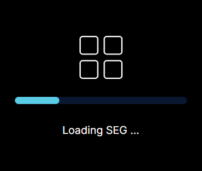
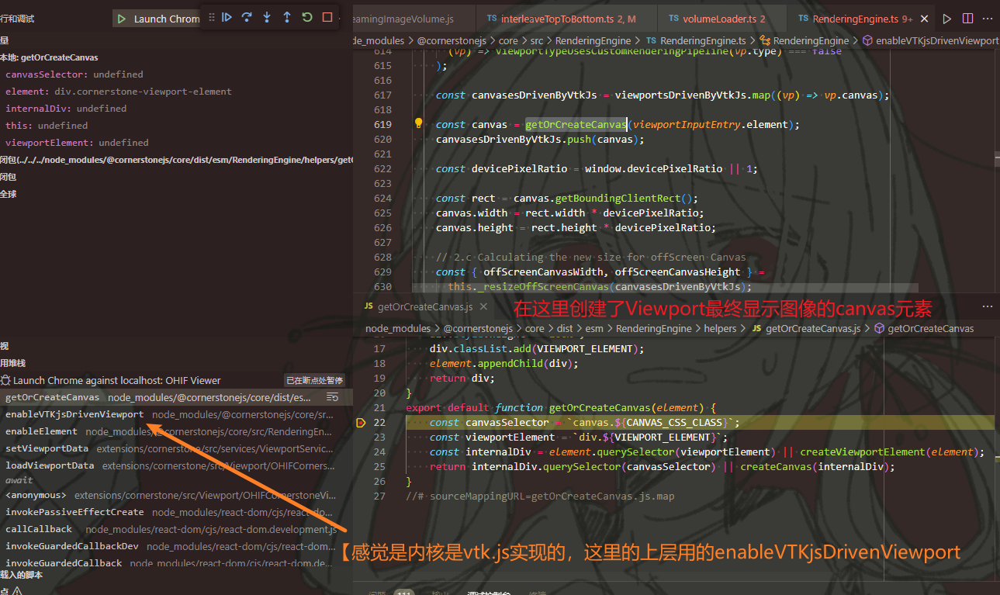

# Cornerstone.js 和 SEG 的 Viewport

## SEG

SEG本身也就是一层套皮的CornerstoneViewport，但会负责进行数据处理和传递。  
最大的不同，CSVP只会传递当前打开的displaySet；而SEG会同时传递当前打开的SEG和reference的2个displaySet。

### 加载流程

  
初始还在这个画面是，先加载Segmentation。

流程类似CSVP，依旧是在管数据的Effect里，**调`loadViewportData`加载数据**。  
接下来的流程为：

1. `await cornerstoneCacheService.createViewportData(displaySets, dataSource);`，注意这里有两个displaySet
2. `await this._getVolumeViewportData(displaySets, dataSource)`走的体素路线
3. 这个时候会有两个分支
   * 对于Image：其`displaySet`不存在load，所以跳过中间，又因为没缓存，执行`volumeImageIds = this._getCornerstoneVolumeImageIds(displaySet, dataSource)`
   * 对于SEG：**执行其load**
4. 两个分支对应的之后情况
   * 对于Image：调后创建了体素"Volume"，但也没加载数据。
   * 对于SEG：直接到`displaySet.load`

## 杂项

* 每当切换Series时、或切换GirdLayout后，Viewport就会销毁（会调用各种清楚副作用函数）并重建。

### 最终的那个canvas怎么来的

  
