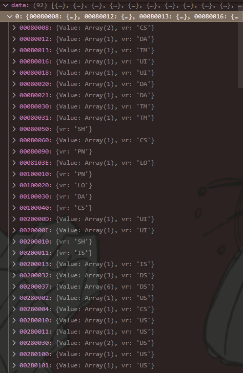
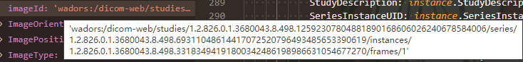
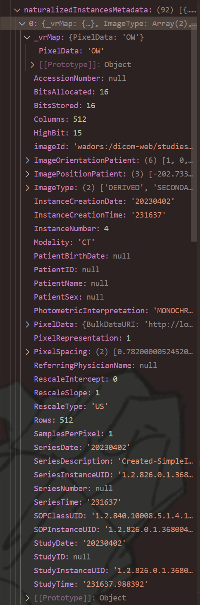
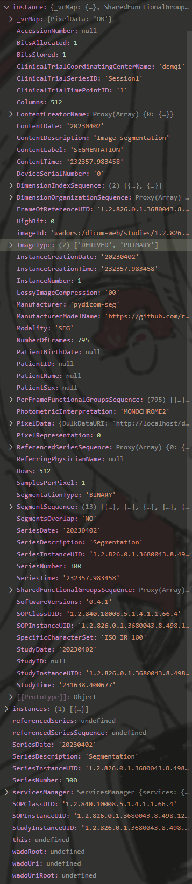
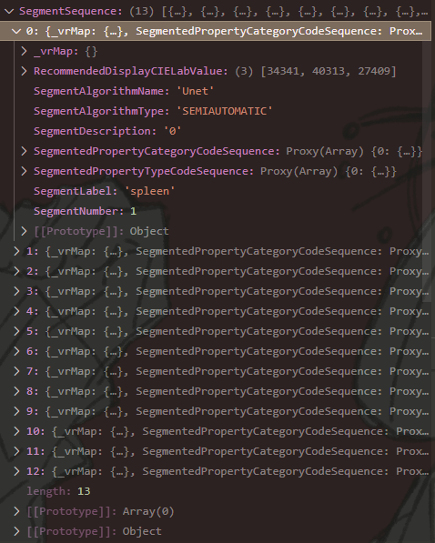
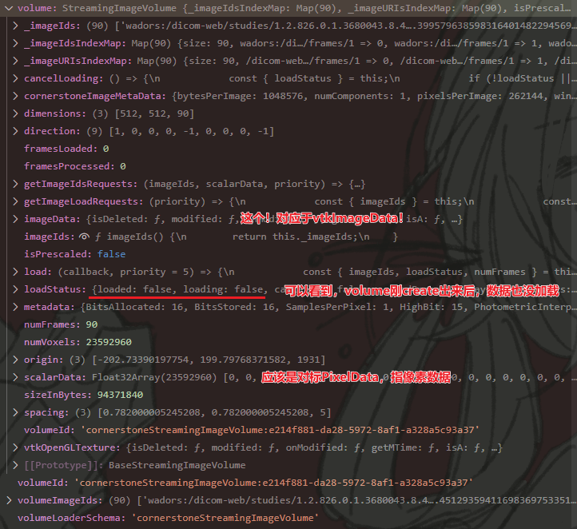
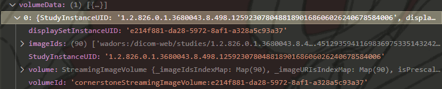
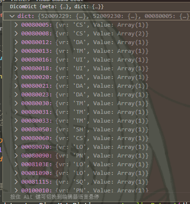
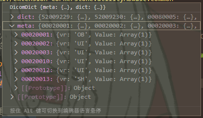

# 常见类型记录

## Metadata相关

* Raw-Instance-Metadata - 原本的每一个Instance的metadata格式（DICOM标准）
  * 来源：直接在`DicomWebDataSource`里通过`retrieveStudyMetadata(wadoDicomWebClient, StudyInstanceUID, 后面不是关键的东西);`，获得到的数据。
  * 示例：  
* OHIF-Instance-Metadata - OHIF下的每一个Instance的metadata格式（可能也是Cornerstone的，溯源来说式dcm.js格式的）
  * 来源：由"Raw Metadata"，按照**dcm.js**进行解析，其中的`DicomMetaDictionary`里的`naturalizeDataset`，会把每一个数字标签(0020, 000D)转换为有意义的标签(StudyInstanceUID)。
  * 内嵌属性 - imageId：一串字符串，通常开头`wado://`，代表来源。  
    
  * 示例：不同Instance的属性具有区别
    * 一CT文件示例：  
      
    * 一SEG文件示例：  
        
      解惑：其中的`SegmentSequence`属性式Raw-Instance-Metadata直接能解析过来的，并不是SegementService里整的。  
      
* OHIF-xxx-Metadata - OHIF下的每一个Sereis的metadata格式
  有关Series和Study级的，可见"Service"文档里的"DicomMetadataStore"的介绍。

## displaySet

需注意：不同的sopClassHandler，解析出来的displaySet，其属性也有较大差别。  
比如对于SEG，和其他影像(如CT)相比，其不存在`images`属性。

* Image-displaySet
  * 示例：
* SEG-displaySet
  * 示例：

## Cornerstone

* Volume
  * 刚创建出来的状态（通过`volumeLoader.createAndCacheVolume`(如CornerstoneCacheService.ts的约213行)）  
      
* VolumeData - 在Volume上封装了一些属性，也是存储了所有的Volume  
  

### 有关Dicom Loader Service

* metadata字节流数据 - `dicomLoaderService.findDicomDataPromise`得到
* dicomData类型 - `DicomMessage.readFile(segArrayBuffer)`  
  类似与Raw-Instance-Metadata，但有些区别  
    
    
  虽然dict可以用API转换成更好的格式，但下面的`meta`好像也存了些重要信息。
* dataset类型 - ``  
  应该跟OHIF-Instance-Metadata一样！因为都是调用的`naturalizeDataset(dict)`得到的。