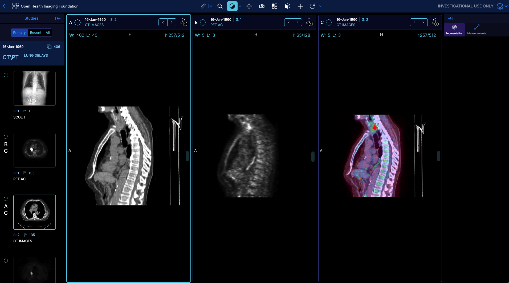
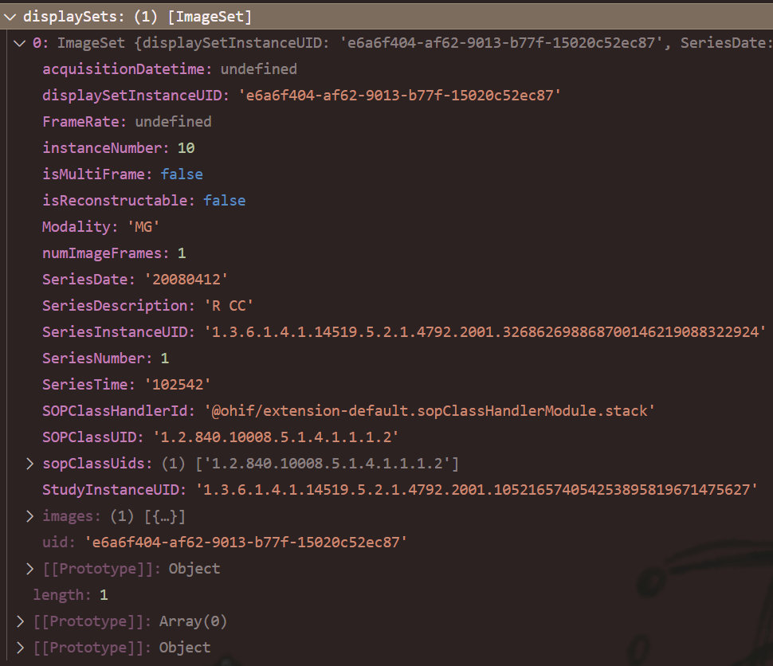
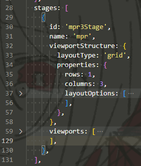
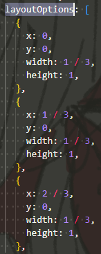
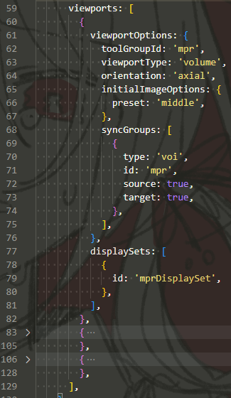

# Extension - 插件相关

## 个人理解的一些点

Extension就像之前说的，提供了各种模块功能(Module)，供各种Mode使用，创建不同的工作流。

## 1. 插件骨架代码

```js
export default {
  /**
   * 必要属性，每个插件不同。
   * 一般都是有个"id.js"，里面id来源于"package.json"里的"name"
   * 然后index.ts(x)中直接`import { id } from './id'`
   */
  id,

  // Lifecyle - 生命周期函数
  preRegistration() { /* */ },
  onModeEnter() { /* */ },
  onModeExit() { /* */ },

  // Modules - **所有的**模块
  /// 目前个人理解的是：**只能**有这些模块，然后提供给服务（目前作用不明确）和模式使用
  /// 每个模块最终返回的都是一个固定格式的字典（python的概念）的列表（但还没看到有多个的情况），大致为`return [ {name: '...', component: ..., ...}, ... ]`
  /// 特别是Mode中使用，在声明的时候，格式为：`插件id.模块名(下面的去掉get, 首字母小写).返回的name`
  getLayoutTemplateModule() { /* */ },
  getDataSourcesModule() { /* */ },
  getSopClassHandlerModule() { /* */ },
  getPanelModule() { /* */ },
  getViewportModule() { /* */ },
  getCommandsModule() { /* */ },
  getContextModule() { /* */ },
  getToolbarModule() { /* */ },
  getHangingProtocolModule() { /* */ }, // 模块名字为去掉get，即HangingProtocolModule
  getUtilityModule() { /* */ }, // 模块名字为UtilityModule
}
```

## 2. 官方维护的插件

| Extension | Description | Modules |
| --- | --- | --- |
| [default](https://v3-docs.ohif.org/platform/extensions/) | 默认插件，提供默认的Viewer布局、Study/Series的浏览器，映射到DICOM服务器的后端 | `commandsModule`, `ContextModule`, `DataSourceModule`, `HangingProtocolModule`, `LayoutTemplateModule`, `PanelModule`, `SOPClassHandlerModule`, `ToolbarModule` |
| [cornerstone](https://v3-docs.ohif.org/platform/extensions/) | 提供2D/3D渲染函数 | `ViewportModule`, CommandsModule, UtilityModule |
| [dicom-pdf](https://v3-docs.ohif.org/platform/extensions/) | Renders PDFs for a [specific SopClassUID](https://github.com/OHIF/Viewers/blob/master/extensions/dicom-pdf/src/OHIFDicomPDFSopClassHandler.js#L4-L6). | Viewport, SopClassHandler |
| [dicom-video](https://v3-docs.ohif.org/platform/extensions/) | Renders DICOM Video files. | Viewport, SopClassHandler |
| [cornerstone-dicom-sr](https://v3-docs.ohif.org/platform/extensions/) | Maintained extensions for cornerstone and visualization of DICOM Structured Reports | ViewportModule, CommandsModule, SOPClassHandlerModule |
| [measurement-tracking](https://v3-docs.ohif.org/platform/extensions/) | 在测量面板最终测量 | ContextModule,PanelModule,ViewportModule,CommandsModule |

## 3. 插件注册

直接在`cli`中注册，然后在`platform/viewer/pluginConfig.json`里可以看到（不要手动操作这个文件）。  
当插件在Viewer中注册后，利用Extension的id，可让`ExtensionManager`找到该插件，  
其所有的功能模块Module，都能被Modes通过`ExtensionManager`用`id`来获取到。

## 4. 生命周期函数

插件可以注入三个生命周期函数：

* `preRegistration`  
  应该是在整个Viewer应用初始化时被调用。  
  用来初始化插件状态(State)、设置用户自定的扩展配置、为服务和命令建立扩展，并启动第三方库。
* `onModeEnter`  
  在每次进入有使用该插件的新模式，或者该模式的数据(data)/数据源(datasource)切换了后调用。
  可以用来初始化数据。
* `onModeExit`  
  *【一般是用来清理的吧？……*

## 5. Context

上下文，个人感觉就是用来区分不同“环境”的，  
然后让一些功能（特别是Command），在不同环境下有不同表现（不启用/有不同逻辑功能），  
因为特别是Command会用到上下文，故应该是由Command Manager管理，由一串字符串（如`TMTV:CORNERSTONE`）定义。

## 6. ⭐Modules

Modules是插件的核心部分，也就是用来组成的各种“块”。  
用来提供“定义”、组件(Component)、过滤(Filtering)/映射(Mapping)逻辑代，然后提供给Modes和Services使用。

### 1. Panel - 侧边栏模组

#### 定义与编写

默认的`LayoutTemplate`有左侧和右侧两个侧边栏【但好像可以制作顶侧和底侧的栏】。
> 注释 - `LayoutTemplate`：
>
> 来自于每个Mode的`index.js`里的`modeFactory()`（该函数用于对这个Mode进行配置），用来描述页面的布局。  
> 其中的`routes`属性里 的列表里 的一个元素里，存在该属性`LayoutTemplate`。

通过`getPanelModule`注册这个模组。

**函数接收**：三个`Manager`。

**函数返回**：一个“列表”，有若干个“对象”。  
每个对象即为一个Panel，包含了对该Panel的"menuOptions"和`components`组件。

其中"menuOptions"应该就是对该Panel的一些定义，比如：

* `name` - 应当就是`id`
* `iconName` - 图标的名称（应当在ui中有）
* `iconLable` - 【暂时不知道干嘛的……
* *`isDisabled` - 在某些"studies"下，可能该Panel会禁用，为一个箭头函数`studies => {}`
* `lable` - 展示的名称

而`components`则是React组件，被用来直接展示的。

以"Measure"Panel举例：

```js
import PanelMeasurementTable from './PanelMeasurementTable.js';

function getPanelModule({
  commandsManager,
  extensionManager,
  servicesManager,
}) {
  const wrappedMeasurementPanel = () => { // 对component的提取
    return (
      <PanelMeasurementTable
        commandsManager={commandsManager}
        servicesManager={servicesManager}
      />
    );
  };

  return [ // 返回的列表
    {
      name: 'measure',
      iconName: 'list-bullets',
      iconLabel: 'Measure',
      label: 'Measurements',
      isDisabled: studies => {}, // 可选
      component: wrappedMeasurementPanel,
    },
  ];
}
```

#### 在Mode中使用Panel

插件只是提供了React组件，需要在模式中具体定义怎么用。  
就是在Mode的`index.js` 中的`modeFactory` 中的`routes.layoutTemplate.props` 中的 `leftPanels`/`rightPanels`来调用Panel。

Mode中可以在左/右侧添加**若干个**Panel，其接受一个`id`的数组（`id`的格式目前已知道，之后在学习Mode中可能会具体再说），  
默认如果一侧存在Panel，都是开启的，可以设置为默认关闭，使用`rightPanleDefaultClosed`。

Mode中的`servicesManager`中存在一个`panelService`，  
可以利用触发器(`Triggers`)，使得在监听到某些操作后，对Panel进行操作（如打开或关闭Panel），如下。

```js
    onModeEnter: ({ servicesManager }) => {
      const {
        measurementService,
        panelService,
      } = servicesManager.services; // 从服务管理器中解包出所需的服务

      _activatePanelTriggersSubscriptions = [ // 这个应该是该平台的一个触发器订阅管理数组
        ...panelService.addActivatePanelTriggers('@ohif/extension-measurement-tracking.panelModule.trackedMeasurements', [ // 对id(name)为"trackedMeasurements"的Panel添加触发器
          {
            sourcePubSubService: measurementService, // 触发器监听源服务
            sourceEvents: [ // 监听事件
              measurementService.EVENTS.MEASUREMENT_ADDED,
              measurementService.EVENTS.RAW_MEASUREMENT_ADDED,
            ],
          },
        ]),
      ];
    },
    onModeExit: () => { // 退出时，要清空触发器
      _activatePanelTriggersSubscriptions.forEach(sub => sub.unsubscribe());
      _activatePanelTriggersSubscriptions = [];
    },
```

*具体应该是"Service"里的内容，这里先只做了解。*

#### 利用cli新建时的模板

**模板**：

```js
  /**
   * PanelModule 应当提供有关panels的列表，从而让OHIF Viewer在 Mode 中进行引用和渲染
   * 每个panel应当至少由`{name, iconName, iconLabel, label, component}`对象定义
   * panel模组的例子见下面的代码块
   */
  getPanelModule: ({
    servicesManager,
    commandsManager,
    extensionManager,
  }) => {},
```

**例子**：

```js
const getPanelModule = () => {
  return [
    {
      name: 'exampleSidePanel', // id
      iconName: 'info-circle-o', // 图表名
      iconLabel: 'Example', // 还是不知道这个有什么用orz……
      label: 'Hello World', // 展示名
      isDisabled: studies => {}, // 可选
      component: ExamplePanelContentComponent,
    },
  ];
};
```

### 2. Command - 命令模组

顾名思义，就是定义各种命令的，  
用来完成特定功能、激活工具、与服务器通信、打开弹窗(Modal)等等、以及其启用条件（或者复用）。

插件可以通过定义`getCommandModule`来定义命令，  
该模组许限定在特定Context下，注册若干个命令。

Command因为以下特性功能很强大：

* 同一命令允许有多种实现
* 根据应用的Context，只有正确的一种命令实现会被运行
* Command能被快捷键、工具栏按钮、渲染设置执行

有关commandModule，一般都是单独建一个文件`commandsModule.js`，在其中配置，  
很好的模板为：

```js
// extensions/myExtension/commandModule.js
// ---------------------------------------
/* 各种导入，除了核心包中的东西，还有各个工具类(./utils) */

const commandsModule = ({ /* 3个Manager */ }) => {
    /// 1. 定义常量部分：如所需服务
    const {
        /* 需要的各种服务，如SegementationService */
    } = servicesManager.services;

    /// 2. 定义内部函数：一般如以下两个
    function _getActiveViewportsEnabledElement() {
    }

    function _getMatchedViewportsToolGroupIds() {
    };

    // 3. 关键部分 - 定义返回所需的actions - 即所有命令函数
    const actions = {
        getSomething: ({ /* 需要的参数 */ }) => { /* 逻辑代码、返回结果 */ },
        setSomething: ({ /* 需要的参数 */ }) => { /* 逻辑代码、返回结果 */ },
        calculateSometing: ({ /* 需要的参数 */ }) => { /* 逻辑代码、返回结果 */ },
        exportSomething: ({ /* 需要的参数 */ }) => { /* 逻辑代码、返回结果 */ },
        // ...
    }

    // 4. 关键部分 - 根据上方的actions，定义所对应的definitions - 即所提到的command的基础结构
    const definitions = {
        getSomething: {
            commandFn: actions.getSomething,
            storeContexts: [], // 这个上下文会覆盖下方的defaultContext
            options: {},
        },
        // 把其它在actions里的补完
    }

    // return的时候，这样写就可以
    return {
        actions,
        definitions,
        defaultContext: 'TMTV:CORNERSTONE', // 这里指定所有命令的默认上下文
    };
}

export default commandsModule;
```

### 3. SOP Class Handler - SOP类处理器

**关键词**： DICOM SOP Class → displaySet

就是把通过DICOM-Web的REST API得到的DICOM SOP类，转化为可供OHIF**展示**的`displaySet`，  
从而可展示(hung, 挂片)在一个Viewport内。

> 解释 - 什么是 **DICOM SOP Class**：
>
> 目前可以简单理解为“成像类型”或影片类型，  
> 比如为影片的CT/MR等等；或者非影像的SEG/RT等。
>
> 具体的各SOP Class可见[B.5 Standard SOP Classes](https://dicom.nema.org/dicom/2013/output/chtml/part04/sect_B.5.html)，  
> 同时，可以在[DICOM标准（标签）浏览器](https://dicom.innolitics.com/ciods)中查看各种DICOM SOP Class。

Mode会选择使用何种SOPClassHandler，所以在该Viewer应用中，可以将同一个Series，根据Mode采用的不同SOPClassHandler，呈现不同的展示方式。

#### 作用

在`DisplayService`中会用这个Module，会注册到该服务中（只要是在Mode中所有插件加载的这个Module都会），  
然后可将"DICOM raw metadata"格式转化为OHIF的"DisplaySet"格式，  
以供Viewport展示。

#### 骨架图

最后要**返回**的三个东西：

```js
return [
  {
    name: 'dicom-seg', // 简单的name，用来在Mode中区分，进行加载
    sopClassUids, // 指定可以处理的 SOP Class UID
    getDisplaySetsFromSeries: (instances) => { /* ... */ }, // 将Series转换为DisplaySet
  },
];
```

故**骨架图**：

```js
import { id } from './id';
import sopClassDictionary from '@ohif/core/src/utils/sopClassDictionary'; // 所有的 SOP Class UID
// import ImageSet from '@ohif/core/src/classes/ImageSet'; // 创建Image影像（相反的为Non-Image影像）的displaySet的数据类型

// 常量定义
const sopClassHandlerName = 'myHandler'; // ID
const sopClassUids = [ // sopClassUids
  sopClassDictionary.CTImageStorage,
  sopClassDictionary.MRImageStorage,
]; // 需要注意：在Mode里的SOPClassUIDs需要在数组中是有序的【应该就按照那个字典中的顺序吧……


function getDisplaySetsFromSeries(instances) {
  const displaySets = [];
  /* 生成 displaySet 里的每一个 displaySet（只有Image影像数据类型为ImageSet() */
  return displaySets;
}

export default function getSopClassHandlerModule() {
  return [
    {
      name: sopClassHandlerName,
      sopClassUids,
      getDisplaySetsFromSeries,
    },
  ];
}
```

#### 已知的SOP Class Handler

*一般不用自己写，直接用别人的。*

* 几乎所有Image类型的 - `@ohif/extension-default.sopClassHandlerModule.stack`
* SR（报告，就是批注的那些） - `@ohif/extension-cornerstone-dicom-sr.sopClassHandlerModule.dicom-sr`
  * 1.2.840.10008.5.1.4.1.1.88.11 - Basic Text SR
  * 1.2.840.10008.5.1.4.1.1.88.22 - Enhanced SR
  * 1.2.840.10008.5.1.4.1.1.88.33 - Comprehensive SR
  * 1.2.840.10008.5.1.4.1.1.88.34- Comprehensive 3D SR
* Video（影像？） - `@ohif/extension-dicom-video.sopClassHandlerModule.dicom-video`
  * 1.2.840.10008.5.1.4.1.1.77.1.2.1 - Video Microscopic Image Storage
  * 1.2.840.10008.5.1.4.1.1.77.1.4.1 - Video Photographic Image Storage
  * 1.2.840.10008.5.1.4.1.1.77.1.1.1 - Video Endoscopic Image Storage
  * 1.2.840.10008.5.1.4.1.1.7 - Secondary Capture Image Storage
  * 1.2.840.10008.5.1.4.1.1.7.4 -  Multi-frame True Color Secondary Capture Image Storage
* PDF（？） - `@ohif/extension-dicom-pdf.sopClassHandlerModule.dicom-pdf`
  * 1.2.840.10008.5.1.4.1.1.104.1 - Encapsulated PDF Storage
* SEG - `@ohif/extension-cornerstone-dicom-seg.sopClassHandlerModule.dicom-seg`
  * 1.2.840.10008.5.1.4.1.1.66.4 - Segmentation Storage  
    **注**：采用`dcmjs`生成应该

### 4. Hanging Protocol - 挂片协议

**重点**：DisplaySet → Viewport

Hanging Protocol对于所有的放射影像浏览器都是非常必要的。  
OHIF用Hanging Protocol来将Images（已转化为了DisplaySet）安排到Viewport中，注册的协议会与可用的DisplaySets匹配。  
可能存在多个Protocol，会计算分数，分数最高者被应用。

可以做如下事：

* 定义Viewport以何种布局(layout)开始  
  e.g. 2*2网格布局
* 指定Viewport的种类、方向(Orientation)  
  e.g. stack(堆叠?)/在Sagittal(矢状面)的Volume(体素)
* 定义哪些**DisplaySets**会**显示在**Layout的**哪个Viewport**中  
  e.g. 某一个`displaySet`在Modality(成像类型)中含有`CT` & 在`SeriesDescription`是`Coronary Arteries`(冠状动脉)，其会被显示到该Layout的第一个Viewport
* 应用某些初始视口设置  
  e.g. 反转对比度，或跳转到某一特定的切片
* 为视口添加特定的同步规则  
  e.g. 同步第1、2号视口的缩放(Zoom)；同步第2、3号视口的VOI  
  > 扩展 - VOI(Volume of Interst, 感兴趣体素)：
  >
  > 在二维图中，存在ROI概念，  
  > 在三维图中，若干个ROI组合取来，形成的区域，就是VOI。
  >
  > 可见[【影像组学导论】第二部分：具体应用方向？十大维度供你参考！](https://blog.csdn.net/weixin_40166430/article/details/115006239)

#### 例子与模块框架

官网举的这个例子：  



这个Protocol采用1*3Layout；  
在第一个Viewport展示了CT图像，在第二个Viewport展示了PT图像，在第三个Viewport展示了PET-CT融合图像；  
所有的Viewport都呈矢状面(Sagittal)。

其对应的Hanging Protocol定义为：

```js
// 注释带*代表可能是很重要的属性
const oneByThreeProtocol = {
  id: 'oneByThreeProtocol', // *唯一ID，可用来在Mode配置中指明是哪种协议({extension}.{module}.{id})
  locked: true,
  hasUpdatedPriorsInformation: false,
  name: 'Default', // 这又有个名字，应该只是用来描述性取名的
  createdDate: '2021-02-23T19:22:08.894Z',
  modifiedDate: '2022-10-04T19:22:08.894Z',
  availableTo: {},
  editableBy: {},
  imageLoadStrategy: 'interleaveTopToBottom', // *影响加载策略，一般就interleaveTopToBottom
  protocolMatchingRules: [ // *协议选择策略
    {
      attribute: 'ModalitiesInStudy',
      constraint: {
        contains: ['CT', 'PT'],
      },
    },
  ],
  displaySetSelectors: {
    ctDisplaySet: {
      seriesMatchingRules: [
        {
          weight: 1,
          attribute: 'Modality',
          constraint: {
            equals: {
              value: 'CT',
            },
          },
          required: true,
        },
        {
          weight: 1,
          attribute: 'isReconstructable',
          constraint: {
            equals: {
              value: true,
            },
          },
          required: true,
        },
      ],
    },
    ptDisplaySet: {
      seriesMatchingRules: [
        {
          attribute: 'Modality',
          constraint: {
            equals: 'PT',
          },
          required: true,
        },
        {
          weight: 1,
          attribute: 'isReconstructable',
          constraint: {
            equals: {
              value: true,
            },
          },
          required: true,
        },
        {
          attribute: 'SeriesDescription',
          constraint: {
            contains: 'Corrected',
          },
        },
      ],
    },
  },
  stages: [
    {
      id: 'hYbmMy3b7pz7GLiaT',
      name: 'default',
      viewportStructure: {
        layoutType: 'grid',
        properties: {
          rows: 1,
          columns: 3,
        },
      },
      viewports: [
        {
          viewportOptions: {
            viewportId: 'ctAXIAL',
            viewportType: 'volume',
            orientation: 'sagittal',
            initialImageOptions: {
              preset: 'middle',
            },
            syncGroups: [
              {
                type: 'voi',
                id: 'ctWLSync',
                source: true,
                target: true,
              },
            ],
          },
          displaySets: [
            {
              id: 'ctDisplaySet',
            },
          ],
        },
        {
          viewportOptions: {
            viewportId: 'ptAXIAL',
            viewportType: 'volume',
            orientation: 'sagittal',
            initialImageOptions: {
              preset: 'middle',
            },
          },
          displaySets: [
            {
              id: 'ptDisplaySet',
            },
          ],
        },
        {
          viewportOptions: {
            viewportId: 'fusionSAGITTAL',
            viewportType: 'volume',
            orientation: 'sagittal',
            initialImageOptions: {
              preset: 'middle',
            },
            syncGroups: [
              {
                type: 'voi',
                id: 'ctWLSync',
                source: false,
                target: true,
              },
            ],
          },
          displaySets: [
            {
              id: 'ctDisplaySet',
            },
            {
              options: {
                colormap: 'hsv',
                voi: {
                  windowWidth: 5,
                  windowCenter: 2.5,
                },
              },
              id: 'ptDisplaySet',
            },
          ],
        },
      ],
      createdDate: '2021-02-23T18:32:42.850Z',
    },
  ],
  numberOfPriorsReferenced: -1,
};


function getHangingProtocolModule() {
  return [
    {
      id: 'oneByThreeProtocol',
      protocol: oneByThreeProtocol,
    },
  ];
}
```

##### id

协议的唯一标识符，这个id可以在Mode configuration中用来指定该模式应该使用哪个协议。  
一个Mode可以通过协议的id来请求一个协议；或者提供一个id数组，这将使得`ProtocolEngine`(管理所有protocol的)选择最佳的匹配协议（基于`protocolMatching`规则）

##### imageLoadStrategy

“图像加载策略”指定了OHIF内置“图像加载策略”函数的名称（就是直接选OHIF提供的策略），根据策略的不同会加载较早查看的图片比较晚加载的图片更早完成【？】。

就三种：

* `interleaveTopToBottom` - 从头到尾按顺序加载，适用于所有正在加载的Series。
* `interleaveCenter` - 也是按顺序加载，不过是从中心开始（具有现实意义，因为一般医学影像的最开始切片并无意义）
* `nth` - 从中心和终点开始，加载所有第$n$个Instance（应该就是切片），然后沿着各切片逐步填充。

*【说的是`nth`策略可以很快的加载影像，不过我没看懂【】，这里统一用`interleaveTopToBottom`就行……*

##### protocolMatchingRules

有关这个协议的一些标准（或者就说Rule规则），用来提供排名点（当存在多个挂片协议时）。

*文档写的跟实际上的代码不同，这里以实际上的代码为准：*

为Rules，是有关Rule的数组，每个Rule对象格式如下：

```js
[
    {
      attribute: 'ModalitiesInStudy',
      constraint: {
        contains: ['CT', 'PT'],
      },
    },
]
```

* `attribute` - 在**Study层级**上的一些tag(metadata)  
  比如`StudyInstanceUID`、`StudyDescription`、`ModalitiesInStudy`、`NumberOfStudyRelatedSeries`、`NumberOfSeriesRelatedInstances`，  
  以及一些自定义标签(Custom attribute)
* `constraint` - 匹配的选项，有五种模式
  * `equals`
  * `doesNotEuqal`
  * `contains`
  * `doesNotContain`
  * `startsWith`
  * `endsWith`

##### displaySetSelectors

定义这个协议将会进行安排（到Viewport）的displaySets。  

```js
  displaySetSelectors: {
    ctDisplaySet: { // 这个算是这个Selector的id，将在后面Viewports配置时用到
      seriesMatchingRules: [ // 只有这一个属性：里面跟上面差不多一样，但注意是series层！
        {
          weight: 1,
          attribute: 'Modality',
          constraint: {
            equals: {
              value: 'CT',
            },
          },
          required: true, // 是否是必要条件
        },
        {
          weight: 1,
          attribute: 'isReconstructable',
          constraint: {
            equals: {
              value: true,
            },
          },
          required: true,
        },
      ],
    },
    ptDisplaySet: {
      seriesMatchingRules: [
        {
          attribute: 'Modality',
          constraint: {
            equals: 'PT',
          },
          required: true,
        },
        {
          weight: 1,
          attribute: 'isReconstructable',
          constraint: {
            equals: {
              value: true,
            },
          },
          required: true,
        },
        {
          attribute: 'SeriesDescription',
          constraint: {
            contains: 'Corrected',
          },
        },
      ],
    },
  }
```

需注意，这里的`seriesMatchingRules`与上面的`protocolMatchingRules`不同，这里是 Series 层。  
也就**对应了`displaySet`里的所有Attributes**！如下图：  


并且在Rule里多了这几个属性：

* `weight` - 权重  
  最终，所有注册的Protocol都会根据Weight进行排序，获胜的协议会被应用到Viewer上。  
  *【但个人并不知道这是怎么算的【……*
* `required` - 就是是否是必要条件【非必要的话就只是增加权重吧……

##### stage

**Stage**用来描述**有关Viewports的Layout布局**（区别layoutTemplate描述的是整体页面的布局（包括左右上下侧栏等））、以及定义**具体每一个Viewport**（种类、朝向、同步、应用的displaySet）。



* `viewportStructure` - 每个Viewport的布局结构  
  **注意**：Viewport编号顺序是先行后列。
  * `layoutType` - 一般grid
  * `properties` - 网格属性
    * `rows` - 行数
    * `columns` - 列数
    * `layoutOptions`：规定每一个窗口的位置、长宽  
        
      根据$rows*columns$划分好gird后，一个Viewport可占用更多的长宽。
* `viewports` - 定义具体每个窗口的行为，为`[{}, {}, {}, ...]`按上面每个Viewport的顺序  
  
  * `viewportOptions` - 定义这个Viewport的选项
    * `viewportId`(可选) - 对这个Viewport的唯一id
    * `viewportType` - 两个选择：`stack`(默认)或`volumn`
    * `background` - 
    * `orientation`
    * `toolGroupId`
    * `initialImageOptions`
    * `syncGroups`
  * `displaySets`

### 5. Viewport - 视窗

关键词：在Mode中决定展示的初始窗口。

### 6. Utility - 工具类

该 Extension 的一些功能代码，可以暴露给其他 Extension/Mode 使用，作为“工具”。

**该 Extension 导出：**

```js
getUtilityModule({ servicesManager }) {
    return [
      {
        name: 'common',
        exports: {
          getCornerstoneLibraries: () => { // comman下的工具1
            return { cornerstone, cornerstoneTools };
          },
          getEnabledElement, // comman下的工具2
          CornerstoneViewportService, // ...3
          dicomLoaderService, // ...4
        },
      },
      {
        name: 'core',
        exports: {
          Enums: cs3DEnums, // core下的工具1（实际上应该不是工具，只是一个枚举类型，作为静态变量
        },
      },
      {
        name: 'tools',
        exports: {
          toolNames,
          Enums: cs3DToolsEnums,
        },
      },
    ];
  },
};
```

**其他 Extension/Mode 使用：**

```js
const utilityModule = extensionManager.getModuleEntry( // .comman对应上面的name
  '@ohif/extension-cornerstone.utilityModule.common'
);

const { CornerstoneViewportService } = utilityModule.exports; // 然后从该组的exports中取出utils
```

### 7. Toolbar

这个可能是自动注册的，并没有在Mode中看到直接的引用，但在定义Toolbar Button时又确实在用。

