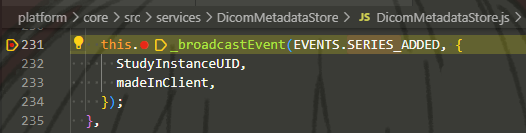
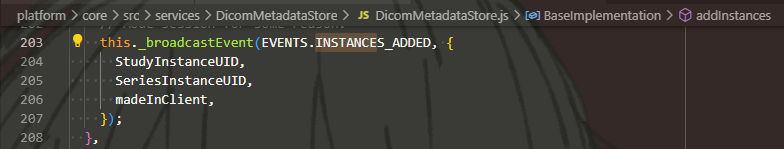
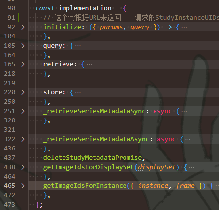
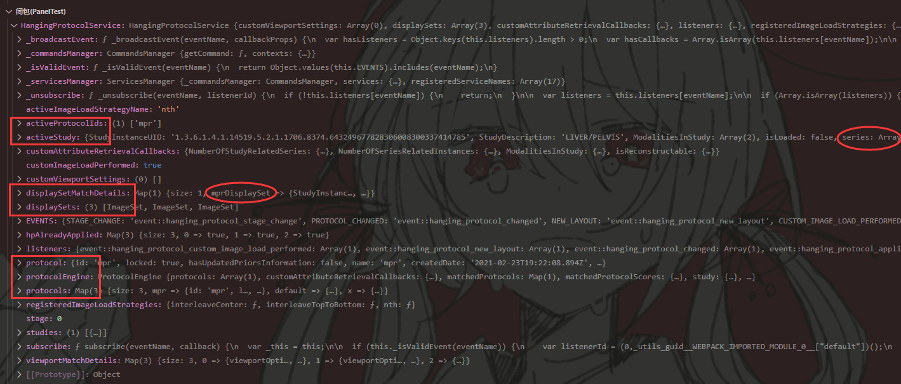
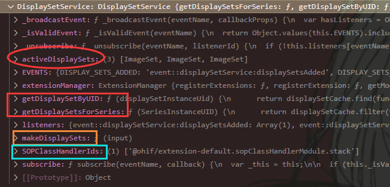

# Service - 服务相关

## 介绍

Service是“特定关注点”(concern-specific)的代码模块，可以跨越不同层（如Extension和Mode）使用，  
Service提供了一些操作，操作内部通常都共享某些状态(State)，  
通过`ServiceManager`使得整个App可随时得到服务。

Service用来解决“横切关注点”问题(Cross-Cutting Concerns)。

> 简单理解 - 横切关注点问题：
>
> 就是对于一些功能，需要在不同功能模块中复用（所以叫横切）。
>
> 解决方法：
>
> * 多继承/继承共同基类
> * **依赖注入** - 本框架的Service应当就是采用的这种解决方法，通过Manager，向需要某公用**功能集**(即Service)的地方注入。
> * 面向协议编程
>
> 详细可以看[面向对象困境之 —— 横切关注点](https://zhuanlan.zhihu.com/p/76618283)。

*个人理解：*

本框架最大的两顶层 - “Extension”和“Mode”，前者提供功能，后者提供交互。  
两者成上下层关系，但在两者中可能存在横切的公用功能，  
举例：弹窗服务，可能Mode中刚加载进去需要弹窗；而Extension中出错也需要弹窗。  
所以需要抽象出Service横切层。

**分类：**

* Data Service - 数据相关服务（非UI服务）
* UI Service - UI相关服务

---

**服务总览：**

| Service | Type | Description |
| --- |  --- |  --- |
| [DicomMetadataStore (NEW)](https://v3-docs.ohif.org/platform/services/data/DicomMetadataStore) | Data Service | DicomMetadataStore |
| [DisplaySetService (NEW)](https://v3-docs.ohif.org/platform/services/data/DisplaySetService) | Data Service | DisplaySetService |
| [segmentationService (NEW)](https://v3-docs.ohif.org/platform/services/data/SegmentationService) | Segmentation Service | segmentationService |
| [HangingProtocolService (NEW)](https://v3-docs.ohif.org/platform/services/data/HangingProtocolService) | Data Service | HangingProtocolService |
| [MeasurementService (MODIFIED)](https://v3-docs.ohif.org/platform/services/data/MeasurementService) | Data Service | MeasurementService |
| [ToolBarService (NEW)](https://v3-docs.ohif.org/platform/services/data/ToolBarService) | Data Service | ToolBarService |
| [ViewportGridService (NEW)](https://v3-docs.ohif.org/platform/services/ui/viewport-grid-service) | UI Service | ViewportGridService |
| [Cine Service (NEW)](https://v3-docs.ohif.org/platform/services/ui/cine-service) | UI Service | cine |
| [CustomizationService](https://v3-docs.ohif.org/platform/services/ui/customization-service) | UI Service | customizationService (NEW) |
| [UIDialogService](https://v3-docs.ohif.org/platform/services/ui/ui-dialog-service) | UI Service | UIDialogService |
| [UIModalService](https://v3-docs.ohif.org/platform/services/ui/ui-modal-service) | UI Service | UIModalService |
| [UINotificationService](https://v3-docs.ohif.org/platform/services/ui/ui-notification-service) | UI Service | UINotificationService |
| [UIViewportDialogService (NEW)](https://v3-docs.ohif.org/platform/services/ui/ui-viewport-dialog-service) | UI Service | UIViewportDialogService |

在`appInit.js`中，在Service Manager中**默认注册的服务**有：

```js
servicesManager.registerServices([
  UINotificationService,
  UIModalService,
  UIDialogService,
  UIViewportDialogService,
  MeasurementService,
  DisplaySetService,
  [CustomizationServiceRegistration, appConfig.customizationService],
  ToolBarService,
  ViewportGridService,
  HangingProtocolService,
  CineService,
  UserAuthenticationService,
]);
```

注意：`DicomMetadataStore`并不在服务容器中，具体获得方法见下面有关该服务的详细介绍。

补充一些可能存在的神必服务：

* `ToolGroupService` - 有关（上方）工具栏的Service

## Data Service

Data Service用来处理与UI无关的状态，因此每个Data Service都有自己要处理的内部状态。

* DicomMetadata Store - DICOM元数据存储服务（从名字搞特殊叫Store，看出来不是常规的服务）
* DisplaySet Service - 显示集服务（应该就是展现的影响切片）
* Hanging Protocol Service - DICOM的Hanging Protocol服务
* Toolbar Service - （上方）工具栏服务
* Measurement Service - 测量服务
* Customization Service - 自定义服务
* State Sync Service - 状态同步服务
* Panel Service - 侧边栏服务

*添加自定义服务见"Service Manager"中。*

### 1. Toolbar&ToolGroup Service - 工具栏服务

* `ToolBarService` - 只负责工具栏的工具注册（相当于UI层）
* `ToolGroupService` - 负责工具的逻辑实现（相当于逻辑代码层）

#### (1) toolbarButtons.js

工具栏每一个按钮的定义：

```json
{
  "id": "Zoom", // 唯一标识
  "type": "ohif.radioGroup", // 种类，感觉有以下几个
  "props": { // 具体该工具的属性
    // ...
  }
}
```

有关type：

* `ohif.radioGroup` - 可能是单个工具
* `ohif.splitButton` - 工具组（Nested Buttons)
* `ohif.action` - 
* `ohif.layoutSelector` - 专门选择layout的

有关`props`：

```js
    type: 'tool',
    icon: 'tool-zoom',
    label: 'Zoom',
    commands: _createSetToolActiveCommands('Zoom'),
```

### 2. DICOM Metadata Store - DICOM元数据存储服务

`DicomMetaDataStore`将metadata存储在其中，  
有一些API可以添加/获得有关Study/Series/Instance的元数据，  
`DataSource`使用`DicomMetaDataStore`来增加或查询(retrieve)元数据。

**事件：**

* `SERIES_ADDED` - 当打开的Study中，所有Series，都把其summary metadata添加到了DicomMetaDataStore中  
    
  可以从上图中，看到每次广播所传的参数。
* `INSTANCES_ADDED` - 当打开的Series中，所有Instance，都把其metadata添加到了DicomMetaDataStore中  
  经过个人测试，在比如进入Mode后，会加载所有的Series；然后每加载完一个Series，就会触发一次。  
  

**API：**

**注意：**  
虽然该实例被归类于服务，但实际上并不在服务容器之内，故不是从`serviceManager.service`中解包得到，  
而是采用以下方法引入：

```js
import { DicomMetadataStore } from '@ohif/core';
```

#### 有关DataSource本身的API

DataSource要从Extension Manager中获得。

然后大致存在以下API：
  
具体可以看`extensions/default/src/DicomWebDataSource/index.js`里的`implementation`。

### 3. Hanging Protocol Service

目前大致看了下，感觉是有关**Viewport配置**的模组。

比如"imageLoadStrategy"，可能是影像加载顺序的策略；  
还有"stages"里的"viewportStructure"，规定了各个Viewport的布局；  
后面的"viewports"应该规定了Viewport的属性。

相当于DisplaySet和Viewport的桥梁（展示协议），负责管理将影像展示到Viewport上，  
一般存在多个Hanging Protocol Service，对于所有DisplaySet，会计算的到一个分数(score)，  
分数最高的protocol会被应用到该DisplaySet，当该DisplaySet被安排到某个Viewport上后，该protocol的配置将被应用。

Protocol来自于一个Mode所用到所有插件的`getHangingProtocolModule`，会自动注册到该服务中。  
在`getHangingProtocolModule`中，返回Protocol的骨架如下：

```js
import MyProtocol from './MyProtocol';
export default function getHangingProtocolModule() {
  return [
    {
      id: MyProtocol.id,    // 每个protocol都要有唯一id字段
      protocol: MyProtocol, // 每个protocol都要有protocol字段
    },
    // { ... },
  ];
}
```

#### 3.1. API

补充API：

* `getViewportsRequireUpdate(HangingProtocolModule, displaySetInstanceUID)`

#### 3. 截图示例



### 4. DisplaySet Service

有关目前的DisplaySet相关的服务。

`DisplaySetService`负责处理从`instanceMetadata`（DICOM标准下的文件）转换到`DisplaySet`（OHIF下的可展示数据）。  
在 Mode 初始化时，Mode 的所有`SOPClassHandlerIds`，会被添加到`DisplaySetService`里（这个Id来自于每个`SOPClassHandler`的`id.js`，就是Mode里引用这个Module的字符串，加上name）。

根据每个Handler的Id，OHIF就能找到DICOM格式数据，**调用相应Handler里的`getDisplaySetsFromSeries`方法**，**将Series转换为DisplaySet**。

在有被查询得到的Instances的元数据(metadata)添加到`DicomMetaDataStore`中后，对应的`DisplaySet`会被同步创建。

#### 4.1. API

* `getActiveDisplaySets()` - 获得当前加载好的所有DisplaySet  
  所以并不是当前激活（正在展示的DisplaySet），有多少个Series就返回多少个对应的应该是。

**补充API：**

* `getDisplaySetsForSeries(seriesUID)`  
  应该是来自Handler里的方法，但不知道为什么能直接调用。
  * 参数：
    * `seriesUID: String` - 就是Series的UID
  * 返回：相应Series的DisplaySet

#### 4. 截图示例



## 5. Viewport Grid Service

* **关键词：**有关Viewport和Grid的服务。  
* **相关内容**
  * `UI/ViewportGrid`
  * DisplaySet Service
  * Hanging Protocol Service

有关UI的服务，用来处理Gird Layout（影片展示网格）。

**API：**

* `setActiveViewportIndex(index)`  
  设置活跃（应该指被选中的）Viewport
* `getState()`  
  得到当前Viewports的状态，返回信息如下图：  

  可以见[OHIF-UI](../临时记录/4%20-%20UI/ui.md)里的`DEFAULT_STATE`，  
  以及挂片协议里`stages`也会具体定义。
* `setDisplaySetsForViewport({ viewportIndex, displaySetInstanceUID })`
* `setLayout({numCols, numRows, keepExtraViewports})`
* `reset()`
* `getNumViewportPanes()`


*注：感觉可以在UI中获得这些服务，可见[OHIF-UI](../临时记录/4%20-%20UI/ui.md)。*

## 6. Segmentation Service

