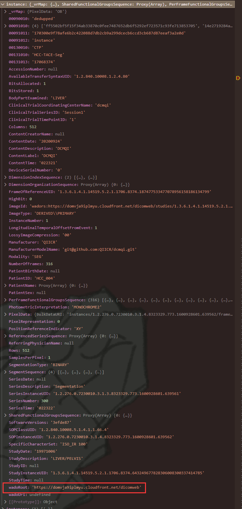
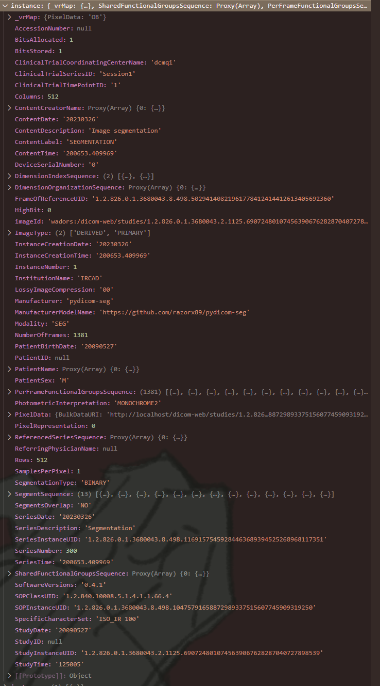

# 错误原因#1 - SEG文件的wadoRoot丢失API无法成功发送请求获取

## 临时Fix

就在`extensions/cornerstone/src/utils` - `217`行加了一个`wadoRoot`。

## 目前已知原因

SEG的instance里就没有`wadoRoot`属性。

**正常情况：**  
  
即对于demo的DICOM服务器来说，会赋予`wadoRoot`属性。

**异常情况：**  
  

所以，需要找到在哪里，为什么会少赋这个属性。
