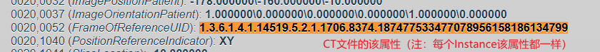
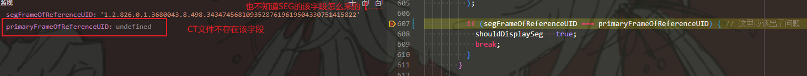

# 错误原因#2 - 影像属性缺失导致SEG无法渲染

* 状态：未解决

## 问题描述

对于如"HCC_004-LIVER/PELVIS"这个影像，打开SEG文件后，可以在CT中查看标签。  
而对于我们转换的影像，如"最好效果"影像中，打开后回到CT中却无法查看。

## 问题原因

发现是CT影像的"(0020,0052)Frame of Reference UID Attribute"缺失导致的问题。

对于正确的影像，因为SEG的该属性和CT的该属性一直，故可以正常渲染。  

代码中体现的原因：  
  

## 问题复现方式

## 临时修补方法

直接把`shouldDisplaySeg`赋为真即可。
