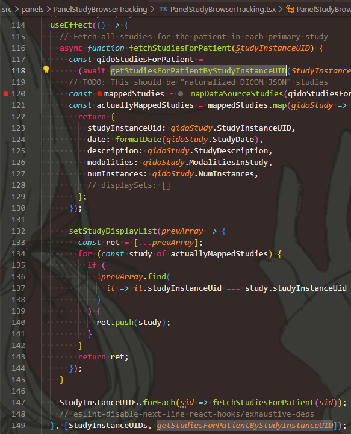

# React

## 组件 - Component

跟Vue的概念类似。

```js
function Welcome(props) {
  return <h1>Hello, {props.name}</h1>;
}
```

组件为一个函数，  
接收唯一参数`props`代表组件属性，可包含数据或方法（回调函数）；  
返回一个HTML标签（React元素）。

使用组件则像HTML标签一样

```js
function Welcome(props) {
  return <h1>Hello, {props.name}</h1>;
}

ReactDOM.render(
  <Welcome name="Sara" />, // JSX语法，为Welcome组件，参数为{name: "Sara"}
  document.getElementById('root')
);
```

## 事件属性

在React中，要使用事件触发属性，如`onclick=""`之类的，方法如下：

```js
<div onClick={ /* 一个函数 */ }>
```

就是把HTML事件变为了驼峰命名法，  
然后，里面只能传**一个回调函数名**，故不加参数。

回调函数默认可接受事件`e`，如：

```js
const clickHandler = (e) => {};

return (
    <button onClick={clickHandler}> Click </button>
);
```

若要传参数，则可在属性中用箭头函数：

```js
const clickHandler = (msg, e) => {};

return (
    <button onClick={ (e) => clickHandler('Messages', e); }> Click with msg </button>
);
```

## 属性 - props

属性可以理解为传递**静态**数据，是"React Component"提供给**外部**“传递数据给该组件”的接口。

父组件传给子组件，过后在子组件中**不能更改**！  
然后，父组件**更新**传递的该**值**后，若子组件不重新渲染（或父组件，父组件会带动子组件重新渲染），则子组件中**值不会改变**！

因此一般只用来：**渲染初始静态数据**，或者**初始化内部数据**。

## 状态 - state

类似于属性，是"React Component"提供给**内部**的功能，可以用来传递**动态**数据。

相当于组件内部的一个**私有变量**，  
不过如果传递的状态，在父组件中被更改，会导致父组件**重新渲染**，再导致子组件重新渲染，然后动态响应到子组件变化。  

> 区别 - 状态与属性：
>
> * 属性：存在于子组件中，父组件在调用子组件时传过去。子组件中无法更改props
> * 状态：存在于**父组件**中。且！父组件中调用`setState()`后，子组件会**重新渲染**！

使用`useState(...)`生成状态，  
参数为初始数据，  
返回两个值：

* 第一个：状态变量，只读，用来传递给子组件
* 第二个：setter，用来在父组件中更新状态（数据）  
  这个调用方法还有待商榷，我感觉是直接赋值的，  
  但看到还有**用箭头函数**的：`setTheme((v) => (v === "light" ? "dark" : "light"))`

最重要作用：会重新渲染！  
对于定义的全局变量`let a = 1;`，改变后不会重渲。

```js
// 单纯一个子组件（列表的每一项）而已，不用看
function ListItem(props) {
    return (
        <div>
            <input type="checkbox" defaultChecked="{props.completed}" />
            <h1> {props.name} </h1>
            <button onClick={props.onDelete}> 删除我 </button>
        </div>
    );
}

// 根组件
function App() {
    const [list, setList] = useState(apiGetResult());

    return (
        <div>
            list.result.map((item) => (
                <ListItem
                    name = {item.name}
                    completed = {item.completed}
                    onDelete = {() => {
                        // 运用setter，更改状态，达成动态数据
                        setList(list.filter((x) => x.id !== item.id)); // 通过filter过滤，让这个item删除
                    }}
                />
            ))
        </div>
    )
}
/* 然后渲染根组件 */

// 假设后端API返回的数据为
function apiGetResult() {
    return {
        code: 200,
        message: "成功",
        result: [
            {id: 1, name: "一", completed: false},
            {id: 2, name: "二", completed: true},
        ],
    }
}
```

## 副作用 - effect

### 1. 监听

*可以理解*为**监听**某数据发生变化后，执行某回调函数。【真正理解是有关“副作用”……

`useEffect`函数：

```js
useEffect(
    () => { /* 执行的逻辑代码 */ },
    [] // 监听对象，可不传
)
```

* 第一个参数：逻辑处理函数，当第二个参数中对象发生改变时，就会执行  
  *应该*不接受参数，  
  可选**返回一个函数**，在组件被销毁时执行，常用来[清除副作用](#3-清除副作用)。
* 第二个参数：要监听的对象
  * 不传：无限执行（每次刷新都执行）
  * 空数组`[]`：只在组件挂载的时候执行，即`componentDidMount`
  * 特定依赖项`[name]`：在依赖项发生变化（数据）或被调用（函数）后执行【注意：此时组件挂载时**仍会执行**！】  
    提醒：当逻辑处理函数中，**用到了组件的State数据**后，就最好**添加到“依赖数组”中**【就像数电里的`always`一样……
    * 数据依赖项：数据改变时调用
    * 函数依赖项：当**监听函数被调用**时，调用该逻辑处理函数【存疑：如果函数是递归函数呢（就是监听内部调用的函数）？……  
      

### 2. 副作用操作

> 理解 - 什么是副作用：
>
> 函数一般就是为了作为一个独立的模块/黑箱，  
> 因此外部（调用者）在调用的时候，只需要在内部**做好内部的操作**，然后返回外部所需的结果（数据）即可。
>
> 都是这么希望的，但显然大多数函数并没有这么乖，会去影响外部的东西，  
> 因此如果被调用函数内部，影响了外部的东西的话，就会给外部带来不可估计的影响，边称为“副作用”。
>
> 比如：
>
> * 参数传引用，然后修改了参数
> * 修改了外部（全局）变量
> * 甚至更抽象的，跳到外部的外部：比如发送网络API请求【但说实话，我不知道这个对当前系统会有什么副作用影响【因为请求一般都不会对该系统本身造成影响】，所以只能这么强制理解了orz……

在React中，副作用一般有两类：

* 调用浏览器的API：如事件监听函数、计时器函数、DOM函数、存储函数等
* 发起获取服务器数据的请求：如用`ajax`

举例：

* 设定定时器
* 修改DOM
* 存储(localstorage)
* 发送网络请求

#### (1) 发送网络请求

> 拓展 - JS发送网络请求的工具：
>
> * 底层 - 原生JS可用
>   * `fetch` - 一个请求函数
>   * `XMLHTTPRequest` - 一个请求对象
> * 封装
>   * `ajax` - `XMLHttpRequest`的封装 - 功能更多 - MVC
>   * `axios` - `ajax`的封装 - 功能更少【精简封装】，更常用 - MVVM

```js
useEffect(() => {
    async function loadData() {
        const res = await fetch(URL)
        return res;
    }

    data = loadData();
})
```

需要说明的一点：  
对于**异步**，需要按上面的方法，新建一个`async`异步函数，在里面调用`await`网络请求；然后再在逻辑代码里面调用这个函数。  
而不能直接在第一个参数外面加`async`，像下面那样是**错误的**。

```js
useEffect(async () => { await /* ... */; })
```

### 3. 清除副作用

组件产生的副作用很可能是周期的、一直存在的，  
如果组件在销毁后，不清除这些副作用，会导致问题。

> *大致*说明 - 组件销毁：
>
> 一般就是父组件不再渲染该子组件后，子组件自动销毁。  
> 比如：
>
> ```js
> return (
>     <div>
>         { flag ? <Son /> : null }
>     </div>
> )
> ```
>
> 当`flag`在`true`和`false`中反复横跳时，`Son`子组件就会反复生死。

常见的就是**消除定时器**。

**方法：**

在逻辑处理代码的最后中，返回一个*应当是无参*的箭头函数：

```js
useEffect(
    () => {
        // 逻辑代码
        // 为了体现清楚副作用的必要，在这里设置一个定时器
        let timer = setInterval(() => { /* 周期执行的代码 */ }, 1000);

        // 组件销毁后，执行的代码
        // 这里用于清除定时器
        return () => { clearInterval(timer); }
    }
)
```

## 回调 - callback

就可以理解为创建一个回调函数。

如果用普通地方法创建回调(`const comHandler = () => {}`)，然后传入子组件props后，  
每当父组件刷新，不仅会重新创建函数实例（虽然花销小），更重要的是，会让子组件props变化，从而重新渲染。

因此可以用`callback`创建一个回调函数，  
使得父组件重新渲染时，该回调函数不会重新生成（或根据依赖项判断是否重新生成），  
从而使得子组件不重新渲染（或根据依赖判断是否因重新生成而重新渲染）。

```js
const commandHandler = useCallback((/* params */) => {
        /* Logics */
    },
    [/* deps */]
)
```

* 第一个参数 - 回调函数，正常的写即可
* 第二个参数 - 依赖项（跟`useEffect()`类似）
  * 不传：每次刷新都新建函数
  * 空数组`[]`：只在组件挂载的时候新建函数，即`componentDidMount`
  * 特定依赖项`[name]`：在依赖项发生变化（数据）或被调用（函数）后新建函数【注意：此时组件挂载时**仍会执行**！】  
    * 数据依赖项
    * 函数依赖项

## 上下文 - context

* 创建上下文 - `const MyContext = createContext(defaultValue)`  
  注意：`defaultValue`指的时，当不处于上下文环境（子组件在组件树中，没搜索到该名字的Context），默认返回该值。
* 使用上下文 - `const ctx = useContext(MyContext)`，  
  一般写作`const useMyContext = () => useContext(MyContext);`，  
  然后就可以像hook一样用`useMyContext()`得到上下文了。

个人理解：就是可以用`createContext()`创建一个全局上下文；  
一般是**父层**创建Context，然后用Provider给所有子组件；  
然后自组件可以用`useContext()`获取上下文的值。

```ts
// 父组件.jsx
//-----------
const initContext = 0;

const MyContext = createContext(); // 这里一般不传参，上下文要在Provider中指定数据，一般用state或reducer指定
// 因此MyContext更多地只是像个名字

const ParentComponent = () => {
    const [someVarSonWillUse, setSomeVarSonWillUse] = useState(initContext); // 用状态存context

    return (
        <div>
            <MyContext.Provider value={someVarSonWillUse}> // 在这里的Provider中，才利用上下文进行传值
                <SonComponent /> // 只有在这里面的可以存在上下文环境，类似于C#
            </MyContext.Provider>
        </div>
    )
}
```

```ts
// 子组件.tsx
//-----------
const SonComponent = () => {
    const iWantUseContext = useContext(MyContext); // 可以看到，父方标签为MyContext，这里只是作用名字，最后获得的是useContext里的

    // 拿到父组件中的值后的逻辑代码
}
```

## 高级状态 - reducer

### 一般用法

类似state一样，都是存状态的（就是私有变量），  
但`reducer`更适合复杂状态（比如复杂对象）；以及更新逻辑复杂（应该指的是`setState()`）。

格式：

```js
const [stateObj, stateObjDispatch] = useReducer(reducer, initStateObj);
```

* `initStateObj` - 初始状态【因为状态复杂，一般都是对象】，会赋给`stateObj`
* `reducer` - 一个函数【但不能直接调用，是给后面的`dispatch`的，接受两个参数
  * `state` - 就是要更改的状态，会**自动**根据dispatch的绑定`stateObj`关系**赋值**
  * `action` - 代表对这个状态的不同操作（或就当成参数也行）
  
  ```js
  const reducer = (state, action) => {
    switch (action.type) {
        case 'action1_Add' : {}
        case 'action2_Sub' : {}
        default: {}
    }
  };
  ```

* `stateObjDispatch` - 就用来触发`reducer()`的，根据其函数计算得到新`stateObj`的返回值  
  虽然`reducer()`有两个参数，但`state`是自动传进去的，也就是说只用传`action`。  
  `action`是对象，最好有一个属性为`type`，定义更新状态的方式。

  调用该方法时一般用如下形式：

  ```js
  stateObjDispatch({
    type: 'action1_Add',
    // 往后随便加，相当于参数
    args: ['args1', 'args2']
  })
  ```

* `stateObj` - 类比于`useState`得到的`state`【不过这里一般复杂，故为对象】

因此，综合运用：

```js
const initialState = {count: 0};

const reducer = (state, action) => {
  switch (action.type) {
    case 'increment':
      return {count: state.count + action.val};
    case 'decrement':
      return {count: state.count - action.val};
    default:
      throw new Error();
  }
};

function CounterComponent() {
  const [state, dispatch] = useReducer(reducer, initialState);
  return (
    <div>
      Count: {state.count} // 可以看到这里调用都要用对象的方法
      <button onClick={() => dispatch({type: 'decrement', val: 1})}>-1</button> // 不仅传type，还可以传参给action
      <button onClick={() => dispatch({type: 'increment', val: 1})}>+1</button>
    </div>
  );
}
```

### 高级/规格用法 - 搭配context实现状态管理

```js
DEFAULT_STATE = {
    name: 'Super SASS',
    sex: 'qwq',
    x: 0,
    ifClosed: true,
    numbers: [1, 3, 5],
    response: {
        code: 200,
        data: {}
    },
    objs: [
        {},
        {}
    ]
}

const SuperSASSContext = createContext(DEFAULT_STATE); // 注意哈，这个只是个名字，

export default ComplexComponent() {
    // 定义Reducer
    /// 1. 判断action类型(action.type)
    /// 2. 根据不同类型，以及参数(action.payload, 跟state格式大致一致)，执行不同逻辑代码
    /// 3. 每个case返回的时候，都用{ ...state, ...{...} }的格式
    const SuperSASSReducer = (state, action) => {
        switch (action.type) {
            case 'CHANGE_SEX': {
                return { ...state, ...{ sex: action.payload } };
            }
            case 'CHANGE_objs':{
                const payload = action.payload;
                const { newObjs } = payload; // 如[ {obj1arr1:1, obj1arr2:2}, {obj2arr1:3, obj2arr2:4} ]
                const objs = newObjs;
                return { ...state, ...{ objs } } // 会将objs属性覆盖为新数组
            }
            // Other case
            default:
                return action.payload;
        }
    };

    // 根据Reducer和初始状态，定义状态变量State和设置方法Dispatch
    const [SuperSASSState, SuperSASSDispatch] = useReducer(SuperSASSReducer, DEFAULT_STATE);

    // 定义一些回调方法
    const setSex = useCallback(
        sex => SuperSASSDispatch({ type:'CHANGE_SEX', payload: {sex} }),
        [SuperSASSDispatch] // 使得每次在setSex被调用后，调用Dispatch后，才会进行重渲
    )

    // 返回该父组件，调用子组件并传递上下文
    return (
        <SuperSASSContext.Provider value={/* 任意想传递的东西，就比如状态 */SuperSASSState}>
            {children}
        </SuperSASSContext.Provider>
    )
}
```

## HTML DOM元素引用 - ref

```js
const ref = useRef();
const inputRef = useRef<HTMLInputElement>(null);
```

只是单方面用来引用HTML元素的（单方面绑定），  
而不是用来改变，然后影像HTML元素的。

因为更改`ref.current`，不会重渲。