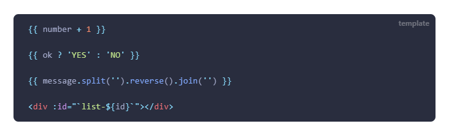
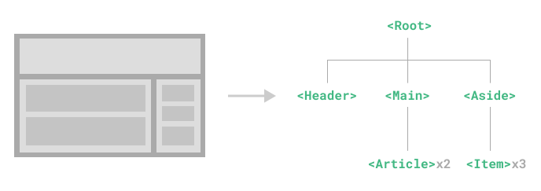

# Vue 基础知识

## Vue的很多相关概念

* Vue - Web开发框架
* create-vue/Vue CLI - Vue脚手架
* Vite(/Webpack) - Vue的构建/打包工具
* Vuex/Plain - Vue的状态管理工具
* Vue-Router - Vue的路由工具

## Vue2相关

### 1. 构建Vue应用的基础知识

#### (1) 创建应用实例

写在`src`中的`main.js`/`main.ts`。

**Javascript:**

```js
const app = Vue.createApp(
   /* 组件选项，里面包含如data、method等组件的定义 */
   )
```

一般来说都从根组件App.vue开始写页面的，因此为：

```js
import App from "./App.vue"

const app = Vue.createApp(App)
```

#### (2) 挂载应用到HTML元素

**HTML:**

```html
<div id="app"></div>
```

**Javascript:**

```js
// 接上代码
app.mount("#app"); // 里面为CSS选择器
```

#### (3) 组件

组件顾名思义，就是将页面划分成若干组件，然后只实现一部分。  
则组件则相当于一个页面（注意页面中也可能包含页面，大到整个网页，小到一个气泡窗都可以称为页面或组件）。  
文件后缀名则是`.vue`。

对于根组件App.vue，就是最终呈现的整个页面，  
然后根组件可以调用其他各个子组件（子组件又调用子组件）完成页面构建。

因此对于组件来说，存在以下三个内容：

```html
<!-- name.vue -->
<template>
   <!-- 相当于.html -->
</template>

<style>
   /* 相当于.css */
</style>

<script>
   // 相当于.js
</script>

<!-- 三者没有顺序 -->
```

可见一个`.vue`相当于html+css+js。

具体组件知识和运用等了解了组建的基本组成：各种选项和指令再详细说明。

#### (4) script内容

重点：`<script>`用来对`<template>`**暴露数据或方法**。  
暴露的东西都是用来在`<template>`里调用的，实现页面的“数据绑定”和“逻辑功能”等。

**对于选项式API(Vue2)：**

即用多个选项（如`data`、`method`等），来描述这个组件（如数据变量、方法），基础的有：

* `data(){}` - 声明组件实例暴露（提供）的响应式对象  
  该对象存在若干该组件的“数据变量”（以后统一叫该词），**响应式对象**则指在对象内部数据变量变化时，页面能动态更新
* `methods:{}` - 声明组件实例暴露的方法（函数）
* `computed:{}` - 声明组件实例暴露（提供）的计算属性
* `mounted(){}`/... - 定义组建的生命周期钩子函数  
  会在特定阶段运行对应代码（如`mounted`就是在刚挂载时）

*其他的各个选项可见“[选项式API](https://cn.vuejs.org/api/options-state.html)”。*

```html
<!-- App.vue -->
<script>
export default {
  // data() 返回的属性将会成为响应式的状态，并且暴露在 `this` 上
  data() {
    return {
      count: 0;
    }
  },
  // methods 是一些用来更改状态与触发更新的函数，它们可以在模板中作为事件监听器绑定
  methods: {
    increment() {
      this.count++;
    },
  },
  // 生命周期钩子会在组件生命周期的各个不同阶段被调用，例如这个函数就会在组件挂载完成后被调用
  mounted() {
    console.log(`The initial count is ${this.count}.`);
  },
}
</script>
```

**对于组合式API(Vue3)：**

就是语法糖，把各个选项直接写出来，而不是写在`export default {}`里的各个选项里，感觉结构更清晰。

```html
<!-- App.vue -->
<script setup>
import { ref, onMounted } from 'vue'

// 响应式状态
const count = ref(0);

// 用来修改状态、触发更新的函数
function increment() {
  count.value++;
}

// 生命周期钩子
onMounted(() => {
  console.log(`The initial count is ${count.value}.`);
});
</script>
```

**以下内容暂时先以选项式API讲解，之后会讲如何转换成组合式API。**

### 2. 模板(template)相关（包含指令v-bind）

上面提到：`<template>`就跟HTML文件一样，用各种标签描述页面，  
vue提供了一些语法，用来便捷实现响应式页面。

**关键语法：**

* **vue指令**：`v-指令:参数(.修饰符)(=值)`  
  用在HTML标签的属性(Attribute)上，从而影响该标签。
  * 指令：如`v-bind`、`v-for`
  * 参数：部分指令需要一个参数，如`v-bind`要指明绑定哪个属性，`v-for`指明循环的变量
    可以用动态参数，即参数使用JS表达式求得，使用`:[JS表达式]`，如`v-on:[eventName]`（单个变量）
  * 值：部分参数需要一个对应的值，如`v-bind`就要指明绑定的值；`v-for`就不用值。
  * 修饰符：一些指令存在特殊的方法，如`v-on`对于绑定的事件就存在特殊的方法（如阻止冒泡）
* **Mastache语法** - `{{ /* data选项里的数据变量（属性） */ }}`  
  用于文本插值（就是直接把数据变量显示在页面上）。  
  使用`v-once`指令，可以只渲染一次，不再为响应式（`v-bind`/`v-model`均无效）。

**vue指令例子 - 属性绑定`v-bind`：**

1. 单属性绑定 - 在HTML标签头里用`v:bind`(简写为`:`)指令，格式为`:/* 属性名字 */="/* data中变量 */"`如`:class="elementClass"`
2. 布尔属性绑定 - 若**变量**为bool类型，则`ture`时有该属性，`false`时无
3. 多属性绑定 - 采用对象：  
   script中`const objOfAttrs = { id: '属性值', class: 'class1 class2'};`  
   +template中`<div :="objOfAttrs">`，则会拥有id和class属性，为对应值。

**注意：**`v-bind`为**Model到View的单向绑定**！！如果绑定到表单(`<input>`)的值value属性上，直接在表单上改值不会影响绑定的数据变量（但通过方法改变数据变量可以响应到表单上改变值）  
*双向绑定为后面的`v-model`。*

“Mustache语法”和“vue指令”都可以使用 JavaScript 表达式。  
  
*注：\`list-${id}\`是js表达式，\${}内容会被`data`里的`id`替换。*  
仅支持单一表达式（可求值，能写在`return`后的，因此调用函数也可以（包括`methods`选项里定义））。

在模板`<template>`中使用`data`里的数据变量，是不需要像在`methods`里的方法要带上`this.`的，  
可以看到上面的示例中都直接写的变量名。

### 3. 选项 - 组件的数据变量 - data

在这里面提供各种响应式的数据变量，供`<template>`使用。

```js
// <script>
export default {
  data() {
    return {
      // 所有数据变量写这里，外面的内容可看成模板
      count: 1, // 放普通变量
      list: ["str1", "str2", 3, true], // 放数组
      obj: { // 放对象
         objAttr1 : "str",
         objAttr2 : true,
      },
      val : undefined, // 放占位的变量（当前还未定义值）
    }
  },
}
```

会将data返回对象的所有属性，添加到该组件实例的属性中。  
在`<template>`中可以直接使用`{{}}`访问属性，而在`<script>`中要使用`this.属性`访问。

在模板中则可：

```html
<!-- template -->
<p> {{ count }} </p>
<p> {{ obj.objAttr1 }} </p>
```

### 4. 选项 - 组件的方法 - methods

主要是暴露给`<template>`的可调用方法，常用于进行**事件监听**（如`onClick()/onMouseOver()`）。  
在事件中调用时，通常直接写方法名，如`<button @click="btnClick">Click</button>`。

也可以在其他方法或者生命周期钩子中调用。

```js
// <script>
export default {
  data() {
    return {
      count: 0,
    }
  },
  methods: {
    increment() { // 在其他方法或是生命周期中也可以调用方法，如下的mounted
      this.count++;
    },
  },
  mounted() {
    this.increment(); // 要用this.
  },
}
```

注意不能用箭头函数！否则方法中的`this`无法正确绑定。

在模板中则可：

```html
<!-- template -->
<button @click="increment">增加count</button>
```

注：有关方法中的参数，会在后面的“[10. 指令 - 事件处理（监听事件） - @](#10-指令---事件处理监听事件---)”讲到，  
这里都是没有参数的情况（`@`调用的方法不带`()`），不用着急。

### 5. 选项 - 计算属性 - computed

template中虽然可以用表达式来得到需要的值，但如果所需得到的值需要大量逻辑处理，要么模板会很臃肿，要么根本不能用表达式（表达式只支持单一表达式）。  
基于MVVM的开发模式，template相当于View，script相当于ViewModel，因此自然也不会再View中写大量业务逻辑。

计算属性则是描述“依赖响应式状态（数据变量）”的复杂逻辑，  
在`<script>`中写在`computed:{}`里。

---

比如对于原本的模板中：

```html
<!-- template -->
<p> {{ author.books.length > 0 ? 'Yes' : 'No' }} </p>
```

然后在组件选项中添加计算属性：

```js
export default {
  data() {
    return {
      author: {
        name: 'John Doe',
        books: [
          'Vue 2 - Advanced Guide',
          'Vue 3 - Basic Guide',
          'Vue 4 - The Mystery',
        ],
      },
    }
  },
  computed: {
    // 一个计算属性
    publishedBooksMessage() {
      // `this` 指向当前组件实例
      return this.author.books.length > 0 ? 'Yes' : 'No';
    },
  },
}
```

则模板中可以替换为：

```html
<p> {{ publishedBooksMessage }} </p>
```

因为是计算**属性**，所以跟属性一样用，直接写名字，不用加`()`。

> 区别 - 与方法的区别：
>
> 属性换成方法可能同样能使用：
>
> ```html
> <template>
>   <p> {{ publishedBooksMessage() }} </p>
> </template>
> 
> <script>
>   // methods中
>     function publishedBooksMessage() {
>       return author.books.length > 0 ? 'Yes' : 'No';
>     },
> </script>
> ```
>
> 但区别：
>
> * 计算属性会被缓存，当调用一次后之后便直接返回值，不再用函数执行。  
>   （但如果内部依赖的响应式数据变量发生改变，则会重新计算（但如果不是响应式以依赖，则不会更新！））
> * 方法调用一次就必须执行一次。  
>
> 因此计算属性适合用于会**被经常重渲染**的地方。
>
> ---
>
> 计算属性还存在`get()`和`set()`概念，  
> 默认是只读的（即只有`get()`），但也可写计算属性（补上`set()`函数），  
> 但即便是写计算属性，也是写其依赖的数据变量或其他的，而不是直接写计算属性本身【？】
> 具体可见“[可写计算属性](https://cn.vuejs.org/guide/essentials/computed.html#writable-computed)”

需要注意：计算属性（最好）**只能用于计算和返回值**，而不要存在副作用（如异步请求或更改DOM，请用侦听器）！

### 6. 选项 - 侦听器 - watch

上面提到产生副作用使用侦听器，侦听器可在所侦听的响应式数据变量发生变化时，触发编写的函数。  
在选项中使用`watch:{}`。

```js
export default {
  data() {
    return {
      question: '',
      answer: 'Questions usually contain a question mark(?). ;-)',
      obj: {
        attr1: {
          a1: '',
          a2: ''
        },
        attr2: ''
      }
    }
  },
  watch: {
    // 每当侦听数据(question)改变时，这个函数就会执行
    question(newQuestion, oldQuestion) { // 第一个参数为数据改变新值；第二个为旧值（均可不要）
      // （不确定）选项式中如果要异步，需要在methods写个异步方法【因为要用组件实例内部的数据变量嘛，所以要写在methods里；如果不用可以写在export外
      if (newQuestion.includes('?')) { 
        this.getAnswer() // 调用异步方法
      }
    },
    // 如果是对象，也可以用"obj.attr"来指明侦听对象的属性
    "obj.attr1.a1"(new) {
      // ...
    },
    // 如果侦听对象如下，只有在obj.attr1 = {...}时才会触发，对于obj.attr1.a1/a2更改时不会
    "obj.attr1"() {
      // ...
    }
  },
  methods: {
     getAnswer() {
      this.answer = 'Thinking...'
      try {
        const res = await fetch('https://yesno.wtf/api')
        this.answer = (await res.json()).answer
      }
      catch (error) {
        this.answer = 'Error! Could not reach the API. ' + error
      }
    }
  }
}
```

在**选项式API**里，侦听器默认是浅层的：仅有被侦听的数据（属性），被新**赋值**时，才会触发。  
因此对于侦听某一对象Object，若其**内部属性**发生变化，**不会触发**！  
需要更改为深层侦听器，具体见“[深层侦听器](https://cn.vuejs.org/guide/essentials/watchers.html#basic-example)”。  
但因为嵌套侦听，对于大型数据结构谨慎使用（只想侦听若干属性就用`"obj.attr"`）。  
其中提到：对于对象的侦听，只要不是替换对象本身，**新值和旧值相同，均为新值**。

其他相关侦听器的内容见文档。

### 7. 指令 - 类和样式绑定 - :class&:style

`:`是`v-bind:`的简写。

`:class`除了之前提到的`:class="data的数据变量"`，  
还可以有以下几种绑定方式：

* 绑定字面量对象 - `:class="{ attr1: boolVar1, attr2: boolVar2 }"`  
  各属性是否存在取决于布尔data数据变量是否为真。  
  合并到本来有的属性值中，而非覆盖。
* 绑定对象数据变量 - `:class="classObj"`  
  `classObj`是定义在data里的对象，内容格式跟上面相同。  
  此时因为布尔变量`boolVar`不能用data内的数据，只能写`true`/`false`。
* 绑定计算属性 - `:class="calcClassObj"`，  
  `calcClassObj`是一个计算属性，返回一个对象，内容格式跟上面相同。  
  此时布尔变量`boolVar`可以是个复杂表达式，也可以调用data内数据。
* 绑定数组 - `:class="[attr1, attr2]"`  
  也可搭配三目运算符，有条件渲染，如：`:class="[boolVar1 ? attr1 : '', attr2]"`，  
  还可以嵌套对象，如：`:class="[{ attr1: boolVar1 }, attr2]"`

对于内联样式绑定`:style`，跟上述类似，不过`var`是样式属性的值。

### 8. 指令 - 条件渲染 - v-if(else, else-if)&v-show

作用：当满足条件时，才渲染该HTML元素。

`v-if`、`v-else-if`、`v-else`组成基本的if语句区块，格式为`v-if="布尔数据变量"`。

`v-if`是一条指令，必须且只能依附于**一个**元素上，  
因此如果相对多个元素用相同的条件（或者说当满足条件的时候渲染多个元素），  
一个经典的方法是使用`<div v-if="boolVar">`，然后包裹住所有元素。  
但这个方法会莫名其妙多一个空属性的`<div>`元素，如果强迫症不想这样，可以使用`<template>`标签包裹。  
*对的没错，就是写在最外面的`<template>`。*

---

`v-show`类似于`v-if`，格式也一样，  
同时`v-show`不支持在`<template>`标签上使用。

**主要区别：**

* `v-show`会在DOM渲染时保留元素，仅是切换了该元素css中`display`属性。  
  有更高的初始渲染开销，适合那种会进行频繁切换显示的元素（如按一个按钮从5张图中切换展示下一张图片）
* `v-if`若不满足条件，不会渲染该元素（在DOM树中找不到）  
  有更高的切换开销，适合那种只判断一（或少）次进行选择渲染适合用`v-if`（如根据性别渲染对应的欢迎内容，且之后不会变换）

### 9. 指令 - 列表渲染 - v-for

就是循环渲染一个数组里的所有项，  
可能套用UI框架开发后该指令很少用，所以这里暂时不详细记录，  
需要用到可见“[**列表渲染**](https://cn.vuejs.org/guide/essentials/list.html)”。

### 10. 指令 - 事件处理（监听事件） - @

`@`是`v-on`的简写。  
之前已经运用过很多次，在“[4. 选项 - 组件的方法 - methods](#4-选项---组件的方法---methods)”也提到过。  
格式为：`@事件名="处理表达式"`。

处理表达式可以是简单的“**内联**事件处理器”，如：`<button @click="count++">`（注意哈，在template里引用script中date的数据变量都不用加`this`！）；  
也可以调用script暴露的方法，此时还**允许传参**。

#### (1) 事件处理的参数

在methods中若定义一个带参数的方法，如下：

```js
methods: {
  plusCount(num1, num2, [nums], e) {
    count += num1 + num2;
    nums.forEach((v) => count += v);
    console.log(e.clientX);
  }
}
```

则在模板中，方法名就需要带上参数`(...)`，如：

```html
<button @click(1, 3, [2, 4, 1], $event)>Click</button>
```

上述的`$event`是vue的一个内部变量，代表事件参数，是原生的DOM事件对象。  
也就是经常会看见的事件处理函数的参数`e`(event)。

如果只有一个参数，会默认传递事件对象`$event`，  
即如果methods定义的是`eventFunc(e) {...}`，则模板中可以不带参数，直接写`@click="eventFunc"`。

#### (2) 事件修饰符

在原生JS开发中，进场会对事件有关DOM进行处理，比如阻止冒泡传递等。  
Vue提供了事件修饰符，用于便捷的对事件进行处理（原生JS也能实现，Vue只是便捷提供方法）。

如：

* `.stop` - 停止向父层冒泡传递
* `.prevent` - 阻止默认行为  
  如对于表单的提交事件`@submit`，阻止其重新加载页面；对于超链接点击`@click`，阻止跳转。
* `.once` - 事件只会被处理一次
* `.capture` - 仅在捕获阶段处理该事件（冒泡阶段就不再处理了）  
  具体示例可见“[Vue事件符.capture的含义用法](https://blog.csdn.net/catascdd/article/details/108273931)”。
* `.self` - 只有当`event.target`是自身的时候才触发（event.target**可能**指向的是最深层的dom元素）  
  因此对于父层只加上该修饰符，可以防止该元素在冒泡阶段被触发（而不会停止冒泡，更父的元素依然允许被触发）。
* `.passive` - 主要是用来改善触摸端滚动屏幕的体验，等需要使用再了解

单个的使用方法：

```html
<button @click.stop="clickFunc">Click</buttom>
```

允许链式调用，也可以只有修饰符，如：

```html
<!-- 链式调用 -->
<button @click.self.prevent>
<!-- 只有修饰符 -->
<a @click.prevent>
```

注意对于链式调用，需要考虑位置，典型就如`.self`和`.prevent`：

* `@click.prevent.self` - 会阻止元素及其子元素的所有点击事件的默认行为
* `@click.self.prevent` - 只会阻止对元素本身的点击事件的默认行为

#### (3) 按键修饰符

监听键盘事件`key...`时，通常会**检查特定的按键**，  
只有为特定的按键触发事件时，才会执行处理。

Vue提供了以下几种常用按键：

* `.enter`
* `.tab`
* `.delete` (捕获“Delete”和“Backspace”两个按键)
* `.esc`
* `.space`
* `.up`
* `.down`
* `.left`
* `.right`

还有`.ctrl`之类的“系统按键修饰符”，具体见“[系统按键修饰符](https://cn.vuejs.org/guide/essentials/event-handling.html#key-modifiers)”。

#### (4) 鼠标修饰符

* `.left`
* `.right`
* `.middle`

### 11. 指令 - 表单输入绑定 - v-model

表单（`<input>`标签）基本都需要**View和Model的双向绑定**到数据变量里，使用`v-model`指令。  
区别于`v-bind`为单向绑定（虽然可以搭配事件处理`@input`实现，这里也相当于个语法糖）。

针对不同类型的表单（单行文本、多行文本、复选框、单选按钮、选择器），有多种`v-model`使用方式，  
同时`v-model`还存在修饰符。 
具体可见“[表单输入绑定](https://cn.vuejs.org/guide/essentials/forms.html)”

### 12. 组件化开发

#### (1) 组件再讲

组件概念在之前讲到了，就是页面可以划分成不同的组件组成。

  
上图中各种大写首字母的标签就是vue组件。

**定义组件：**

就是在`<script>`里时候默认导出的东西：

```js
<script>
export default {
  data() {
      // ...
    }
  },
  methods:{
    // ...
  }
}
</script>
```

#### (2) 父传子 - prop

#### (3) 子传父 - 自定义事件.emit(E)&@E

#### (4) 父访问子 - $refs

#### (5) 子访问父/根 - \$parent/\$root

#### (6) 爷传孙 - inject&provide

类似于MVVM的“依赖注入”的思想。

### 13. 插槽

## Vue3相关

### 组合式API

作用：为了让数据、逻辑相关的部分**组合**在一起编写。

基本使用方式：是在`setup`选项中编写组合式API。  
需要将所有在模板中调用的变量、方法给`return {...}`回去。

#### (1) 定义响应式数据变量

* 基本类型的引用：`ref()`
  * 存在属性`value`，在`<script>`时需要对`.value`操作，而`<template>`中会自动解析，不用加`.value`
* 对象的引用：`reactive()`  
  若使用解构返回`return {...obj}`，会使得解构后的属性失去响应式，可用函数`toRefs(obj)`，使得解构后也有响应式，如：
  * `let {name, age} = toRefs(person); return {name, age}`
  * `return { ...toRefs(person) };`

#### () 选项

指在`setup()`函数的“参数”。

* `props` - 接受“父传子”传过来的数据  
  跟之前的`props`一样，子组件需要先用数组/对象的形式声明`props`选项，然后`setup(props)`里就可以用`props.dataName`（类似于选项式里的`this.dataName`）。
* `context` - 对于子组件来说，可能有用的东西
  * `attrs` - 该子组件标签的属性（非响应式数据）  
    如父组件里`<MyComp class="123">`，则子组件里存在`context.attrs.class == "123"`。

#### provide&inject

```js
// 爷组件
setup() {
  // 非响应式
  provide('number', 17);
  // 响应式
  const name = ref("张三");
  provide('name', name); // 不要传.value
}
```

```js
// 孙组件
setup() {
  const number = inject('number'); // 爷/孙组件 改变该值，互不影响
  const name = inject('name'); // 爷/孙组件 改变该值，为响应式
}
```

#### setup语法糖

1. 引用组件，选项不需要手动注册`component()`
2. 定义数据变量/方法，setup不需要手动暴露`return {}`